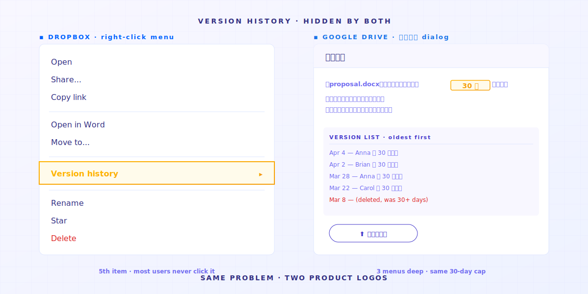

> To nie twoja wina. Twoje narzędzie po prostu nigdy nie zostało zaprojektowane do tej pracy.

Trzy osoby.

**Osoba A** to freelance designer. Na pulpicie ma `_v3_final_FINAL.psd`.
**Osoba B** pracuje w kancelarii prawnej. Na dysku czeka `umowa_v7_wersja_klienta_2025-04-15.docx`.
**Ty, który to czytasz**, pewnie właśnie patrzysz na `praca_rozdział3_po_korekcie_promotora_naprawdę_finalna_v2.docx`.

Różne zawody. Różne nazwy plików. **Ten sam objaw**.

Nie dlatego, że mają obsesję porządku. Dlatego, że jeśli tego nie zrobią, **pliki zamieniają się w chaos**. Na dysku NAS skasowane to znaczy znikło na zawsze. Dlatego pojawia się folder `old/` — parking dla wszystkich poprzednich wersji.


---

> **TL;DR** —  Foldery współdzielone, Dropbox i dyski NAS **tego rodzaju narzędzia nigdy nie zostały zaprojektowane do zarządzania historią plików**. Mają 4 luki konstrukcyjne — każda przesuwa tę pracę z powrotem na ciebie. Ten artykuł rozebiera je jedną po drugiej i uczciwie przyznaje, które z nich Keeply załatał, a których nie.

## Mapa artykułu

1. [Przycisku „poprzednia wersja" nigdy nie było](#reason-1)
2. [30-dniowa historia wersji ma warunki](#reason-2)
3. [Historia wersji mówi kiedy — nie mówi dlaczego](#reason-3)
4. [Konwencje nazewnictwa przerzucają pamięć organizacji na ludzi](#reason-4)
5. [Kiedy Keeply nie jest odpowiedzią](#limitations)

---

## 1. Przycisku „poprzednia wersja" nigdy nie było {#reason-1}

Szukasz wczorajszej wersji pliku projektu.

Otwierasz Dropboxa lub Google Drive — wszystko jest najnowsze. Historia wersji jest trzy poziomy menu w głąb. Nie wiedziałbyś, gdyby ktoś ci nie powiedział.



Otwierasz firmowy NAS — te chaotyczne numery wersji tam leżące *są* twoją historią wersji.


**Tego rodzaju narzędzia nigdy nie zostały zaprojektowane do zarządzania historią plików**.

Dyski chmurowe zależy przede wszystkim na jednym: żeby twoje pliki wyglądały identycznie na trzech urządzeniach.
Ten cel kłóci się z „zachowaniem każdej starej wersji".

Więc narzędzie wybrało synchronizację. **Nie zobaczyć historii zmian w czasie.**

> W 2015 roku Will Styler, doktorant językoznawstwa na UCSD, stracił pliki swojej dysertacji. Miał 7 różnych planów kopii zapasowej. Każdy z nich zawiódł. Napisał post-mortem dla przyszłych doktorantów. Ostatnie zdanie: „Redundancy doesn't prevent stupidity" — wielokrotne kopie nie chronią przed głupotą. [Pełny opis incydentu](https://wstyler.ucsd.edu/posts/lost_dissertation_files.html)

→ Powiązany artykuł: [Dlaczego trzymanie pracy magisterskiej na jednym laptopie to hazard, przed którym nikt nie ostrzega](/en/post/thesis-single-point-of-failure/)

---

## 2. 30-dniowa historia wersji ma warunki {#reason-2}

Dobra, odkryłeś, że Dropbox naprawdę ma historię wersji. Ulga?

Zaraz, to nie koniec złych wieści: **limit 30 dni**.


Przełóżmy na codzienność: chcesz znaleźć brief od klienta z poprzedniego kwartału? Jeśli nie płacisz za plan Enterprise, **tej wersji już nie ma**.

Ten limit 30 dni to nie ograniczenie techniczne — to decyzja biznesowa. Historia plików stała się powodem do aktualizacji planu.
(Keeply daje ci historię plików bezpłatnie, na zawsze.)

> Kwiecień 2026, Hacker News. Użytkownik julianozen opublikował post: jego ojciec nadpisał plik, który nie był ruszany przez 2 lata. Dwa dni później próbował go odzyskać — nie udało się. Odpowiedź Dropboxa: poza 30-dniowym oknem retencji. Reakcja julianozen: „To nie jest definicja 30-dniowej historii." Odpowiedź od lazide: „Which is bonkers." [Pełny wątek](https://news.ycombinator.com/item?id=47772260)

30-dniowe okno zostało zaprojektowane dla scenariusza „wczoraj przypadkowo nadpisałem plik".
Do „klient chce zobaczyć ofertę z poprzedniego kwartału" — **używanie złego narzędzia rzadko daje to, czego chcesz**.

→ Powiązany artykuł: [Ukryty koszt folderów współdzielonych](/en/post/hidden-cost-shared-folders/)

---

## 3. Historia wersji mówi kiedy — nie mówi dlaczego {#reason-3}

Załóżmy, że rozwiązałeś dwa pierwsze problemy: historia jest włączona, 30 dni wystarczy.
Jest jeszcze głębszy problem, który na ciebie czeka.

Historia wersji mówi: „zmodyfikowano 2025-04-15 14:23".
**Nie mówi, co się zmieniło o 14:23. Nie mówi, dlaczego.**


Dla niektórych zawodów to nie ma znaczenia. Dla innych — to jest śmiertelne:

- **Designer** zmienił krycie jednej warstwy na 30%. Historia mówi „zmodyfikowano". Nie mówi której warstwy.
- **Prawnik** zmienił w klauzuli umownej „zobowiązuje się" na „może". Jedno słowo. Historia mówi „zmodyfikowano". Nie mówi którego słowa.
- **Doktorant** zmienił „argument ma jednak ograniczenia" na „argument wyraźnie się potwierdza" — z ostrożnego na kategoryczny. Historia mówi „zmodyfikowano". Nie mówi, że znaczenie się odwróciło.

> W styczniu 2025 roku portal Legal Cheek opublikował anonimową historię prawnika: „Jako aplikant wysłałem błędny testament do rodziny złej zmarłej osoby jako załącznik." Katastrofą nie było „brak zapisanej wersji" — tylko „nie wiedziałem, która wersja jest aktualna." [Pełna historia](https://www.legalcheek.com/2025/01/courtroom-etiquette-email-blunders-and-document-mix-ups-lawyers-share-their-most-embarrassing-mistakes/)

I tu większość ludzi popełnia błąd.

**Kopia zapasowa oznacza zachowanie pliku.**
**Zarządzanie wersjami oznacza zachowanie pliku *plus* zapis tego, co i dlaczego zmieniłeś.**

**Backup daje ci pierwsze. Zarządzanie — drugie.**

Zaczynasz więc upychać intencje w nazwy plików: `umowa_v7_zmiana_na_żądanie_klienta_klauzula3.docx`.
Nazwa pliku się kończy. Otwierasz arkusz kalkulacyjny. Arkusz nie nadąża. Zaczynasz kanał na Slacku.
**W końcu twój „system zarządzania wersjami" to nazwy plików + arkusz + Slack + twoja pamięć.** Gdy jeden element zawiedzie, cały system się sypie.
Trzy miesiące później otwierasz swoje notatki i odkrywasz, że twoje dawne nawyki nie zgadzają się z obecnymi.

---

## 4. Konwencje nazewnictwa przerzucają pamięć organizacji na ludzi {#reason-4}

Po natrafieniu na wszystkie trzy problemy powyżej, każda firma robi to samo — **pisze 14-stronicowy PDF z konwencją nazewnictwa**.

Zwykle wygląda to tak:

```text
[YYYY-MM-DD]_[KodProjektu]_[TypDok]_[Status]_[Autor].rozszerzenie
```

Bardzo schludnie.


Sześć miesięcy później nikt już tego nie przestrzega.

Nie dlatego, że współpracownicy są leniwi.
**Dlatego, że próbujemy kontrolować nieobliczalne istoty — i zakończenie tej historii pisze się samo.**

> Forum Asany, czerwiec 2023, wątek o „epickich wpadkach z nazewnictwem plików". Becky_Caday napisała: „Kilka wersji tego samego pliku, bo ktoś nie wiedział, że można otwierać oryginał i edytować — zmienił jedno słowo na wielkie litery. `Lista 2.0` stało się `LISTA 2.0`." Arndt_Dienstbier napisał: „Używali spacji jako wersjonowania" (wiele plików `Dokument.docx`, różniących się tylko spacjami na końcu nazwy). [Pełny wątek](https://forum.asana.com/t/share-your-epic-file-naming-fails-and-lets-laugh-together/462366)

Każdy członek zespołu, przy każdym zapisie, musi pamiętać + chcieć + mieć czas, żeby przestrzegać reguły. Gdy jeden z tych warunków odpada, **gratulacje — znowu masz chaos**.

Pamiętanie o konwencji nazewnictwa to coś, co **narzędzie powinno robić samo**.
Nie coś, co należy przerzucać na dyscyplinę każdej osoby z osobna.

→ Powiązany artykuł: [Kiedy ekipa od AutoCAD wczytała złą wersję](/en/post/autocad-wrong-version-crew/)

---

## 5. Kiedy Keeply nie jest odpowiedzią {#limitations}

Zbudowaliśmy Keeply, żeby wypełnić te 4 luki konstrukcyjne.
Ale są scenariusze, **w których Keeply nie jest odpowiedzią**:

- **Notatki ze spotkań w czasie rzeczywistym** → użyj Notion / Google Docs. Keeply to długoterminowa pamięć wersji dla osób i małych zespołów, nie narzędzie do współpracy na żywo.
- **Materiały wideo 50GB+** → użyj Frame.io / PostHaste. Logika wersjonowania w Keeply (zapis różnic przy każdym zapisie) nie jest opłacalna dla dużych plików binarnych.
- **Podpisywanie prawne między organizacjami** → użyj DocuSign / Adobe Sign. Jeśli umowa trafia do 10 zewnętrznych kancelarii, Keeply nie jest częścią tamtego systemu zgodności.

Dla pozostałych 80% scenariuszy pracy z wiedzą — **designerów, asystentów prawnych wewnątrz kancelarii, księgowych, doktorantów, zespołów PM, freelancerów** — te 4 luki konstrukcyjne i tak cię dosięgną.
To właśnie my chcemy rozwiązać.

---

Wróćmy do pytania z początku: dlaczego foldery współdzielone niemal zawsze rodzą własne, lokalne reguły nazewnictwa?

Bo **tak naprawdę chcieli mieć czystą strukturę — żeby nie podejmować decyzji na podstawie nieaktualnych informacji**.
Więc wersje lądowały w nazwach plików, w arkuszach, w pamięci.

Przerzucanie pamięci organizacji na ludzką dyscyplinę to **z góry wadliwy projekt**.

**Pytanie nie brzmi: jak lepiej egzekwować konwencje nazewnictwa?
Brzmi: czy twoje narzędzie wykonuje tę pracę za ciebie?**

---

> O autorze: [prawdziwe imię i nazwisko założyciela], założyciel Keeply.
> LinkedIn (uzupełnić w Touch 4) ｜ X (uzupełnić w Touch 4)
