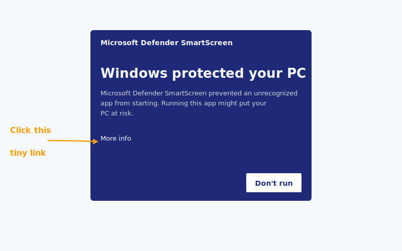

> „Kliknąłem dwa razy, wyskoczył niebieski ekran, uznałem, że to wirus i zamknąłem."
>
> — Projektant, który właśnie usłyszał o Keeply, odpisał tego samego popołudnia.

Nie jest pierwszy. Niebieski ekran na Windows pewnie zatrzymuje więcej osób, niż faktycznie kończy instalację.

Tu masz całą drogę od początku do końca: **dlaczego pojawia się niebieski ekran → trzy czystsze sposoby instalacji → otwarcie pierwszego projektu zaraz po**.

## Spis treści

1. [Dlaczego pojawia się niebieski ekran (to nie problem Keeply)](#why-smartscreen)
2. [Trzy ścieżki — wybierz tę, która ci pasuje](#three-paths)
3. [Windows ścieżka 1: jedno polecenie winget (zalecane)](#path-winget)
4. [Windows ścieżka 2: pobierz .exe](#path-exe)
5. [Instalacja na macOS: krok prawym kliknięciem, którego nie da się pominąć](#path-macos)
6. [Po instalacji: wrzuć pierwszy projekt](#first-project)
7. [Utknąłeś? 5 częstych błędów](#troubleshoot)

## Dlaczego pojawia się niebieski ekran (to nie problem Keeply) {#why-smartscreen}

Ten ekran nazywa się [SmartScreen](https://learn.microsoft.com/en-us/windows/security/operating-system-security/virus-and-threat-protection/microsoft-defender-smartscreen/). On nie decyduje „czy ten program jest złośliwy?" — decyduje „czy wystarczająco dużo osób już go używało?".

Pomyśl o tym tak: nowa restauracja bez recenzji w Google to nie zła kuchnia. To po prostu kuchnia, której nikt jeszcze nie ocenił.

SmartScreen traktuje nowe oprogramowanie tak samo. Buduje zaufanie przez **liczbę pobrań + czas**, a każda nowa wersja przechodzi przez ten okres obserwacji od nowa. Keeply trafia na to za każdym razem, gdy wypuszcza aktualizację. Nic z tego nie ma związku z tym, czy samo oprogramowanie jest bezpieczne.

Dlaczego więc to ludzi straszy? Bo ekran daje ci tylko gigantyczny przycisk „Nie uruchamiaj". Żeby uruchomić mimo to, musisz kliknąć w mały link **Więcej informacji** z boku. Wizualnie to nie czyta się jako powiadomienie — czyta się jako ściana.

Ale nie musisz się z tym mierzyć. **Keeply jest opublikowane w [oficjalnym repozytorium pakietów winget Microsoftu](https://github.com/microsoft/winget-pkgs)**, a ta ścieżka w ogóle nie wywołuje ostrzeżenia.

Więc nie chodzi o to, jak obejść ostrzeżenie. Chodzi o to, by wybrać ścieżkę, na której ostrzeżenie nigdy się nie pojawia.



## Trzy ścieżki — wybierz tę, która ci pasuje {#three-paths}

| Ścieżka | Najlepsza, jeśli | Czas | Niebieski ekran? |
| --- | --- | --- | --- |
| **A. polecenie winget** (Windows) | nie przeszkadza ci wklejenie jednej linijki do PowerShell | 2 min | Nie |
| **B. Pobranie oficjalnego .exe** (Windows) | nie chcesz otwierać czarnego terminala | 5 min | Tak — przeprowadzimy cię przez to |
| **C. Pobranie oficjalnego .dmg** (macOS) | jesteś na Macu | 3 min | Nie, ale wymagane prawe kliknięcie |

Wybrałeś? Przejdź do odpowiedniej sekcji. Pomiń pozostałe.

## Windows ścieżka 1 — jedno polecenie winget (zalecane) {#path-winget}

**winget** to wbudowany w Windows „menedżer pakietów" — zasadniczo Microsoft Store, ale w linii poleceń. Jest wbudowany w Windows od wersji 10 1809. Nie musisz instalować nic dodatkowego.

Otwórz PowerShell (wyszukaj „PowerShell" w menu Start), wklej tę linię, naciśnij Enter:

```powershell
winget install Boy1690.Keeply
```


Jakieś 30 sekund i gotowe. Bez niebieskiego ekranu. Bez drobnego druku „Więcej informacji".

Dlaczego ta ścieżka jest taka czysta? Bo żeby w ogóle trafić na listę winget, Keeply musi przejść [oficjalną weryfikację Microsoftu na GitHubie](https://github.com/microsoft/winget-pkgs): sprawdzają źródło instalatora, sygnatury plików i zachowanie instalacji. Pakiet wychodzi dopiero, gdy wszystko przejdzie.

Inaczej mówiąc: kiedy uruchamiasz to polecenie, Microsoft już przeprowadził za ciebie rundę weryfikacji. Sprawdzenie SmartScreen na tej ścieżce jest zbędne, więc po prostu się nie pojawia.

Krótka droga i ścieżka zaufania, w jednej linii.

## Windows ścieżka 2 — pobierz .exe {#path-exe}

Nie chcesz dotykać PowerShell? Spoko. Wejdź na keeply.work, kliknij pobierz, weź `.exe`, kliknij dwukrotnie.

Wyskoczy niebieski ekran SmartScreen. **To normalne** ([dlaczego, zobacz wyżej](#why-smartscreen)). Żeby kontynuować:

1. Kliknij **Więcej informacji** (mały podkreślony tekst na ostrzeżeniu)
2. Pojawi się przycisk **Uruchom mimo to**
3. Kliknij go. Instalator przejmuje stąd.


Cały objazd zabiera może 3 minuty — większość z tego psychologicznie, nie w faktycznych kliknięciach. Stąd ta ścieżka i ścieżka 1 się zbiegają.

## Instalacja na macOS — krok prawym kliknięciem, którego nie da się pominąć {#path-macos}

Brak niebieskiego ekranu na Macu. Ale nie możesz kliknąć dwukrotnie przy pierwszym uruchomieniu — [macOS Gatekeeper](https://support.apple.com/en-us/102445) to zablokuje.

Poprawny przebieg:

1. Pobierz `.dmg`, przeciągnij Keeply do folderu Aplikacje
2. Otwórz Aplikacje, znajdź Keeply
3. **Prawe kliknięcie → Otwórz** (nie podwójne kliknięcie)

   

4. Pojawi się okno dialogowe — kliknij „Otwórz"

   

To wszystko. **Tylko pierwsze uruchomienie tego wymaga** — później podwójne kliknięcie działa normalnie.

Dlaczego objazd za pierwszym razem? Gatekeeper blokuje uruchomienie podwójnym kliknięciem dla każdej aplikacji, której notaryzacji jeszcze nie widział. Prawe kliknięcie → Otwórz to sposób Apple na powiedzenie „wiem, co instaluję, wpuść mnie".

To nie jest specyficzne dla Keeply. Każda nowa aplikacja Maca, której nie było wcześniej na twoim komputerze, zachowuje się tak samo przy pierwszym uruchomieniu.

## Po instalacji — wrzuć pierwszy projekt {#first-project}

Zainstalowane to nie znaczy gotowe. Twój pierwszy projekt chroniony tego samego dnia — to gotowe.

Otwórz Keeply, kliknij **Nowy projekt**, wybierz folder, w którym aktywnie pracujesz.

**Co wrzucić jako pierwsze**: cokolwiek, co teraz trzymasz w rękach, czego nie możesz sobie pozwolić stracić i co ciągle edytujesz. Pitch, umowa, plik projektowy, deck — każde z tego się nadaje. Nie wybieraj folderu, którego nie dotykałeś od sześciu miesięcy. Wartość tego folderu jest w archiwizacji, nie w ochronie. Inna historia.

Pierwsze skanowanie zajmuje 1 do 2 minut. Potem Keeply pilnuje folderu w tle i **odnotowuje wersje automatycznie, gdy zapisujesz**. Bez ręcznego przycisku „checkpoint" do naciskania.

Wymyślony, ale typowy przykład: projektant wrzuca swój folder pitcha na Q2 zaraz po instalacji. Pierwsze skanowanie trwa 2 minuty. Trzy dni później orientuje się, że w sobotę źle podmienił kolor logo — wyciągnięcie poprzedniej wersji z historii zajmuje 20 sekund.

Ludzie, którzy używają pierwszego projektu w dniu instalacji, zostają znacznie częściej niż ci, którzy czekają tydzień.

## Utknąłeś? 5 częstych błędów {#troubleshoot}

| Objaw | Rozwiązanie |
| --- | --- |
| Polecenie `winget` nie znalezione | Twój Windows nie ma jeszcze App Installer. Użyj ścieżki 2 (pobranie .exe) zamiast tego — nie walcz z tym |
| Win 11 mówi „wymaga administratora" | Otwórz ponownie PowerShell przez **Uruchom jako administrator** |
| Mac mówi „nie można otworzyć, ponieważ pochodzi od niezidentyfikowanego programisty" | Prawe kliknięcie → Otwórz (nie podwójne kliknięcie). Zobacz sekcję macOS wyżej |
| Sieć firmowa blokuje pobieranie | Użyj polecenia winget zamiast tego — idzie przez CDN Microsoftu i zwykle przechodzi |
| Zainstalowane, ale nie chce się otworzyć | Zrestartuj raz. Nadal nic? Napisz na [support@keeply.work](mailto:support@keeply.work) |

## Jedna rzecz do zapamiętania

Jedna rzecz:

**Niebieski ekran to nie wyrok — to reputacja, która wciąż się buduje.**

Nie musisz obchodzić ostrzeżenia. Musisz tylko wybrać ścieżkę winget, gdzie ostrzeżenie nigdy się nie pojawia.
