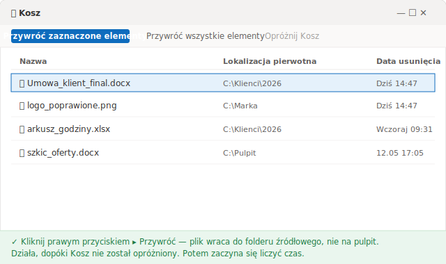

# Jak odzyskać usunięte pliki z kosza (i dlaczego liczy się każda minuta)

> Plik wciąż w koszu? To pięć sekund. Już opróżniony? Zegar właśnie ruszył.

Jest 14:47 w czwartek. Porządkowałeś folder z klientami, zaznaczyłeś stos starych plików i skasowałeś je naraz, żeby zrobić miejsce. Dwie minuty później dociera do ciebie, że w tym stosie była też finalna umowa, którą poprawiałeś całe przedpołudnie. Otwierasz kosz. Pusty — opróżniłeś go przy okazji, bez namysłu.

Od tej chwili o tym, czy odzyskasz plik, nie decyduje to, jaką metodę wybierzesz. Decyduje, **ile czasu ci jeszcze zostało**. Plik, który właśnie wpadł do kosza, to niemal pewny odzysk. Plik skasowany na dobre to inna historia: każda mijająca minuta i każda nowa rzecz, którą komputer zapisze na dysku, zmniejsza twoje szanse o kolejny stopień.

Dlatego ten poradnik nie układa dróg według „łatwa czy trudna". Układa je według **pilności**: droga 1 jest na sytuację, gdy plik wciąż tam jest, droga 4 na moment, gdy zostało już prawie nic. Próbuj od góry do dołu.

## Droga 1: przywróć prosto z kosza

To najspokojniejszy scenariusz — i na nim kończy się większość przypadkowych skasowań. Kiedy naciskasz zwykły klawisz Delete, Windows nie usuwa pliku — tylko przenosi go do **kosza**. Plik leży tam w całości, dopóki go nie opróżnisz albo dopóki kosz sam się nie przepełni.

Otwórz **kosz** na pulpicie, znajdź plik, kliknij go prawym przyciskiem i wybierz **Przywróć**. Plik wraca dokładnie do tego folderu, z którego zniknął, a nie na pulpit. Gotowe.

Są jednak dwie pułapki, przez które kosz świeci pustkami, choć niczego nie opróżniałeś:

- Skasowałeś plik skrótem **Shift + Delete** — ten skrót omija kosz i kasuje od razu.
- Plik był za duży i przekroczył maksymalny rozmiar kosza, więc Windows usunął go w całości, zamiast odłożyć.

Jeśli to któryś z tych przypadków, kosz nie pomoże. Zejdź do kolejnej drogi.

## Droga 2: cofnij usuwanie, gdy błąd jest świeży

Jeśli skasowałeś plik przed chwilą i nie zrobiłeś jeszcze nic więcej, to najszybszy ze wszystkich skrótów — szybszy nawet niż otwieranie kosza. W oknie Eksploratora plików naciśnij **Ctrl + Z**. Albo kliknij prawym przyciskiem w pustym miejscu wewnątrz folderu, w którym był plik, i wybierz **Cofnij usuwanie**. Windows od razu przywraca plik na miejsce.

Dobre w tej drodze jest to, że odkłada plik tam, gdzie należy, nawet jeśli zdążył już trafić do kosza. Złe jest to, że żyje krótko: otworzysz kilka okien, skopiujesz inne pliki albo wyłączysz komputer i historia cofania znika.

Krótko mówiąc: Ctrl + Z to odruch pierwszych dwóch minut. Po tym oknie potrzebujesz innej drogi.

## Droga 3: Przywróć poprzednie wersje, jeśli włączyłeś to wcześniej

Tu granica robi się wyraźna: od tej drogi w dół to, czy odzyskasz plik, **zależy od czegoś, co zrobiłeś — albo zapomniałeś zrobić — zanim doszło do straty.**

Windows ma funkcję o nazwie **Historia plików**, która automatycznie trzyma poprzednie wersje wskazanych przez ciebie folderów. Gdy jest włączona, klikasz prawym przyciskiem folder, w którym był utracony plik, wybierasz **Przywróć poprzednie wersje**, a Windows pokazuje migawki według daty, żebyś wybrał właściwą. To dokładnie ta droga, którą opisuje Microsoft w artykule o [kopii zapasowej i przywracaniu przy użyciu Historii plików](https://support.microsoft.com/pl-pl/windows/kopia-zapasowa-i-przywracanie-przy-u%C5%BCyciu-historii-plik%C3%B3w-7bf065bf-f1ea-0a78-c1cf-7dcf51cc8bfc).

I tu jest pułapka, o której prawie żaden poradnik nie mówi jasno: **zakładka „Poprzednie wersje" pokaże cokolwiek tylko wtedy, gdy Historia plików była włączona wcześniej.** Jeśli nigdy jej nie aktywowałeś, lista będzie pusta — nie ma czego przywracać. Windows zaczyna rejestrować dopiero po tym, jak włączysz funkcję; przeszłości nie odtworzy.

Na komputerze osobistym albo w małym biurze bez działu IT — a tak pracuje wielu jednoosobowych przedsiębiorców, księgowych i prawników — ta funkcja prawie nigdy nie jest włączona fabrycznie. Jeśli to twój przypadek, lista będzie pusta i lądujesz na ostatniej drodze.

## Droga 4: program do odzyskiwania, i natychmiast przestań używać dysku

Skoro doszedłeś tutaj, plik został skasowany na dobre i żadna twoja warstwa kopii go nie zatrzymała. Zostaje skanowanie fizycznej części dysku programem do odzyskiwania danych — takim jak **Recuva** (darmowy, lekki) albo **Disk Drill** (płatna wersja, mocniejsza). To narzędzia, które czytają dysk i próbują odtworzyć obszary oznaczone przez system jako „usunięte", ale jeszcze niezapisane na nowo.

Zanim cokolwiek zainstalujesz, jest jednak rzecz ważniejsza niż sam program: **natychmiast przestań używać dysku, na którym był plik.** Gdy plik znika na dobre, dane nie znikają w jednej chwili — system tylko oznacza zajmowane przez nie miejsce jako wolne. Sam Microsoft potwierdza to w dokumentacji [odzyskiwania plików w systemie Windows](https://support.microsoft.com/pl-pl/windows/odzyskiwanie-plik%C3%B3w-w-windows-61f5b28a-f5b8-3cc2-0f8e-a63cb4e1d4c4): miejsce używane przez usunięty plik jest oznaczone jako wolne, co oznacza, że dane mogą nadal istnieć i dać się odzyskać. Dlatego, jak pisze ta sama strona, każde użycie komputera może tworzyć pliki, które w dowolnym momencie nadpiszą to wolne miejsce — czyli właśnie to, co chcesz ocalić.

I tu dochodzimy do rzeczy, którą zna najmniej osób: **na dysku SSD okno zamyka się dużo szybciej niż na talerzowym.** SSD ma mechanizm o nazwie TRIM, który sam czyści bloki oznaczone jako usunięte, żeby dysk pozostał szybki. Strona Microsoftu ostrzega wprost, że wolne miejsce mogło już zostać zastąpione, szczególnie na dysku półprzewodnikowym (SSD). Kiedy TRIM przejdzie — często w ciągu kilku minut po skasowaniu — nie odzyska danych nawet narzędzie kryminalistyczne: skanuje, ale nie ma już czego czytać. Na dysku talerzowym okno jest większe, ale plik i tak mógł zostać częściowo nadpisany.

Stąd dwie złote zasady: **nie instaluj programu na tym samym dysku co utracony plik i nie zapisuj na nim odzyskanego pliku** — oba te kroki grożą nadpisaniem dokładnie tego, co próbujesz ocalić.

## Kiedy nie musisz niczego odzyskiwać

Zauważyłeś, co łączy te cztery drogi? Im niżej, tym bardziej twoja szansa zależy od szczęścia i tempa. Na drodze 4 zakładasz się, że TRIM jeszcze nie przeszedł, a dysk jeszcze nie nadpisał — zakład, który zwykle wychodzi drogo.

Jest jednak zupełnie inny kierunek i nie leży on w „odzyskuj szybciej". Leży w **zamienieniu przypadkowego skasowania w nie-zdarzenie.** Pomysł jest prosty: zamiast liczyć, że wyłowisz plik z dysku już po fakcie, trzymaj z wyprzedzeniem wersje całego **folderu**. Wtedy skasowany plik nie znika — zostaje w historii, a ty przywracasz go jednym kliknięciem.

Tym właśnie zajmuje się [Keeply](https://keeply.work). Wskazujesz mu folder — na swoim komputerze albo na firmowym dysku sieciowym — a on trzyma wersje tego folderu w tle, w rytmie, który ustawiasz **ty**: co 15, 30 albo 60 minut, domyślnie co 30. Kiedy plik znika z monitorowanego folderu, dalej leży w całości na osi czasu wersji; otwierasz ją, znajdujesz najnowszą wersję sprzed usunięcia i przywracasz.

Różnica, dzięki której to wszystko działa: Keeply **nie** uruchamia się od Ctrl + S i **nie** nasłuchuje każdego twojego zapisu. Działa według własnego harmonogramu, zawsze w tle. Jest też ręczny przycisk **„Zapisz wersję"**, którym oznaczasz ważny moment jednolinijkową notatką — na przykład „przed wysłaniem do klienta". A ponieważ wersje są trzymane od momentu sprzed usunięcia, odzysk dzieje się **zanim** dane zamienią się w „miejsce do nadpisania" — bez wyścigu z mechanizmem TRIM, bez zakładu o program skanujący.

Ta sama warstwa wersji chroni cię też przed czymś groźniejszym niż przypadkowe skasowanie: **przed śmiercią samego dysku.** Z jednym dyskiem, gdy on padnie, tracisz wszystko. Keeply trzyma dane w układzie 3-2-1 — jedna kopia lokalna, jedna główna i jedno odbicie w innym miejscu — więc martwy dysk nie zabiera ze sobą twojej pracy. (To zabezpieczenie poboczne; głównym tematem zostaje tu odzyskanie przypadkowo skasowanego pliku.) Pod spodem każda zapisana wersja jest zablokowana i niezmienna — to wewnętrzna maszyneria. Nigdy nie wpisujesz żadnej komendy, żeby używać Keeply, i nie musisz rozumieć inżynierii pod spodem, żeby działał.

## Gdzie Keeply NIE pomaga (bez owijania w bawełnę)

Żadne narzędzie nie obejmuje wszystkiego, a udawanie, że jest inaczej, kończy się tym, że zaufasz niewłaściwemu miejscu. Trzy sytuacje, w których Keeply nie jest odpowiedzią:

- **Plik, który nigdy nie był w monitorowanym folderze.** Jeśli skasowany plik nigdy nie przeszedł przez folder obserwowany przez Keeply, nie ma po nim śladu. Wtedy zostają drogi 1–4 powyżej — i wracasz do wyścigu z czasem.
- **Plik utracony, zanim zainstalowałeś Keeply.** Keeply trzyma wersje od chwili, w której powierzasz mu folder. Plik skasowany na dobre w zeszłym tygodniu, gdy nie było jeszcze żadnej warstwy, dalej zależy od programu do odzyskiwania danych, z całym ryzykiem, które się z tym wiąże.
- **Cicha awaria pliku.** Jeśli plik był już uszkodzony w chwili, gdy została uchwycona jego wersja, Keeply wiernie zachowa wersję uszkodzoną. Wersjonowanie to nie naprawa.

Krótko mówiąc: Keeply zajmuje się **przyszłością** — żeby kolejne przypadkowe skasowanie nie było już problemem. Plik, który przepadł wcześniej, wciąż należy do czterech dróg z góry.

## Kiedy wystarczą narzędzia, które już masz

Nie ma sensu instalować dodatkowej warstwy, jeśli twoje pliki są już dobrze chronione. Jeśli żyją w **OneDrive** albo **SharePoint**, masz dwa mocne zabezpieczenia za darmo.

Pierwsze to **kosz w chmurze**, który trzyma usunięty plik całkiem długo: na koncie osobistym to **30 dni**, na koncie służbowym lub szkolnym **93 dni**, zgodnie z [dokumentacją Microsoftu o usuwaniu i przywracaniu plików w OneDrive](https://support.microsoft.com/pl-pl/office/przywracanie-usuni%C4%99tych-plik%C3%B3w-lub-folder%C3%B3w-w-us%C5%82udze-onedrive-949ada80-0026-4db3-a953-c99083e6a84f). To okno znacznie większe niż przy lokalnym skasowaniu.

Drugie to **historia wersji**, dzięki której wracasz do starszych wersji tego samego pliku. Ma jednak wyraźny limit: na osobistym koncie Microsoft możesz pobrać tylko **25 ostatnich wersji**, jak podaje [strona pomocy Microsoftu o przywracaniu poprzedniej wersji pliku w OneDrive](https://support.microsoft.com/pl-pl/office/przywracanie-poprzedniej-wersji-pliku-przechowywanego-w-us%C5%82udze-onedrive-159cad6d-d76e-4981-88ef-de6e96c93893). Dla pliku, który zmienia się bez przerwy, 25 wersji może pokryć tylko ostatnie kilka dni.

To zabezpieczenie w chmurze jest świetne — ale działa wyłącznie dla plików, które **naprawdę** leżą w folderze zsynchronizowanym z chmurą. Dla wielu jednoosobowych przedsiębiorców, księgowych i prawników pracujących na komputerze osobistym albo na firmowym dysku sieciowym — bez synchronizacji, bez działu IT, który włączyłby Historię plików — ani kosz w chmurze, ani ta historia wersji nie wchodzą do gry. I właśnie tu warstwa wersji działająca w tle pokazuje swoją wartość.

## Najczęściej zadawane pytania

**Gdzie trafia plik usunięty z kosza (albo przez Shift + Delete) i czy da się go odzyskać?**
Kiedy opróżniasz kosz albo kasujesz plik przez Shift + Delete, Windows nie usuwa danych od razu — tylko oznacza zajmowane przez nie miejsce na dysku jako wolne. Według Microsoftu dane pliku mogą nadal istnieć i da się je odzyskać, dopóki coś nowego ich nie nadpisze. Szansa jest, ale spada z każdym zapisem na dysk, a najszybciej na dysku SSD.

**Jak odzyskać trwale usunięte pliki po opróżnieniu kosza?**
Próbuj w kolejności pilności: (1) jeśli właśnie skasowałeś plik, naciśnij **Ctrl + Z** albo kliknij prawym przyciskiem w folderze i wybierz **Cofnij usuwanie**; (2) kliknij prawym przyciskiem folder źródłowy i sprawdź **Przywróć poprzednie wersje** — ale coś tam zobaczysz tylko, jeśli **Historia plików** była włączona wcześniej; (3) na końcu program do odzyskiwania danych, np. Recuva albo Disk Drill, i natychmiast przestań używać dysku, żeby go nie nadpisać.

**Czy program do odzyskiwania danych zawsze odzyska plik?**
Nie. Skuteczność jest wysoka, gdy zadziałasz szybko, a dysk nie został nadpisany, ale mocno spada z czasem i z każdym nowym zapisem. Na dysku SSD mechanizm TRIM czyści zwolnione bloki w kilka minut, więc potem nie pomoże nawet narzędzie kryminalistyczne. Nie instaluj programu na tym samym dysku co utracony plik i nie zapisuj na nim odzyskanego pliku.

**Jak długo OneDrive przechowuje usunięty plik?**
Według dokumentacji Microsoftu kosz OneDrive trzyma usunięty plik przez **30 dni** na koncie osobistym i **93 dni** na koncie służbowym lub szkolnym. Dodatkowo historia wersji na koncie osobistym pozwala pobrać **25 ostatnich wersji** pliku. Obie te możliwości działają tylko dla plików, które naprawdę leżą w folderze zsynchronizowanym z chmurą.

**Czy Keeply to program do odzyskiwania danych jak Recuva albo Disk Drill?**
Nie, to dwie różne warstwy. Recuva i Disk Drill skanują fizyczną część dysku, próbując wyłowić bajty już oznaczone jako usunięte — to wyścig z czasem. Keeply trzyma nienaruszone wersje folderu od momentu sprzed usunięcia pliku, więc odzysk dzieje się, zanim dane staną się możliwe do nadpisania. Keeply to narzędzie, dzięki któremu zwykle nie będziesz musiał sięgać po Recuvę.

## Czytaj także

- [Keeply](https://keeply.work) — warstwa wersji, która robi zdjęcia twoich folderów w tle, na komputerze osobistym albo na dysku sieciowym, żeby przypadkowo skasowany plik został w całości w historii i wrócił jednym kliknięciem.
- [Kopia zapasowa i przywracanie przy użyciu Historii plików — Pomoc Microsoftu](https://support.microsoft.com/pl-pl/windows/kopia-zapasowa-i-przywracanie-przy-u%C5%BCyciu-historii-plik%C3%B3w-7bf065bf-f1ea-0a78-c1cf-7dcf51cc8bfc) — pełna droga Historii plików i Przywróć poprzednie wersje.
- [Odzyskiwanie plików w systemie Windows — Pomoc Microsoftu](https://support.microsoft.com/pl-pl/windows/odzyskiwanie-plik%C3%B3w-w-windows-61f5b28a-f5b8-3cc2-0f8e-a63cb4e1d4c4) — narzędzie wiersza poleceń do plików, które opuściły kosz, z ostrzeżeniem o nadpisaniu i SSD.
- [Usuwanie lub przywracanie plików i folderów w OneDrive — Pomoc Microsoftu](https://support.microsoft.com/pl-pl/office/przywracanie-usuni%C4%99tych-plik%C3%B3w-lub-folder%C3%B3w-w-us%C5%82udze-onedrive-949ada80-0026-4db3-a953-c99083e6a84f) — okres przechowywania w koszu w chmurze (30 dni konto osobiste / 93 dni służbowe).

*Autor: Ting-Wei Tsao, założyciel Keeply, [LinkedIn](https://www.linkedin.com/in/ting-wei-tsao-b57480152)*
