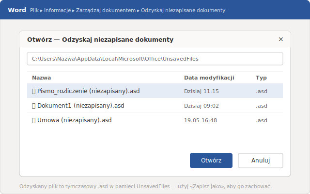
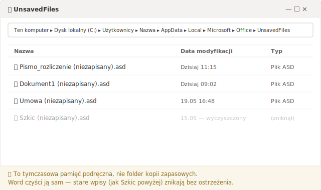
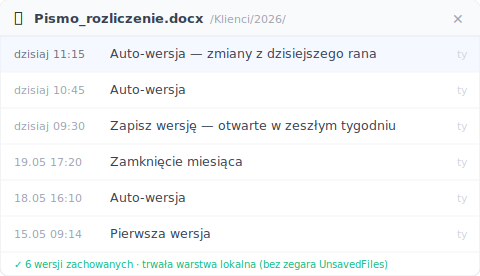

# Jak odzyskać niezapisany dokument Word: uczciwy poradnik (2026)

Jak wyciągnąć dokument z ukrytego folderu Worda w pięć minut — i dlaczego połowa osób, które o to pytają, tak naprawdę szuka czegoś zupełnie innego.

Jest 11:15 we wtorek w niewielkim biurze rachunkowym. Word zamknął się sam w połowie pisma, które ma iść z miesięcznym rozliczeniem. Od chwili, gdy otworzyłeś pusty dokument, nie zapisałeś ani razu. Pierwszy odruch to wpisać w Google „jak odzyskać niezapisany dokument Word". Dobra wiadomość: Word trzyma ukrytą kopię, z której prawie nikt nie umie skorzystać. Zła wiadomość, o której nikt nie uprzedza: ta kopia ratuje tylko jeden rodzaj straty — a jeśli twój przypadek jest tym drugim, przez pół godziny będziesz przekopywać folder, w którym nigdy nie było tego, czego szukasz.

Ten poradnik od razu rozdziela dwie sytuacje, pokazuje pięciominutowy ratunek i mówi wprost, gdzie Word zostawia cię na lodzie.

## Ratunek w 5 minut: Plik > Informacje > Zarządzaj dokumentem

Najpierw najszybsza droga. Jeśli Word się zawiesił, a ty właśnie uruchomiłeś go ponownie, często sam pokazuje z lewej strony panel **„Odzyskiwanie dokumentu"** z listą tego, co zdążył zapisać. Jeśli panel się pojawił, kliknij najnowszy plik i zapisz go od razu — sprawa załatwiona. Jeśli się nie pojawił (albo zamknąłeś go przez przypadek), skorzystaj z drogi poniżej.

Otwórz Worda i wejdź w **Plik → Informacje → Zarządzaj dokumentem → Odzyskaj niezapisane dokumenty**. Otworzy się okno z listą dokumentów, które Word odłożył sam, choć ty nigdy ich nie zapisałeś. Kliknij ten z datą i godziną najbliższą momentowi, w którym pracowałeś, otwórz go i od razu zapisz jako plik .docx w miejscu, które rozpoznasz.

To polecenie wyciąga pliki z ukrytego folderu, którego większość ludzi nigdy nie widziała: `%LocalAppData%\Microsoft\Office\UnsavedFiles`. Leżą w nim kopie tymczasowe z rozszerzeniem `.asd`, tworzone przez Autoodzyskiwanie. Tę ścieżkę i ten sam tok postępowania opisuje sama Microsoft w [artykule o odzyskiwaniu dokumentów Worda](https://learn.microsoft.com/pl-pl/troubleshoot/microsoft-365-apps/word/recover-lost-unsaved-corrupted-document).

Jeśli lista okaże się pusta, zostaje jeszcze plan B, zanim się poddasz. Kliknij **Start**, wpisz w wyszukiwaniu `.asd` i naciśnij Enter. Pojawiły się pliki `.asd`? W Wordzie wejdź w **Plik → Otwórz → Przeglądaj**, zmień typ pliku na **Wszystkie pliki** i otwórz `.asd` wprost. To ta sama zawartość, tylko otwarta z zewnątrz, a nie z poziomu Worda.

## Dlaczego dokument znika ponownie (i nikt cię nie ostrzega)

Pamięć podręczna niezapisanych plików to nie sejf. Word czyści ten folder sam, według własnego harmonogramu, nie pytając cię o zdanie. Dlatego plik, który leżał tam wczoraj, dziś może go już nie być — i dlatego odzyskaną kopię musisz zapisać w tej samej chwili, w której ją znajdujesz.

Po forach i blogach krąży liczba „4 dni" przechowywania. Potraktuj ją jak plotkę: Microsoft nie podaje żadnego sztywnego, gwarantowanego okresu dla tego folderu. Może być krócej — zależnie od tego, ile nowych plików Word zdążył wygenerować i jak była używana maszyna. Reguła praktyczna jest tylko jedna: znalazłeś — zapisz. Nie licz, że `.asd` na ciebie poczeka.

Silnikiem tego wszystkiego jest Autoodzyskiwanie. To ono zapisuje kopię `.asd` w stałych odstępach, kiedy piszesz. Częstotliwość ustawiasz w **Plik → Opcje → Zapisywanie**, w polu „Zapisz informacje Autoodzyskiwania co X min". Microsoft zaleca w [artykule pomocy Worda](https://learn.microsoft.com/pl-pl/troubleshoot/microsoft-365-apps/word/recover-lost-unsaved-corrupted-document) zostawienie Autoodzyskiwania włączonego i ustawienie tego odstępu na **pięć minut lub mniej** w biurach, które nie mogą sobie pozwolić na utratę pracy. Zrób to teraz, zanim przyjdzie kolejne zawieszenie — zajmuje dziesięć sekund, a to różnica między utratą pięciu minut a utratą całego poranka.

## „Odzyskaj niezapisane" nie zadziałało. Co teraz?

Najpewniej dlatego, że twój problem to nie ten, który to polecenie rozwiązuje. Istnieją dwa zupełnie różne rodzaje „straciłem swojego Worda", a Word kieruje oba w to samo miejsce — i to właśnie myli niemal wszystkich.

**Problem A — plik nigdy nie został zapisany.** Word zawiesił się, gdy pisałeś nowy dokument, albo przy zamykaniu kliknąłeś przez przypadek „Nie zapisuj". Na dysku nigdy nie powstał żaden `.docx`. Tutaj pamięć niezapisanych plików to twoja jedyna i w pełni uprawniona szansa — dokładnie do tego została stworzona.

**Problem B — plik już istniał, a ty straciłeś zmiany z rana.** Umowa była zapisana od zeszłego tygodnia. Pracowałeś nad nią cały ranek, o 12:00 nadpisałeś go wersją z przypadkowo skasowanym akapitem — i teraz chcesz odzyskać treść sprzed 11:15. Plik leży na miejscu, cały. Zniknęły tylko ostatnie godziny. I tu pamięć niezapisanych plików prawie nigdy nie pomaga: `.asd` celuje w pliki, które nigdy nie trafiły na dysk, a nie w starsze wersje pliku, który już istnieje.

Dla Problemu B droga natywna jest inna. Kliknij plik prawym przyciskiem i poszukaj **Przywróć poprzednie wersje** (albo otwórz **Właściwości → Poprzednie wersje**) i sprawdź, czy jest tam wcześniejsza wersja. Haczyk, na którym potyka się większość ludzi: ta karta cokolwiek pokaże tylko wtedy, gdy **Historia plików** Windowsa albo punkty przywracania były włączone *zanim* doszło do straty. Microsoft pisze wprost, że Historię plików trzeba [najpierw skonfigurować](https://support.microsoft.com/en-us/windows/backup-and-restore-with-file-history-7bf065bf-f1ea-0a78-c1cf-7dcf51cc8bfc) — dopiero potem ma ona z czego przywracać. Na komputerze jednoosobowej działalności czy małego biura bez działu IT prawie nigdy nie są włączone. Funkcję odkrywasz właśnie tego dnia, w którym przydałoby się, żeby działała już od tygodni.

## Jak odzyskać poranną wersję bez liczenia na pamięć podręczną Worda?

Żeby wrócić do wersji sprzed kilku godzin, potrzebujesz trwałej warstwy wersji — czegoś, co robi zdjęcia pliku według harmonogramu, zamiast liczyć na to, że w pamięci Worda akurat jest to, czego chcesz. To odpowiedź na Problem B, który narzędzia natywne pokrywają wyłącznie wtedy, gdy przygotowałeś się z wyprzedzeniem.

Tym właśnie zajmuje się [Keeply](https://keeply.work) w przypadku plików na lokalnym komputerze albo na dysku sieciowym. Wskazujesz Keeply **folder**, w którym leżą twoje dokumenty — folder klientów, folder bieżącego miesiąca — a on trzyma wersje w tle według harmonogramu, który ustawiasz **ty**: co 15, 30 albo 60 minut, domyślnie co 30 minut. Jest też ręczny przycisk „Zapisz wersję", przy którym dopisujesz jednolinijkową notatkę — na przykład „przed wysłaniem do klienta" — by oznaczyć moment, do którego warto będzie wrócić.

Kiedy poranek przepada, nie grzebiesz w żadnym ukrytym folderze. Otwierasz oś czasu danego pliku i wybierasz wersję z 11:15. Pod spodem Keeply korzysta z silnika Git: każda zapisana wersja jest niezmienna, więc nadpisanie nigdy nie kasuje poprzedniej. Nigdy nie wpisujesz żadnej komendy — oś czasu to po prostu lista godzin do kliknięcia.

Dwie rzeczy, których nie wolno pomylić z tym, co robi Word: Keeply **nie** uruchamia się od Ctrl+S i **nie** nasłuchuje każdego twojego zapisu. Działa według własnego zegara. To właśnie ta różnica sprawia, że obejmuje cały ranek, a nie tylko ostatnią chwilę przed zawieszeniem.

## Gdzie Keeply NIE pomoże (bez owijania w bawełnę)

Żadna warstwa wersji nie pokrywa wszystkiego, a udawanie, że jest inaczej, kończy się utratą pliku, bo zaufałeś niewłaściwemu miejscu. Trzy sytuacje, w których Keeply nie jest odpowiedzią:

- **Nowy dokument, który nigdy nie trafił do monitorowanego folderu.** Jeśli otworzyłeś Worda, napisałeś i program zawiesił się przed jakimkolwiek zapisem na dysk, nie było pliku, który Keeply mógłby zwersjonować. To czysty Problem A — twoją drogą wciąż pozostaje pamięć niezapisanych plików Worda.
- **Cicha awaria pliku.** Jeśli plik był już uszkodzony w chwili, gdy została uchwycona jego wersja, Keeply wiernie zachowa wersję uszkodzoną. Wersjonowanie to nie naprawa.
- **Pliki spoza monitorowanego folderu.** Dokument, który zapisałeś prosto na pendrive, którego nigdy nie dodałeś do Keeply, nie ma żadnej historii. Co nie leży w monitorowanym folderze, dla osi czasu po prostu nie istnieje.

## Kiedy wystarczą same funkcje Worda

W wielu przypadkach nie potrzebujesz niczego poza tym, co już jest w pakiecie Office, a dokładanie dodatkowej warstwy byłoby przesadą. Bądź szczery co do swojej sytuacji, zanim zaczniesz szukać kolejnego narzędzia.

Funkcje natywne wystarczą, gdy: dokument to roboczy szkic, który bez żalu napiszesz od nowa; plik żyje w **OneDrive** albo **SharePoint** z włączonym **Autozapisem**; albo gdy strata poranka pracy byłaby irytująca, ale nie poważna.

Autozapis w OneDrive/SharePoint zresztą pokrywa całkiem sporo — zapisuje w chmurze na bieżąco i utrzymuje historię wersji dostępną z przeglądarki. Warto jednak znać granice: działa tylko, gdy plik jest w zsynchronizowanej kopii w chmurze, historia wersji ma swój limit, a Autozapis nadpisuje, zamiast najpierw zapytać. Dla kogoś, kto pracuje na lokalnym komputerze albo na firmowym dysku sieciowym — a tak wygląda praca sporej części jednoosobowych działalności, księgowych i prawników bez zarządzanego IT — ten chmurowy obieg po prostu nie wchodzi w grę, i to wtedy rozmowa się zmienia.

## Najczęściej zadawane pytania

**Gdzie w Windowsie znajduje się niezapisany dokument Word?**
W ukrytym folderze `%LocalAppData%\Microsoft\Office\UnsavedFiles`, zapisany jako plik tymczasowy `.asd`. Najprościej dotrzeć do niego od wewnątrz Worda: Plik → Informacje → Zarządzaj dokumentem → Odzyskaj niezapisane dokumenty, bez ręcznego nawigowania po folderze.

**Jak długo Word przechowuje niezapisany plik?**
Microsoft nie podaje żadnego sztywnego, gwarantowanego terminu. Word czyści ten folder według własnego harmonogramu, bez ostrzeżenia. Krążąca w sieci liczba „4 dni" nie jest gwarancją. Bezpieczna reguła to zapisać odzyskaną kopię w chwili, w której ją znajdziesz.

**Odzyskałem plik, ale straciłem tylko zmiany z rana. Jak je przywrócić?**
To przypadek pliku, który już istniał. Spróbuj prawym przyciskiem → Przywróć poprzednie wersje (albo Właściwości → Poprzednie wersje), ale to zadziała tylko, jeśli Historia plików Windowsa była włączona wcześniej. Żeby pewnie wrócić do wersji sprzed kilku godzin, potrzebujesz trwałej warstwy wersji, która zapisywała plik według harmonogramu — takiej jak Keeply, który prowadzi osobną oś czasu dla każdego pliku w monitorowanych przez ciebie folderach.

**Czym różni się Autoodzyskiwanie od Autozapisu?**
Autoodzyskiwanie zapisuje tymczasową kopię `.asd` na twoim lokalnym dysku w stałych odstępach, na potrzeby ratunku po zawieszeniu. Autozapis zapisuje prawdziwy plik, na bieżąco, ale tylko dla otwartych dokumentów z OneDrive lub SharePoint. Jedno to lokalna siatka bezpieczeństwa, drugie to ciągły zapis w chmurze.

**Czy zmiana odstępu Autoodzyskiwania faktycznie pomaga?**
Pomaga. W Plik → Opcje → Zapisywanie ustaw „Zapisz informacje Autoodzyskiwania co X min" na pięć minut lub mniej, zgodnie z zaleceniem Microsoftu. Im krótszy odstęp, tym mniej pracy zostaje poza ostatnią kopią bezpieczeństwa, gdy Word zamknie się sam.

## Czytaj także

- [Keeply — chroń historię folderów, w których pracujesz](https://keeply.work)

*Autor: Ting-Wei Tsao, założyciel Keeply, [LinkedIn](https://www.linkedin.com/in/ting-wei-tsao-b57480152)*
