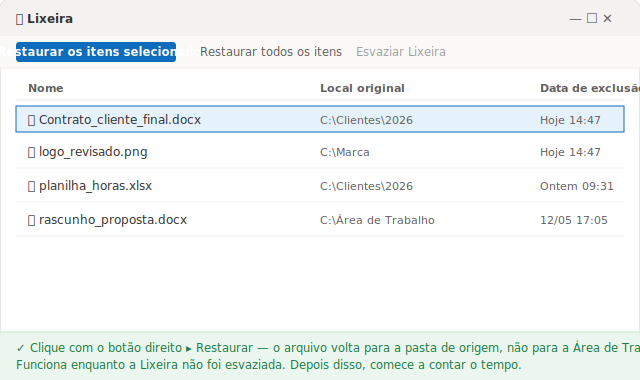
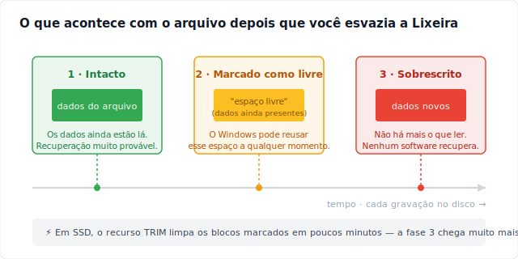
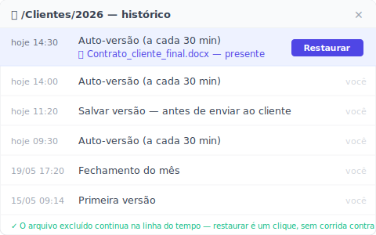

# Como recuperar arquivos excluídos da lixeira (na ordem do tempo que você tem)

> Arquivo ainda na Lixeira? São cinco segundos. Já esvaziou? O relógio começou a correr.

São 14h47 de uma quinta-feira. Você estava limpando a pasta de clientes, selecionou um monte de arquivo velho e apagou de uma vez para deixar tudo organizado. Dois minutos depois percebe que, no meio daquele monte, foi também o contrato final que você ajustou a manhã inteira. Abre a Lixeira. Vazia — você a esvaziou junto, sem pensar.

A partir daqui, o que decide se você recupera o arquivo não é qual método você usa. É **quanto tempo ainda sobrou**. Arquivo que acabou de cair na Lixeira é recuperação quase garantida. Arquivo já apagado de vez é outra história: cada minuto que passa, cada coisa nova que o computador grava no disco, derruba sua chance mais um degrau.

Por isso este guia não organiza os caminhos por "fácil ou difícil". Organiza por **urgência**: o caminho 1 é para quando o arquivo ainda está lá, o caminho 4 é para quando quase não sobrou nada. Tente de cima para baixo.

## Caminho 1: restaurar direto da Lixeira

Esse é o cenário tranquilo, e é onde a maioria dos "apaguei sem querer" termina bem. Quando você aperta a tecla Delete normal, o Windows não apaga o arquivo — ele só move para a **Lixeira**. O arquivo fica lá inteiro até você esvaziar, ou até a Lixeira expirar sozinha.

Abra a **Lixeira** na Área de Trabalho, ache o arquivo, clique nele com o botão direito e escolha **Restaurar**. Ele volta para a pasta exata de onde foi apagado, não para a Área de Trabalho. Pronto.

Mas existem duas armadilhas que deixam a Lixeira vazia sem você ter esvaziado nada:

- Você apagou com **Shift + Delete** — esse atalho pula a Lixeira e apaga direto.
- O arquivo era grande demais e passou do tamanho máximo da Lixeira, então o Windows apagou de uma vez em vez de guardar.

Se for um desses casos, a Lixeira não ajuda. Desça para o próximo caminho.

## Caminho 2: desfazer a exclusão quando você acabou de errar

Se você apagou agora e ainda não fez mais nada, esse é o atalho mais rápido — mais rápido até que abrir a Lixeira. Na janela do Explorador de Arquivos, aperte **Ctrl + Z**. Ou clique com o botão direito num espaço vazio dentro da própria pasta que continha o arquivo e escolha **Desfazer Exclusão**. O Windows devolve o arquivo para o lugar na hora.

O bom desse caminho é que ele recoloca o arquivo na posição certa, mesmo que ele já tenha ido para a Lixeira. O ruim é que ele só vive por algumas ações: abriu mais umas janelas, copiou outros arquivos, ou desligou o computador, e o histórico de desfazer some.

Em resumo: Ctrl + Z é o reflexo dos dois primeiros minutos. Passou dessa janela, você precisa de outro caminho.

## Caminho 3: Restaurar versões anteriores, se você ligou isso antes

Aqui a fronteira fica clara: deste caminho em diante, recuperar ou não **depende de algo que você fez — ou esqueceu de fazer — antes do problema acontecer.**

O Windows tem um recurso chamado **Histórico de Arquivos** (File History), que guarda automaticamente versões anteriores das pastas que você indica. Com ele ligado, você clica com o botão direito na pasta que continha o arquivo perdido, escolhe **Restaurar versões anteriores** e o Windows lista os instantâneos por data para você escolher. É exatamente o caminho que a Microsoft descreve para [backup e restauração com o Histórico de Arquivos](https://support.microsoft.com/pt-br/windows/backup-e-restaura%C3%A7%C3%A3o-com-hist%C3%B3rico-de-arquivos-7bf065bf-f1ea-0a78-c1cf-7dcf51cc8bfc).

E aqui está a armadilha que quase nenhum tutorial fala com clareza: **a aba "Restaurar versões anteriores" só mostra algo se o Histórico de Arquivos já estava ligado antes.** Se você nunca ativou, a lista vem vazia — não há nada para restaurar. O Windows só começa a registrar depois que você ativa; o passado ele não reconstrói.

Num computador pessoal ou no PC de um escritório pequeno sem TI — o caso de muito MEI, contador e advogado — esse recurso quase nunca está ligado de fábrica. Se for o seu caso, a lista vem vazia e você é empurrado para o último caminho.

## Caminho 4: software de recuperação, e pare de usar o disco já

Chegando aqui, o arquivo foi mesmo apagado de vez e nenhuma camada de backup sua o guardou. O que sobra é varrer a parte física do disco com um software de recuperação de dados — como o **Recuva** (gratuito, leve) ou o **Disk Drill** (versão paga, mais robusta). São ferramentas que leem o disco tentando recuperar regiões que o sistema marcou como "apagadas" mas ainda não regravou.

Antes de instalar qualquer coisa, há uma atitude mais importante que o software: **pare de usar o disco do arquivo imediatamente.** Quando um arquivo é apagado de vez, os dados não somem na hora — o sistema só marca aquele espaço como livre. A própria Microsoft confirma isso na documentação de [Recuperação de Arquivos do Windows](https://support.microsoft.com/pt-br/windows/recupera%C3%A7%C3%A3o-de-arquivos-do-windows-61f5b28a-f5b8-3cc2-0f8e-a63cb4e1d4c4): o espaço de um arquivo excluído é marcado como espaço livre, o que significa que os dados ainda podem existir e ser recuperados. Por isso, diz a mesma página, para aumentar suas chances você deve minimizar ou evitar usar o computador — cada gravação nova pode cair justamente em cima do que você quer salvar.

E aqui está a parte que menos gente conhece: **em SSD, a porta fecha muito mais rápido que em HD.** O SSD tem um mecanismo chamado TRIM, que limpa por conta própria os blocos marcados como apagados para o disco continuar rápido. A própria página da Microsoft avisa que o espaço livre pode já ter sido substituído, especialmente em uma SSD. Quando o TRIM passa — em geral poucos minutos depois de você apagar — nem ferramenta forense recupera: ela varre, mas não há mais dado para ler. Em HD a janela é maior, mas o arquivo ainda pode ter sido parcialmente sobrescrito.

Daí vêm as duas regras de ouro: **não instale o software no mesmo disco do arquivo perdido, e não salve o arquivo recuperado de volta nesse disco** — os dois passos correm o risco de gravar por cima de exatamente o que você está tentando salvar.

## Quando você não precisa recuperar nada

Você reparou no que os quatro caminhos têm em comum? Quanto mais para baixo, mais a sua chance depende de sorte e de velocidade. No caminho 4 você está apostando que o TRIM ainda não rodou e que o disco ainda não regravou — uma aposta que costuma sair cara.

Existe um rumo completamente diferente, e ele não está em "recuperar mais rápido". Está em **fazer da exclusão acidental um não-evento.** A ideia é simples: em vez de torcer para resgatar o arquivo do disco depois que ele já era, guarde de antemão as versões de uma **pasta** inteira. Aí um arquivo apagado não desaparece — ele continua no histórico, e você o traz de volta com um clique.

É isso que o [Keeply](https://keeply.work) faz. Você aponta para ele uma pasta — no seu computador ou numa unidade de rede da empresa — e ele guarda versões dessa pasta em segundo plano, num ritmo que **você** define: a cada 15, 30 ou 60 minutos, sendo 30 o padrão. Quando um arquivo é apagado da pasta monitorada, ele continua inteiro na linha do tempo de versões; você abre, acha a versão mais recente antes da exclusão e restaura.

A diferença que faz tudo funcionar: o Keeply **não** dispara a cada Ctrl + S e **não** fica escutando cada vez que você salva. Ele segue o próprio relógio, sempre em segundo plano. Existe ainda um botão **"Salvar versão"** para você marcar à mão um momento importante com uma nota de uma linha — "antes de enviar ao cliente", por exemplo. E como as versões são guardadas desde antes da exclusão, a recuperação acontece **antes** de os dados virarem "espaço sobrescritível" — sem corrida contra o TRIM, sem aposta no software de varredura.

Essa mesma camada de versões te cobre contra um risco maior que a exclusão acidental: **o próprio disco morrer.** Com um disco só, se ele falha você perde tudo. O Keeply mantém seus dados num arranjo 3-2-1 — uma cópia local, uma cópia principal e um espelho em outro lugar — então um disco morto não leva junto o seu trabalho. (Essa é a proteção secundária; o foco aqui continua sendo recuperar um arquivo apagado sem querer.) Por baixo, cada versão guardada fica travada e não é sobrescrita — isso é maquinário interno. Você nunca digita um comando para usar o Keeply, e não precisa entender a engenharia por trás para ele funcionar.

## Onde o Keeply NÃO ajuda (sem enrolação)

Nenhuma ferramenta cobre tudo, e fingir o contrário só faz você confiar no lugar errado. Três situações em que o Keeply não é a resposta:

- **Arquivo que nunca esteve numa pasta monitorada.** Se o arquivo apagado nunca passou pela pasta que o Keeply observa, não há rastro dele. Aí valem os caminhos 1 a 4 acima — e você volta à corrida contra o tempo.
- **Arquivo perdido antes de você instalar o Keeply.** Ele guarda versões a partir do momento em que você entrega a pasta. Um arquivo apagado de vez na semana passada, quando não havia camada nenhuma, ainda depende de software de recuperação de dados, com todo o risco que isso traz.
- **Corrupção silenciosa.** Se o arquivo já estava corrompido na hora em que uma versão foi capturada, o Keeply guarda fielmente a versão corrompida. Versionar não é reparar.

Em resumo: o Keeply cuida do **futuro** — para que a próxima exclusão acidental não seja mais um problema. Arquivo que já se perdeu antes ainda pertence aos quatro caminhos lá de cima.

## Quando as ferramentas que você já tem bastam

Não vale a pena instalar uma camada extra se os seus arquivos já estão bem protegidos. Se eles vivem no **OneDrive** ou no **SharePoint**, você tem duas proteções fortes de graça.

A primeira é a **lixeira na nuvem**, que guarda o arquivo apagado por bastante tempo: em conta pessoal são **30 dias**, em conta corporativa ou escolar são **93 dias**, segundo a [documentação da Microsoft sobre restaurar arquivos no OneDrive](https://support.microsoft.com/pt-br/windows/excluir-ou-restaurar-arquivos-e-pastas-no-onedrive-949ada80-0026-4db3-a953-c99083e6a84f). É uma janela bem maior que a da exclusão local.

A segunda é o **histórico de versões**, que deixa você voltar a versões antigas do mesmo arquivo. Mas ele tem um teto claro: em conta Microsoft pessoal, você recupera só as **últimas 25 versões**, conforme a [página de suporte da Microsoft](https://support.microsoft.com/pt-br/office/restaurar-uma-vers%C3%A3o-anterior-de-um-arquivo-armazenado-no-onedrive-159cad6d-d76e-4981-88ef-de6e96c93893). Para um arquivo que muda o tempo todo, 25 versões podem cobrir só os últimos dias.

Essa proteção na nuvem é ótima — mas só vale para arquivos que estão **de verdade** na pasta sincronizada com a nuvem. Para muito profissional autônomo, contador ou advogado que trabalha num computador pessoal ou numa unidade de rede da empresa — sem nada sincronizado, sem TI para ligar o Histórico de Arquivos — nem a lixeira da nuvem nem esse histórico de versões entram em campo. E é justamente aí que uma camada de versões em segundo plano mostra o seu valor.

## Perguntas frequentes

**Arquivo excluído da Lixeira (ou com Shift + Delete) vai para onde? Dá para recuperar?**
Quando você esvazia a Lixeira ou apaga com Shift + Delete, o Windows não apaga os dados na hora — ele só marca aquele espaço do disco como livre para reuso. Segundo a Microsoft, os dados ainda podem existir e ser recuperados até que algo novo seja gravado por cima. Por isso ainda há chance, mas ela cai a cada nova gravação no disco, e mais rápido ainda em SSD com TRIM.

**Como recuperar arquivos excluídos da lixeira permanente, depois de esvaziar?**
Tente na ordem de urgência: (1) se você acabou de apagar, aperte **Ctrl + Z** ou clique com o botão direito na pasta e escolha **Desfazer Exclusão**; (2) clique com o botão direito na pasta de origem e veja **Restaurar versões anteriores** — mas isso só lista algo se o **Histórico de Arquivos** do Windows já estava ligado antes; (3) por último, um software de recuperação de dados como Recuva ou Disk Drill, parando de usar o disco imediatamente para não sobrescrever o arquivo.

**Software de recuperação de dados sempre recupera o arquivo?**
Não. A taxa de sucesso é alta se você agir cedo e o disco ainda não foi sobrescrito, mas cai muito com o tempo e com cada nova gravação. Em SSD, o recurso TRIM limpa os blocos marcados em poucos minutos, então logo nem ferramenta forense recupera. Não instale o software no mesmo disco do arquivo perdido e não salve o arquivo recuperado de volta nesse disco.

**Por quanto tempo o OneDrive guarda um arquivo excluído?**
Pela documentação da Microsoft, a lixeira do OneDrive guarda o arquivo por **30 dias** em conta pessoal e por **93 dias** em conta corporativa ou escolar. Além disso, o histórico de versões em conta pessoal mantém as **últimas 25 versões** de cada arquivo. As duas janelas só valem para arquivos que estão de fato na pasta sincronizada com a nuvem.

**O Keeply é um software de recuperação de dados como o Recuva ou o Disk Drill?**
Não, são camadas diferentes. Recuva e Disk Drill varrem a parte física do disco para tentar resgatar bytes já marcados como apagados — uma aposta contra o tempo. O Keeply guarda versões intactas de uma pasta num cofre desde antes do arquivo ser excluído, então a recuperação acontece antes de os dados virarem espaço sobrescritível. O Keeply é a ferramenta que faz você nunca precisar do Recuva.

## Leia também

- [Keeply](https://keeply.work) — uma camada de versões que fotografa suas pastas em segundo plano, no computador pessoal ou na unidade de rede, para que um arquivo apagado sem querer continue inteiro no histórico e volte com um clique.
- [Backup e restauração com o Histórico de Arquivos — Suporte da Microsoft](https://support.microsoft.com/pt-br/windows/backup-e-restaura%C3%A7%C3%A3o-com-hist%C3%B3rico-de-arquivos-7bf065bf-f1ea-0a78-c1cf-7dcf51cc8bfc) — o caminho completo do Histórico de Arquivos e do Restaurar versões anteriores.
- [Recuperação de Arquivos do Windows — Suporte da Microsoft](https://support.microsoft.com/pt-br/windows/recupera%C3%A7%C3%A3o-de-arquivos-do-windows-61f5b28a-f5b8-3cc2-0f8e-a63cb4e1d4c4) — ferramenta de linha de comando para arquivos que já saíram da Lixeira, com o aviso sobre sobrescrita e SSD.
- [Excluir ou restaurar arquivos e pastas no OneDrive — Suporte da Microsoft](https://support.microsoft.com/pt-br/windows/excluir-ou-restaurar-arquivos-e-pastas-no-onedrive-949ada80-0026-4db3-a953-c99083e6a84f) — prazo de retenção na lixeira da nuvem (30 dias pessoal / 93 dias corporativa).

*Por Ting-Wei Tsao, fundador da Keeply, [LinkedIn](https://www.linkedin.com/in/ting-wei-tsao-b57480152)*
