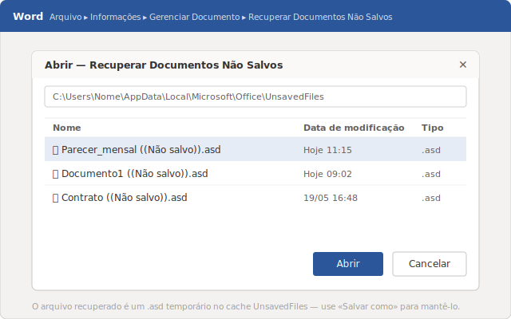
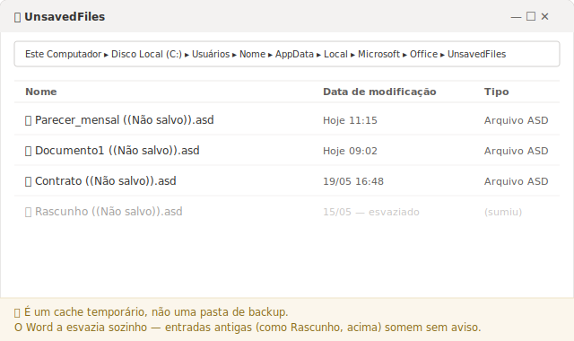
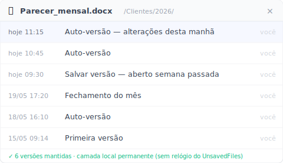

# Recuperar documento Word não salvo: o guia honesto (2026)

Como tirar o documento do cache oculto do Word em cinco minutos — e por que metade das pessoas que procuram isso está, na verdade, atrás de outra coisa.

São 11h15 de uma terça-feira num escritório de contabilidade. O Word fechou sozinho no meio do parecer que vai com a entrega do mês. Você não tinha salvado nada desde que abriu o arquivo em branco. A primeira reação é abrir o Google e digitar "recuperar documento Word não salvo". A boa notícia: o Word guarda uma cópia escondida que quase ninguém sabe usar. A notícia que ninguém te conta: essa cópia só serve para um tipo de perda — e, se o seu caso for o outro, você vai passar meia hora cavando uma pasta que nunca teve o que você procura.

Este guia separa as duas situações logo de cara, mostra o resgate de cinco minutos e é sincero sobre onde o Word te deixa na mão.

## O resgate em 5 minutos: Arquivo > Informações > Gerenciar Documento

Primeiro, o caminho mais rápido: se o Word travou e você o reabriu agora, ele costuma mostrar sozinho um painel chamado **"Recuperação de Documento"** na lateral esquerda, listando o que conseguiu salvar. Se esse painel aparecer, clique no arquivo mais recente e salve na hora — você já resolveu. Se não apareceu (ou você fechou sem querer), use o caminho abaixo.

Abra o Word e vá em **Arquivo → Informações → Gerenciar Documento → Recuperar Documentos Não Salvos**. Uma janela lista os documentos que o Word guardou sozinho mas que você nunca salvou. Clique no que tem a data e hora mais próximas de quando você estava trabalhando, abra e salve imediatamente como .docx num lugar que você reconheça.

Esse comando puxa arquivos de uma pasta oculta que a maioria das pessoas nunca viu: `%LocalAppData%\Microsoft\Office\UnsavedFiles`. Lá ficam cópias temporárias com a extensão `.asd`, geradas pela AutoRecuperação. A própria Microsoft documenta esse caminho e esse passo a passo no [artigo de recuperação de documentos do Word](https://learn.microsoft.com/pt-br/troubleshoot/microsoft-365-apps/word/recover-lost-unsaved-corrupted-document).

Se a lista vier vazia, ainda há um plano B antes de desistir. Clique em **Iniciar**, digite `.asd` na busca e pressione Enter. Apareceram arquivos `.asd`? No Word, vá em **Arquivo → Abrir → Procurar**, mude o tipo de arquivo para **Todos os Arquivos**, e abra o `.asd` direto. É o mesmo conteúdo, acessado por fora.

## Por que o documento some de novo (e ninguém te avisa)

O cache de não salvos não é um cofre. O Word esvazia essa pasta sozinho, no próprio cronograma, sem te perguntar. Por isso o arquivo que estava lá ontem pode não estar hoje, e por isso você precisa salvar a cópia recuperada na hora em que a encontra.

Há um número de "4 dias" de retenção que circula em fóruns e blogs. Trate como boato: a Microsoft não publica um prazo fixo garantido para essa pasta. Pode ser menos, dependendo de quantos arquivos novos o Word gerou e de como a máquina foi usada. A regra prática é só uma: achou, salvou. Não conte que o `.asd` vai te esperar.

A AutoRecuperação é o motor disso tudo. Ela grava aquela cópia `.asd` em intervalos fixos enquanto você digita. Você controla a frequência em **Arquivo → Opções → Salvar**, na caixa "Salvar informações de AutoRecuperação a cada X minutos". De fábrica o Word salva [a cada 10 minutos](https://support.microsoft.com/pt-br/office/ajudar-a-proteger-seus-arquivos-em-caso-de-falha-551c29b1-6a4b-4415-a3ff-a80415b92f99) — e a Microsoft recomenda, no [artigo de suporte do Word](https://learn.microsoft.com/pt-br/troubleshoot/microsoft-365-apps/word/recover-lost-unsaved-corrupted-document), baixar esse intervalo para **cinco minutos ou menos** em escritórios que não podem perder trabalho. Faça isso agora, antes do próximo travamento — leva dez segundos e é a diferença entre perder cinco minutos ou perder a manhã.

## "Recuperar não salvos" não funcionou. E agora?

Provavelmente porque o seu problema não é o que o comando resolve. Existem dois tipos de "perdi meu Word" completamente diferentes, e o Word manda os dois pela mesma porta — o que confunde quase todo mundo.

**Problema A — o arquivo nunca foi salvo.** O Word travou enquanto você escrevia um documento novo, ou você clicou em "Não Salvar" sem querer ao fechar. Nunca existiu um `.docx` no disco. Aqui o cache de não salvos é a sua única e legítima chance — é exatamente para isso que ele foi feito.

**Problema B — o arquivo já existia e você perdeu as alterações da manhã.** O contrato estava salvo desde a semana passada. Você trabalhou nele a manhã inteira, salvou por cima às 12h com um parágrafo apagado por engano — e agora quer o texto das 11h15 de volta. O arquivo está lá, inteiro. O que sumiu foram as últimas horas. E aqui o cache de não salvos quase nunca ajuda: o `.asd` mira em arquivos que nunca foram gravados, não em versões antigas de um arquivo que existe.

Para o Problema B, o caminho nativo é outro. Clique com o botão direito no arquivo e procure **Restaurar versões anteriores** (ou abra **Propriedades → Versões Anteriores**) e veja se há uma versão de mais cedo. O detalhe que derruba a maioria: essa aba só mostra algo se o **Histórico de Arquivos** ou os pontos de restauração do Windows já estivessem ligados *antes* da perda. Em PC de MEI ou escritório pequeno sem TI, quase nunca estão. Você descobre o recurso justamente no dia em que precisaria que ele já estivesse ativo há semanas.

## Como recuperar a versão da manhã sem depender do cache do Word?

Para voltar a uma versão de horas atrás você precisa de uma camada de versões persistente — algo que guarde fotos do arquivo num cronograma, em vez de torcer para o cache do Word ter o que você quer. É a resposta para o Problema B, que as ferramentas nativas só cobrem se você tiver se preparado com antecedência.

É o que o [Keeply](https://keeply.work) faz para arquivos no PC local ou numa unidade de rede. Você aponta o Keeply para uma **pasta** onde ficam seus documentos — a pasta dos clientes, a do mês corrente — e ele guarda versões em segundo plano num cronograma que **você** define: a cada 15, 30 ou 60 minutos, com 30 minutos por padrão. Tem também um botão manual "Salvar versão", onde você escreve uma nota de uma linha — "antes de mandar pro cliente", por exemplo — para marcar um marco que vale a pena reencontrar depois.

Quando a manhã se perde, você não fuça em pasta oculta nenhuma. Abre a linha do tempo daquele arquivo e escolhe a versão das 11h15. Por baixo, o Keeply usa um motor Git: cada versão salva é imutável, então uma gravação por cima não apaga a anterior. Você nunca digita um comando — a linha do tempo é só uma lista de horários para clicar.

Dois pontos para não confundir com o que o Word faz: o Keeply **não** é disparado pelo Ctrl+S e **não** fica escutando cada salvamento seu. Ele trabalha no próprio relógio. É essa diferença que faz ele cobrir a manhã inteira, e não só o último instante antes do travamento.

## Onde o Keeply NÃO ajuda (sem enrolação)

Nenhuma camada de versões cobre tudo, e fingir o contrário só faz você perder arquivo confiando no lugar errado. Três situações em que o Keeply não é a resposta:

- **Documento novo que nunca foi salvo numa pasta monitorada.** Se você abriu o Word, digitou e ele travou antes de qualquer gravação em disco, não havia arquivo para o Keeply versionar. Isso é o Problema A puro — o cache de não salvos do Word continua sendo o seu caminho.
- **Corrupção silenciosa.** Se o arquivo já estava danificado quando uma versão foi capturada, o Keeply guarda fielmente a versão danificada. Versionar não é o mesmo que reparar.
- **Arquivos fora da pasta monitorada.** Aquele documento que você salvou direto num pen drive que nunca foi adicionado ao Keeply não tem histórico nenhum. O que não está na pasta monitorada simplesmente não existe para a linha do tempo.

## Quando os recursos do Word já bastam

Em vários casos você não precisa de nada além do que já vem no Office, e instalar uma camada extra seria exagero. Seja honesto sobre o seu cenário antes de procurar mais ferramenta.

Os recursos nativos bastam quando: o documento é um rascunho descartável que você não se importaria em refazer; o arquivo vive no **OneDrive** ou no **SharePoint** com o **Salvamento Automático** ligado; ou quando perder uma manhã de trabalho seria chato, mas não um problema sério.

O Salvamento Automático do OneDrive/SharePoint, aliás, cobre bastante coisa — ele grava na nuvem continuamente e mantém um histórico de versões acessível pelo navegador. Vale conhecer os limites: ele só funciona se o arquivo estiver na cópia sincronizada da nuvem, o histórico de versões tem teto, e o Salvamento Automático grava por cima em vez de te perguntar antes. Para quem trabalha no PC local ou numa unidade de rede da empresa — o caso de boa parte dos MEIs, contadores e advogados sem TI gerenciado — esse fluxo na nuvem simplesmente não está em jogo, e é aí que a conversa muda.

## Perguntas frequentes

**Onde fica o documento do Word não salvo no Windows?**
Numa pasta oculta em `%LocalAppData%\Microsoft\Office\UnsavedFiles`, guardado como arquivo temporário `.asd`. O jeito mais fácil de chegar nele é por dentro do Word, em Arquivo → Informações → Gerenciar Documento → Recuperar Documentos Não Salvos, sem precisar navegar na pasta manualmente.

**Por quanto tempo o Word guarda um arquivo não salvo?**
Não há prazo fixo garantido publicado pela Microsoft. O Word esvazia essa pasta no próprio cronograma, sem aviso. O número de "4 dias" que circula na internet não é uma garantia. A regra segura é salvar a cópia recuperada assim que você a encontrar.

**Recuperei o arquivo, mas perdi só as alterações da manhã. Como volto?**
Esse é o caso do arquivo que já existia. Tente botão direito → Restaurar versões anteriores (ou Propriedades → Versões Anteriores), mas isso só funciona se o Histórico de Arquivos do Windows já estava ligado antes. Para voltar a uma versão de horas atrás de forma confiável, você precisa de uma camada de versões persistente que tenha guardado o arquivo num cronograma — como o Keeply, que mantém uma linha do tempo por arquivo nas pastas que você monitora.

**Qual a diferença entre AutoRecuperação e Salvamento Automático?**
A AutoRecuperação grava uma cópia temporária `.asd` no seu disco local em intervalos fixos, para resgate depois de um travamento. O Salvamento Automático (AutoSave) grava o arquivo de verdade, continuamente, mas só para documentos abertos do OneDrive ou SharePoint. Um é rede de segurança local; o outro é gravação contínua na nuvem.

**Mudar o intervalo da AutoRecuperação ajuda mesmo?**
Ajuda. Em Arquivo → Opções → Salvar, deixe "Salvar informações de AutoRecuperação a cada X minutos" em cinco minutos ou menos, como a Microsoft recomenda. Quanto menor o intervalo, menos trabalho fica de fora da última cópia de segurança quando o Word fecha sozinho.

## Leia também

- [Keeply — proteja o histórico das pastas onde você trabalha](https://keeply.work)

*Por Ting-Wei Tsao, fundador da Keeply, [LinkedIn](https://www.linkedin.com/in/ting-wei-tsao-b57480152)*
