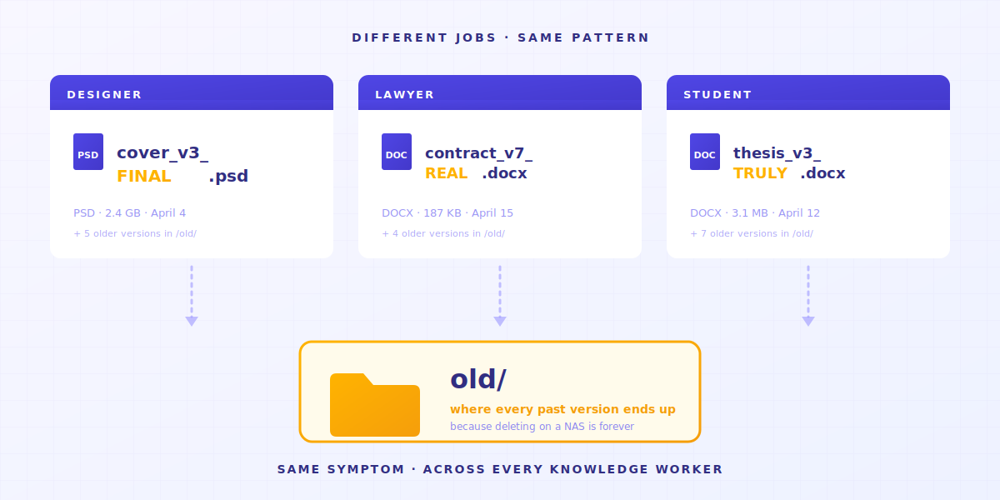

> Não é falta de disciplina sua. A ferramenta que você usa simplesmente não foi projetada pra isso.

Três pessoas. Situações diferentes.

**Pessoa A** é designer freelancer. Área de trabalho tem `_v3_final_FINAL.psd`.
**Pessoa B** trabalha num escritório de advocacia. HD tem `contrato_v7_versao-cliente_2025-04-15.docx`.
**Você que está lendo isto** talvez esteja olhando agora pra `dissertacao_cap3_pos-orientador_versao-realmente-final-v2.docx`.

Profissões diferentes. Nomes de arquivo diferentes. **O mesmo sintoma**.

Não é porque as três pessoas são perfeccionistas obsessivas.
É porque se você não fizer isso, **seus arquivos viram uma bagunça**. E num NAS, apagou — sumiu. Sem volta. Por isso acaba surgindo aquela pasta `antigos/`, guardando tudo que já foi editado algum dia.



---

> **TL;DR** —  Pastas compartilhadas, Dropbox e NAS **não foram projetados para gerenciar o histórico de arquivos**. Eles têm 4 lacunas estruturais, e cada uma empurra o trabalho de volta pra você. Este artigo desmonta cada uma — e admite quais o Keeply resolve e quais não resolve.

## Mapa do artigo

1. [O botão "versão anterior" nunca existiu](#reason-1)
2. [O histórico de 30 dias é uma mentira](#reason-2)
3. [O histórico te diz quando, não por quê](#reason-3)
4. [Convenções de nomenclatura empurram a memória pra cima das pessoas](#reason-4)
5. [Quando o Keeply não é a resposta](#limitations)

---

## 1. O botão "versão anterior" nunca existiu {#reason-1}

Você quer a versão de ontem daquele arquivo de design.

Abre o Dropbox ou o Google Drive — tudo está na versão mais recente. O histórico de versões está três menus abaixo. Você não sabe, a não ser que alguém te conte.


Abre o NAS da empresa — aqueles números de versão bagunçados parados lá *são* o seu histórico de versões.


**Este tipo de ferramenta não foi projetado para isso — para gerenciar o histórico de arquivos**.

O que os drives em nuvem mais se importam é fazer seus arquivos aparecerem idênticos nos três dispositivos.
Esse objetivo briga com "guardar todas as versões antigas".

Então a ferramenta escolheu a sincronização. **Ela não te mostra a linha do tempo das mudanças**.

> Em 2015, Will Styler, doutorando em linguística da UCSD, perdeu os arquivos da sua dissertação. Ele tinha 7 planos de backup diferentes. Todos falharam. Ele escreveu um post-mortem para futuros alunos de pós-graduação. A última linha: "Redundancy doesn't prevent stupidity" (ter múltiplos backups não salva de bobagem). [Relato completo](https://wstyler.ucsd.edu/posts/lost_dissertation_files.html)

→ Leia também: [Por que deixar sua dissertação num único computador é uma aposta que ninguém avisou que você estava fazendo](/en/post/thesis-single-point-of-failure/)

---

## 2. O histórico de 30 dias é uma mentira {#reason-2}

Calma, espera. Você descobriu que o Dropbox tem histórico de versões. Aliviou?

Espera. A próxima má notícia já está vindo: **limite de 30 dias**.


Traduzindo pro dia a dia: você quer o briefing do cliente do trimestre passado? A menos que esteja pagando pelo plano enterprise, **ele já sumiu**.

O limite de 30 dias não é uma restrição técnica — é uma decisão de negócio. O histórico de versões foi transformado num motivo para você fazer upgrade.
(No Keeply, o histórico dos seus arquivos é gratuito para sempre.)

> Abril de 2026, Hacker News. O usuário julianozen posta: o pai dele sobrescreveu um arquivo que não era tocado há 2 anos. Dois dias depois, tentou recuperar — não conseguiu. O Dropbox explicou: fora da janela de retenção de 30 dias. A reação de julianozen: "Isso não é o que 30 dias de histórico significa." Resposta de lazide: "Which is bonkers." [Thread completa](https://news.ycombinator.com/item?id=47772260)

A janela de 30 dias foi projetada para "eu acidentalmente sobrescrevi o arquivo de ontem."
Para "meu cliente quer a proposta do trimestre passado de volta semana que vem" — **usar a ferramenta errada raramente te dá o que você precisa**.

→ Leia também: [O custo oculto das pastas compartilhadas](/en/post/hidden-cost-shared-folders/)

---

## 3. O histórico te diz quando, não por quê {#reason-3}

Suponha que você resolveu os dois primeiros problemas: histórico ativado, 30 dias são suficientes.
Tem um problema mais fundo esperando.

O histórico de versões diz "modificado em 2025-04-15 14:23".
**Ele não te diz o que mudou às 14:23. Não te diz por quê mudou.**


Pra alguns trabalhos, isso é tranquilo. Para outros, é fatal:

- **Uma designer** mudou a opacidade de uma camada para 30%. O histórico diz "modificado". Não diz qual camada.
- **Uma advogada** mudou uma cláusula de "deverá" para "poderá". Uma palavra. O histórico diz "modificado". Não diz qual palavra.
- **Uma mestranda** mudou "mas este argumento tem limitações" para "este argumento claramente se sustenta" — de cautelosa para assertiva. O histórico diz "modificado". Não diz que o sentido foi invertido.

> Janeiro de 2025, o Legal Cheek publicou uma história anônima de uma advogada: "Enviei o testamento errado para a família errada de uma pessoa falecida como enclosure, quando era estagiária." O desastre não foi "não salvei nenhuma versão" — foi "não sabia qual versão era a atual". [História completa](https://www.legalcheek.com/2025/01/courtroom-etiquette-email-blunders-and-document-mix-ups-lawyers-share-their-most-embarrassing-mistakes/)

É aqui que a maioria das pessoas erra.

**Backup significa guardar o arquivo.**
**Gerenciamento de versões significa guardar o arquivo *mais* um registro do que você mudou e por quê.**

**Backup te dá o primeiro. Gerenciamento te dá o segundo.**

Aí você começa a enfiar a intenção nos nomes de arquivo: `contrato_v7_pedido-cliente_clausula3.docx`.
O nome do arquivo não comporta mais. Você abre uma planilha. A planilha não consegue acompanhar. Você cria um canal no Slack.
**No final, seu "sistema de gerenciamento de versões" é nome de arquivo + planilha + Slack + sua memória**. Qualquer peça falha, o sistema inteiro desmorona.
Três meses depois, você abre seus registros e descobre que seus próprios hábitos antigos não combinam com os atuais.

---

## 4. Convenções de nomenclatura empurram a memória pra cima das pessoas {#reason-4}

Depois de bater em todos os três problemas acima, toda empresa faz a mesma coisa: **escreve um PDF de 14 páginas com convenção de nomenclatura**.

Geralmente fica assim:

```text
[AAAA-MM-DD]_[CodigoProjeto]_[TipoDoc]_[Status]_[Autor].ext
```

Muito organizado, né?


Seis meses depois, ninguém segue.

Não, não é seu colega que é preguiçoso.
**É que estamos tentando controlar uma população de seres incontroláveis — e o final se escreve sozinho.**

> Fórum do Asana, junho de 2023, uma thread sobre "falhas épicas de nomenclatura de arquivo". Becky_Caday: "Múltiplas versões do mesmo arquivo porque alguém não sabia que podia abrir o original e editar — ela só mudou uma palavra para maiúsculas. `List 2.0` virou `LIST 2.0`." Arndt_Dienstbier: "Eles usavam espaço em branco para versionamento" (múltiplos arquivos `Document.docx` distinguidos apenas por espaços no final). [Thread completa](https://forum.asana.com/t/share-your-epic-file-naming-fails-and-lets-laugh-together/462366)

Cada membro da equipe, a cada salvamento, precisa lembrar + concordar + ter tempo de seguir a regra. Qualquer um desses falha — **parabéns, você ganhou uma bagunça de volta**.

Lembrar de convenções de nomenclatura é algo que **uma ferramenta deveria simplesmente fazer**.
Não algo a ser empurrado para a disciplina de cada pessoa.

→ Leia também: [Quando a equipe de AutoCAD carregou a versão errada](/en/post/autocad-wrong-version-crew/)

---

## 5. Quando o Keeply não é a resposta {#limitations}

Construímos o Keeply para preencher essas 4 lacunas estruturais.
Mas há cenários **onde o Keeply não é a resposta**:

- **Anotações de reunião em colaboração ao vivo** → use Notion / Google Docs. O Keeply é memória de versão de longo prazo para indivíduos e pequenas equipes, não uma ferramenta de colaboração em tempo real.
- **Footage de vídeo com 50GB+** → use Frame.io / PostHaste. A lógica de versão do Keeply (registrar diferenças a cada salvamento) não escala economicamente para arquivos binários grandes.
- **Assinatura jurídica entre organizações** → use DocuSign / Adobe Sign. Se um contrato vai para 10 escritórios de advocacia externos, o Keeply não está nessa estrutura de compliance.

Para os outros 80% dos cenários de trabalhadores do conhecimento — **designers, paralegais dentro de escritórios de advocacia, contadores, mestrandos, equipes de PM, freelancers** — essas 4 lacunas estruturais vão te atingir.
É pra isso que estamos aqui.

---

Voltando à pergunta inicial: por que todo mundo que já usou uma pasta compartilhada acaba inventando seu próprio sistema de nomes?

Porque **o que elas realmente queriam era uma estrutura limpa, para não tomarem decisões com informações desatualizadas**.
Então colocaram versões em nomes de arquivo, em planilhas, na memória.

Empurrar a memória organizacional para a disciplina humana é um design com falha conhecida.

**A questão não é como aplicar convenções de nomenclatura melhor.
É se sua ferramenta consegue fazer esse trabalho por você.**

Que sua ferramenta faça esse trabalho por você.

---

> Sobre o autor: [Nome Real do Fundador], fundador do Keeply.
> LinkedIn (preencher no Touch 4) ｜ X (preencher no Touch 4)
