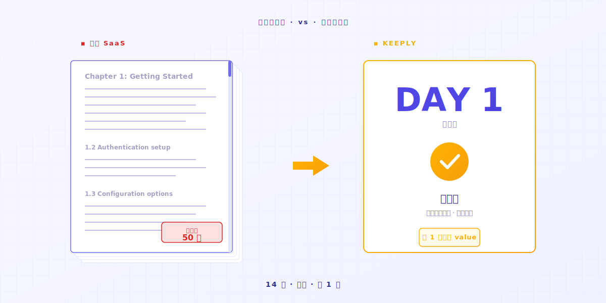

# Как пользоваться Keeply: пропусти 30 функций, освойся за 2 действия

> Тебе не нужно сначала становиться экспертом. Перетащи папку, продолжай работать — история версий уже идёт.

## Содержание

1. [Почему ты сопротивляешься новым инструментам?](#why-resist-new-tools)
2. [Почему ты бросаешь инструмент?](#why-give-up-a-tool)
3. [Так что это за 2 действия?](#what-are-the-two-actions)
4. [Расскажу, что ты почувствуешь](#first-week-natural)
5. [Когда Keeply тебе не подходит](#when-keeply-isnt-right)

---

Господин А ведёт много проектов и каждый день ведёт блокнот, чтобы фиксировать сделанное. Только что услышал, что Keeply — отличная программа для заметок к файлам. Открывает главную страницу и видит «Запустись за 3 шага» и «Бесплатный пробный период 7 дней». Прошлый инструмент, который он пробовал, на 14-й день он всё ещё путался. Терпение кончилось раньше, чем появилась хоть какая-то польза. **На этот раз он хочет 10 минут, чтобы решить.**

Дело не в том, что ты медленный. Дело в том, что кривая обучения традиционных программ исходит из того, что ты готов сегодня бросить всё и стать студентом на 14 дней.

---

## Почему ты сопротивляешься новым инструментам? {#why-resist-new-tools}

Ты вчера попробовал поставить инструмент. Документация на 50 страниц. 30 новых терминов. Завтра у тебя сдача проекта.

Ты думаешь: «Вернусь к этому на следующей неделе, спокойно разберусь.» И больше не открываешь.

Большинство софтверных компаний считают «изучи за 14 дней» естественным порядком вещей. [Отраслевые исследования](https://userpilot.com/blog/time-to-value-benchmark-report-2024/) показывают: пользователи, которые проходят меньше половины онбординга, отваливаются за 14 дней в **3 раза** чаще, чем те, кто проходит его целиком.

Иначе говоря: программа исходит из того, что у тебя есть 14 свободных дней. Что твоя работа может подождать, пока ты её не освоишь.

Твой следующий проект в это допущение не входит.

---

## Почему ты бросаешь инструмент? {#why-give-up-a-tool}

Новый инструмент обычно учат около 14 дней. Первые 13 — фаза разведки.

На середине этой фазы большинство людей захотят закрыть вкладку.

До того как я сделал Keeply, я сам перепробовал кучу новых инструментов. Многие на первый день казались возни больше, чем толку, и я тихо возвращался к старому способу.

Потом я понял: у инструментов, которые я реально оставил у себя, было одно общее — **они были достаточно интуитивны, чтобы просто пользоваться**.

Однажды я писал код через AI, и AI понесло. Я уже потерял счёт, докуда он добрался. **Хорошо, что я всё это время вёл заметки к файлам.**

Открываю историю. **Возвращаюсь к состоянию, которое я мог контролировать.**

Тогда я понял: хороший инструмент — это не тот, у которого больше всего функций, а **тот, который достаточно прост, чтобы освоиться**. Я ещё ни одной функции не выучил, и просто тем, что тихо подхватил тот файл, инструмент уже окупился.

Проблема не в инструменте. **Этот класс программ просто не должен проектироваться по принципу «сначала выучи, потом пользуйся».**

---

## Так что это за 2 действия? {#what-are-the-two-actions}

### Действие 1: Перетащи папку в Keeply

Просто перетаскиваешь её. **Не переименовывай, не сортируй, не думай о структуре.**

### Действие 2: Продолжай работать

Что ты собирался сегодня делать — делай.

Редактируй файл, сохраняй, возвращайся к предыдущей версии, удаляй и переделывай. **Keeply автоматически сохраняет в Timeline слева и создаёт одну заметку к файлу.** Тебе не нужно жать кнопку. Не нужно запоминать сочетание клавиш.

Тебе не нужно даже переименовывать файлы. Тот самый `_v3_actually_final.docx` сохраняет своё имя. Keeply не трогает твои привычки.

К концу дня 1 у тебя 1 день заметок к файлам. **К концу дня 7 — целая неделя.**

Интуитивное использование — вот и весь фокус.

---

## Расскажу, что ты почувствуешь {#first-week-natural}

### День 1

Перетащи проект. Сохрани.

### День 2–3

Отредактируй 200 слов в существующем файле. Сохрани.

Через Timeline ты смотришь, как твои заметки к файлам начинают копиться. **Кликни в заметку, увидь, что ты удалил и что добавил.**

### День 4–7

Заметки к файлам копятся всё больше.

Однажды ты заметишь — **как же круто, что у меня есть эта программа**.

---

## Когда Keeply тебе не подходит {#when-keeply-isnt-right}

Keeply не борется за каждый сценарий. В 4 случаях другой инструмент — лучший выбор.

- **Если тебе нужна синхронизация между устройствами через облако**: выбирай [IDrive](https://www.idrive.com/) или [Backblaze](https://www.backblaze.com/). Keeply живёт у тебя на компьютере. Он не cloud-native.
- **Если тебе нужно восстановление системы или полный бэкап диска**: выбирай [Acronis True Image](https://www.acronis.com/). Keeply этим не занимается.
- **Если ты IT-специалист и управляешь 50+ машинами**: выбирай [MSP360](https://www.msp360.com/). Keeply — для одиночек и небольших команд.
- **Если ты просто не хочешь терять личные документы**, в Windows встроена «История файлов», и её достаточно. Ничего ставить не надо.

Выбирать инструмент — как выбирать коллегу. У каждого свой сильный сценарий. Признай это честно — и сожжёшь меньше 14-дневных триалов.

---

## Подытоживая

Ты хочешь попробовать новый инструмент и не хочешь потерять на него 14 дней. Это нормально.

Перетащи папку в [Keeply](https://keeply.work/). Продолжай делать сегодняшнюю работу.

На 7-й день открой Timeline и посмотри. **Поймёшь.**

---

## Дальнейшее чтение

- [Полное руководство по управлению версиями файлов](/ru/post/file-version-management-complete-guide/) (PILLAR 1, зачем нужно управление версиями)

---

*Автор: Тинвэй Цао, основатель Keeply | [LinkedIn](https://www.linkedin.com/in/tingwei-tsao/)*
