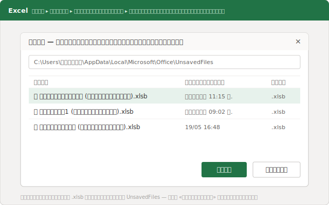
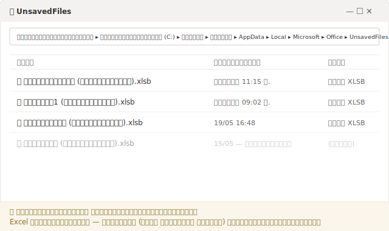
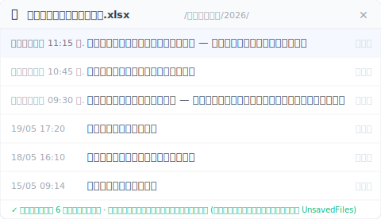

# วิธีกู้ไฟล์ Excel ที่ไม่ได้บันทึก และทำไมวิธีเดิมใช้ไม่ได้ในครั้งที่สอง

> Excel แอบเก็บเวิร์กบุ๊กที่คุณไม่เคยบันทึกไว้ในแคชชั่วคราว แต่เก็บไว้ได้ไม่นาน และช่วยได้แค่กรณีเดียวเท่านั้น บทความนี้จะบอกว่าเมื่อไรวิธีนี้พอใช้ และเมื่อไรคุณต้องการชั้นเก็บเวอร์ชันจริง ๆ

11:15 น. เช้าวันอังคารที่สำนักงานบัญชีเล็ก ๆ แห่งหนึ่ง ตารางคำนวณภาษีของลูกค้าเปิดค้างมาตั้งแต่เช้า สามชีต ทุกแถวกระทบยอดซ้ำสองรอบ ใกล้ถึงกำหนดยื่นเต็มที พอดีกับที่ Windows เด้งขึ้นมาขอรีสตาร์ตเพื่ออัปเดต มือคุณตอบเร็วเกินไป คลิกที่ตอบคำถาม "คุณต้องการบันทึกการเปลี่ยนแปลงหรือไม่" พลาดไปโดนปุ่ม "ไม่บันทึก" ไฟล์ปิดลง งานสี่ชั่วโมงของทั้งเช้า ดูเหมือนจะหายไปแล้ว

ถ้าคุณเคยเจอเหตุการณ์แบบนี้ คุณไม่ได้อยู่คนเดียว และในกรณีส่วนใหญ่ สถานการณ์จริงดีกว่าที่รู้สึกมาก เพราะเบื้องหลังนั้น Excel แอบทำสำเนาฉุกเฉินเก็บไว้ให้ แต่ทางออกฉุกเฉินนี้ทำงานได้เฉพาะในบางเงื่อนไข และมันจะปิดตัวเองทิ้งไปเองด้วย น้อยคนจะรู้เรื่องนี้ และนั่นคือเหตุผลว่าทำไมพอลองทำแบบเดิมอีกครั้ง มันถึงใช้ไม่ได้

## ใน 5 นาทีต่อจากนี้ ต้องทำอะไรเพื่อเอาไฟล์กลับมา

เปิด Excel ขึ้นมาใหม่ แล้วไปตามนี้: **ไฟล์ → ข้อมูล → จัดการเวิร์กบุ๊ก → กู้คืนเวิร์กบุ๊กที่ไม่ได้บันทึก** Excel จะเปิดโฟลเดอร์ที่ซ่อนอยู่ซึ่งเก็บสำเนาฉุกเฉินชั่วคราวเอาไว้ มองหาไฟล์ที่เวลาตรงกับงานของคุณ เปิดขึ้นมา แล้ว**บันทึกทันที**ด้วยชื่อจริงไปยังที่อยู่ถาวร ทำให้ไว เพราะแคชนี้ไม่ได้อยู่ตลอดไป

ถ้า Excel ค้างหรือดับไปเองแทนที่จะปิดตามปกติ เส้นทางจะสั้นกว่านั้นอีก พอเปิดขึ้นมาใหม่ จะมีแถบ **การกู้คืนเอกสาร** โผล่ขึ้นมาทางซ้าย ในนั้นจะแสดงรายการทุกเวอร์ชันที่ Excel เก็บทันไว้ พร้อมเวลากำกับของแต่ละเวอร์ชัน เลือกเวอร์ชันที่เวลาใหม่ที่สุด ดูเนื้อในคร่าว ๆ แล้วบันทึกด้วยชื่อที่ชัดเจน แถบนี้ใช้ได้ดีที่สุดกับไฟล์ที่คุณเคยบันทึกไว้อย่างน้อยหนึ่งครั้ง ส่วนเวิร์กบุ๊กที่เปิดใหม่เอี่ยมยังไม่เคยบันทึกเลย ให้ใช้เส้นทาง "กู้คืนเวิร์กบุ๊กที่ไม่ได้บันทึก" ข้างบนจะปลอดภัยกว่า เดี๋ยวเราจะพูดถึงเรื่องนี้ในกรณี A

มีข้อควรระวังเรื่องลำดับอยู่อย่างเดียว: บันทึกก่อน แล้วค่อยตรวจ ตราบใดที่ไฟล์ที่กู้มายังแค่เปิดค้างไว้ ยังไม่ได้เขียนลงที่ไหน งานทั้งหมดของคุณก็ยังแขวนอยู่บนสำเนาชั่วคราวที่ Excel จะลบทิ้งเมื่อไรก็ได้

## ทำไมพอครั้งหน้า ไฟล์ถึงหายไปเฉย ๆ

เพราะโฟลเดอร์สำเนาฉุกเฉินนั้นไม่ใช่คลังเก็บถาวร มันเป็นแค่ที่พักชั่วคราว Excel เก็บเวิร์กบุ๊กที่ไม่เคยบันทึกไว้ที่ `%LocalAppData%\Microsoft\Office\UnsavedFiles` ในรูปไฟล์ชั่วคราวนามสกุล `.xlsb` แล้วล้างโฟลเดอร์นี้ทิ้งเองเมื่อไรก็ได้ โดยไม่ถามคุณ คุณวางเส้นทางนี้ลงในช่องที่อยู่ของ File Explorer ก็เข้าไปดูโฟลเดอร์ตรง ๆ ได้เช่นกัน

มีตัวเลข "เก็บไว้กี่วัน" ลอยอยู่ในเน็ตเยอะมาก ให้ระวังไว้ เพราะหน้าคู่มืออย่างเป็นทางการของ Microsoft เรื่อง [การกู้คืนเวอร์ชันก่อนหน้าของไฟล์ Office](https://support.microsoft.com/th-th/office/recover-an-earlier-version-of-an-office-file-169cb166-e7e2-438e-8f39-9a8927828121) ไม่ได้รับประกันระยะเวลาเก็บที่ตายตัวไว้เลย หน้านั้นบอกแค่ว่าจะเข้าไปกู้ยังไง ไม่ได้บอกว่าสำเนาจะอยู่นานแค่ไหน ในทางปฏิบัติ โฟลเดอร์นี้มักว่างเร็วกว่านั้น เช่น หลังรีสตาร์ตเครื่อง หรือพอมีไฟล์ใหม่ ๆ มาเก็บมากพอ ไฟล์เก่าก็ถูกลบ ดังนั้นไฟล์ที่กู้มาได้ ให้ถือว่าเป็นของชั่วคราวไปก่อน จนกว่าคุณจะ**บันทึกเป็น**ไปไว้ที่ถาวรเรียบร้อยแล้ว

จุดสำคัญสำหรับสำนักงานหลายแห่งในไทยคือ คนที่ตั้งใจทำงานบนดิสก์ในเครื่องหรือไดรฟ์เครือข่ายของบริษัท เช่น สำนักงานบัญชี นักทำบัญชีอิสระ ฟรีแลนซ์ และ SME ที่จงใจไม่เอาข้อมูลลูกค้าที่อ่อนไหวขึ้นคลาวด์ คนกลุ่มนี้จะไม่ได้หลักประกันถาวรจากแคชตัวนี้ โฟลเดอร์ UnsavedFiles เป็นทางออกฉุกเฉินใช้ครั้งเดียว ไม่ใช่ตัวแทนของประวัติเวอร์ชัน

## "ฉันไม่ได้บันทึก" จริง ๆ แล้วมีสองปัญหาคนละเรื่องกัน

เพราะประโยค "ฉันทำไฟล์ Excel ที่ไม่ได้บันทึกหาย" ที่จริงครอบคลุมสองเหตุการณ์ฉุกเฉินที่ต่างกันคนละเรื่อง และ Excel ก็ส่งทั้งสองเข้าประตูเดียวกัน ใครที่แยกสองอย่างนี้ไม่ออก จะคว้าวิธีกู้ผิดตัว เรามาแยกให้ชัด เพราะแคชนั้นที่จริงถูกออกแบบมาเพื่อรับมือแค่หนึ่งในสองเท่านั้น

**กรณี A ไฟล์ไม่เคยถูกบันทึกเลย** คุณเปิดเวิร์กบุ๊กใหม่ พิมพ์ข้อมูลอยู่ชั่วโมงหนึ่ง แล้ว Excel ดับ หรือเผลอคลิก "ไม่บันทึก" บนดิสก์ไม่มีไฟล์อยู่เลย ไม่เคยมี กรณีนี้แคช UnsavedFiles คือความหวังเดียวของคุณ และมันถูกสร้างมาเพื่อเรื่องนี้พอดี เส้นทาง **จัดการเวิร์กบุ๊ก** ที่อธิบายไว้ข้างบนใช้ได้ตรงเป๊ะ

**กรณี B ไฟล์มีอยู่แล้ว แต่เวอร์ชันของเมื่อเช้าหายไป** ตารางนี้นอนอยู่บนเซิร์ฟเวอร์มาหลายสัปดาห์แล้ว วันนี้คุณเปิดมาแก้ เผลอบันทึกทับด้วยเวอร์ชันผิด หรือเขียนทับงานครึ่งวันลงไป ไฟล์ยังอยู่ แค่อยู่ในสภาพที่ผิด และตรงนี้แคชแทบช่วยอะไรไม่ได้เลย เพราะมันทำงานกับไฟล์ที่ไม่เคยบันทึกเท่านั้น มันดึงเวอร์ชัน 11:15 น. ออกมาจากไฟล์ที่คุณบันทึกทับซ้ำไปแล้วหลายรอบให้ไม่ได้

นี่แหละคือสิ่งที่หลายคนพิมพ์ค้นว่า "กู้ไฟล์ Excel ที่ถูกเขียนทับ โดยไม่มีเวอร์ชันก่อนหน้า" ในเครื่องเดียว สิ่งที่เทียบได้กับกรณีนี้คือการ **คลิกขวาที่ไฟล์ → คุณสมบัติ → เวอร์ชันก่อนหน้า** แต่วิธีนี้จะได้ผลก็ต่อเมื่อ Windows File History หรือจุดคืนค่าระบบถูกเปิดไว้**ก่อน**ที่ไฟล์จะหาย ส่วนเครื่องในสำนักงานเล็ก ๆ ที่ไม่มีฝ่ายไอทีดูแล แทบไม่เคยเปิดไว้ ลิสต์เวอร์ชันก่อนหน้าก็เลยขึ้นว่าง สำหรับกรณี B คุณไม่ได้ต้องการทางออกฉุกเฉิน คุณต้องการชั้นเก็บเวอร์ชันถาวรที่เริ่มจดบันทึกตั้งแต่ก่อนเรื่องจะพัง

## เอาเวอร์ชันของเมื่อเช้ากลับมาได้ยังไง ในเมื่อไฟล์ยังอยู่

วิธีคือมีอีกชั้นหนึ่งทำงานอยู่ใต้การบันทึกของคุณ ชั้นที่ไม่ได้โผล่มาแค่ตอนฉุกเฉิน แต่คอยเก็บเวอร์ชันระหว่างทางไว้ตลอด [Keeply](https://keeply.work) ทำหน้าที่นี้พอดี คุณชี้ให้มันดูโฟลเดอร์ที่เก็บไฟล์ของคุณครั้งเดียว จากนั้นมันจะเก็บเวอร์ชันให้อัตโนมัติอยู่เบื้องหลังตามตารางที่คุณกำหนดเอง Keeply ทำงานได้ทั้งกับไฟล์ที่เก็บในเครื่องคอมพิวเตอร์ของคุณ และไฟล์ที่อยู่บน**ไดรฟ์เครือข่ายหรือ NAS**

จังหวะการเก็บคุณตั้งเองได้ ทุก 15, 30 หรือ 60 นาที ค่าเริ่มต้นคือ 30 นาที นอกจากนี้ยังมีปุ่ม **บันทึกเวอร์ชัน** ที่กดเองได้ สำหรับปักหมุดจุดสำคัญพร้อมโน้ตสั้น ๆ หนึ่งบรรทัด เช่น "เวอร์ชันที่ส่งให้สรรพากร" พอเวอร์ชันของเมื่อเช้าหายไป คุณก็ไม่ต้องไปงมในแคชอีก แค่เปิดไทม์ไลน์ของไฟล์ แล้วเลือกเวอร์ชัน 11:15 น.

มีจุดที่คนเข้าใจผิดกันบ่อย: Keeply **ไม่ได้**ผูกกับปุ่มลัดบันทึกของคุณ การกด Ctrl+S ไม่ได้สร้างเวอร์ชันใหม่ใน Keeply และ Keeply ก็ไม่ใช่บริการที่คอยดักฟังทุกครั้งที่คุณบันทึก มันทำงานตามตารางที่ตั้งไว้ บวกกับตอนกดปุ่มเอง แค่นั้น สำหรับคนที่อยากรู้ว่าเบื้องหลังทำงานยังไง: Keeply ใช้เอนจิน Git อยู่ข้างใน ทุกเวอร์ชันที่เก็บไว้จึงเปลี่ยนแปลงไม่ได้ ไม่ถูกเขียนทับ และไม่เสียหาย แต่คุณไม่ต้องพิมพ์คำสั่งใด ๆ และไม่จำเป็นต้องเข้าใจ Git เลย ทุกอย่างทำผ่านไทม์ไลน์ทั้งหมด

## Keeply ช่วยไม่ได้ตรงไหนบ้าง

ประวัติเวอร์ชันที่ตรงไปตรงมาไม่ใช่ยาวิเศษ และการบอกขีดจำกัดให้ชัดก็เป็นเรื่องที่ควรทำ มีสามกรณีที่ Keeply ช่วยคุณไม่ได้:

- **ไฟล์ใหม่ที่ไม่เคยบันทึก ในโฟลเดอร์ที่ไม่ได้เฝ้าดู** ถ้าคุณเปิดเวิร์กบุ๊กใหม่ พิมพ์ไปชั่วโมงหนึ่ง แล้วไม่เคยเอาไปไว้ในโฟลเดอร์ที่เฝ้าดู Keeply ก็ไม่มีอะไรให้เก็บ เพราะมันมองไม่เห็น กรณีนี้ยังเป็นกรณี A ซึ่งเป็นหน้าที่ของแคชใน Excel
- **ไฟล์เสียหายแบบเงียบ ๆ** ถ้าไฟล์ Excel ค่อย ๆ เสียโดยไม่มีข้อความเตือนใด ๆ Keeply ก็จะเก็บสภาพที่เสียนั้นไว้อย่างซื่อสัตย์เช่นกัน ซื่อสัตย์แต่ไร้ประโยชน์ ประวัติเวอร์ชันเก็บสิ่งที่คุณป้อนให้ มันไม่ได้ตรวจว่าเนื้อในยังดีอยู่ไหม การเก็บเวอร์ชันไม่เท่ากับการซ่อม
- **ไฟล์ที่อยู่นอกโฟลเดอร์ที่เฝ้าดู** ไฟล์ Excel ในแฟลชไดรฟ์ที่คุณไม่เคยเพิ่มเข้าไป จะไม่มีประวัติในไทม์ไลน์ อะไรที่ไม่ได้ถูกเฝ้าดู ก็ไม่โผล่ในไทม์ไลน์ไหนทั้งนั้น

## เมื่อไรเครื่องมือในตัวของ Excel ก็เพียงพอแล้ว

บ่อยครั้งมันก็พอ และตอนนั้นคุณก็ไม่ต้องมีชั้นเสริมอะไรเลย สำหรับการคำนวณใช้แล้วทิ้งที่ยังไงก็ลบทิ้งในอีกชั่วโมง การลงแรงอะไรเพิ่มก็เกินจำเป็น บันทึกระหว่างทางบ้าง แค่นั้นพอ

คนที่ทำงานบน OneDrive หรือ SharePoint โดยเปิด **บันทึกอัตโนมัติ** ไว้ตลอดอย่างสม่ำเสมอ ก็ได้รับการปกป้องดีในหลายกรณี เพราะ **ประวัติเวอร์ชัน** ที่มีมาในตัวตรงนั้น ครอบคลุมการย้อนกลับไปสภาพก่อนหน้าได้อย่างมั่นคง ถึงอย่างนั้นก็ควรรู้ขีดจำกัดสามข้อ: ประวัตินี้ผูกกับสำเนาบนคลาวด์ที่ซิงก์อยู่ ปริมาณประวัติที่เก็บมีเพดานจำกัด และบันทึกอัตโนมัติจะเขียนทับให้เรื่อย ๆ โดยไม่ถามคุณ แปลว่าสภาพที่ผิดก็จะถูกเก็บอย่างซื่อสัตย์พอ ๆ กับสภาพที่ถูก ส่วนสำนักงานที่จงใจเก็บไฟล์ไว้ในเครื่องหรือไดรฟ์เครือข่ายเพราะเหตุผลด้านความเป็นส่วนตัวของข้อมูล วิธีบนคลาวด์นี้ก็ใช้ไม่ได้ตั้งแต่แรกอยู่แล้ว

การเปิด **การกู้คืนอัตโนมัติ** (AutoRecover) ไว้ก็เป็นนิสัยที่ดี ไปที่ **ไฟล์ → ตัวเลือก → บันทึก** แล้วติ๊กช่อง "บันทึกข้อมูลการกู้คืนอัตโนมัติทุก ๆ … นาที" จากนั้นกำหนดช่วงเวลา Microsoft แนะนำให้ใส่[ตัวเลขเล็ก ๆ เช่น 5 หรือ 10 นาที](https://support.microsoft.com/th-th/office/help-protect-your-files-in-case-of-a-crash-551c29b1-6a4b-4415-a3ff-a80415b92f99) เพื่อความปลอดภัยเพิ่มขึ้น ด้วยวิธีนี้คุณจะไม่เสียงานเกิน 5 หรือ 10 นาที แต่อย่าลืมว่า การกู้คืนอัตโนมัติเป็นตัวสำรองไว้สำหรับตอนเครื่องดับ ไม่ได้รับประกันว่าจะดึงเวอร์ชันเฉพาะเจาะจงของเมื่อเช้ากลับมาให้คุณได้

กฎที่ตรงไปตรงมาคือ ถ้าเสียงานทั้งเช้าไปแล้วคุณยังพอรับได้ เครื่องมือในตัวของ Excel ก็เพียงพอ แต่ถ้าเช้าที่หายไปหมายถึงพลาดกำหนดยื่นภาษี หรือต้องโทรขอโทษลูกค้าด้วยความกระอักกระอ่วน ชั้นเก็บเวอร์ชันที่ทำงานต่อเนื่องก็คุ้มค่ากับการลงทุนแน่นอน

## คำถามที่พบบ่อย

**ไฟล์ Excel ที่ไม่ได้บันทึก ไปอยู่ที่ไหนในเครื่องของฉัน**
เวิร์กบุ๊กที่ไม่เคยบันทึกจะอยู่ที่ `%LocalAppData%\Microsoft\Office\UnsavedFiles` ในรูปไฟล์ชั่วคราวนามสกุล `.xlsb` วิธีที่ง่ายที่สุดคือไปที่ **ไฟล์ → ข้อมูล → จัดการเวิร์กบุ๊ก → กู้คืนเวิร์กบุ๊กที่ไม่ได้บันทึก** พอเจอไฟล์แล้ว ให้รีบบันทึกไปไว้ที่ถาวรทันที เพราะ Excel เคลียร์โฟลเดอร์นี้ทิ้งเองได้

**Excel เก็บไฟล์ที่ไม่ได้บันทึกไว้นานแค่ไหน**
ในหน้าคู่มืออย่างเป็นทางการ Microsoft ไม่ได้รับประกันระยะเวลาเก็บที่ตายตัว ตัวเลข "สี่วัน" ที่ลอยอยู่ในเน็ตไม่ใช่คำรับประกัน สำเนาฉุกเฉินอาจถูกลบเร็วกว่านั้น หลังรีสตาร์ตเครื่อง หรือพอมีไฟล์ใหม่มาเก็บมากพอ ดังนั้นพอไฟล์หาย ให้กู้คืนให้เร็วที่สุด แล้ว**บันทึกเป็น**ไปไว้ที่ถาวร

**ฉันเผลอบันทึกทับงานของเมื่อเช้าไปแล้ว Keeply ช่วยได้ไหม**
ได้ มันถูกสร้างมาเพื่อเรื่องนี้พอดี ถ้าไฟล์อยู่ในโฟลเดอร์ที่ Keeply เฝ้าดู Keeply จะเก็บเวอร์ชันให้อัตโนมัติตามตารางที่คุณตั้งไว้ ทุก 15, 30 หรือ 60 นาที ค่าเริ่มต้นคือ 30 นาที แทนที่จะไปงมในแคชที่ซ่อนอยู่ คุณแค่เปิดไทม์ไลน์ของไฟล์ แล้วเลือกเวอร์ชันของเมื่อเช้า เงื่อนไขเดียวคือ ต้องเพิ่มโฟลเดอร์นั้นเข้าไปก่อนล่วงหน้า

**ลิสต์เวอร์ชันก่อนหน้าขึ้นว่าง ฉันยังกู้ไฟล์ Excel ที่ถูกเขียนทับได้ไหม**
ถ้า Windows File History ไม่เคยถูกเปิดไว้สำหรับโฟลเดอร์นั้น รายการใน คลิกขวา → คุณสมบัติ → เวอร์ชันก่อนหน้า จะว่างเปล่า และในกรณีนี้แคช UnsavedFiles ก็มักช่วยไม่ได้เช่นกัน เพราะมันใช้กับไฟล์ที่ไม่เคยบันทึกเท่านั้น สำหรับเวอร์ชันที่ถูกเขียนทับ คุณต้องการชั้นเก็บเวอร์ชันที่เริ่มจดบันทึกตั้งแต่ก่อนความผิดพลาดจะเกิดขึ้น

**เปิดบันทึกอัตโนมัติบน OneDrive ไว้แล้ว ยังไม่พออีกหรือ**
ในหลายกรณีก็พอ ประวัติเวอร์ชันบน OneDrive และ SharePoint ครอบคลุมการย้อนกลับไปสภาพก่อนหน้าได้ดี แต่มันผูกกับสำเนาบนคลาวด์ที่ซิงก์อยู่ ปริมาณประวัติที่เก็บมีเพดานจำกัด และบันทึกอัตโนมัติจะเขียนทับให้เรื่อย ๆ โดยไม่ถามคุณ คนที่จงใจทำงานบนเครื่องหรือไดรฟ์เครือข่ายเพราะเหตุผลด้านความเป็นส่วนตัวของข้อมูล ก็ต้องการวิธีที่ใช้ได้ในที่นั้นด้วย

## อ่านเพิ่มเติม

- [Keeply – ประวัติเวอร์ชันสำหรับไฟล์ในเครื่องและไดรฟ์เครือข่ายของคุณ](https://keeply.work)
- [ฝ่ายสนับสนุนของ Microsoft: การกู้คืนเวอร์ชันก่อนหน้าของไฟล์ Office](https://support.microsoft.com/th-th/office/recover-an-earlier-version-of-an-office-file-169cb166-e7e2-438e-8f39-9a8927828121)

---
*เขียนโดย Ting-Wei Tsao ผู้ก่อตั้ง Keeply, [LinkedIn](https://www.linkedin.com/in/ting-wei-tsao-b57480152)*
