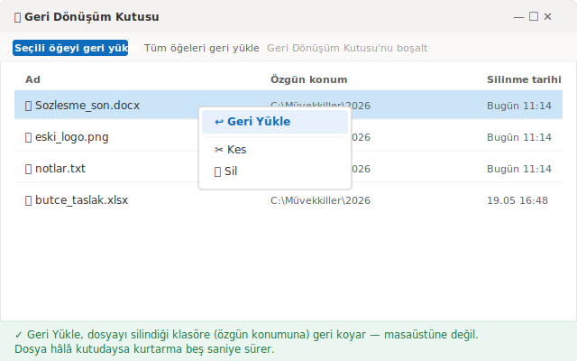
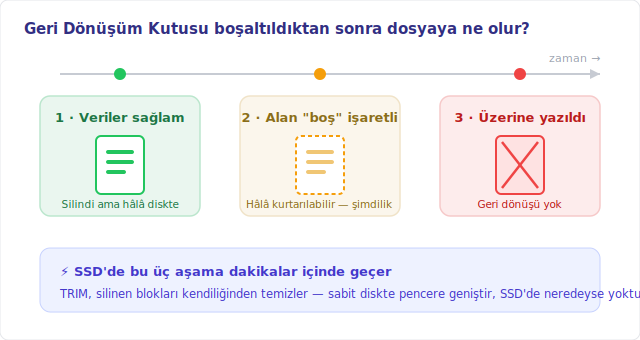
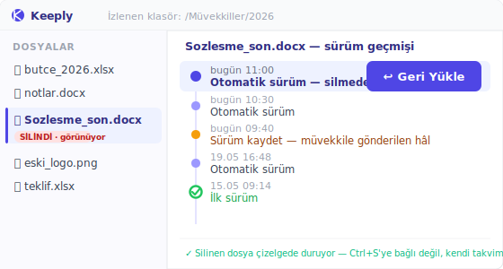

# Geri dönüşüm kutusundan silinen dosyaları kurtarma: kalan zamana göre 4 yöntem

> Dosya hâlâ Geri Dönüşüm Kutusu'nda mı? Beş saniye. Kutuyu çoktan boşalttınız mı? Kronometre yeni başladı.

*[kurgusal örnek]* Çarşamba, 11:14. Bir müvekkilin klasörünü topluyordunuz: bir yığın eski dosyayı seçip ferahlamak için topluca sildiniz. İki dakika sonra fark ettiniz ki o yığının içinde, sabah boyunca üzerinde çalıştığınız son sözleşme de varmış. Geri Dönüşüm Kutusu'nu açtınız. Boş — onu da hemen, düşünmeden boşaltmıştınız.

Buradan sonra dosyayı kurtarıp kurtaramayacağınızı belirleyen şey, seçtiğiniz yöntem değil. **Kalan zamanınız.** Henüz Geri Dönüşüm Kutusu'na düşmüş bir dosya neredeyse kesin kurtarılır. Kalıcı olarak silinmiş bir dosya bambaşka bir hikâye: geçen her dakika, bilgisayarın diske yazdığı her yeni şey, şansınızı bir kademe düşürür.

Bu yüzden bu rehber yöntemleri "kolay mı zor mu" diye sıralamıyor. **Aciliyete** göre sıralıyor: 1. yöntem dosya hâlâ ortadayken, 4. yöntem neredeyse hiçbir şey kalmadığında içindir. Yukarıdan aşağıya doğru deneyin.

## 1. yöntem: doğrudan Geri Dönüşüm Kutusu'ndan geri yükleme

Dosya hâlâ Geri Dönüşüm Kutusu'ndaysa iş beş saniyede biter — ve "yanlışlıkla sildim" vakalarının büyük çoğunluğu da burada mutlu sonla kapanır. Normal **Delete** tuşuna bastığınızda Windows dosyayı yok etmez; yalnızca onu **Geri Dönüşüm Kutusu**'na taşır. Dosya, siz kutuyu boşaltana ya da kutu kendi kendine dolup eskiyi silene kadar olduğu gibi orada durur.

Masaüstündeki **Geri Dönüşüm Kutusu**'nu açın, dosyayı bulun, üzerine sağ tıklayın ve **Geri Yükle**'yi seçin. Dosya tam silindiği klasöre, yani **özgün konumuna** geri döner — masaüstüne değil. Hepsi bu.

Ama iki tuzak, siz hiçbir şey boşaltmadan kutuyu boş bırakabilir:

- Dosyayı **Shift + Delete** ile sildiniz — bu kısayol kutuyu atlar ve doğrudan kalıcı siler.
- Dosya, Geri Dönüşüm Kutusu'nun ayrılan boyutundan büyüktü; Windows onu kutuda tutmak yerine bir anda kalıcı sildi.

Bu iki durumdan birindeyseniz Geri Dönüşüm Kutusu size yardımcı olmaz. Bir alttaki yönteme geçin.

## 2. yöntem: tam silmişken yapılan işlemi geri alma

Daha demin sildiyseniz ve o andan beri başka bir şey yapmadıysanız, en hızlı kısayol budur — Geri Dönüşüm Kutusu'nu açmaktan bile hızlı. Dosya Gezgini penceresinde **Ctrl + Z**'ye basın. Ya da dosyanın bulunduğu klasörün boş bir yerine sağ tıklayıp **Silmeyi Geri Al**'ı seçin. Windows dosyayı anında yerine koyar.

İyi yanı: bu yöntem dosya Geri Dönüşüm Kutusu'na gitmiş olsa bile onu doğru yere geri koyar. Kötü yanı: yalnızca birkaç işlem kadar geçerlidir. Başka pencereler açar, başka dosyalar kopyalar ya da bilgisayarı kapatırsanız geri alma geçmişi silinir.

Kısacası Ctrl + Z, ilk iki dakikanın refleksidir. O pencere kapandıktan sonra başka bir yönteme ihtiyacınız olur.

## 3. yöntem: önceki sürümleri geri yükleme — daha önceden açtıysanız

Buradan itibaren çizgi nettir: kurtarıp kurtaramayacağınız, **sorun çıkmadan önce yaptığınız — ya da yapmayı unuttuğunuz — bir şeye** bağlıdır.

Windows'ta **Dosya Geçmişi** (File History) adlı bir özellik, ona gösterdiğiniz klasörlerin eski kopyalarını otomatik kaydeder. Açıkken, kayıp dosyanın bulunduğu klasöre sağ tıklar, **Önceki sürümleri geri yükle**'yi seçersiniz; Windows da anlık görüntüleri tarihe göre listeler ve siz seçersiniz. Microsoft'un [Dosya Geçmişi ile yedekleme ve geri yükleme](https://support.microsoft.com/tr-tr/windows/dosya-ge%C3%A7mi%C5%9Fi-ile-yedekleme-ve-geri-y%C3%BCkleme-7bf065bf-f1ea-0a78-c1cf-7dcf51cc8bfc) sayfasında anlattığı yol tam olarak budur.

Ve neredeyse hiçbir kılavuzun açıkça söylemediği tuzak şu: **"Önceki Sürümler" sekmesi yalnızca Dosya Geçmişi daha önceden açıksa bir şey gösterir.** Hiç açmadıysanız liste boş gelir — geri yüklenecek bir şey yoktur. Windows ancak özelliği açtıktan sonra kaydetmeye başlar; geçmişi geriye dönük olarak yeniden kurmaz.

Kişisel bir bilgisayarda ya da bilişim desteği olmayan küçük bir büronun makinesinde — birçok serbest meslek erbabı, mali müşavir ve avukatın durumu — bu özellik neredeyse hiçbir zaman baştan açık değildir. Durumunuz buysa liste boş gelir ve son yönteme itilirsiniz.

## 4. yöntem: kurtarma yazılımı, ve o diski hemen kullanmayı bırakın

Buraya geldiyseniz dosya gerçekten kalıcı silinmiş ve hiçbir yedek katmanı onu tutmamış demektir. Geriye, diskin fiziksel bölümünü bir veri kurtarma yazılımıyla taramak kalır — **Recuva** (ücretsiz, hafif) ya da **Disk Drill** (ücretli sürümü daha kapsamlı) gibi. Bunlar, sistemin "silindi" diye işaretleyip henüz üzerine yazmadığı bölgeleri okumaya çalışan araçlardır.

Herhangi bir şey kurmadan önce, yazılımdan daha önemli bir hareket var: **dosyanın bulunduğu diski hemen kullanmayı bırakın.** Bir dosya kalıcı silindiğinde veriler o anda kaybolmaz — sistem yalnızca o alanı boş olarak işaretler. Microsoft, [Windows Dosya Kurtarma](https://support.microsoft.com/tr-tr/windows/windows-dosya-kurtarma-61f5b28a-f5b8-3cc2-0f8e-a63cb4e1d4c4) belgesinde bunu doğruluyor: "silinen bir dosya tarafından kullanılan alan boş alan olarak işaretlenir, bu da dosya verilerinin hâlâ var olabileceği ve kurtarılabildiği anlamına gelir." Aynı sayfa, şansınızı artırmak için "bilgisayarınızı simge durumuna küçültün veya kullanmaktan kaçının" diyor — çünkü her yeni yazma, tam da kurtarmak istediğiniz şeyin üstüne denk gelebilir.

Ve çok az kişinin bildiği kısım: **SSD'de kapı, sabit diske göre çok daha hızlı kapanır.** SSD'de TRIM adlı bir mekanizma vardır; disk hızlı kalsın diye silinmiş olarak işaretlenen blokları kendiliğinden temizler. Microsoft'un aynı sayfası tam da bu yüzden "özellikle katı hal sürücüsünde (SSD) boş alanın üzerine yazılması mümkündür" diye uyarıyor. TRIM bir kez geçtikten sonra — genelde silmeden birkaç dakika sonra — adli bir araç bile bir şey kurtaramaz: tarar, ama okunacak veri kalmamıştır. Sabit diskte pencere daha geniştir, ama dosyanın üzerine kısmen yazılmış olabilir.

İşte iki altın kural buradan çıkıyor: **yazılımı kayıp dosyanın diskine kurmayın ve kurtardığınız dosyayı da oraya kaydetmeyin** — ikisi de kurtarmaya çalıştığınız şeyin üzerine yazma riski taşır.

## Ya yanlışlıkla silme bir daha hiç sorun olmasaydı?

Dört yöntemin ortak yanını fark ettiniz mi? Aşağı indikçe şansınız hızınıza ve şansa daha çok bağlanıyor. 4. yöntemde TRIM'in henüz çalışmadığına ve diskin üzerine henüz yazılmadığına bahse giriyorsunuz — çoğu zaman pahalıya patlayan bir bahis.

Bambaşka bir yön var ve "daha hızlı kurtarmak"ta değil. **Yanlışlıkla silmeyi sıradan, önemsiz bir olaya çevirmekte.** Fikir basit: dosya çoktan gittikten sonra onu diskten söküp almayı ummak yerine, bir **klasörün** sürümlerini önceden saklamak. Böylece silinen bir dosya kaybolmaz — geçmişte durur ve onu tek tıkla geri getirirsiniz.

[Keeply](https://keeply.work) tam bunu yapar. Ona bir klasör gösterirsiniz — bilgisayarınızdaki ya da şirketin bir **ağ sürücüsündeki** — o da arka planda, **sizin** belirlediğiniz bir ritimle o klasörün sürümlerini tutar: her 15, 30 ya da 60 dakikada bir, varsayılanı 30. İzlenen klasörden bir dosya silindiğinde, o dosya sürüm zaman çizelgesinde olduğu gibi durur; çizelgeyi açar, silmeden önceki son sürümü bulur ve **Geri Yükle**'ye basarsınız.

Her şeyi yürüten fark şu: Keeply her **Ctrl + S**'de **tetiklenmez** ve her kaydedişinizi dinleyen bir hizmet **değildir**. Kendi saatine göre, hep arka planda çalışır. Bir de elle önemli bir anı tek satırlık notla işaretlemek için bir **"Sürüm kaydet"** düğmesi vardır — örneğin "müvekkile gönderilen hâl". Ve sürümler dosya silinmeden önce tutulduğu için, kurtarma veriler yeniden kullanılabilir boş alana dönüşmeden **önce** olur — TRIM'e karşı yarış yok, tarama yazılımına bahis yok.

Aynı sürüm katmanı sizi yanlışlıkla silmekten daha büyük bir riske karşı da korur: **diskin kendisinin bozulması.** Tek disk varsa, o gittiğinde her şey gider. Keeply verilerinizi bir 3-2-1 düzenine göre tutar — bir yerel kopya, bir ana kopya ve başka bir yerde bir ayna — yani ölen bir disk işinizi de beraberinde götürmez. (Bu ikincil korumadır; burada konu, yanlışlıkla silinen bir dosyayı geri getirmek.) Kaputun altında tutulan her sürüm değiştirilemez biçimde saklanır, hiçbir zaman üzerine yazılmaz. Ama bu içerideki bir mühendislik; tek bir komut yazmanız ya da bunu anlamanız gerekmez, her şey zaman çizelgesi üzerinden yürür.

## Keeply'nin işe yaramayacağı yerler (dürüst olalım)

Hiçbir araç her şeyi kapsamaz; aksini iddia etmek sizi yanlış ağa güvendirmekten başka işe yaramaz. Keeply'nin yanıt olmadığı üç durum:

- **İzlenmeyen bir klasördeki, hiç kaydedilmemiş yeni dosya.** Silinen dosya Keeply'nin izlediği klasörden hiç geçmediyse, ondan hiçbir iz kalmaz. Burada yukarıdaki 1–4. yöntemler geçerlidir — ve yine zamana karşı yarışa girersiniz.
- **Keeply kurulmadan önce kaybolan dosya.** Keeply, klasörü ona emanet ettiğiniz andan itibaren sürüm tutar. Hiçbir katman yokken geçen hafta kalıcı silinen bir dosya hâlâ kurtarma yazılımına ve onun bütün riskine bağlıdır.
- **Sessiz dosya bozulması.** Bir sürüm alındığı anda dosya zaten bozulmuşsa, Keeply o bozuk hâli de sadakatle tutar. Sürüm tutmak, dosyayı onarmak değildir.

Özet: Keeply **geleceğe** bakar — bir sonraki yanlışlıkla silme artık sorun olmasın diye. Daha önce kaybedilmiş bir dosya hâlâ yukarıdaki dört yöntemin işidir.

## Elinizdeki araçlar ne zaman zaten yeter?

Dosyalarınız hâlihazırda iyi korunuyorsa fazladan bir katman eklemenize gerek yok. Eğer dosyalar **OneDrive** ya da **SharePoint**'te yaşıyorsa, ücretsiz olarak iki sağlam korumanız vardır.

Birincisi, silinen dosyayı epey bir süre tutan **bulut çöp kutusu**: kişisel hesapta **30 gün**, iş veya okul hesabında **93 gün**, Microsoft'un [OneDrive'da silinen dosya veya klasörleri geri yükleme](https://support.microsoft.com/tr-tr/office/onedrive-da-silinen-dosya-veya-klas%C3%B6rleri-geri-y%C3%BCkleme-949ada80-0026-4db3-a953-c99083e6a84f) belgesine göre. Bu, yerel silmenin penceresinden çok daha geniştir.

İkincisi, aynı dosyanın eski hâllerine dönmenizi sağlayan **sürüm geçmişi**. Ama net bir tavanı var: kişisel bir Microsoft hesabında yalnızca **son 25 sürümü** alırsınız, Microsoft'un [önceki bir sürümü geri yükleme](https://support.microsoft.com/tr-tr/office/onedrive-de-depolanan-bir-dosyan%C4%B1n-%C3%B6nceki-bir-s%C3%BCr%C3%BCm%C3%BCn%C3%BC-geri-y%C3%BCkleme-159cad6d-d76e-4981-88ef-de6e96c93893) sayfasına göre. Sürekli değişen bir dosyada 25 sürüm yalnızca son birkaç günü kapsayabilir.

Yerel diskte de bir not: Geri Dönüşüm Kutusu'nun sabit bir saklama süresi yoktur. Microsoft'un [Windows'ta sürücüde yer açma](https://support.microsoft.com/tr-tr/windows/windows-da-s%C3%BCr%C3%BCc%C3%BCde-yer-a%C3%A7ma-85529ccb-c365-490d-b548-831022bc9b32) sayfasında belirtildiği gibi, **Depolama Algısı** (Storage Sense) açıksa Windows "geçici dosyalar ve Geri Dönüşüm Kutusu'ndaki öğeler gibi ihtiyacınız olmayan şeyleri silerek otomatik olarak yer açar." Yani yerelde silinen bir dosya, sandığınızdan daha erken kalıcı kaybolabilir.

Bu korumalar mükemmeldir — ama yalnızca bulutla eşitlenen klasörde **gerçekten** bulunan dosyalar için geçerlidir. Veri gizliliği nedeniyle bilerek yerel diskte ya da şirket ağ sürücüsünde çalışan — hiçbir şeyi eşitlemeyen, Dosya Geçmişi'ni açacak bilişim desteği olmayan — birçok büro için ne bulut çöp kutusu ne de bu sürüm geçmişi devrededir. Arka planda çalışan bir sürüm katmanı asıl değerini tam da burada gösterir.

## Sıkça Sorulan Sorular

**Geri Dönüşüm Kutusu'ndan (ya da Shift + Delete ile) silinen dosya nereye gider, geri getirilebilir mi?**
Geri Dönüşüm Kutusu'nu boşalttığınızda ya da Shift + Delete ile sildiğinizde Windows veriyi hemen yok etmez; yalnızca o alanı boş olarak işaretler. Microsoft'a göre silinen dosyanın verileri hâlâ var olabilir ve üzerine yeni bir şey yazılmadığı sürece kurtarılabilir. Yani bir şans kalır, ama diske her yeni yazmada azalır — SSD'de TRIM yüzünden daha da hızlı.

**Geri dönüşüm kutusu boşaltıldıktan sonra kalıcı olarak silinen dosyaları nasıl geri getiririm?**
Aciliyet sırasına göre deneyin: (1) az önce sildiyseniz **Ctrl + Z**'ye basın ya da klasörde sağ tıklayıp **Silmeyi Geri Al** deyin; (2) dosyanın bulunduğu klasöre sağ tıklayıp **Önceki sürümleri geri yükle** seçin — ama bu yalnızca Windows **Dosya Geçmişi** kayıptan önce açıksa bir şey gösterir; (3) son çare olarak Recuva ya da Disk Drill gibi bir veri kurtarma yazılımı, dosyanın üzerine yazmamak için o diski hemen kullanmayı bırakarak.

**Veri kurtarma yazılımı dosyayı her zaman geri getirir mi?**
Hayır. Erken davranır ve diskin üzerine yazılmadıysa başarı oranı yüksektir, ama zamanla ve her yeni yazmada düşer. SSD'de TRIM işaretlenen blokları birkaç dakikada temizler; bu süre geçtikten sonra adli düzeyde bir araç bile bir şey kurtaramaz. Yazılımı kayıp dosyanın diskine kurmayın ve kurtardığınız dosyayı da oraya kaydetmeyin.

**Geri Dönüşüm Kutusu silinen dosyaları ne kadar süre tutar?**
Sabit bir gün sayısı yoktur. Windows masaüstündeki Geri Dönüşüm Kutusu, diskin yaklaşık %5'i kadar bir alana kadar dosya tutar; o sınır dolunca en eski öğeler otomatik silinir. Depolama Algısı (Storage Sense) açıksa Windows kutuyu belirlediğiniz aralıkta kendiliğinden de boşaltır. Bulut çöp kutuları farklıdır: OneDrive kişisel hesapta 30 gün, iş veya okul hesabında 93 gün tutar.

**Keeply, Recuva ya da Disk Drill gibi bir veri kurtarma yazılımı mı?**
Hayır, ikisi farklı katmandır. Recuva ve Disk Drill, silinmiş olarak işaretlenmiş baytları geri almaya çalışmak için diskin fiziksel bölümünü tarar — zamana karşı bir bahis. Keeply ise bir klasörün sürümlerini dosya silinmeden önce saklar; kurtarma, veriler yeniden kullanılabilir boş alana dönüşmeden gerçekleşir. Keeply, Recuva'ya hiç ihtiyaç duymamanızı sağlayan araçtır.

## Daha fazla bilgi

- [Keeply – yerel dosyalarınız ve ağ sürücüleriniz için sürüm geçmişi](https://keeply.work) — klasörlerinizin sürümlerini arka planda tutan bir katman; silinen bir dosya geçmişte olduğu gibi durur ve tek tıkla geri döner.
- [Windows Dosya Kurtarma — Microsoft Desteği](https://support.microsoft.com/tr-tr/windows/windows-dosya-kurtarma-61f5b28a-f5b8-3cc2-0f8e-a63cb4e1d4c4) — Geri Dönüşüm Kutusu'ndan çıkmış dosyalar için komut satırı aracı, üzerine yazma ve SSD uyarısıyla birlikte.
- [Dosya Geçmişi ile yedekleme ve geri yükleme — Microsoft Desteği](https://support.microsoft.com/tr-tr/windows/dosya-ge%C3%A7mi%C5%9Fi-ile-yedekleme-ve-geri-y%C3%BCkleme-7bf065bf-f1ea-0a78-c1cf-7dcf51cc8bfc) — Dosya Geçmişi ve Önceki sürümleri geri yükleme yolunun tamamı.
- [OneDrive'da silinen dosya veya klasörleri geri yükleme — Microsoft Desteği](https://support.microsoft.com/tr-tr/office/onedrive-da-silinen-dosya-veya-klas%C3%B6rleri-geri-y%C3%BCkleme-949ada80-0026-4db3-a953-c99083e6a84f) — bulut çöp kutusunun saklama süresi (kişisel 30 gün / iş 93 gün).

---
*Yazan: Ting-Wei Tsao, Keeply kurucusu, [LinkedIn](https://www.linkedin.com/in/ting-wei-tsao-b57480152)*
