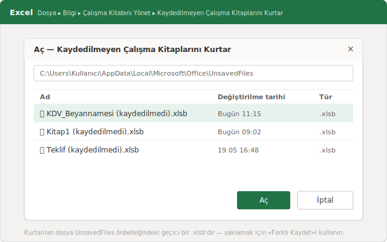
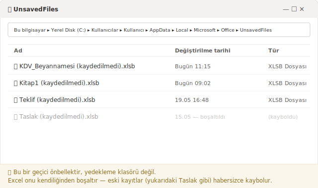
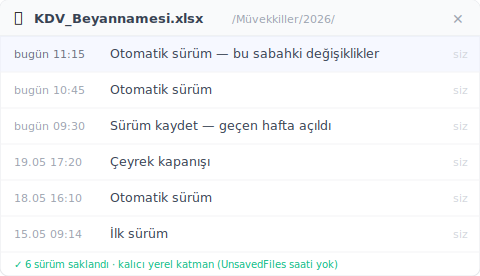

# Kaydedilmeyen Excel dosyasını kurtarma: aynı numara ikinci seferde neden tutmaz

> Excel, hiç kaydetmediğiniz bir çalışma kitabını gizli bir önbellekte kısa süre tutar; ama yalnızca tek bir durum için. Bunun ne zaman yettiğini, ne zaman gerçek bir sürüm katmanına ihtiyacınız olduğunu burada okuyacaksınız.

*[kurgusal örnek]* Salı sabahı, küçük bir mali müşavirlik ofisi. Saat 11:15. Bir müvekkilin KDV beyannamesi için hazırlanan tablo sabahtan beri açık: üç sayfa, her satır iki kez kontrol edilmiş. Tam o sırada Windows bir güncelleme için yeniden başlatma soruyor. Cevap fazla hızlı geliyor, "Değişiklikleri kaydetmek istiyor musunuz?" sorusuna verilen tıklama "Kaydetme"nin üstüne kayıyor. Dosya kapanıyor. Sabahki dört saatlik emek, görünüşe göre, gitti.

Bunu yaşadıysanız yalnız değilsiniz; ve çoğu durumda işin aslı hissettiğinizden çok daha iyidir. Çünkü Excel arka planda bir acil kopya tutar. Ama bu acil çıkış yalnızca belirli koşullarda çalışır ve kendiliğinden kapanır. Bunu pek kimse bilmez; aynı numarayı ikinci kez denediğinizde tam da bu yüzden tutmaz.

## Önümüzdeki beş dakikada dosyayı geri getirmek için ne yapmalısınız?

Excel'i yeniden açın ve şu yolu izleyin: **Dosya → Bilgi → Çalışma Kitabını Yönet → Kaydedilmeyen Çalışma Kitaplarını Kurtar**. Excel, geçici acil kopyaların bulunduğu gizli bir klasörü açar. Doğru saat damgasını taşıyan dosyayı bulun, açın ve hemen gerçek bir adla, sabit bir konuma kaydedin. Acele edin; bu önbellek sonsuza kadar kalmaz.

Excel düzgün kapanmak yerine çöktüyse yol daha da kısadır: yeniden açtığınızda solda **Belge Kurtarma** bölmesi çıkar; Excel'in yakalayabildiği bütün sürümler orada saatleriyle listelenir. En geç saatli sürümü seçin, içeriğine kısaca göz atın ve net bir adla kaydedin. Bu bölme, daha önce en az bir kez kaydettiğiniz dosyalar için en güvenilir yoldur. Hiç kaydedilmemiş, tertemiz yeni bir çalışma kitabını ise yukarıdaki "Kaydedilmeyen Çalışma Kitaplarını Kurtar" yoluyla geri almanız daha güvenlidir; buna birazdan A durumunda değiniyoruz.

Sıralama konusunda tek bir uyarı: önce kaydedin, sonra inceleyin. Kurtardığınız dosya yalnızca açık durup henüz bir yere yazılmadıysa, bütün emeğiniz Excel'in dilediği an temizleyebileceği geçici bir kopyaya bağlı kalır.

## Dosya bir sonraki sefer neden öylece ortada yok?

Çünkü o acil kopya klasörü bir arşiv değil, bir geçici bellektir. Excel, hiç kaydedilmemiş çalışma kitaplarını `%LocalAppData%\Microsoft\Office\UnsavedFiles` altında geçici `.xlsb` dosyaları olarak tutar ve bu klasörü kendi takvimine göre, size sormadan boşaltır. Bu yolu Windows Gezgini'nin adres çubuğuna yapıştırarak doğrudan klasöre de gidebilirsiniz.

İnternette ısrarla dolaşan bir "dört gün" rakamı var. Buna temkinli yaklaşın: Microsoft'un [bir Office dosyasının önceki bir sürümünü kurtarma](https://support.microsoft.com/tr-tr/office/office-dosyas%C4%B1n%C4%B1n-%C3%B6nceki-bir-s%C3%BCr%C3%BCm%C3%BCn%C3%BC-kurtarma-169cb166-e7e2-438e-8f39-9a8927828121) sayfasında böyle bağlayıcı bir saklama süresi taahhüt edilmez; sayfa yalnızca oraya nasıl gidileceğini gösterir, kopyanın ne kadar kalacağını değil. Uygulamada klasör çoğu zaman daha erken boşalır: bir yeniden başlatmadan sonra ya da yeterince yeni kayıt biriktiğinde eskiler silinir. Bu yüzden kurtardığınız bir dosyayı, **Farklı Kaydet** ile sabit bir yere koyana kadar geçici sayın.

Türkiye'deki birçok ofis için asıl önemli nokta şu: bilerek yerel diskte ya da şirket içi ağ sürücüsünde çalışan herkes — müvekkil ve mükellef verilerini bulutta tutmak istemeyen mali müşavirler, serbest meslek erbabı, küçük muhasebe büroları — bu önbellekten kalıcı bir güvence göremez. UnsavedFiles klasörü tek seferlik bir acil çözümdür, sürüm geçmişinin yerini tutmaz.

## "Kaydetmedim" derken aslında iki ayrı dert var

Çünkü "kaydedilmeyen Excel dosyamı kaybettim" cümlesi gerçekte iki ayrı acil durumu kapsar ve Excel her ikisini de aynı kapıdan geçirir. Bu ikisini ayırmayan kişi yanlış kurtarma yöntemine sarılır. İşte temiz ayrım; çünkü önbellek aslında bunlardan yalnızca biri için tasarlanmıştır.

**A durumu — dosya hiç kaydedilmedi.** Yeni bir çalışma kitabı açtınız, bir saat veri girdiniz, sonra Excel çöktü ya da yanlışlıkla "Kaydetme"ye tıkladınız. Diskte hiçbir dosya yok, hiç olmadı. Burada UnsavedFiles önbelleği tek umudunuzdur ve zaten tam bunun için yapılmıştır. Yukarıda anlatılan **Çalışma Kitabını Yönet** yolu bu durumda tam isabettir.

**B durumu — dosya zaten vardı, ama sabahki hâli gitti.** Tablo haftalardır sunucuda duruyordu. Bugün üzerinde çalıştınız, yanlış bir sürümü üstüne yazdınız ya da yarım günlük emeğin üzerine kaydettiniz. Dosya yerinde; sadece yanlış hâlde. Ve burada önbellek neredeyse hiç işe yaramaz: o, yalnızca hiç kaydedilmemiş dosyalar için çalışır; defalarca kaydettiğiniz bir dosyadan size 11:15'teki sürümü çıkaramaz.

İşte birçok kişinin "önceki sürüm olmadan üzerine yazılan dosyayı kurtarma" diye aradığı durum tam budur. Yerel olarak A durumunun karşılığı, dosyaya **sağ tıklama → Özellikler → Önceki Sürümler** yoludur; ama bu yalnızca Windows Dosya Geçmişi ya da geri yükleme noktaları kayıp olmadan **önceden** açıksa işe yarar — bilişim desteği olmayan küçük bir ofis bilgisayarında ise bu neredeyse hiçbir zaman açık değildir, dolayısıyla liste boş çıkar. B durumu için acil çıkışa değil, iş ters gitmeden önce yazmaya başlayan kalıcı bir sürüm katmanına ihtiyacınız var.

## Dosya hâlâ dururken sabahki sürümü nasıl geri alırsınız?

Kayıt işlemlerinizin bir alt katmanında, yalnızca acil durumda devreye giren değil, sürekli ara sürümleri tutan bir katman çalıştırarak. [Keeply](https://keeply.work) tam bunu yapar: dosyalarınızın bulunduğu klasörü bir kez gösterirsiniz, o da arka planda, sizin belirlediğiniz bir takvime göre otomatik olarak sürüm tutar. Keeply yerel bir bilgisayardaki dosyalar için de, bir **ağ sürücüsündeki** dosyalar için de çalışır.

Aralığı siz ayarlarsınız: her 15, 30 veya 60 dakikada bir; varsayılanı 30 dakikadır. Buna ek olarak, bir kilometre taşını işaretlemek için tek satırlık bir notla kullanabileceğiniz **"Sürüm kaydet"** düğmesi vardır — örneğin "vergi dairesine gönderilen hâli". Sabah gittiğinde artık önbellekte balık avlamazsınız; dosyanın zaman çizelgesini açar, 11:15 sürümünü seçersiniz.

Sık yanlış anlaşılan bir nokta: Keeply tuş kombinasyonunuza **bağlanmaz**. Ctrl+S yeni bir Keeply sürümü tetiklemez ve Keeply her kaydedişinizi dinleyen bir hizmet değildir. Ayarladığınız takvime göre, bir de düğmeye basınca çalışır — hepsi bu. Kaputun altında ne döndüğünü merak edenler için: Keeply içeride bir Git motoru kullanır, tutulan her sürüm değiştirilemez biçimde saklanır, hiçbir zaman üzerine yazılmaz ya da bozulmaz. Ama bunun için tek bir komut yazmanız ya da Git'ten anlamanız gerekmez; her şey zaman çizelgesi üzerinden yürür.

## Keeply nerede işe yaramaz?

Dürüst bir sürüm geçmişi her derde deva değildir; sınırlarını açıkça söylemek de işin doğrusudur. Şu üç durumda Keeply sizi kurtarmaz:

- **İzlenmeyen bir klasördeki, hiç kaydedilmemiş yeni dosya.** Taze bir çalışma kitabı açıp bir saat veri girer ve onu hiç izlenen klasöre koymazsanız, Keeply'nin tutacağı hiçbir şey yoktur — onun göreceği bir şey yok. Bu, A durumu olarak kalır ve Excel'in önbelleğinin işidir.
- **Sessiz dosya bozulması.** Bir Excel dosyası hiçbir hata vermeden yavaşça bozuluyorsa, Keeply o bozuk hâli de sadakatle tutar — sadık ama işe yaramaz. Sürüm geçmişi kendisine verileni saklar; içeriğin sağlam olup olmadığını denetlemez. Sürüm tutmak, onarmak demek değildir.
- **İzlenen klasörün dışındaki dosyalar.** Hiç eklemediğiniz USB belleğindeki bir Excel'in zaman çizelgesinde geçmişi olmaz; izlenmeyen hiçbir şey hiçbir çizelgede görünmez.

## Excel'in kendi araçları ne zaman fazlasıyla yeter?

Çoğu zaman yeter — ve o zaman ek bir katmana hiç ihtiyacınız olmaz. Bir saat sonra zaten sileceğiniz, tek seferlik bir hesap için her türlü uğraş fazladır; arada bir kaydedin, bu kadar.

OneDrive ya da SharePoint'te **Otomatik Kaydetme** açık şekilde tutarlı biçimde çalışanlar da birçok durumda iyi korunur: oradaki yerleşik **sürüm geçmişi** önceki hâllere dönmeyi sağlam biçimde kapsar. Yine de üç sınırı bilmekte fayda var: bu geçmiş senkronize edilmiş bulut kopyasına bağlıdır, saklanan geçmişin bir üst sınırı vardır ve Otomatik Kaydetme size sormadan sürekli üzerine yazar — yani yanlış bir hâl de doğru bir hâl kadar sadakatle alınır. Veri gizliliği nedeniyle bilerek yerel diskte ya da şirket ağ sürücüsünde kalan ofisler için ise bu bulut akışı zaten devrede değildir.

Otomatik Kurtarma'yı (AutoRecover) açmak da iyi bir alışkanlıktır: **Dosya → Seçenekler → Kaydet** yolundan, "Otomatik Kurtarma bilgilerini kaydetme sıklığı … dakika" kutusunu işaretleyip aralığı belirleyebilirsiniz. Microsoft, fazladan güvenlik için bu kutuya [5 veya 10 gibi küçük bir sayı](https://support.microsoft.com/tr-tr/office/kilitlenme-durumunda-dosyalar%C4%B1n%C4%B1z%C4%B1-korumaya-yard%C4%B1mc%C4%B1-olma-551c29b1-6a4b-4415-a3ff-a80415b92f99) girmenizi önerir. Yalnız şunu unutmayın: Otomatik Kurtarma bir çökme anı için yedektir; sabahki belirli bir sürümü size geri getirme garantisi vermez.

Dürüst kural şudur: bir sabahı kaybetmek sizin için katlanılabilirse, Excel'in kendi araçları yeter. Ama kaybedilen bir sabah, kaçırılmış bir beyanname süresi ya da müvekkile mahcup bir telefon anlamına geliyorsa, sürekli çalışan bir sürüm katmanı kendini fazlasıyla amorti eder.

## Sıkça Sorulan Sorular

**Excel kaydedilmeyen dosyaları ne kadar süre saklar?**
Microsoft resmî sayfasında bağlayıcı bir saklama süresi taahhüt etmez. İnternette dolaşan "dört gün" rakamı bir garanti değildir; acil kopyalar bir yeniden başlatmadan sonra ya da yeni kayıtlar biriktiğinde daha erken de silinebilir. Bu yüzden kaybolan bir dosyayı mümkün olan en kısa sürede kurtarın ve **Farklı Kaydet** ile kalıcı bir yere yazın.

**Kaydedilmeyen Excel dosyalarını bilgisayarımda nerede bulurum?**
Hiç kaydedilmemiş çalışma kitapları `%LocalAppData%\Microsoft\Office\UnsavedFiles` altında geçici `.xlsb` dosyaları olarak durur. En kolay yol **Dosya → Bilgi → Çalışma Kitabını Yönet → Kaydedilmeyen Çalışma Kitaplarını Kurtar**'dır. Bulduğunuz dosyayı hemen sabit bir konuma kaydedin, çünkü Excel bu klasörü kendiliğinden boşaltır.

**Önceki sürüm listesi boşken üzerine yazdığım Excel dosyasını geri alabilir miyim?**
Windows Dosya Geçmişi o klasör için hiç açık olmadıysa, sağ tık → Özellikler → Önceki Sürümler listesi boş çıkar; bu durumda UnsavedFiles önbelleği de çoğunlukla yardımcı olmaz, çünkü o yalnızca hiç kaydedilmemiş dosyalar içindir. Üzerine yazılan hâller için, hata olmadan önce yazmaya başlayan bir sürüm katmanına ihtiyacınız vardır.

**Bu sabah çalıştığım hâlin üzerine yanlışlıkla kaydettim — Keeply bana yardımcı olur mu?**
Evet, zaten tam bunun içindir. Dosya Keeply'nin izlediği bir klasörde duruyorsa, Keeply ayarladığınız takvime göre — her 15, 30 veya 60 dakikada bir, varsayılanı 30 — otomatik olarak sürüm tutar. Gizli önbellekte aramak yerine dosyanın zaman çizelgesini açar, sabahki sürümü seçersiniz. Tek koşul: klasörün önceden eklenmiş olması.

**OneDrive, Otomatik Kaydetme açıkken tek başına yetmez mi?**
Birçok durumda yeter. OneDrive ve SharePoint'teki sürüm geçmişi önceki hâllere dönmeyi iyi kapsar. Ama bu geçmiş senkronize bulut kopyasına bağlıdır, saklanan geçmişin bir üst sınırı vardır ve Otomatik Kaydetme size sormadan sürekli üzerine yazar. Veri gizliliği nedeniyle bilerek yerelde ya da ağ sürücüsünde çalışanların, orada da geçerli olan bir çözüme ihtiyacı vardır.

## Daha fazla bilgi

- [Keeply – yerel dosyalarınız ve ağ sürücüleriniz için sürüm geçmişi](https://keeply.work)
- [Microsoft Desteği: Office dosyasının önceki bir sürümünü kurtarma](https://support.microsoft.com/tr-tr/office/office-dosyas%C4%B1n%C4%B1n-%C3%B6nceki-bir-s%C3%BCr%C3%BCm%C3%BCn%C3%BC-kurtarma-169cb166-e7e2-438e-8f39-9a8927828121)

---
*Yazan: Ting-Wei Tsao, Keeply kurucusu, [LinkedIn](https://www.linkedin.com/in/ting-wei-tsao-b57480152)*
