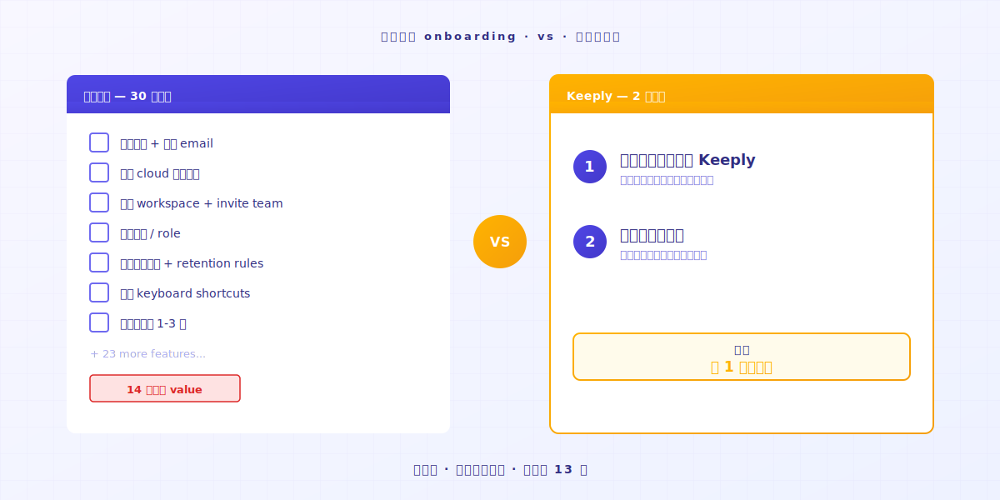
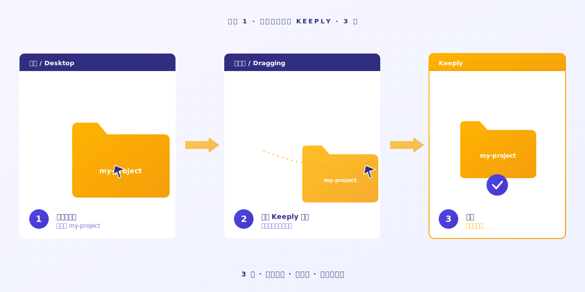

# Keeply nasıl kullanılır: 30 özelliği atla, 2 hareketle başla

> Önce uzman olmana gerek yok. Bir klasörü içine sürükle, çalışmaya devam et — sürüm geçmişi zaten çalışıyor.

## İçindekiler

1. [Yeni araçlara neden direniyorsun?](#why-resist-new-tools)
2. [Bir araçtan neden vazgeçiyorsun?](#why-give-up-a-tool)
3. [Peki bu 2 hareket ne?](#what-are-the-two-actions)
4. [Sana ne yaşayacağını anlatayım](#first-week-natural)
5. [Keeply sana uygun olmadığında](#when-keeply-isnt-right)

---

A Bey çok sayıda projeyi aynı anda yürütüyor ve ne yaptığını takip etmek için her gün bir defter kullanıyor. Keeply'nin harika bir dosya not yazılımı olduğunu yeni duydu. Ana sayfayı açıyor ve "3 adımda başla" ile "7 gün ücretsiz deneme" görüyor. Denediği son araçta 14. günde hâlâ kayıptı. Herhangi bir değer ortaya çıkmadan sabrı tükendi. **Bu kez karar vermek için 10 dakika istiyor.**

Yavaş olduğun için değil. Geleneksel yazılımın öğrenme eğrisi, bugün her şeyi bırakıp 14 gün öğrenci olmaya hazır olduğunu varsayıyor.

---

## Yeni araçlara neden direniyorsun? {#why-resist-new-tools}

Dün bir araç kurmayı denedin. Belgeler 50 sayfa. 30 yeni terim var. Yarın bir proje teslim ediyorsun.

Şöyle düşünüyorsun: "Haftaya gelir, vakit ayırırım." Sonra bir daha hiç açmıyorsun.

Çoğu yazılım şirketi "14 günde öğren"i doğal düzen olarak görüyor. [Sektör araştırması](https://userpilot.com/blog/time-to-value-benchmark-report-2024/) gösteriyor ki tanıtımın yarısından azını bitiren kullanıcılar, tamamını bitirenlerin **3 katı** oranında 14 gün içinde ayrılıyor.

Başka bir deyişle: yazılım 14 boş günün olduğunu varsayıyor. İşinin onu öğrenene kadar bekleyebileceğini varsayıyor.

Senin sıradaki projen o varsayımın içinde değil.

---

## Bir araçtan neden vazgeçiyorsun? {#why-give-up-a-tool}

Yeni bir aracı öğrenmek genellikle yaklaşık 14 gün sürer. İlk 13'ü keşif aşamasıdır.

O aşamanın ortasında çoğu insan sekmeyi kapatmak ister.

Keeply'yi yapmadan önce, ben de bir sürü yeni aracı denedim. Çoğu 1. günde zahmetli geldi ve sessizce eski yöntemime döndüm.

Sonradan fark ettim: gerçekten devam ettiğim araçların ortak bir noktası vardı — **sezgisel olarak kullanılacak kadar basitlerdi**.

Bir keresinde kod yazmak için yapay zekâ kullanıyordum ve yapay zekâ raydan çıktı. Nereye geldiğini çoktan kaybetmiştim. **Neyse ki bütün süreç boyunca dosya notu tutmuştum.**

Geçmişi açtım. **Kontrol edebileceğim bir duruma geri döndüm.**

İşte o zaman anladım: iyi bir araç en çok özelliği olan değil, **anlamak için yeterince basit olanıdır**. Tek bir özellik öğrenmemiştim ve sadece o dosyayı sessizce yakalayarak araç kendi bedelini çıkarmıştı bile.

Sorun araç değil. **Bu yazılım kategorisi sadece "önce öğren, sonra kullan" etrafında tasarlanmamalı.**

---

## Peki bu 2 hareket ne? {#what-are-the-two-actions}

### 1. hareket: Bir klasörü Keeply'ye sürükle

Tam anlamıyla sürükleyip bırakıyorsun. **Yeniden adlandırma, kategorize etme, yapı düşünme.**

### 2. hareket: Çalışmaya devam et

Bugün ne yapacaktıysan, onu yap.

Bir dosyayı düzenle, kaydet, önceki sürüme geri dön, sil ve baştan yap. **Keeply soldaki Zaman Çizelgesi'ne otomatik olarak kaydeder ve bir dosya notu oluşturur.** Bir düğmeye basmıyorsun. Bir kısayol ezberlemiyorsun.

Dosyalarını yeniden adlandırmana da gerek yok. O `_v3_gercekten_son.docx` adını koruyor. Keeply alışkanlıklarına dokunmuyor.

1. günün sonunda, 1 günlük dosya notların var. **7. günün sonunda, tam bir haftan var.**

Sezgisel kullanım, bütün hile bu.

---

## Sana ne yaşayacağını anlatayım {#first-week-natural}

### 1. gün

Bir projeyi içine sürükle. Kaydet.

### 2-3. gün

Mevcut bir dosyada 200 kelime düzenle. Kaydet.

Zaman Çizelgesi üzerinden kendi dosya notlarının birikmeye başladığını izliyorsun. **Bir nota tıkla, neyi sildiğini ve neyi eklediğini gör.**

### 4-7. gün

Daha fazla dosya notu üst üste biriktiriyorsun.

Bir gün fark edeceksin — **bu yazılıma sahip olmam ne güzel**.

---

## Keeply sana uygun olmadığında {#when-keeply-isnt-right}

Keeply her senaryo için savaşmıyor. 4 durumda başka bir araç daha iyi tercih.

- **Cihazlar arası bulut senkronizasyonuna ihtiyacın varsa**: [IDrive](https://www.idrive.com/) veya [Backblaze](https://www.backblaze.com/) seç. Keeply bilgisayarında yaşıyor. Bulut tabanlı değil.
- **Sistem geri yüklemesi veya tam disk yedekleme istiyorsan**: [Acronis True Image](https://www.acronis.com/) seç. Keeply bunu yapmıyor.
- **50+ makine yöneten BT uzmanıysan**: [MSP360](https://www.msp360.com/) seç. Keeply bireyler ve küçük takımlar için.
- **Sadece kişisel belgelerini kaybetmek istemiyorsan**, Windows Dosya Geçmişi yerleşik ve yeterince iyi. Bir şey kurmana gerek yok.

Bir araç seçmek, bir iş arkadaşı seçmek gibi. Her birinin güçlü olduğu senaryosu var. Bu konuda dürüst ol, daha az 14 günlük deneme yakacaksın.

---

## Toparlarsak

Yeni bir araç denemek istiyorsun ve buna 14 gün kaybetmek istemiyorsun. Bu adil.

Bir klasörü [Keeply](https://keeply.work/)'ye sürükle. Bugünün işine devam et.

7. günde Zaman Çizelgesi'ni aç ve bir bak. **Anlayacaksın.**

---

## İlgili okuma

- [Dosya sürüm yönetiminin tam rehberi](/tr/post/file-version-management-complete-guide/) (PILLAR 1, sürüm yönetimi neden önemli)

---

*Yazar: Ting-Wei Tsao, Keeply kurucusu | [LinkedIn](https://www.linkedin.com/in/tingwei-tsao/)*
