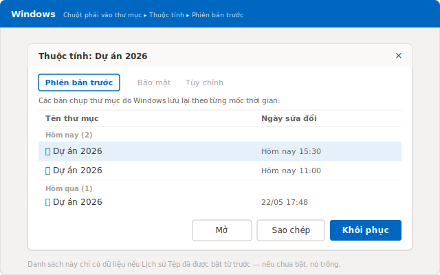
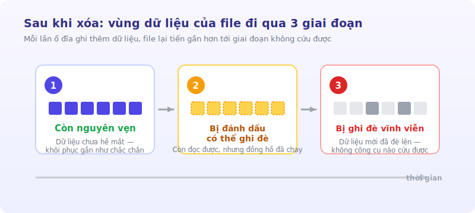
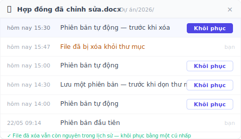

# 5 cách khôi phục file đã xóa (xếp theo thời gian bạn còn lại)

> File còn trong Thùng rác thì lấy lại mất 5 giây. Đã xóa vĩnh viễn thì là một cuộc đua — và đồng hồ đã chạy.

3 giờ 47 chiều thứ Năm. Bạn dọn lại thư mục dự án, quét chọn một mớ file cũ rồi bấm Shift + Delete cho gọn. Hai phút sau bạn nhận ra trong mớ đó có cả bản hợp đồng đã chỉnh sửa cả buổi sáng. Mở Thùng rác. Trống trơn — Shift + Delete bỏ qua luôn Thùng rác. *[ví dụ minh họa]*

Lúc này, thứ quyết định bạn có lấy lại được file hay không không phải là bạn dùng cách nào, mà là **bạn còn lại bao nhiêu thời gian**. File mới rơi vào Thùng rác thì gần như chắc chắn cứu được. File đã xóa vĩnh viễn thì mỗi phút trôi qua, mỗi lần ổ đĩa ghi thêm một thứ gì đó, cơ hội lại tụt xuống một bậc.

Vậy nên năm cách dưới đây không xếp theo "dễ hay khó", mà xếp theo **mức độ khẩn cấp**: cách số 1 dành cho khi file vẫn còn đó, cách số 5 dành cho khi đã gần như không còn gì. Thử lần lượt từ trên xuống.

## Cách 1: lấy lại file ngay trong Thùng rác

Đây là trường hợp dễ thở nhất, và cũng là nơi phần lớn các vụ "xóa nhầm" kết thúc có hậu. Khi bạn nhấn phím Delete bình thường, Windows không xóa file — nó chỉ chuyển file vào **Thùng rác** (Recycle Bin). File vẫn nằm nguyên ở đó cho tới khi bạn tự dọn, hoặc tới khi nó tự hết hạn.

Mở **Thùng rác** trên màn hình nền, tìm file cần lấy lại, chuột phải vào nó và chọn **Khôi phục**. File sẽ quay về đúng thư mục ban đầu nó bị xóa, không phải ra màn hình nền. Xong.

Nhưng có hai cái bẫy khiến Thùng rác trống dù bạn chưa hề dọn nó:

- Bạn xóa bằng tổ hợp **Shift + Delete** — thao tác này bỏ qua thẳng Thùng rác.
- File quá lớn, vượt dung lượng tối đa của Thùng rác, nên Windows xóa luôn thay vì giữ lại.

Nếu rơi vào một trong hai trường hợp đó, Thùng rác không giúp được gì. Xuống cách tiếp theo.

## Cách 2: bấm Hoàn tác Xóa khi vừa lỡ tay

Nếu bạn vừa mới xóa xong, còn chưa kịp làm gì khác, đây là đường nhanh nhất — nhanh hơn cả mở Thùng rác. Trong cửa sổ File Explorer, nhấn **Ctrl + Z**. Hoặc chuột phải vào vùng trống trong chính thư mục vừa chứa file, chọn **Hoàn tác việc Xóa** (Undo Delete). Windows sẽ trả file về chỗ cũ ngay lập tức.

Cái hay của cách này là nó kéo file trở lại đúng vị trí, kể cả khi file đã đi vào Thùng rác. Cái dở là nó chỉ sống được trong khoảng vài thao tác gần nhất: bạn mở thêm vài cửa sổ, copy vài file khác, hay tắt máy là lịch sử hoàn tác bay sạch.

Nói cách khác, Ctrl + Z là phản xạ của hai phút đầu tiên. Qua khỏi cửa sổ đó rồi, bạn cần một cách khác.

## Cách 3: Khôi phục phiên bản trước, nếu bạn đã bật từ trước

Đây là chỗ ranh giới bắt đầu rõ: từ cách này trở đi, việc bạn lấy lại được hay không **phụ thuộc vào một thứ bạn đã làm — hoặc đã quên làm — từ trước khi sự cố xảy ra.**

Windows có một tính năng tên là **Lịch sử Tệp** (File History), tự động ghi lại các phiên bản trước của những thư mục bạn chỉ định. Khi nó đang chạy, bạn có thể chuột phải vào thư mục từng chứa file đã mất, chọn **Khôi phục phiên bản trước** (Restore previous versions), và Windows sẽ liệt kê các bản chụp theo từng mốc thời gian để bạn chọn. Đây đúng là đường đi mà Microsoft mô tả cho việc lấy lại file qua [Lịch sử Tệp](https://support.microsoft.com/vi-vn/windows/khôi-phục-tệp-bằng-lịch-sử-tệp-quay-lui-và-khôi-phục-bằng-lịch-sử-tệp-7bf065bf-f1ea-0a78-c1cf-7dcf51cc8bfc).

Và đây là cái bẫy mà gần như không bài hướng dẫn nào nói thẳng: **Lịch sử Tệp chỉ trả về kết quả nếu nó đã được bật từ trước.** Nếu trước hôm nay bạn chưa từng bật, thì danh sách phiên bản đơn giản là trống — không có gì để khôi phục cả. Một khi bật, Windows mới bắt đầu theo dõi; còn quá khứ thì nó không dựng lại được.

Trên một máy tính cá nhân hay máy của một văn phòng nhỏ không có bộ phận IT, tính năng này gần như không bao giờ được bật sẵn. Nếu đó là trường hợp của bạn, danh sách này trống, và bạn buộc phải xuống cách cuối cùng.

## Cách 4: dùng phần mềm khôi phục dữ liệu, và ngừng dùng ổ đĩa ngay

Đến đây thì file đã thật sự bị xóa vĩnh viễn, và không lớp sao lưu nào của bạn giữ được nó. Lựa chọn còn lại là quét tầng vật lý của ổ đĩa bằng một phần mềm khôi phục dữ liệu — như **Recuva** (miễn phí, nhẹ) hoặc **Disk Drill** (bản trả phí, mạnh hơn). Đây là những công cụ quét ổ đĩa, cố đọc lại những vùng dữ liệu mà hệ điều hành đã đánh dấu là "đã xóa" nhưng chưa kịp ghi đè.

Trước khi cài bất cứ thứ gì, có một việc quan trọng hơn cả phần mềm: **ngừng dùng ổ đĩa chứa file ngay lập tức.** Khi một file bị xóa vĩnh viễn, dữ liệu thật chưa biến mất — hệ điều hành chỉ gỡ "địa chỉ" của nó và đánh dấu vùng đó là sẵn sàng cho dữ liệu mới. Mỗi lần máy ghi thêm một thứ gì đó, nó có thể đè lên đúng vùng chứa file của bạn. Microsoft nói thẳng điều này trong tài liệu về [Phục hồi Tệp Windows](https://support.microsoft.com/vi-vn/windows/phục-hồi-tệp-windows-61f5b28a-f5b8-3cc2-0f8e-a63cb4e1d4c4): nếu muốn tăng khả năng khôi phục, hãy hạn chế hoặc tránh dùng máy, vì mọi hoạt động đều có thể ghi đè lên các vùng trống — đặc biệt là trên ổ SSD.

Và đây là phần ít người biết nhất: **trên ổ SSD, cánh cửa đóng lại nhanh hơn nhiều so với ổ cứng HDD.** SSD có một cơ chế tên là TRIM, chủ động dọn sạch các khối đã bị đánh dấu xóa để ổ chạy nhanh hơn. Khi TRIM đã chạy qua — thường chỉ vài phút sau khi xóa — thì ngay cả công cụ cấp pháp y cũng không vớt lại được gì. Quét vẫn quét, nhưng không còn dữ liệu để đọc. Trên HDD thì cửa sổ này dài hơn, nhưng file vẫn có thể đã bị một dữ liệu mới đè lên một phần.

Vì vậy mới có lưu ý vàng: nếu phải khôi phục, **đừng cài phần mềm vào chính ổ đĩa chứa file đã mất, và đừng lưu file vừa cứu được trở lại ổ đó** — cả hai đều có nguy cơ ghi đè lên đúng thứ bạn đang cố cứu.

## Khi nào bạn không phải khôi phục gì cả

Bạn có để ý điểm chung của cả bốn cách trên không? Càng xuống dưới, cơ hội càng phụ thuộc vào may rủi và vào tốc độ. Đến cách 4 thì bạn đang đặt cược vào việc TRIM chưa chạy và ổ đĩa chưa ghi đè — một canh bạc mà bạn thường thua.

Có một hướng hoàn toàn khác, và nó không nằm ở chỗ "khôi phục nhanh hơn", mà ở chỗ **làm cho việc xóa nhầm không còn là sự cố nữa.** Ý tưởng đơn giản: thay vì hy vọng vớt lại file từ tầng vật lý của ổ đĩa sau khi đã mất, hãy giữ sẵn các phiên bản của cả một **thư mục** ngay từ trước. Khi đó, một file bị xóa không biến mất — nó vẫn nằm nguyên trong lịch sử, và bạn lấy lại nó bằng một cú nhấp.

Đó chính là việc [Keeply](https://keeply.work) làm. Bạn chỉ định cho nó một thư mục — trên máy tính của bạn hoặc trên ổ đĩa mạng của công ty — và nó lặng lẽ giữ lại các phiên bản của thư mục đó ở chế độ nền, theo nhịp do **chính bạn** đặt: cứ mỗi 15, 30 hay 60 phút, mặc định là 30. Khi một file bị xóa khỏi thư mục đang được theo dõi, nó vẫn còn nguyên trong dòng thời gian phiên bản; bạn mở ra, tìm bản gần nhất trước lúc xóa, và khôi phục.

Khác biệt mấu chốt: Keeply **không** chạy mỗi khi bạn bấm Ctrl+S, và nó không "nghe" từng lần lưu của bạn. Nó đi theo đồng hồ của chính nó, đều đặn ở chế độ nền. Bên cạnh đó còn một nút **"Lưu một phiên bản"** để bạn tự tay đánh dấu một mốc quan trọng kèm ghi chú — ví dụ "trước khi dọn thư mục". Vì các phiên bản được giữ ngay từ trước khi file bị xóa, việc khôi phục diễn ra **trước** khi dữ liệu kịp rơi vào trạng thái "có thể bị ghi đè" — không có cuộc đua với TRIM, không có canh bạc với phần mềm quét.

Cùng một lớp phiên bản đó còn che cho bạn một rủi ro lớn hơn cả xóa nhầm: **khi chính ổ đĩa hỏng.** Khi bạn chỉ có một ổ đĩa duy nhất, nó hỏng là mất sạch — không còn chỗ nào để quay về. Keeply giữ dữ liệu của bạn ở thế 3-2-1: một bản trên máy, một bản chính, và một bản sao ở nơi khác. Một ổ chết không kéo theo cả công việc của bạn. (Đây là lớp bảo vệ phụ — trục chính của bài này vẫn là chuyện lấy lại một file lỡ xóa.)

Bên dưới lớp vỏ, mỗi phiên bản được giữ lại đều bị khóa cứng, không bao giờ bị ghi đè hay hỏng — đó là chuyện máy móc bên trong. Bạn không bao giờ phải gõ một câu lệnh nào, và cũng chẳng cần biết kỹ thuật đằng sau là gì mới dùng được nó.

## Những chỗ Keeply không giúp được bạn (nói thật)

Không công cụ nào lo được hết mọi thứ. Có ba trường hợp Keeply chẳng làm gì được, và bạn nên biết trước:

- **File chưa bao giờ nằm trong một thư mục đang được theo dõi.** Nếu file bị xóa chưa từng chạm vào thư mục mà Keeply quan sát, thì không có dấu vết nào của nó. Lúc này, các cách từ 1 đến 4 ở trên mới là đường đi — và bạn quay lại đúng cuộc đua với thời gian.
- **Bạn cần cứu một file đã mất từ trước khi cài Keeply.** Keeply giữ phiên bản kể từ lúc bạn giao thư mục cho nó. File bị xóa vĩnh viễn từ tuần trước, khi chưa có lớp phiên bản nào, thì vẫn phải dùng phần mềm khôi phục dữ liệu — với mọi rủi ro của nó.
- **File hỏng âm thầm.** Nếu file đã hỏng ngay tại thời điểm được giữ phiên bản, Keeply sẽ giữ lại trung thành… đúng cái bản hỏng đó. Giữ phiên bản không phải là sửa file.

Nói gọn: Keeply lo cho **tương lai** — để lần xóa nhầm tiếp theo không còn là sự cố. Còn file đã mất từ trước thì vẫn thuộc về năm cách phía trên.

## Khi nào công cụ sẵn có là đã đủ

Không cần đến lớp phiên bản riêng nếu file của bạn vốn đã được che chắn tốt. Nếu file nằm trên **OneDrive** hoặc **SharePoint**, bạn có sẵn hai lớp bảo vệ rất chắc.

Thứ nhất, **Thùng rác trên đám mây** giữ file đã xóa khá lâu: với tài khoản cá nhân là **30 ngày**, còn với tài khoản cơ quan hoặc trường học là **93 ngày**, theo đúng [tài liệu của Microsoft](https://support.microsoft.com/vi-vn/office/khôi-phục-tệp-hoặc-thư-mục-đã-xóa-trong-onedrive-949ada80-0026-4db3-a953-c99083e6a84f). Đây là một cửa sổ rộng hơn nhiều so với việc xóa cục bộ trên máy.

Thứ hai, **lịch sử phiên bản** cho phép quay lại các bản cũ của cùng một file. Nhưng nó có giới hạn rõ ràng: với tài khoản Microsoft cá nhân, bạn chỉ truy xuất được **25 phiên bản gần nhất**, theo [trang hỗ trợ của Microsoft](https://support.microsoft.com/vi-vn/office/khôi-phục-phiên-bản-trước-của-tệp-được-lưu-trữ-trong-onedrive-159cad6d-d76e-4981-88ef-de6e96c93893). Với file thay đổi liên tục, 25 phiên bản có thể chỉ phủ được vài ngày gần nhất.

Lớp bảo vệ đám mây này rất tốt — nhưng nó chỉ có giá trị với những file **thật sự** nằm trong thư mục đồng bộ với đám mây. Còn với rất nhiều người làm tự do, kế toán viên hay luật sư làm việc trên một máy tính cá nhân hoặc một ổ đĩa mạng của công ty — không có gì đồng bộ lên đám mây, không có IT để bật Lịch sử Tệp — thì cả Thùng rác đám mây lẫn lịch sử phiên bản kia đều không bao giờ vào cuộc. Và đó đúng là chỗ một lớp phiên bản chạy nền phát huy hết giá trị.

## Câu hỏi thường gặp

**File đã xóa khỏi Thùng rác đi đâu? Có lấy lại được không?**
Khi bạn xóa khỏi Thùng rác (hoặc xóa bằng Shift + Delete), Windows không xóa ngay phần dữ liệu thật — nó chỉ gỡ "địa chỉ" của file và đánh dấu vùng đĩa đó là sẵn sàng ghi đè. File vẫn nằm đó cho tới khi một dữ liệu mới đè lên. Vì vậy vẫn còn cơ hội, nhưng cơ hội tụt nhanh theo mỗi lần máy ghi vào ổ đĩa, đặc biệt trên ổ SSD có cơ chế TRIM.

**Khôi phục file đã xóa vĩnh viễn trong Thùng rác bằng cách nào?**
Thử theo thứ tự khẩn cấp: (1) nếu vừa lỡ tay, bấm **Ctrl + Z** hoặc chuột phải chọn **Hoàn tác việc Xóa**; (2) chuột phải vào thư mục cũ chọn **Khôi phục phiên bản trước**, hoặc dùng **Lịch sử Tệp** — nhưng chỉ chạy nếu tính năng này đã bật từ trước khi sự cố xảy ra; (3) cuối cùng mới đến phần mềm khôi phục dữ liệu như Recuva hoặc Disk Drill, và phải ngừng dùng ổ đĩa ngay để tránh ghi đè.

**Phần mềm khôi phục dữ liệu có chắc chắn lấy lại được file không?**
Không. Tỉ lệ thành công cao nếu bạn quét sớm và ổ đĩa chưa bị ghi đè, nhưng tụt mạnh theo thời gian và theo từng lần ghi mới. Riêng ổ SSD có cơ chế TRIM tự dọn các khối đã xóa, nên thường chỉ vài phút sau khi xóa là không công cụ nào cứu được nữa. Đừng cài phần mềm vào ổ chứa file đã mất, và đừng lưu file vừa cứu được trở lại ổ đó.

**File trên OneDrive đã xóa thì giữ được bao lâu?**
Với tài khoản Microsoft cá nhân, Thùng rác đám mây giữ file đã xóa **30 ngày**; với tài khoản cơ quan hoặc trường học là **93 ngày**. Ngoài ra, lịch sử phiên bản cho tài khoản cá nhân giữ **25 phiên bản gần nhất** của mỗi file. Cả hai con số này đều theo tài liệu chính thức của Microsoft.

**Keeply có phải là phần mềm khôi phục dữ liệu như Recuva hay Disk Drill không?**
Không, hai thứ ở hai tầng khác nhau. Recuva và Disk Drill quét tầng vật lý của ổ đĩa để cố vớt lại những byte đã bị đánh dấu xóa — một canh bạc với thời gian. Keeply giữ các phiên bản còn nguyên vẹn trong một kho lưu trữ ngay từ trước khi file bị xóa, nên việc khôi phục diễn ra trước khi dữ liệu kịp rơi vào trạng thái "có thể bị ghi đè". Keeply là công cụ giúp bạn không bao giờ phải cần đến Recuva.

## Tìm hiểu thêm

- [Keeply](https://keeply.work) — một lớp phiên bản tự chụp ảnh các thư mục của bạn ở chế độ nền, trên máy tính cá nhân hoặc ổ đĩa mạng, để một file lỡ xóa luôn còn nguyên trong lịch sử và khôi phục được bằng một cú nhấp.
- [Khôi phục tệp bằng Lịch sử Tệp — Hỗ trợ của Microsoft (tiếng Việt)](https://support.microsoft.com/vi-vn/windows/khôi-phục-tệp-bằng-lịch-sử-tệp-quay-lui-và-khôi-phục-bằng-lịch-sử-tệp-7bf065bf-f1ea-0a78-c1cf-7dcf51cc8bfc) — đường đi đầy đủ cho Lịch sử Tệp và Khôi phục phiên bản trước.
- [Phục hồi Tệp Windows — Hỗ trợ của Microsoft (tiếng Việt)](https://support.microsoft.com/vi-vn/windows/phục-hồi-tệp-windows-61f5b28a-f5b8-3cc2-0f8e-a63cb4e1d4c4) — công cụ dòng lệnh cho file không còn trong Thùng rác, kèm lưu ý về ghi đè và SSD.
- [Khôi phục tệp hoặc thư mục đã xóa trong OneDrive — Hỗ trợ của Microsoft (tiếng Việt)](https://support.microsoft.com/vi-vn/office/khôi-phục-tệp-hoặc-thư-mục-đã-xóa-trong-onedrive-949ada80-0026-4db3-a953-c99083e6a84f) — thời hạn giữ file trong Thùng rác đám mây (30 ngày cá nhân / 93 ngày cơ quan).

*Tác giả: Ting-Wei Tsao, nhà sáng lập Keeply, [LinkedIn](https://www.linkedin.com/in/ting-wei-tsao-b57480152)*
