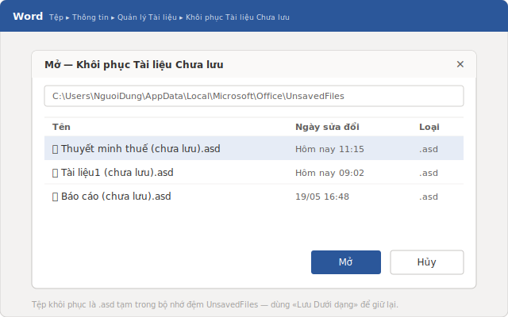
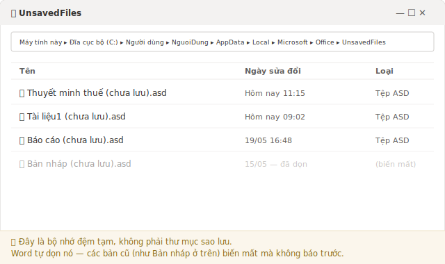
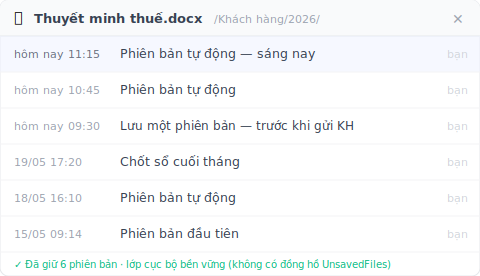

> Word tắt trước khi bạn kịp lưu? Mở lại Word và nhìn vào ngăn **Phục hồi Tài liệu** bên trái trước tiên. Nhưng nếu thứ bạn mất là cả buổi sáng làm việc trên một file vốn đã có sẵn, thì đó là một vấn đề hoàn toàn khác — và phần lớn các bài hướng dẫn gộp chung hai chuyện này làm một.

11 giờ 15, thứ Ba. Trong một văn phòng kế toán nhỏ, bạn đang gấp rút hoàn thiện bảng thuyết minh cho tờ khai thuế phải nộp trước 12 giờ trưa. File này chưa từng được lưu — nó là một bản nháp mở từ sáng sớm tới giờ. Word bỗng đơ lại, cửa sổ chuyển xám, rồi tất cả biến mất. Hoặc tệ hơn: một hộp thoại hỏi bạn có muốn lưu không, và theo phản xạ, bạn bấm "Không Lưu". Ba tiếng đồng hồ, bay sạch. *[ví dụ minh họa]*

Tin tốt: trong hầu hết trường hợp, Word vẫn giữ một bản sao đâu đó. Tin xấu: cái cửa sổ mà người ta hay dùng để phục hồi lại trộn lẫn hai tình huống rất khác nhau. Hãy xem trước tiên thao tác cứu file, rồi đến điểm phân biệt mà gần như không ai nói rõ.

## 5 phút đầu tiên: thao tác lấy lại file chưa từng được lưu

Đừng động vào thứ gì khác. Mở lại Word.

Nếu Word vừa đóng đột ngột, nó thường hiện một ngăn **Phục hồi Tài liệu** ở bên trái, kèm danh sách các bản có ghi mốc thời gian. Đây là đường ngắn nhất: tìm dòng khớp với lần chỉnh sửa gần nhất của bạn, mở nó ra, rồi **lưu lại ngay lập tức** dưới dạng `.docx` vào một thư mục thật. Ngăn này không hiện mãi đâu.

Nếu nó không hiện, hãy đi theo đường menu:

**Tệp** > **Thông tin** > **Quản lý Tài liệu** > **Khôi phục Tài liệu Chưa lưu**

Word sẽ mở một thư mục chứa các bản sao tạm. Mở bản có giờ khớp với phiên làm việc gần nhất, kiểm tra lại nội dung, rồi lưu ngay với một cái tên thật, ở một chỗ thật. Đây đúng là thao tác mà Microsoft khuyến nghị cho tình huống này.

Nếu vẫn không thấy gì, còn một **phương án dự phòng**: bấm nút **Start**, gõ `.asd` rồi nhấn Enter. Nếu có file `.asd` hiện ra, mở Word rồi vào **Tệp** > **Mở** > **Duyệt**, chọn **Tất cả Tệp** ở danh sách kiểu file (nằm bên phải ô "Tên tệp"), và mở file `.asd` đó. Đây là file gốc của Tự Phục hồi — nó thường chứa đúng thứ bạn đang tìm.

## Word cất file chưa lưu ở đâu (và vì sao chúng tự biến mất)

Trên Windows, các bản sao tạm này nằm trong một thư mục ẩn:

`%LocalAppData%\Microsoft\Office\UnsavedFiles`

Đó chính là các file `.asd`. Bạn có thể dán đường dẫn này thẳng vào thanh địa chỉ của File Explorer để vào luôn.

Nhưng cẩn thận: **thư mục này không phải két sắt.** Nó là một bộ nhớ đệm dự phòng, và Word tự dọn nó theo nhịp riêng của Word, không hề báo trước một câu. Sau một lần khởi động lại máy, hoặc khi một công việc mới hơn chiếm chỗ, các bản cũ sẽ biến mất. Trên các diễn đàn, đôi khi bạn sẽ đọc thấy con số Word giữ file "vài ngày" — Microsoft không cam kết con số đó ở bất kỳ đâu. Hãy coi nó như tin đồn, đừng coi như quy tắc.

Quy tắc duy nhất đáng tin gói gọn trong một câu: **tìm được bản đúng thì lưu ngay.** Không phải sau ly cà phê. Ngay lúc đó.

## "Tôi chưa lưu" thật ra là HAI vấn đề khác nhau

Đây là điều mà không bài hướng dẫn nào nói rõ ràng. Đằng sau cụm "lấy lại file Word", có hai tình huống gần như chẳng liên quan gì đến nhau.

**Trường hợp A — file chưa từng được lưu.** Bạn đang gõ trên một tài liệu mới, Word treo hoặc bạn lỡ bấm "Không Lưu" trước cả lần lưu đầu tiên. Trên ổ đĩa không hề tồn tại một file nào. Bộ nhớ đệm file chưa lưu (mục **Khôi phục Tài liệu Chưa lưu**) là hy vọng chính đáng duy nhất của bạn — và nó sinh ra đúng là để làm việc đó. Mọi thứ chúng ta vừa xem ở trên đều áp dụng cho trường hợp này.

**Trường hợp B — file đã tồn tại từ trước, và bạn mất công việc của buổi sáng.** Báo cáo đã nằm trên ổ đĩa từ mấy tuần nay. Sáng nay, bạn vô tình lưu đè lên nó, hoặc xóa mất một đoạn rồi lưu chồng lên. Bạn muốn quay về bản lúc 11 giờ 15. File thì vẫn còn nguyên — chỉ vài tiếng gần nhất là biến mất.

Và đây là cái bẫy: bộ nhớ đệm file chưa lưu **gần như không bao giờ giúp được bạn ở trường hợp này.** Nó chỉ liệt kê những file chưa từng được lưu lần nào. Còn báo cáo của bạn thì đã được lưu cả trăm lần rồi. Windows có sẵn một đường đi — chuột phải vào file > **Thuộc tính** > tab **Phiên bản Trước** — nhưng nó chỉ trả về kết quả nếu **Lịch sử Tệp** của Windows đã được **bật từ trước khi** sự cố xảy ra. Còn trên máy của một văn phòng kế toán hay văn phòng luật không có bộ phận IT riêng, gần như nó chẳng bao giờ được bật. Một khi đã bật, Windows mới bắt đầu theo dõi file của bạn liên tục; nhưng nếu trước đó chưa bật, thì đơn giản là không có bản nào để khôi phục cả.

## Lấy lại bản của sáng nay khi file vẫn còn tồn tại bằng cách nào?

Đây là câu hỏi của Trường hợp B, và đây mới là chỗ ăn thua. Nếu bạn đợi đến lúc đã mất việc mới đi tìm xem Word giấu nó ở đâu, thì bạn đang trông cậy vào một bộ nhớ đệm gần như chưa bao giờ giữ đúng bản đó.

Cách làm ngược lại là không để may rủi quyết định nữa: chụp ảnh định kỳ cả một **thư mục**, thay vì hy vọng Word tình cờ giữ đúng khoảnh khắc bạn cần. Đó chính là việc [Keeply](https://keeply.work) làm. Bạn chỉ định cho nó một thư mục — trên máy tính của bạn hoặc trên ổ đĩa mạng của công ty — và nó giữ lại các phiên bản của thư mục đó ở chế độ nền, theo nhịp do **chính bạn** đặt: cứ mỗi 15, 30 hay 60 phút, mặc định là 30.

Keeply chạy theo nhịp riêng của nó. Nó không kích hoạt khi bạn bấm Ctrl+S và không "nghe" từng lần lưu của bạn: nó đi theo đồng hồ của chính nó, lặng lẽ ở chế độ nền. Bên cạnh đó, một nút **"Lưu một phiên bản"** cho phép bạn tự tay đánh dấu một mốc kèm một dòng ghi chú — ví dụ "trước khi gửi khách hàng". Còn buổi sáng đã mất? Bạn mở dòng thời gian của file ra và chọn bản lúc 11 giờ 15.

Bên dưới lớp vỏ, Keeply dựa trên một engine Git: mỗi phiên bản được giữ lại đều bị "đông cứng", không bao giờ bị ghi đè hay hỏng. Nhưng đó chỉ là chuyện máy móc bên trong. Bạn không bao giờ phải gõ một câu lệnh nào, và bạn cũng chẳng cần biết Git là gì mới dùng được nó.

## Những chỗ Keeply không giúp được bạn (nói thật)

Không công cụ nào lo được hết mọi thứ. Có ba trường hợp Keeply chẳng làm gì được cho bạn, và bạn nên biết trước:

- **File mới tinh, chưa từng được lưu vào một thư mục đang được theo dõi.** Đây là Trường hợp A thuần túy. Nếu tài liệu chưa bao giờ chạm vào thư mục mà Keeply quan sát, thì không hề có dấu vết nào của nó. Ở đây, bộ nhớ đệm của Word vẫn là con đường duy nhất.
- **File hỏng âm thầm.** Nếu file đã bị hỏng ngay tại thời điểm được giữ phiên bản, Keeply sẽ giữ lại trung thành… đúng cái bản hỏng đó. Giữ phiên bản không phải là sửa file.
- **File nằm ngoài thư mục đang theo dõi.** Một tài liệu lưu vội ra USB mà chưa bao giờ thêm vào Keeply thì không có lịch sử nào hết. Nó chỉ bảo vệ những gì bạn đã giao cho nó.

## Khi nào công cụ sẵn có của Word là đã đủ

Không cần đại bác để bắn một bản nháp dùng một lần. Và đúng là trong nhiều tình huống, Word cùng hệ sinh thái của nó làm việc rất tốt.

Nếu file của bạn nằm trên **OneDrive** hoặc **SharePoint** và đã bật **Lưu Tự động**, thì phần cốt lõi đã được lo: việc lưu lên đám mây diễn ra liên tục và có sẵn lịch sử phiên bản. Đó là một lớp bảo vệ chắc chắn, nhưng kèm ba điều cần lưu ý: file phải thật sự nằm trong thư mục đồng bộ với đám mây; lịch sử phiên bản có giới hạn theo thời gian; và việc lưu sẽ ghi đè lên bản trước mà không hỏi lại bạn. Nói cách khác, lớp bảo vệ này chỉ có giá trị với những file thật sự được cất trên đám mây.

Còn với phần còn lại, thứ cơ bản cần chỉnh một lần cho xong là **Tự Phục hồi** — cơ chế tự ghi ra các file `.asd` theo từng khoảng thời gian đều đặn. Hãy vào **Tệp** > **Tùy chọn** > **Lưu** và giảm giá trị ở ô "lưu thông tin tự phục hồi sau mỗi…". Microsoft khuyến nghị để tính năng này luôn bật và đặt khoảng thời gian xuống còn **năm phút hoặc ít hơn** với những văn phòng không thể chấp nhận mất việc.

Nhưng đừng quên ranh giới: với rất nhiều người làm tự do, kế toán viên hay luật sư làm việc trên một máy tính cá nhân hoặc một ổ đĩa mạng của công ty — không có bộ phận IT để bật Lịch sử Tệp — lớp bảo vệ đám mây kia chẳng bao giờ vào cuộc. Và đó đúng là chỗ mà một lớp phiên bản bền bỉ phát huy hết giá trị.

## Câu hỏi thường gặp

**Windows lưu file Word chưa lưu ở đâu?**
Trong một thư mục ẩn: `%LocalAppData%\Microsoft\Office\UnsavedFiles`, dưới dạng các file `.asd`. Bạn có thể dán đường dẫn này vào thanh địa chỉ của File Explorer, hoặc vào **Tệp** > **Thông tin** > **Quản lý Tài liệu** > **Khôi phục Tài liệu Chưa lưu** trong Word.

**Word giữ một file chưa lưu trong bao lâu?**
Không có thời hạn nào được cam kết. Bộ nhớ đệm file chưa lưu được Word tự dọn theo nhịp riêng, không báo trước: một lần khởi động lại máy hoặc một công việc mới hơn đều có thể xóa các bản cũ. Con số "vài ngày" lưu truyền trên các diễn đàn không được trang chính thức nào của Microsoft bảo đảm. Tìm được bản đúng thì lưu ngay, đừng chần chừ.

**Tự Phục hồi (AutoRecover) dùng để làm gì và nên đặt khoảng thời gian bao nhiêu?**
Đó là tính năng tự động ghi ra một file `.asd` theo từng khoảng thời gian đều đặn. Bạn chỉnh nó ở **Tệp** > **Tùy chọn** > **Lưu**. Microsoft khuyến nghị để nó luôn bật và đặt khoảng thời gian xuống còn năm phút hoặc ít hơn.

**Tôi lỡ lưu đè file sáng nay và muốn lấy lại bản lúc 11 giờ 15. Tự Phục hồi có giúp được không?**
Hiếm khi. Bộ nhớ đệm file chưa lưu chỉ liệt kê những file chưa bao giờ được lưu; còn file của bạn thì đã được lưu rồi. Đường đi sẵn có là chuột phải > **Thuộc tính** > **Phiên bản Trước**, nhưng nó chỉ chạy nếu Lịch sử Tệp của Windows đã được bật từ trước khi sự cố xảy ra. Để có một đường quay lui đáng tin mà không phụ thuộc vào điều kiện đó, bạn cần một lớp phiên bản chụp ảnh thư mục theo từng khoảng thời gian đều đặn, như [Keeply](https://keeply.work): bạn mở dòng thời gian ra và chọn đúng bản lúc 11 giờ 15.

**Keeply có thay thế Tự Phục hồi của Word không?**
Không, hai thứ này lo hai nhu cầu khác nhau. Tự Phục hồi cứu một tài liệu mà bạn chưa từng lưu sau khi Word treo — đó là Trường hợp A. Keeply giải quyết Trường hợp B: lấy lại một phiên bản cụ thể của một file vốn đã tồn tại, mà không phải đặt cược vào một bộ nhớ đệm có lẽ chưa bao giờ giữ nó. Trên một máy tính cá nhân hay một ổ đĩa mạng, hai thứ này bổ trợ cho nhau.

## Tìm hiểu thêm

- [Keeply](https://keeply.work) — một lớp phiên bản tự chụp ảnh các thư mục của bạn ở chế độ nền, trên máy tính cá nhân hoặc ổ đĩa mạng, và cho phép bạn mở lại bất kỳ phiên bản nào qua dòng thời gian của nó.
- [Cách khôi phục tài liệu Word chưa lưu — Microsoft Learn](https://learn.microsoft.com/en-us/troubleshoot/microsoft-365-apps/word/recover-lost-unsaved-corrupted-document) — trang chính thức của Microsoft, có đầy đủ đường menu và khuyến nghị về khoảng thời gian Tự Phục hồi (năm phút hoặc ít hơn).
- [Khôi phục các tệp Microsoft 365 của bạn — Microsoft Support (tiếng Việt)](https://support.microsoft.com/vi-vn/office/recover-your-microsoft-365-files-dc901de2-acae-47f2-9175-fb5a91e9b3c8) — trang hỗ trợ tiếng Việt mô tả ngăn Phục hồi Tài liệu và tính năng Lưu Tự động.

*Tác giả: Ting-Wei Tsao, nhà sáng lập Keeply, [LinkedIn](https://www.linkedin.com/in/ting-wei-tsao-b57480152)*
