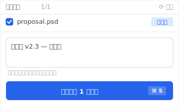
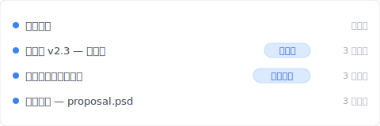
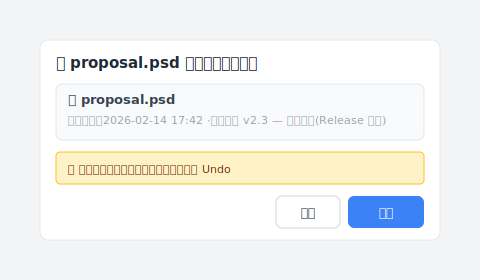

# 【2026 文件管理】3-2-1 备份原则：20 年了还够用吗？空间冗余救硬盘、不救自己覆盖的版本

> 3-2-1 规则 20 年没变。但你今天怕的事跟 2005 年不一样了。

2005 年，摄影师 **Peter Krogh** 为自己订下备份规则：3 份文件、2 种媒介、1 份异地。他防的是磁带腐坏、硬盘摔到地上、机房失火。

20 年后的你，怕的是**自己覆盖了不该盖的版本**。或同事在共享文件夹改错。或客户 3 个月后打来要当初签的那版。

3-2-1 规则没变过。但你的痛点换了——而 3-2-1 从设计就没处理新痛点那层。这篇拆完 3-2-1 防什么、不防什么，然后让你看 [Keeply](https://keeply.work) 怎么把 3-2-1 + 版本历史一个工具一起做。

## 重点

**3-2-1 备份原则**是必要的：[三份文件、两种媒介、一份异地](https://www.cisa.gov/audiences/small-and-medium-businesses/secure-your-business/back-up-business-data)（CISA 至今仍以此为标准备份建议），防的是硬盘损毁、机房失火这类灾难。但它从设计就没处理**操作失误**：你自己覆盖、同事改错、云端同步把错的版本传到三个位置，3-2-1 都救不了。本文拆解 3-2-1 防什么、不防什么，以及 Keeply 怎么把那一层补上。

## 本文目录

1. [Peter Krogh 的 3-2-1 备份原则：3 份文件、2 种媒介、1 份异地](#3-2-1-规则到底在说什么)
2. [3-2-1 备份原则防什么、不防什么？硬盘坏防得到、自己覆盖防不到](#3-2-1-防什么不防什么)
3. [做了 3-2-1 还是丢档的 1 个原因：「3 份」是空间冗余、不是时间冗余](#为什么你做了-3-2-1-还是丢档)
4. [Keeply 怎么把 3-2-1 + 版本历史 + 发行版冻结一个工具做完](#3-2-1--版本历史能不能一套搞定)
5. [不必加 Keeply 或类似工具的 3 种情境](#when-not-needed)
6. [常见问题](#常见问题)

---

## Peter Krogh 的 3-2-1 备份原则：3 份文件、2 种媒介、1 份异地 {#3-2-1-规则到底在说什么}

3-2-1 是 Peter Krogh 在 2005 年[《The DAM Book》](https://www.oreilly.com/library/view/the-dam-book/9780596008550/)（O'Reilly Media）订下的备份规则：

- **3 份**文件：原档加 2 份备份
- **2 种**存储媒介：例如本机硬盘加云端，或 NAS 加外接 SSD
- **1 份**存放异地（其中一份放在物理上不同地点）

当时主流媒介是磁带、CD/DVD、机械硬盘，物理损毁率高、媒介老化快。3-2-1 的设计目的很清楚：让任何单一硬件故障、媒介老化、机房灾难都救不死你的文件。

20 年后硬件可靠多了。但 3-2-1 救的还是同一种事——「文件不见」。下面这个剧本，3-2-1 没在它的设计范围内。

## 3-2-1 备份原则防什么、不防什么？硬盘坏防得到、自己覆盖防不到 {#3-2-1-防什么不防什么}

3-2-1 能防的是硬盘损毁、机房失火、勒索软件加密——所有让文件「不见」的情况。它不防的是文件还在、但内容变错了——你自己覆盖掉版本、同事改错共享文件夹、想找 3 个月前那一版翻不到。

要看 3-2-1 守不守得住，先看「会丢档」的剧本长什么样。

| 场景 | 3-2-1 救得了吗？ | 为什么 |
| --- | :---: | --- |
| 硬盘摔坏 | ✅ | 3 份备份在不同媒介 |
| 机房失火 | ✅ | 1 份在异地 |
| 勒索软件加密 | ✅（异地份未中招） | 异地隔离 |
| **你自己覆盖掉版本** | ❌ | 3 份都会被同步成新版 |
| **同事改错共享文件夹** | ❌ | 同上 |
| **找 3 个月前的旧版** | ❌ | 3-2-1 不是版本历史 |

对啊，这就是让人烦的地方。3-2-1 防的是「文件不见了」。它没处理「文件还在但变错了」。

A 先生是设计师。周一早上 10:32，客户打电话来要 3 个月前签好的提案版本。他打开 NAS，看见 12 个文件——`proposal.psd`、`proposal_v2.psd`、`proposal_FINAL.psd`、`proposal_FINAL_FINAL.psd`...3 个位置的云端备份每份都是现在最新的。

但他不要最新。他要 3 个月前那一版。

3-2-1 把错的最新版尽责地保护了 3 份。

## 做了 3-2-1 还是丢档的 1 个原因：「3 份」是空间冗余、不是时间冗余 {#为什么你做了-3-2-1-还是丢档}

这里要拆一个 20 年没人明讲的盲点：**「3 份备份」的「3」是空间冗余、不是时间冗余**。

2005 年硬盘寿命短、媒介易坏，多放几份是为了对抗物理损毁。这时候「3」是合理解。

2026 年硬盘可靠、云端实时同步，「3」变成了什么？**变成同一个错误被实时复制到 3 个位置**。

A 先生上礼拜的痛就是这个：他在 NAS 上打开 `proposal.psd` 改图，按了保存。Dropbox 自动同步、Backblaze 也同步、外接硬盘下班前 Time Machine 跑一次。3 个位置 5 分钟内全变成那个被他改错的版本。

他原本要找的那一版——客户 3 个月前说 OK 的——没有任何一个位置留着。3-2-1 把错的版本保护了 3 份、把对的那版盖掉了 3 次。

问题不是 3-2-1 做错了。问题是它从设计就没「时间」这个维度。它只有「空间」。

## Keeply 怎么把 3-2-1 + 版本历史 + 发行版冻结一个工具做完 {#3-2-1--版本历史能不能一套搞定}

A 先生最后怎么解的？他换成 [Keeply](https://keeply.work)。

装完之后 3 件事自然落在一个工具里：

本机在他电脑上、Keeply 自动把每个变更同步到 NAS 上的正本、再从正本同步到他选的另一个备援位置（家里那颗外接硬盘、或一个云端 bucket）。3-2-1 那 3 个点他不用各别设定备份计划——版本走到哪一个位置都有自己的时间轴。

更重要的是「时间」这层也补上了。每 30 分钟背景自动存一次、加上他重要时刻可以点「保存版本」。

2 月 14 日业主签约那天、A 先生改完最后一版、点 Keeply 主窗口的「保存版本」按钮、跳出这个对话框：

写了「给客户 v2.3 — 签约版」这行笔记、保存版本。3 个月后客户打来要某一版、他翻时间轴：

「给客户 v2.3 — 签约版」那一行自己一行、有他写的笔记。点开就是 3 个月前客户看的那一版。不用翻 12 个 `_FINAL` 文件猜哪个是哪个。点下去 Keeply 跳出还原确认：

点「还原」之前 Keeply 会自动把当前版本另外存成一份新快照——所以即使他点错版本、也能立刻 Undo 回去。这层「还原也是版本化」的设计、让他不用紧张地多按几次确认。3-2-1 那 3 个位置任何一个都能当还原来源、选哪个都一样。

而且 Keeply 还有一层「发行版」冻结机制——当他在 2 月 14 日点「保存版本」标成「给客户 v2.3 — 签约版」的时候，那一版会被冻结成一个独立的快照，不被后续他自己的保存覆盖。3 个月后就算他盖掉了工作版，发行版那个快照还在原地。

3 件事一个工具：

- **空间冗余**：本机 + 正本 + 备援（Keeply 内建 3-2-1 位置层）
- **时间冗余**：版本历史（手动保存＋可选自动）、可以写笔记
- **发行版冻结**：重要版本标成「给客户 v2.3」、永远不被覆盖

「异地」原则仍然要 A 先生自己决定——如果他把本机跟备援都放在同一个办公室，火灾一起烧，任何工具救不了。但他不需要两个工具：一个管空间冗余、一个管时间冗余。一套 [Keeply](https://keeply.work)、从本机到备援、从这秒到上周的某次发行版、都看得见、找得回。

## 不必加 Keeply 或类似工具的 3 种情境 {#when-not-needed}

几种情况确实不需要：

**你的文件没有版本意义**。家里的照片、手机备份、家庭影片——这些只需要 3-2-1 空间冗余（云端 + 外接 + NAS）就够了，没有「3 个月前那版」的需求。

**你在公司 IT 管控的环境**。IT 用 Veeam、Acronis、Backblaze for Business 或别的集中备份系统——这层通常已经做了 3-2-1。加 Keeply 是个人工作流的补强、先去问 IT 规范。

**法规合规场景需要不可变存档**。SOX、HIPAA、GDPR 这种需要不可变封存（immutable archive）的场景要用 Veeam、Acronis、行业专属封存软件——这些工具有审计链、加密、保留期管理。Keeply 是日常工作版本管理、不是合规工具。

## 常见问题 {#常见问题}

**Q1: 3-2-1 规则和 4-2-1-1-0 规则的区别？**

4-2-1-1-0 是 3-2-1 的延伸：多 1 份不可变备份、加上 0 个错误验证。本质仍是空间冗余、**不解版本历史问题**。

**Q2: 云端备份算 3-2-1 的「异地」吗？**

算。但 iCloud、OneDrive、Google Drive 是同步不是备份——你删除或覆盖会实时同步到云端，**不防操作失误**。详见 [Keeply 跟备份、云端工具有什么不一样](/zh-cn/post/what-keeply-saves-vs-backup-cloud/)。

**Q3: NAS 算 2 种媒介吗？**

NAS 加本机硬盘可算 2 种媒介。但 **RAID 不算备份**——RAID 防的是硬盘坏掉、不防你自己删错。

**Q4: Keeply 已经是 3-2-1 吗？**

是。Keeply 把 3-2-1 内建为位置层（本机工作副本 + 正本 + 备援位置），加上版本历史和「发行版」冻结功能（把某一版标成里程碑、不被后续保存覆盖）。一套工具同时做三层。

**Q5: 个人工作者也需要 3-2-1 吗？**

看你的文件重要性。丢了会痛就需要。判断标准是「丢了会不会痛」、跟个人或企业无关。

## 延伸阅读

主篇 [文件版本管理完整指南](/zh-cn/post/file-version-management-complete-guide/) 拆解 4 个结构性原因——为什么工具就是没设计给你这件事。

对照阅读：[Keeply 跟备份、云端工具有什么不一样](/zh-cn/post/what-keeply-saves-vs-backup-cloud/) — 三件不同事的完整对照。

Windows 版的同类拆解：[你以为自己有备份，但「备份」在 Windows 里有 3 种意思](/zh-cn/post/windows-file-history-vs-backup/)。

---

2005 年的 Peter Krogh 订下 3-2-1 时、他防的是手上会掉的硬盘。

你不是 2005 年的 Peter Krogh。你怕的是「上礼拜那版我盖掉了」、是「3 个月前客户说 OK 的那版找不到了」。

你不需要两个工具。一个管空间冗余、一个管时间冗余。一套 [Keeply](https://keeply.work) 同时做三层。

---

> 关于作者：Ting-Wei Tsao，[Keeply](https://keeply.work) 创办人。
> [LinkedIn](https://www.linkedin.com/in/ting-wei-tsao-b57480152/)
