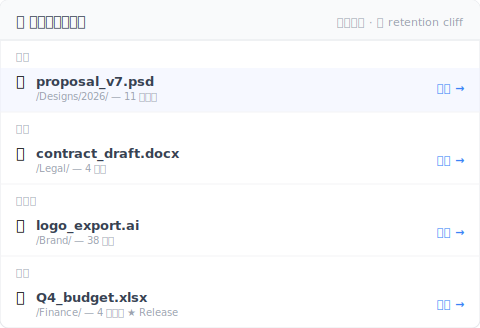

# 【2026 文件管理】比 iCloud 跟 Dropbox 之前先看:4 家云端共通的版本历史天花板

> 容量跟价格是错的维度。Retention 才是所有比较文停止有用的地方。

周五下午 4:23,客户 email 来:「上次提案的 v3 版能找出来吗?是两个月前那次,改价格前那版。」

你打开 Dropbox。版本历史只到 30 天前。客户要的版本在 60 天深处。

没了。

这不是某一家云端的问题。这是 4 家云端共通的问题,比较文从没告诉你过。

## 比较文从没列给你看的那张版本历史表

容量、分享、月费——这是每篇「iCloud vs Dropbox vs OneDrive vs Google Drive」比较文的落点。没人把 retention 规则并排放出来。我们放这里:

| 云端 | 通用档版本历史 | Retention 形状 | 实际 上限 |
|---|---|---|---|
| **iCloud Drive** | ❌ 对非 Apple 档不暴露 | 只有「最近删除」文件夹 | 删除恢复 30 天;PSD / Word / PDF 没版本历史界面 |
| **Dropbox** | ✅ 有 | 时间制 | [30 天(Basic / Plus / Family)/ 180 天(Pro / Business)/ 365 天(Enterprise)](https://help.dropbox.com/files-folders/restore-delete/version-history-overview) |
| **OneDrive** | ✅ 有 | 计数制 + 删除窗口 | [保留 500 主要版本](https://learn.microsoft.com/en-us/sharepoint/document-library-version-history-limits);回收站 personal 30 天 / business 93 天 |
| **Google Drive**(非原生档) | ✅ 有 | 时间 + 计数(先触发者赢) | [30 天 OR 100 versions](https://support.google.com/drive/answer/2409045),除非你按「Keep forever」 |

盯着这张表看十秒。4 家形状根本不一样。你想 apple-to-apple 比都比不了。

## 3 种不同的「retention」机制,1 个共通盲点

3 家有 expose 版本历史的云端各自用完全不同的 上限。

**时间制(Dropbox)**——你拿到一个窗口。30 / 180 / 365 天。窗口外的版本不管有几个都消失。两个月前动一次的文件,跟两个月前动五十次的文件,下场一样:都没了。

**计数制(OneDrive)**——你拿到的是 slot 数。保留 500 主要版本。超过 500,最旧的版本被删腾空间给新的。可能是两年累积 500 个版本,也可能是一周内就改了 500 次,1 月看过的那版 2 月就消失。

**混合制(Google Drive)**——先触发者赢。30 天 OR 100 versions。闲置的 PSD 可能在 30 天时只有 15 个版本就消失历史;密集改的文档可能两周内就到 100 版本上限。Google 提供「Keep forever」per-version override——但你要在保存当下就记得按。

**第四家 iCloud Drive**——是完全不同的问题:**通用档没有版本历史界面**。Pages、Numbers、Keynote 有原生版本浏览器(Apple 从 macOS 文档架构继承的)。Word、PSD、PDF,iCloud Drive 里的其他任何东西:只同步最新版本,旧版本不保留。Apple 从没对非 Apple 档类型公布过明确的 retention 政策,因为根本没有政策可公布。

4 家共通的盲点:**每家都有 上限。Cap 形状不一样。比较文从没告诉你哪个形状符合你的工作。**

## 为什么比较文不写 retention?

Retention 在规格表上很难呈现。

容量是一个数字:GB。价格是一个数字:每月 $X。分享 UX 是一张截图。

Retention 是一棵条件树:方案层级、文件类型、版本数、流逝时间、像「Keep forever」这种手动 override。所以测评站跳过——不合规格表格式。

这是买家的盲点:用比较文买云端 retention,跟只看后备箱尺寸买车一样。你会买到后备箱,但不会买到对的车。

你真正需要的那版,没有定价进比较表。你真正需要的那版,会在你已经选好之后两个月才出现。

## 不在云端 feature 内的那层版本历史

Reframe 一下:你不换云端就能解这个问题。你的云端做同步没问题。少的那一块是**另一层**——文件层级的版本历史,无时间 上限、每次保存自动触发。

具体说:

- **云端(4 家任一)**负责同步 + 异地副本
- **版本历史层(Keeply 或同类)**负责每次保存,无时间 上限、无计数 上限、不需要在保存当下决定要不要「Keep forever」

你不是要取代 Dropbox 或 iCloud。你是叠一层原本云端没设计成的东西上去。

[Keeply](https://keeply.work) 跟 iCloud Drive、Dropbox、OneDrive、Google Drive、Synology / QNAP NAS、纯 Finder 文件夹都能搭配——你不换系统,是加一层在原本系统上面。

Keeply 是这层的 reference 实现:每次保存本地保留,无时间 上限、无计数 上限,加上「Release」冻结机制——把某个版本标成「这版送给客户」,那个 快照 永远存在,后续保存五十次也盖不掉。两个月前的版本,回溯约 2 个点击。

```
Keeply 时间轴 — proposal.psd
────────────────────────────────
● 2026-05-12 14:23   (当前)
● 2026-04-15 09:11   ◀ 27 天前
● 2026-03-08 17:42   ◀ 65 天前  ★ Release:client-signoff
● 2026-02-14 11:30
```

65 天前那版上面的 Release 标记表示它过了 OneDrive 500 版本 上限、过了 Dropbox 30 天窗口、过了 Google Drive 100 版本计数,还是能拉回来——因为 Keeply 不像云端那样套 上限。

删除也是同样逻辑。云端的 30 天回收站到了就清空，但 Keeply 的「最近删除」面板没有那道时钟——本机保留：



「上个月」那条 38 天前删的 `logo_export.ai`、云端 30 天窗口早过了——Dropbox 给你 410 Gone、OneDrive 给你 410 Gone。Keeply 面板里还在、点还原就回来。「更早」那条 Q4 budget 是 4 个月前删的 Release 冻结版、任何云端 retention 都救不回、Keeply 一样留着。

## 这篇文章不够用的场景

这篇不解所有 retention 场景。三个边界要讲清楚:

**只是删除恢复,不是深度历史**:如果你担心的是「我不小心删了一个文件」,每家云端的 30 天回收站就够。你不需要这篇文章描述的那层。

**法规等级的不可变存档(GDPR / SOX / HIPAA)**:版本历史不是 immutable archive。如果合规要求「原始档不可被修改」,你需要正规的存档工具——Veeam、Acronis 或你产业认证的供应商。Keeply 与同类工具是工作中版本层,不是存档系统。

**Cloud-native 个人接案(Pages / Numbers / Sheets)**:如果你的工作全在 Apple 原生格式或 Google 原生 Docs / Sheets,内建版本历史可能够你用。代价是文件类型 lock-in——你不能直接在 Word 开 Pages 档,要转档。对某些人值得,对某些人不值得。

## 延伸阅读

主篇 [文件版本管理完整指南](/zh-cn/post/file-version-management-complete-guide/) 拆解 4 个结构性原因——为什么工具就是没设计给你这件事。

[3-2-1 备份原则](/zh-cn/post/3-2-1-backup-rule/) 讲空间冗余那一半——3 份文件、2 种媒介、1 份异地。这篇是时间冗余的另一半:怎么让文件在时间里保持可拉回。

[Keeply 到底存什么?跟备份、云端工具有什么不一样](/zh-cn/post/what-keeply-saves-vs-backup-cloud/) 把 Keeply 跟备份工具跟云端存储当成 3 个不同层而不是 3 个竞争产品来比。

---

比较文的 framing 把你卡在循环里:更大容量、更好分享、更多功能。真正会坏掉的那件事——60 天前那版——从来没出现在规格表上。

挑符合你分享需求跟价格的云端。然后加上那一层补天花板的工具。

两个月后客户来问,答案是「有,我找一下」——不是「等等,咦,没了」。

---

> 关于作者:Ting-Wei Tsao,Keeply 创办人。
> [LinkedIn](https://www.linkedin.com/in/ting-wei-tsao-b57480152/)
