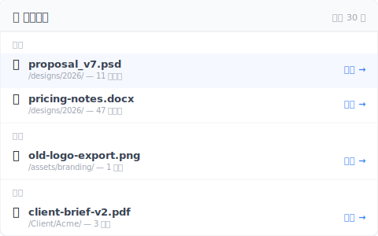

# 【2026 文件管理】你不需要救援软体，你需要一份「最近删除」清单

> iOS 会显示你删了什么，Finder 不会。这个 UX 模式偏偏缺在你最需要的工具里。

周三上午 11:14，你按下 Delete，本以为删掉的是错的重复档。两分钟后，发现删错了——删到的是正确版本。

打开废纸篓。空的。上周五清过了。

Google「Mac 救回删除的文件」。第一个结果：Disk Drill，$89 美金一次性，需要对你的 SSD 做鉴识扫描。你已经在 Google「SSD 上跑鉴识恢复会不会伤硬盘」。

你不需要鉴识工具。你需要一份清单。

## 已经做这件事的工具，跟没做的工具

iOS 照片有「最近删除」相册。iCloud Drive 有。备忘录有。Outlook 有「恢复已删除项目」。Gmail 有 30 天废纸篓。连 Slack 都保留删除讯息 90 天让管理员可以还原。

然后是表格下半部——你真正在工作的地方。

| 工具 | 「最近删除」清单？ |
|---|---|
| iOS 照片 | ✅ 30 天相册 |
| iCloud Drive | ✅ 「最近删除」文件夹 |
| 备忘录（iOS / macOS） | ✅ 30 天文件夹 |
| Outlook | ✅ 恢复已删除项目 |
| Gmail | ✅ 30 天废纸篓 |
| Slack | ✅ 90 天管理员还原 |
| **macOS Finder** | ⚠️ 废纸篓 30 天，但没有文件夹层级的清单 |
| **Windows 文件资源管理器** | ⚠️ 只有回收站，清空后就没了 |
| **Dropbox 本机文件夹** | ❌ 删除的文件直接从本机画面消失 |
| **Google Drive 本机同步** | ❌ 跟 Dropbox 一样 |
| **一般版本控制工具** | ❌ 要去「浏览历史」找 |

下半部的工具，刚好就是你日常保存真实工作的地方。上半部的工具，反而是没有这个功能也还可以的。

## 为什么这个模式偏偏缺在你最需要的地方？

「最近删除」这个 affordance 出现在**有 curated 内容模型**的 app 里（照片、备忘录、email）。它缺席在把文件视为「透明文件系统镜像」的工具里。

**Curated app**（iOS 照片、Outlook、备忘录）：你不是在「管理文件」，是在「跟内容互动」。「最近删除」是内容管理的基本元件——心智模型本来就要这个，设计师当然会做。

**文件系统镜像**（Finder、文件资源管理器、Dropbox 本机同步）：这些工具是为了**透明反映磁盘内容**设计的。加一个「最近删除」面板会违反这个透明契约——文件不在磁盘上了，为什么文件夹还显示？

这份透明的代价：你只继承到 OS 层的废纸篓 / 回收站。清空后，文件在所有地方看起来都消失了——即使版本控制或云端同步其实还有一份。恢复路径变成「打开时间轴 → 找到那天 → 找到文件 → 还原」，摩擦大、容易跳过、容易默认跑去用鉴识软体。

于是你来到了 Disk Drill 的订价页面——不是因为鉴识恢复是对的工具，是因为对的工具（那份清单）没被工具呈现出来。

## UI 没呈现的那条 30 秒恢复路径

工具有「最近删除」清单时，恢复大约 5 秒。没有时，恢复是 5 分钟的时间轴翻找，或 $89 美金加 2 小时的鉴识扫描——而且 SSD 上不一定救得到。

这个模式做得好的工具长什么样：

- **放在最上层**——sidebar 入口或主 tab，不是埋在 3 个点击之后
- **按时间分组**——「今天 / 昨天 / 本周 / 更早」，不是 200 笔删除的扁平清单
- **显示原始路径**——这个文件从哪个文件夹删的？这对确认「对，就是这个」很关键
- **一键还原**——不用选版本、不用 3 步「你确定吗」精灵。点下去 → 还原到原始路径
- **不需要鉴识**——这是从你自己有意保存的存档历史中救回，不是从磁区层救

[Keeply](https://keeply.work) 把这个做成「🗑️ 删除清单」面板：你加进去的项目内，过去 30 天删除的文件清单、按时间分组、一键还原到原始文件夹。还原这个动作本身会建立一个新存档点——所以连 undo 都会被版本化，你可以再 undo 一次。

不是鉴识工具，是一份有还原按钮的清单。

可以放在你加进 Keeply 的任何文件夹里运作——你的 Dropbox 本机文件夹、iCloud Drive 文件夹、Synology NAS 上的项目目录、笔电上的纯文件夹。你不换系统，是叠一层清单上去。

## 这份清单不够用的场景

这个模式不解所有删除场景。三个边界要讲清楚：

**你 6 个月前清过废纸篓且当时没在跑版本控制**：这篇文章描述的模式不适用——你真的进入鉴识恢复领域了。Disk Drill 或 Recuva 可能有用，但 [文件恢复软体不一定救得到](/zh-cn/post/restore-without-panic/) 解释为什么这类工具经常也失败（SSD TRIM 是简短版）。

**删除发生在你不控制的远端共享文件夹**：如果 IT 管理员或团队负责人清空 SharePoint 回收站超过 93 天窗口，那份清单在你这边根本没存在过。要解的是管理员政策对话，不是装什么软体。

**你要救的是文件内部的编辑不是整个文件**：Excel 单一储存格回溯、Word 撤销某段话——这是另一个问题，[Excel 那篇](/zh-cn/post/excel-version-history-limits/) 跟 [Word 那篇](/zh-cn/post/client-asked-which-version/) 各自处理。

## 延伸阅读

主篇 [文件版本管理完整指南](/zh-cn/post/file-version-management-complete-guide/) 拆解 4 个结构性原因——为什么工具就是没设计给你这件事。

[文件恢复软体不一定救得到：4 种情境](/zh-cn/post/restore-without-panic/) — 本文的 forensics 角度对照版：当「清单恢复」太迟时，这篇讲为什么替代方案也常常失败。

[找回被覆盖文件的极限：自动恢复 救不到的地方](/zh-cn/post/recover-overwritten-file/) — 不同恢复场景（覆盖而非删除），同一主题：工具是按「为什么建造」分类的。

---

文件恢复的摩擦不是技术限制，是 UI 设计选择——要不要显示你删了什么。

有显示的工具（iOS、Outlook、iCloud）帮你避开那场恐慌螺旋。没显示的工具（Finder、文件资源管理器、一般同步 client）把你推到原本不必进去的鉴识领域。

挑会呈现这个模式的工具。或加一层做这件事的工具。周三上午，删错后两分钟，答案是「点、点、还原」——不是「我先 Google 一下 Disk Drill 多少钱」。

---

> 关于作者：Ting-Wei Tsao，Keeply 创办人。
> [LinkedIn](https://www.linkedin.com/in/ting-wei-tsao-b57480152/)
