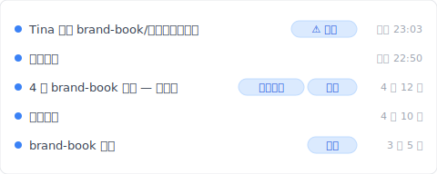
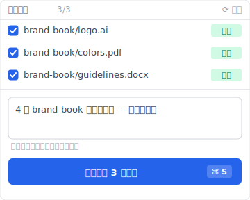
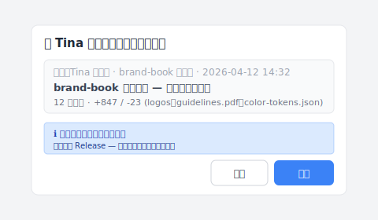

---
title: "【2026 文件管理】员工离职把公司资料清光了？同步工具不挡、法律救不了、Keeply 怎么补不可逆历史"
description: "员工离职前清空文件夹、Dropbox 忠实同步删除动作、版本还原也救不回（她直接清空回收站）。法律打 2 年、DLP 月费高、都救不了已经发生的事。换 Keeply 后 4 月 brand-book 冻结成 Release、就算管理员权限也删不掉。"
slug: departing-employee-data-risk
image: cover.svg
og_image: cover.png
date: 2026-05-09T08:00:00+08:00
draft: false
locale: zh-CN
derived_from: zh-TW
primary_keyword: "员工离职 公司资料"
voice_version: v3-2026-05-15
role: cluster
pillar_parent: file-version-management-complete-guide
status: approved_master
image_alt_data: "文件夹时间轴显示 23:03：brand-book/ 于 22:50 被复制、23:03 遭删除、30 天后永久失效——同一文件夹两个动作，Dropbox 与 Google Drive 均未记录，两者都超出同步工具的拦截范围"
faq_schema:
  - q: 员工离职前清空 Dropbox / Google Drive 文件夹、版本还原能救吗？
    a: 大部分救不到。Dropbox 个人版保留 30 天、商务版 180 天版本历史——但只要用户主动清空回收站（管理员权限或自己的文件）、那次删除动作会绕过版本还原。同步工具的设计目标是「两端一致」、不是「不可逆历史」。

  - q: 员工带走或删掉资料，法律 / DLP 能解吗？
    a: 都不及时。法律走商业秘密诉讼要 1-2 年、举证困难、赢了原稿也老到没人要。DLP（数据泄露防护软件）月费对 10 多人团队不成比例、要专人顾、而且 DLP 只防未来、员工上周末已经做完的事它挡不到。

  - q: Keeply 怎么补同步工具的盲区？
    a: Keeply 底层逻辑不是「同步」是「不可逆历史」——你存的每一版都进时间轴、本机 git 没时间上限、500 版本上限不存在。重要交付可以冻结成 Release（对应 ADR-003）、就算员工有管理员权限、Release 冻结版本也删不掉。

  - q: Keeply 适合 IT 管控企业使用吗？
    a: 小型企业（10 人以下）适合直接装。中型企业可作为 IT DLP / 集中备份的补强层、主要场景是「个人 / 部门工作流的版本历史」。Keeply 不取代企业 DLP（USB 锁 / 实时监控 / 加密通道）那些功能、是补同步工具不挡「主动清空」的那层盲区。
---

# 【2026 文件管理】员工离职把公司资料清光了？同步工具不挡、法律救不了、Keeply 怎么补不可逆历史

> Dropbox 忠实同步 Tina 的删除动作。法律打 2 年、DLP 只防未来——都救不了上周末已经发生的事。

## 本文目录

1. [周六晚上 11 点 03 分——同步工具看着她清空](#hook)
2. [换 Keeply 后周一早上 9 点 14 分我直接点时间轴还原](#keeply-restore)
3. [法律救不了火、DLP 来不及装——事后救援的两条死路](#alternatives)
4. [为什么她删得这么容易？同步工具的「两端一致」设计缺陷](#why)
5. [Keeply 不可逆历史 + Release 冻结：管理员权限也删不掉的那一层](#keeply)
6. [Keeply 不是万灵丹——3 种它不解的离职场景](#limits)

---

## 周六晚上 11 点 03 分——同步工具看着她清空 {#hook}

那个周六晚上 11 点 03 分、Tina 在家里把整个 `brand-book` 文件夹拖进回收站、并且顺手按了清空。

不到一分钟、Dropbox 忠实地把这个动作同步到云端。

星期一客户打来要原稿、你打开文件夹、里面是空的。你以为还有救、但她手动清空回收站的动作、直接绕过了 Dropbox 的版本还原机制。

（Dropbox 个人版保留 30 天、商务版 180 天、但两种都救不了「用户主动清空回收站」这个动作。详见 [Dropbox 官方说明](https://help.dropbox.com/delete-restore/recover-deleted-files)。）

你查不到她有没有把文件拷走、也交不出东西给客户。

这篇拆完法律 / DLP 为什么都救不了已经发生的事、同步工具为什么设计上就不挡这层、然后让你看 [Keeply](https://keeply.work) 怎么用「不可逆历史 + Release 冻结」补同步工具看不到的盲区。

---

## 换 Keeply 后周一早上 9 点 14 分我直接点时间轴还原 {#keeply-restore}

先让你看现在。同样是 Tina 周六 23:03 清空 `brand-book/`——在 [Keeply](https://keeply.work) 里，这个品牌项目保管库的时间轴看起来是这样：

「Tina 删除 brand-book/（管理员权限）」在时间轴最上方、用「⚠ 已删」tag 标记——是 Keeply 把那次删除动作记录下来的轨迹（不是文件本体、是「Tina 在 23:03 对这个文件夹做了删除」的事实）。

下面那行「4 月 brand-book 交付 — 完整集」自己一行、有「业主交付」+「冻结」两个 tag——是 4 月 12 日交付给业主那一刻、主动点 Keeply 主窗口「保存版本」+ 写笔记 + 冻结成 Release（对应 ADR-003）的版本。**就算 Tina 有管理员权限、Release 冻结版本也删不掉**（不可变存档的设计）。

那行笔记是怎么来的？4 月 12 日交付当下、把整个 `brand-book/` 集点 Keeply「保存版本」按钮、跳出来这个对话框：

写一行「4 月 brand-book 交付完整集 — 已交给业主」、保存版本——同时把那一版冻结成 Release（业主接收选项：纯文件夹 / ZIP / repo 路径 / git clone、含 PDF 收执单 + commit hash 证明）。周一早上 9:14 你打开 Keeply、点「业主交付」tag 那一行——3 秒还原整个 brand-book 完整集、交给客户。Tina 那次删除徒劳无功。

加上 Keeply 在背景每 30 分钟轮询文件变更——就算员工故意大量改动、轨迹都被记录下来。

下面拆法律 / DLP 为什么都救不了已经发生的事。

---

## 法律救不了火、DLP 来不及装——事后救援的两条死路 {#alternatives}

遇上这种事、你上网找解法。

想走法律途径？律师只会跟你谈商业秘密、但现实是、你现在连举证都做不到（你查不到 Tina 有没有拷走文件、只看到文件夹空了）。就算耗上一两年打赢官司、那份原稿也老到没人要了。

既然法律救不了火、你转向企业资安软件（DLP、Data Loss Prevention）。这是一条更深的坑。DLP 确实能挡下拷贝、但它的月费对十几人的团队来说根本不成比例、你还得专门请个工程师来顾系统。最致命的是、**DLP 只能防御未来**。Tina 周末已经做完的事、你现在刷卡买再贵的资安软件都来不及了。

这两条路都在解决「事后怎么办」、却没人问最基本的问题。

---

## 为什么她删得这么容易？同步工具的「两端一致」设计缺陷 {#why}

**为什么她删得这么容易？**

因为你用错工具了。

Dropbox、Google Drive 或 OneDrive 没坏、它们的核心设计叫做「两端一致」。你删了、云端就跟着删；你改了、云端就覆盖。它的责任是同步你的动作、不是保护你的资产。

把同步工具当成文件保管库、等于把整间公司的命脉押在没有保险的裸仓上。

详细的同步 vs 版本历史拆解可看 [Keeply 跟备份、云端工具有什么不一样](/zh-cn/post/what-keeply-saves-vs-backup-cloud/)——三件不同事、3-2-1 防硬盘 / 云端防设备遗失 / Keeply 防自己人。

---

## Keeply 不可逆历史 + Release 冻结：管理员权限也删不掉的那一层 {#keeply}

这就是为什么你需要真正的文件版本管理工具。它的底层逻辑不是同步、而是**不可逆历史 + Release 冻结**。

换到 Keeply、Tina 删了文件、你根本不需要去翻什么回收站、点开时间轴直接拉回上一版就好。就算她有管理员权限、Keeply 的 Release 冻结机制（ADR-003 — git commit + tag、commit hash 原生不可变）让她也删不掉那些被标记为里程碑的版本。至于她动了什么、轨迹记录全都定死在那里（git history 不可篡改）、不需要你事后像侦探一样去拼凑。

3 件事一个工具：

- **不可逆历史**——你存的每一版进时间轴、git history 写死、本机 git 没时间上限
- **Release 冻结**——重要交付（业主交付版、年度报告、客户确认版）标 Release、管理员权限也删不掉
- **轨迹定死**——谁、什么时候、做了什么动作、git log 全部留底

接手的人怎么真的把 Tina 那台笔电上的版本拉过来？Keeply 有一个叫「cherry-pick」的对话框、从另一台机器或另一个保管库挑特定版本套用过来：

新接手的同事打开 Keeply、选 Tina 那台笔电的 brand-book 保管库、看到 4 月 12 日业主交付那一版、写「brand-book 业主交付 — 完整批准版本集」这行说明、点「套用」。12 个文件——logos、guidelines.pdf、color-tokens.json——一次进到新主机的工作目录。原本的 Release 冻结属性也跟着过来、后续没人能误删。

---

## Keeply 不是万灵丹——3 种它不解的离职场景 {#limits}

我得诚实说、Keeply 不是万灵丹。

**实时监控 + USB 锁死那种事走 DLP**。如果你要的是「员工插 USB 立刻挡 / 监控他截图了什么 / 拷贝到 USB 就警报」、那是 DLP 的工作（Symantec、McAfee、Microsoft Purview 那群）。Keeply 补的是「事后还原 + 不可逆轨迹」、不取代实时防御。

**第三方平台账号交接走账号管理**。Slack、Figma、Notion 那些 SaaS 平台的权限撤销、要走账号管理（Okta、JumpCloud、Google Workspace Admin）。Keeply 顾的是文件层的版本历史、不管 SaaS 账号生命周期。

**法律意见走律师**。Keeply 提供版本轨迹证据、但「该不该告」「能不能赢」是律师的判断。Keeply 不是合规工具。

离职风险只是文件管理的一块拼图、想看完整框架（个人 vs 多人 vs 跨组织交付）可看 [文件版本管理完整指南：个人 / 多人 / 跨组织交付场景](/zh-cn/post/file-version-management-complete-guide/)。

你得先想清楚一件事：你要的是花大钱防堵员工犯错、还是**「不管员工做了什么、你都有把握一秒复原」**？

我做 Keeply、选的是后者。

---

下一个员工提离职、当你周一早上 9 点 14 分打开系统、看到他过去 6 个月经手的所有文件、每一次有意义的修改、都安稳地躺在时间轴上。

你根本不需要担心他离职前最后一个周末做了什么。因为记录早就定死了——点 [Keeply](https://keeply.work) 时间轴顶端那条「业主交付」tag、3 秒就有。

---

> 关于作者：Ting-Wei Tsao，[Keeply](https://keeply.work) 创办人。
> [LinkedIn](https://www.linkedin.com/in/ting-wei-tsao-b57480152/)
