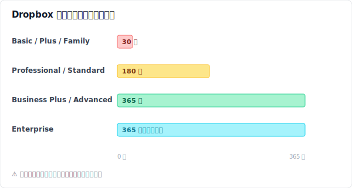
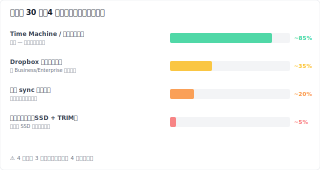
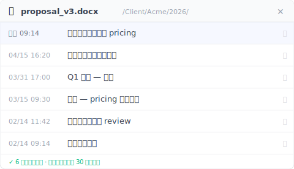
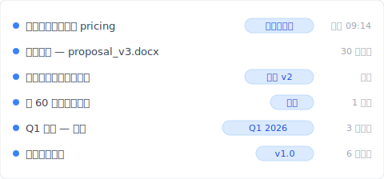

---
title: "【2026 文件管理】Dropbox 救得回昨天的误删，救不回两个月前那一版"
description: "Dropbox 救得回昨天的误删。救不回客户两个月后突然要的那一版。30 天时钟过了还剩什么路？以及怎么让下次再也不用倒数。"
date: 2026-05-17T08:14:00+08:00
draft: false
slug: "dropbox-recover-deleted-30-days"
primary_keyword: "dropbox 恢复已删除文件"
locale: zh-CN
master_locale: en
categories: [文件管理]
tags: [云端同步, 版本控制, 文件恢复, 工具比较]
image: cover.svg
og_image: cover.png
cta_topic: backup
role: cluster
pillar_parent: file-version-management-complete-guide
locales_required: [en, zh-TW, zh-CN, ja, ko, it]
voice_version: v2-2026-05-17-three-readers
image_alt_data: "日历显示 Dropbox 蓝色的第 1 天到第 30 天，第 31 天用红色标出 —— 说明 Dropbox Basic / Plus 30 天删除窗口的悬崖。下方：Keeply 本机层没有保留期限上限。"
faq_schema:
  - q: 文件在 Dropbox 删除超过 30 天还能救回来吗？
    a: "在 Basic、Plus、Family 三种方案上，官方答案是不行 —— 30 天删除窗口一关上，文件就从「已删除文件」里永久移除。剩三条非官方路径（Dropbox 客服升级处理、本机同步快取、磁盘层救援软件），各自命中率都低、而且都附带条件。Professional 与 Standard 方案有 180 天窗口；Business Plus 与 Advanced 是 365 天。"
  - q: Dropbox 把已删除文件保留多久？
    a: "Basic、Plus、Family 方案 30 天。Professional、Essentials、Business Standard 是 180 天。Business Plus 与 Advanced 是 365 天。Enterprise 视管理员政策而定。事发后才升级方案，不会回溯延长保留期 —— 删除当下开始倒数的那座时钟，会一直走下去。"
  - q: Dropbox 同步删除是不是连我电脑里那份也一起没了？
    a: "是。Dropbox 是同步引擎 —— 某一台同步设备上删除，几分钟内就会传播到所有其他同步设备。从 dropbox.com 的「已删除文件」还原会把档案同时送回所有设备，但仅限于你方案对应的保留期限内。"
  - q: Recuva 或 Disk Drill 能在 SSD 上救回 Dropbox 已删除文件吗？
    a: "现代 SSD 都有 TRIM 机制（用来主动通知磁盘哪些区块已删除，磁盘控制器会预先擦除），删除后短时间内就会执行。TRIM 一旦跑过，连鉴识级的救援工具都救不回来。没有 TRIM 的 HDD 救援窗口比较长，但磁区也可能早就被覆盖。四条路径里，救援软件这条命中率最低。"
  - q: Keeply 跟 Dropbox 的版本历史差在哪？
    a: "Keeply 跑在 Dropbox 同步的上游，把你每一次本机存档永久保留，没有时间或数量上限。Dropbox 版本历史则受方案限制（30 / 180 / 365 天）。Keeply 跟 Dropbox 并行，不是取代它 —— 跨设备同步、异地副本这些事还是 Dropbox 做。"
---

# 【2026 文件管理】Dropbox 救得回昨天的误删，救不回两个月前那一版

> Dropbox 救得回昨天的误删。救不回客户两个月后突然要的那一版。30 天时钟过了还剩什么路？以及怎么让下次再也不用倒数。

这不是一份救援指南。是三个人在 Dropbox 30 天时钟上的三个位置，以及他们各自还能做什么。

名字是化名。情境是合成的 —— 取自 [Dropbox Community](https://community.dropbox.com/) 上数百则已删除文件救援讨论串里反覆出现的模式。但他们各自发现的机制是真的。

## Sarah — 5 分钟前

> **【合成示例】** Sarah 是一位接案设计师。周三上午 11:14。她刚按下 Delete 删掉 `proposal_v3_FINAL.docx`，以为那是比较旧的重复版本。比较新的应该叫 `proposal_v3_FINAL_FINAL.docx`。她停了一下。等等 —— 真的是这样吗？

她打开 dropbox.com，单击左侧的 **已删除文件**。文件还在那里，时间戳 11:14 AM。三个动作：**⋯** → **还原**。完成。文件回到原本的路径。笔记本同步回来。两分钟后手机也跟上。

Sarah 救得这么轻松，是因为她还在 30 天窗口内。Basic、Plus、Family 三种方案上，Dropbox 都会把已删除文件保留 30 天。来源：[help.dropbox.com 关于救援已删除文件](https://help.dropbox.com/delete-restore/recover-deleted-files-folders)。在这 30 天内，从网页端救援只要三个单击。

Sarah 自己没意识到：她能救回来，靠的是三件意外做对的事。

她用的是 dropbox.com，不是桌面文件管理员。如果 `proposal_v3_FINAL.docx` 当时被放在一个被 [Selective Sync 选择性同步](https://help.dropbox.com/sync/selective-sync-overview)（Dropbox 让你把特定文件夹不同步到本机以节省磁盘空间的选项）排除掉的文件夹里，删除会直接在云端发生，根本不会经过她本机的资源回收站。这种状况每天都在发生 —— 用户先在本机找，找不到，就以为文件根本不存在过。

她也只是还原一份文件，不是还原特定版本。如果 Sarah 想要的是「三个礼拜前的那个 `proposal_v3`」而不是今天这一版，她需要的是[版本历史](/zh-cn/post/file-version-management-complete-guide/)，那跟删除历史是两棵完全不同的树。还原会把删除当下那一刻的状态还回来。昨天她改的那三次存档全部包在里面。

而且她在这个文件夹里没看过「冲突副本」。如果有 —— 像 `proposal (Marco's conflicted copy 2026-04-15).docx`，这是 Dropbox 发生[同步冲突](../dropbox-conflicted-copy/)时自动留下的标记 —— 而她队友以为是冗余把它删了，她现在就会在「已删除文件」里搜错文件名。

Sarah 不会想到这些。她拿回文件。吃午饭。下午一切如常。

## Marco — 35 天前

> **【合成示例】** Marco 是一位 B2B 顾问，用 Dropbox Plus。今天客户来信问他要那份「我们改价格前的提案 —— 大概一个月前那版」。Marco 打开「已删除文件」。空的。他用日期排序。最近一个月也没东西。他翻寄件备份、邮件草稿、桌面。然后他想起来了：五个礼拜前他整理过这个文件夹。他一定把现在要的那份删掉了。

Marco 开了张支持单。48 小时后回信来了：Plus 账户超过 30 天窗口的文件，Dropbox 没办法救援。客服建议他升级到 Professional，未来可以享 180 天窗口。Marco 还是升级了，抱着一丝希望。他打开看。文件依然不在。

这是 Dropbox 保留政策里行销不会主动讲的一段。你方案对应的保留期限，套用的是**删除那一刻**你所在的方案。Plus 删除 = 30 天窗口，不管你一周后变成什么方案。从删除当下开始数的那座时钟，对之后任何升级都视而不见。这种用户体验，在 [Dropbox Community 讨论串](https://community.dropbox.com/en/discussion/477149/can-i-recover-files-deleted-more-than-30-days-ago-if-i-upgrade-my-account) 里反覆出现。

Marco 实际还剩三条路。

第一条是 Dropbox 客服升级处理。Business 与 Enterprise 客户在窗口刚过几天内，客服有时会想办法。按 Dropbox 官方政策，这是一案一议，不是承诺。Marco 用的是 Plus。支持单礼貌地结案了。

第二条是检查文件是否曾同步到他旧的笔记本上。如果作业系统的同步快取里还留有一份本机副本 —— 而且作业系统还没把那块空间回收 —— 他也许能在那里找到残影。他翻 `~/Dropbox/.dropbox.cache/` 和 `~/Library/Application Support/`。没东西。重启后快取已经被清掉。

第三条是 Marco 实际做的：凭记忆与那一周他寄出的邮件，重写那段价格调整。这跟原本的提案不是同一份。客户察觉。签约延后三天。

下方是 Dropbox 全方案保留期限的浓缩版本：

数字来源同样是 [版本历史](https://help.dropbox.com/files-folders/restore-delete/version-history-overview) 与 [资料保留政策](https://help.dropbox.com/account-settings/data-retention-policy)。Marco 的救援窗口是 30 天，因为他删除当下的方案是 Plus。事后任何升级都改不了过去。

## Linh — 75 天前

> **【合成示例】** Linh 是一位写论文的博士生。她指导教授来信：「我想看你 2 月中那版给我的方法学章节 —— 是我们把样本范围缩小前的那版。」那是两个半月前的事。Linh 在六个礼拜前定稿第 4 章的时候，把那份草稿删了。她用的是 Dropbox Family 方案，跟伴侣共用。30 天窗口。早就过了。

Linh 在 Dropbox 这一侧的所有路径都走完了。剩下的只有本机端。

她在 Windows 上打开 [Recuva](https://www.ccleaner.com/recuva)（免费），扫描 SSD。跳出几百个文件碎片，没有一个对得上她要的日期。她改试 [Disk Drill](https://www.cleverfiles.com/)（89 美元试用版），做更深一层的鉴识扫描。同样结果。原因不在软件。原因在 TRIM。

TRIM 是现代 SSD 的一项功能。作业系统会预先告诉 SSD 控制器哪些区块已经被删除，SSD 就会在新写入之前主动擦除这些区块。[Microsoft Learn 文件里这样描述这套 API](https://learn.microsoft.com/en-us/windows/win32/w8cookbook/new-api-allows-apps-to-send--trim-and-unmap--hints-to-storage-media)：「TRIM 提示通知磁盘，先前被分配的某些磁区，App 不再需要，可以清除。」macOS 在 OS X 10.10.4 之后对 Apple 自家 SSD 预设启用 TRIM；第三方 SSD 则要跑 `sudo trimforce enable` 才会启用。结果是：TRIM 一跑过该磁区 —— 通常在删除后几分钟内 —— 救援软件就什么都找不到了。Linh 的论文草稿在 6 个礼拜前就已经在芯片层被抹掉。没有任何工具能伸手进去。

下方这张图把 Linh 调查过的四条路径，依实际成功率排序：

四条里有三条都要求**删除之前**就已经设定好。第四条 —— 事后才跑 Recuva 或 Disk Drill —— 是大家最先尝试的那一条，也是在现代笔记本上几乎从来救不回来的那一条。

Linh 写信告诉指导教授，她会用笔记和早期草稿重建方法学章节。这花掉她一个原本没打算牺牲的周六。

## 为什么三个人都掉进来

Sarah、Marco、Linh 三个人，工作不同、文件不同、时间戳不同。他们的共通点是：都把 Dropbox 的删除救援当成版本历史层来用。它不是。它是一道**最后一道网**，设计来接住昨天你不小心删错的那个重复文件。

最后一道网必须有期限。储存要花钱。一朵把每一次删除都永远留着的云，最后不是收费方式变了就是悄悄帮账户设上限。30 天窗口不是 错误；是产品照设计运作。行销讲的是接得住的那一面。没讲的是接不住的那一面。

接住最后一道网漏掉的，是一座住在别处的版本历史层 —— 不试图当同步引擎、不试图便宜、不试图一次做十二件事的那种地方。一个只做一件事的层：把每一次存档永远留着，留在你自己的硬盘上，那里储存便宜、时间不是敌人。

## 平行宇宙

> 现在倒带。同样的 Sarah、同样的 Marco、同样的 Linh。他们三个人，在注册 Dropbox 那一天就同时装了 Keeply。

Sarah 误删那个重复文件。她的救援经过完全一样 —— Dropbox 在 30 天内接住，三个单击，完成。Keeply 在背景默默跑着；这次她没用到。

Marco 的客户在那份价格修改草稿从 Dropbox 消失 35 天后才来信。Marco 打开 Keeply 的文件历史面板，找那份提案。五个礼拜前的版本就在那里，附着他当时写的一行备注：「套用价格修改」。他把它复制出来。11 秒。

Linh 的指导教授问她样本范围缩小前的版本。Linh 打开 Keeply 的项目全局时间轴。她找到 2 月中标着「初版方法学 —— 完整样本」的那一笔。还原。完成。她的周六还是她的。

三个情境的机制都一样。Keeply 跑在 Dropbox 上游 —— 每一次本机存档都永久留在一份历史里，搜寻标签就是你当时写下的那行字。Dropbox 还是负责跨设备同步、分享链接、异地副本。这些都不变。变的是：30 天时钟再也不能决定你需要的那一版还在不在。它在你硬盘上。永远都在。

**跟你现有的云端服务并行运作。** Keeply 跑在 Dropbox、OneDrive、Google Drive、iCloud，或任何你在同步的文件夹上游。你不用迁移。你不用二选一。本机层保留历史；云端负责同步。这套故事在每一位比价者会读到的那道[悬崖](../cloud-version-history-cliff/)上都成立。

## Keeply 不解什么（以及今天能做的一件事）

诚实列出 Keeply 不解的事：

- **即时跨设备同步**是 Dropbox 的工作，不是 Keeply 的。
- **手机端查看历史版本**不是 Keeply 的功能；它是一支桌面 App。
- **对外分享链接**送最新版给客户 —— 找 Dropbox。
- **团队管理后台与稽核记录** —— 找 Dropbox Business。
- **异地冗余**怕硬盘挂掉 —— 让 Dropbox 继续跑那一份。

Keeply 不是 Dropbox 的替代品。它是 Dropbox 底下那一层：每一次本机存档都永久留着，让那座 30 天时钟不再决定「60 天后你会需要的那一版」还在不在。

如果你现在已经过了第 30 天，剩下的路径就是 Linh 试过的那些；没有一条很可能成功。你还能存的版本，是下一版。装本机历史层最佳的一天，是你需要它的前一天。两分钟后的现在也不晚。

---

**作者**：Ting-Wei Tsao 是 [Keeply](https://keeply.work) 的创办人，做给不想学 Git 的人用的本机版本历史层。[LinkedIn](https://www.linkedin.com/in/ting-wei-tsao/)
