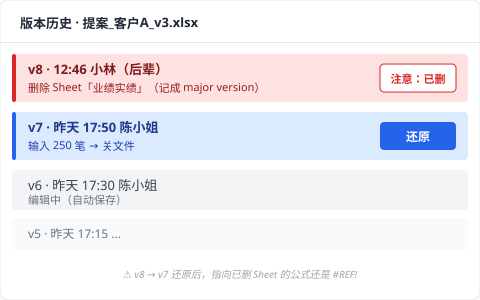
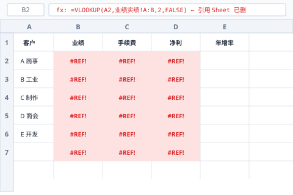
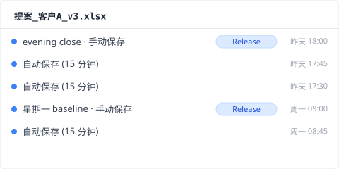

> 星期二下午 14 点 32 分。业务的陈小姐（**合成案例**）打开 OneDrive 上的「提案_客户A_v3.xlsx」，这份文件他从星期一就在准备。明天早上 10 点要提案，还剩 19 小时 28 分。文件打开那一刻，画面冻住了。工作表「业绩实绩」是空的。分页还在、列 A 到 AZ 都还在、行号 1 到 250 也在，可是每一格都是白的。连动的工作表「报价」合计栏也整排 `#REF!`。OneDrive 角落是绿色对勾。Excel 上面有行小字「另有 1 人正在编辑」。中午午休的时候，后辈小林开过这个文件。

搜「Excel 数据 恢复」会看到一排恢复软件的广告。EaseUS、4DDiG、Recoverit、iMyFone，全部讲扫 SSD 磁区做 disk recovery。可是这次发生的事，不是磁区问题。是协同编辑的时候同事删了一个工作表，那个 delete 就被推上云端而已。我把这种事故分钟级追踪的记录整理出来，今天分享。

## 协同编辑把工作表吃掉时 Excel 画面上的征兆

14 点 32 分 17 秒，陈小姐打开「提案_客户A_v3.xlsx」。Excel 启动，他点工作表「业绩实绩」。画面读取中，0.4 秒后，整片白。工作表分页还在、列头 A 到 AZ 都在、行号 1 到 250 也在，可是每一格都是空的。Excel 上面写「另有 1 人正在编辑」，旁边是后辈小林的头像。15 秒前小林还开着这个文件。陈小姐看到的，就是小林中午 14:32 还在编的云端版本。

事故的细节：

- **昨天 17:50**：陈小姐把工作表「业绩实绩」填好 250 笔客户实绩，关文件。
- **今天 12:31**：小林（后辈）开文件（陈小姐有跟他说「明天要提案」）。
- **今天 12:46**：小林对工作表「业绩实绩」右键，按「删除工作表」（误操作，事后解释「以为删的是测试用的工作表」）。
- **今天 12:46:03**：Excel 把这个操作推给 SharePoint，工作表删除反映到云端，被记成主要版本 v8，AutoSave 把它当「正常编辑」处理。
- **今天 12:46 到 14:32**：这 1 小时 46 分钟，文件在云端是「工作表业绩实绩不见了」的状态。
- **今天 14:32**：陈小姐开文件，云端那个状态（工作表已删）被同步下来。

为什么 Excel 不警告？Office 365 协同编辑的 commit semantics 是 **last-writer-wins**：谁最后动就以谁为准，特别是工作表层级的删除（[Microsoft Learn: Co-authoring in Office](https://learn.microsoft.com/en-us/office365/servicedescriptions/office-online-service-description/sharing-and-collaboration)）。删工作表在 Excel 看来是「正常的编辑动作」，不会跳确认框。

可是这只是表面的症状。

## OneDrive 同步对勾为什么维持绿色不报错

14 点 32 分 47 秒，陈小姐想搞清楚状况，先看 OneDrive 图标。绿色对勾。全部同步，没错误。真的吗？

OneDrive 的同步对勾代表「本机文件跟云端一致」，不代表「数据没坏」。小林 12:46:03 删了工作表，删除被推上云端，陈小姐的电脑（在办公室，下午才开机）还没同步。14:32 陈小姐一开文件，OneDrive 立刻拉云端状态，把本机文件覆盖成「工作表已删」。同步对勾显示成功。

「已同步」不等于「你的工作安全」。在协同编辑模式下，别人的 delete 也会同步进来。

## SharePoint 版本历史恢复后 `#REF!` 为什么还在

14 点 37 分，陈小姐用浏览器打开 OneDrive，对文件右键，选【版本历史】。列表跳出来：v8（12:46，小林）/ v7（昨天 17:50，陈小姐）/ v6（昨天 17:30，陈小姐）...

按【还原 v7】。

等几秒。文件重新下载。打开工作表「业绩实绩」，250 笔数据回来了。松了一口气。

可是打开工作表「报价」，整排 `#REF!`。原因：v7 还原的是整个 workbook，可是 v7 那个时间点工作表「报价」的公式指向的是「业绩实绩」在 v6 时的那些单元格位置。v8 删掉的工作表，v7 还原后公式还是返回 `#REF!`。SharePoint 版本历史是 **workbook 等级的快照**，不是 per-sheet diff（[SharePoint version history limits](https://learn.microsoft.com/en-us/sharepoint/document-library-version-history-limits)）。工作表被删这件事会被记成「主要版本」，可是它没办法回头去修被删工作表连带造成的公式错误。

**恢复后 cascade 公式的修复步骤**：

1. 恢复后打开工作表「报价」（公式 cell 大片 `#REF!`）
2. 在数据编辑栏找到原本指向「业绩实绩」的地址
3. 一格一格改写成新的引用位置
4. 同工作表公式太多，用 VLOOKUP / XLOOKUP 批量处理

到这里，已经损失 3 小时 28 分钟。离明天提案还剩 15 小时 60 分钟。

## Excel 关掉那一秒 Ctrl+Z 为什么就失效

15 点 32 分，陈小姐放弃了，把 Excel 关掉。他想「再开一次试试另一个还原版本」。

开回去发现：Ctrl+Z 按不了。「撤销上一步」是灰的。Excel 的 undo stack 是 **per-session**，文件一关，全部的 undo 记录（不管是自己的操作，还是协同编辑对方的操作显示）都重置。本来可以拿来「撤销小林删工作表」的编辑 session，在 14:46 陈小姐关文件那一秒就消失了。

undo stack 在内存里，per-session 结构，不会存进文件、也不会上云。这是 Microsoft Office 全产品共通的规格。

## Time Machine 为什么救不回前一天的工作表

隔天早上 9 点，陈小姐想到「公司的 Mac 应该有 Time Machine」，发信给 IT 部。30 分钟后回应：「Time Machine 快照有，每小时自动拍」。

打开昨天 15 点的快照。看工作表「业绩实绩」，空的。

为什么？Time Machine 拍的是「OneDrive 同步文件夹上面的本机文件状态」（[Apple Support: Back up your files with Time Machine on Mac](https://support.apple.com/en-us/104984)）。14:32 那一刻 OneDrive 已经把本机文件覆盖成「工作表已删」。15:00 Time Machine 拍下来的就是已经被云端状态染掉的本机文件。Time Machine 记录的是「从云端落下来的最新版」，不是本机编辑历史。

事故发生后 4 小时。陈小姐什么都还没救回来。

## 用 Keeply 救回协同编辑误删的 Excel 数据的方法

如果，在平行宇宙里，陈小姐的电脑装了 Keeply，14 点 32 分那一刻，会发生什么事？

Keeply 在本机保管库保存独立的快照，跟 OneDrive 走完全不同的路径、不同的存储空间。Keeply 不知道「Office 365 协同编辑」这件事，也因为不知道，小林的 delete 不会反映到 Keeply 的保管库里。

陈小姐的 Keeply 设成 15 分钟间隔后台自动保存。昨天 17:50 陈小姐关文件后，18:00 Keeply 拍了最后一张自动保存：「业绩实绩」250 笔、「报价」公式正常。今天 12:46 小林的 delete 发生在云端侧，陈小姐的电脑在办公室、下班后关机，Keeply 不会动。14:32 陈小姐开机，OneDrive 同步云端状态下来，可是 Keeply 的保管库跟 OneDrive 不在同一条路径上，不受影响。

14 点 33 分，陈小姐打开 Keeply：

1. 在左边时间轴点开「提案_客户A_v3.xlsx」昨天 18:00 那个自动保存版
2. 按「还原此版本」
3. Keeply 用新文件名（`提案_客户A_v3_RESTORED.xlsx`）输出

打开文件确认，「业绩实绩」250 笔 ✅、「报价」公式 ✅。陈小姐发 LINE 给小林：「测试的请改用新文件，这个才是本尊」。30 秒解决。

Keeply 在后台自动保存（间隔可选 15、30 或 60 分钟，默认 30；陈小姐这台设 15 分钟）+ 重要节点你可以主动按「保存版本」按钮 + 每张快照分别存在保管库，不会互相覆盖。整个流程不经过协同编辑、不经过云端同步，是本机磁盘上的另一个世界。

## Keeply 也救不回的 3 种协同编辑数据消失

Keeply 不是万能。在协同编辑环境下，下列 3 种情况 Keeply 也救不回来。

1. **文件放在共享网络磁盘、陈小姐本机没副本**。Keeply 只看本机文件，不会去监看共享磁盘上别人改了什么。共享磁盘要团队另外建一台 Keeply 镜像保管库。
2. **小林直接登录陈小姐的电脑（远程桌面之类）改文件再删**。这时 delete 是本机事件，Keeply 会记录。要还原就是从 Keeply 保管库拉回来，可是那一秒同时推上云端，远程同步起来会比较复杂。
3. **事故发生的这 1 小时刚好在 Keeply 自动保存的盲区**。例如 14:30 设定要存、14:32 出事、14:31 那张快照太旧，或 14:15 存的时候「业绩实绩」就已经被改成一半空白。重要节点记得手动按「保存版本」可以补上这个盲区。

事故报告书到这里结束。下次怎么不再发生这种事，我会另外写一篇接着聊。我自己现在 Excel 工作文件的版本历史，就是靠这层独立保管库睡得安稳。

---

**作者**：[Ting-Wei Tsao](https://www.linkedin.com/in/ting-wei-tsao-b57480152)，Keeply 创始人。在做你的文件管理守护神。

## 常见问题 {#faq}

**Q. Keeply 怎么补上协同编辑冲突的数据消失？**

A. 把本机保管库跟 OneDrive 切开，云端侧的编辑不会直接动到你本机的存储空间。Keeply 在后台自动保存（15、30 或 60 分钟间隔可选）+ 重要节点你主动按「保存版本」按钮 + 每张快照分别保存在保管库，互不覆盖。同事在云端侧删了工作表，那个 delete 不会传到 Keeply 的保管库。事故当下打开 Keeply、挑前一版、按「还原此版本」，30 秒。前面 4 层（OneDrive 同步 / SharePoint 版本历史 / Time Machine / 恢复软件）全部都依赖云端状态做事后救援，对协同编辑冲突特别弱。Keeply 是跟云端状态切开的事前防御层。

**Q. Excel 消失的数据怎么救回来？**

A. 看情况。单人编辑 Ctrl+S 覆盖的话，用 SharePoint 版本历史（前提是主要版本有留下来）或 Excel 内建「版本历史」按钮。协同编辑时别人删掉数据，可以用 SharePoint workbook 等级的快照救回，但连动公式要手动重建。文件只在本机、Windows 卷影复制又没开的话，几乎没救。

**Q. 协同编辑时同事误删了工作表，能救回来吗？**

A. SharePoint 版本历史可以还原 workbook 等级，前提是删除前那个 bundle 有被记成「主要版本」。AutoSave 连续写的中间状态不一定每个都会独立留存。连动公式引用到被删工作表的其他工作表，v7 还原后还是 `#REF!`，要手动重建。事前有本机快照层（像 Keeply）的话，可以从没被云端 delete 污染的原本还原。

**Q. 没保存就关掉的 Excel 文件能救回来吗？**

A. 自动恢复（默认 10 分钟间隔）有机会保留「没保存的最近状态」。打开 Excel，从「文件 → 信息 → 未保存工作簿」找。可是文件正常关掉那一秒，自动恢复暂存文件会自动删除，如果没看清楚就关掉就没救了。Keeply 跟你按不按保存无关，在后台自动存，未保存就关文件的情况保管库也还会有最近的状态。

**Q. Excel 恢复软件能救单元格层级的数据吗？**

A. 几乎不行。恢复软件是 disk 磁区层级救「刚被删掉的位元」，前提是整个文件被删掉要救回来。文件还活着、但里面的单元格数据消失（协同编辑 delete 或公式 `#REF!` 连带崩坏）这种，恢复软件解不了。而且 SSD + TRIM 环境下，连磁区层级救援成功率都 < 5%（[NIST SP 800-88r1: Guidelines for Media Sanitization](https://nvlpubs.nist.gov/nistpubs/SpecialPublications/NIST.SP.800-88r1.pdf)）。协同编辑数据消失这件事，恢复软件结构上解不开，只能靠事前有本机快照层。

## 相关文章

- 📚 主题 hub：[文件版本管理完全指南：5 个原因，多数工具都接不住](/zh-cn/post/file-version-management-complete-guide/)
- 📊 同主题：[Excel 版本历史按钮为什么是灰的：4 个条件你 1 个都没中](/zh-cn/post/excel-version-history-limits/)
- 🔄 同主题：[Dropbox 冲突的副本：4 种触发场景](/zh-cn/post/dropbox-conflicted-copy/)

## 资料来源

1. [Microsoft Learn: Co-authoring in Office](https://learn.microsoft.com/en-us/office365/servicedescriptions/office-online-service-description/sharing-and-collaboration)
2. [SharePoint version history limits: Microsoft Learn](https://learn.microsoft.com/en-us/sharepoint/document-library-version-history-limits)
3. [Apple Support: Back up your files with Time Machine on Mac](https://support.apple.com/en-us/104984)
4. [NIST SP 800-88r1: Guidelines for Media Sanitization (SSD TRIM behavior)](https://nvlpubs.nist.gov/nistpubs/SpecialPublications/NIST.SP.800-88r1.pdf)
