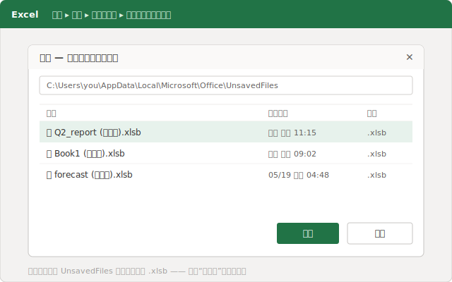
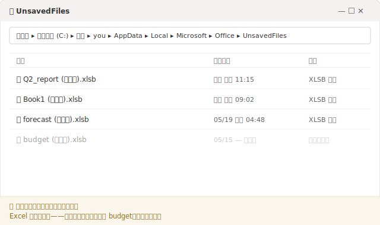
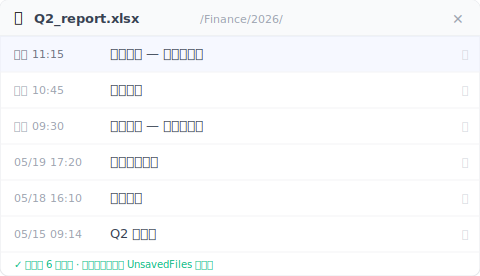

# 【2026 文件管理】Excel 未保存恢复：救回来的为什么又没了

*Excel 的「恢复未保存的工作簿」会从一个隐藏的 `UnsavedFiles` 缓存里捞出从没保存过的文件。它存成一个临时的 `.xlsb`，Excel 按自己的节奏清掉它。所以你刚救回来的文件，几天后可能又不见了。真正该补的不是更快的恢复,而是一层不待在那个缓存里的版本历史。*

你周二把没保存的表格救了回来，松了口气。到周末它又没了。不是 Excel 弄丢的。那个恢复缓存从一开始就在倒计时。

如果你刚关掉 Excel 没保存、心一下子凉了，先看这一段。恢复是真能成的，大概三十秒。但你最好顺便搞清楚，你要救的这个文件到底*存在哪*。因为它会再次消失，原因就在这里。

## 先把文件救回来：恢复未保存的工作簿 {#h2-1}

别动别的，先做这一步：

- **文件 → 信息 → 管理工作簿 → 恢复未保存的工作簿。**（或者 **文件 → 打开 → 恢复未保存的工作簿**，按钮在最近文件列表的最下面。）
- 会弹出一个文件夹。你会看到一堆名字很乱、以 `.xlsb` 结尾的文件。那就是你没保存的工作簿。
- 找时间戳对得上的那个打开，然后立刻**另存为**一个正经的文件名和位置。

这份 `.xlsb` 列表不是哪个恢复向导变出来的。Excel 是在读你自己硬盘上的一个文件夹：`%LocalAppData%\Microsoft\Office\UnsavedFiles`。Excel 会把你没保存的工作偷偷塞一份副本到那里，这样你不保存就关掉、或者它崩了，它还有东西能还给你。

文件拿回来了？好。接下来这部分，没人会告诉你。

## 为什么救回来的文件，到周末又没了 {#h2-2}

那个 `UnsavedFiles` 文件夹是个临时存放区，不是保险柜。Excel 替你管它,也就意味着 Excel 会替你清空它。按自己的节奏，不打招呼。

**微软的支持页面没有承诺一个未保存的文件能在那里待多久**。网上反复流传的「四天」这个说法，微软也从来没写过。[官方说明](https://support.microsoft.com/zh-cn/office/%E6%81%A2%E5%A4%8D-office-%E6%96%87%E4%BB%B6%E7%9A%84%E6%97%A9%E6%9C%9F%E7%89%88%E6%9C%AC-169cb166-e7e2-438e-8f39-9a8927828121)只教你怎么打开「恢复未保存的工作簿」，然后就没了。它从不保证文件明天还在。实际上，大家普遍发现这个缓存几天之内、或者重启之后、或者新条目攒够了，就被清掉了。

所以「我恢复了」和「我留下了」是两回事。如果你打开恢复出来的工作簿，瞄了一眼，没**另存为**到一个正经文件夹就又关掉了，那你没保存。你只是看了一眼一份还在倒计时的临时副本。周五再回来，它可能就没了，而且这一次文件夹里连能恢复的东西都没有。

恢复这一步解决的是接下来十分钟。它解决不了下周。

## 同一个缓存,Excel 拿它扛两种「未保存」灾难 {#h2-3}

大家会被绕进去，是因为「我把没保存的 Excel 文件弄丢了」其实是两个不同的问题套了同一句话，而 Excel 把它俩都塞进了同一扇「恢复未保存的工作簿」的门。

**问题 A。你一次都没保存过。** 全新工作簿，三小时的公式，然后崩了、或者手滑点了「不保存」。硬盘上从来没有过一个真正的文件，所以 `UnsavedFiles` 缓存确实是你最好、也是唯一的指望。它就是干这个的，上面第一步通常能把它救回来。

**问题 B。你以前保存过，后来把这次改的东西丢了。** 这是那份你打开过上百次的月度报表。你弄了一上午，没保存，关掉了。文件还在。只是*最近这几个小时*的改动没了。这时候缓存里往往没什么有用的，因为 Excel 只是把你的编辑当成一次可恢复的开档过程在记，没把它当成文件的一个永久版本。

具体想象一下。`Q2_report.xlsx` 在 `/Finance/2026/` 里躺了好几周。今天上午你把数字对平了、加了两个工作表、一路弄到十一点多。然后顺手一关，提示框看都没看就点过去了。Excel 重开。文件就在那儿，最后保存是昨天 5:14。这一上午是*从*那份保存过的副本打开的，再没存回去。丢的只有你今天真正做的那部分。

问题 B 还有几个表亲，缓存一个都够不着：你在**另一台电脑**上打开了这个文件，那台机器上根本没有这份本地缓存；或者 OneDrive 的自动保存悄悄盖掉了同步的那份（这是另一个坑，有它自己的解法。见[多人共编时 Excel 数据消失了怎么办](/zh-cn/post/excel-data-vanished-postmortem/)）。表面不一样，根子是同一个：本该救你的那个东西，要么是临时的，要么是本地的，要么两样都占。

一个为了扛崩溃而生的缓存，从来就不是用来当你文件的历史的。

## 那一层不待在临时缓存里的版本历史 {#h2-4}

对付问题 B，答案不是更快地翻 `UnsavedFiles`。答案是让文件有自己的历史，存在一个 Excel 扫不掉的地方。一层盯着你表格真正存放的那个文件夹的版本历史，一边干活一边留下带时间戳的副本,而不是塞进一个 Excel 回收复用的缓冲区。

这正是 [Keeply](https://keeply.work) 要补的那个缺口。把它指向你表格存放的文件夹，它就在后台按你设的节奏留一个版本。每 15、30 或 60 分钟，默认 30。再加一个手动的**保存版本**按钮，可以写一行备注标个节点。等今天上午的改动没了，你不用去翻一个可能早就清空的缓存；你打开这个文件的时间轴，挑出 11:15 那一版。

`UnsavedFiles` 缓存是 Excel 给在编文件准备的短期安全网。一条版本时间轴是文件的长期记忆。一个会过期，一个不会。想看清楚这几层各自接住什么、又在哪里断手，可以参考[文件版本管理完整指南](/zh-cn/post/file-version-management-complete-guide/)。

## 哪些情况,版本历史也救不了你 {#h2-5}

假装它能搞定一切就不老实了，所以这里说清楚它搞不定的：

- **一个从没保存进受监控文件夹的全新工作簿。** 如果这个文件根本没写进被盯着的那个文件夹，就没有它的版本可留。这还是 Excel `UnsavedFiles` 缓存的活（问题 A），还是在它那个短倒计时上。
- **静默损坏。** 如果一个文件悄悄坏了，然后一个看起来没问题的版本盖掉了好的那个，时间轴会忠实地把坏副本也留下来。
- **放在受监控文件夹之外的文件。** 版本历史只认得你指给它的那些文件夹。你从没加进去的那个 U 盘上的表格，它管不着。

版本时间轴解决的是「我有过它、后来把改动丢了」。它变不出一个从来没存到任何地方的文件。

## 什么时候 Excel 自带的就够了 {#h2-6}

你不是每次都需要再加一层。这些时候跳过它就行：

- 一个用完就扔、重做也无所谓的临时计算表。
- **你的文件放在 OneDrive 或 SharePoint 里、并且开了自动保存。** 这能覆盖很多情况。云端版本历史在你编辑时就能接住大部分覆盖。但要知道它接不住什么：它只绑同步的那份，[存的历史有上限](https://learn.microsoft.com/zh-cn/sharepoint/document-library-version-history-limits)，而且[自动保存是一边干活一边盖](https://support.microsoft.com/zh-cn/office/what-is-autosave-6d6bd723-ebfd-4e40-b5f6-ae6e8088f7a5)，不会先问你。如果你读过这些限制、它们咬不到你，那你不用再加一层。
- 丢一上午的活只是个能扛过去的麻烦，而不是会误掉的截止日期。

要是说的就是你，那就学会「恢复未保存的工作簿」这条路，早点保存让文件先存在，然后接着过你的一天。只有当那张表格里的活是你没法乐呵呵重做的那种，多加这一层才值。

## 常见问题 {#faq}

**我的 Excel 文件以前保存过，弄了一上午没保存就关了，能把这一上午找回来吗？**

多半没法从 Excel 缓存里找。「恢复未保存的工作簿」是给那些你一次都没保存过的文件用的;文件一旦保存过，你这次没保存的开档改动就不一定还留在那里。想找回「一个已有文件最近这几个小时」，靠的是一层持续的版本历史（比如 Keeply）。它给文件本身留带时间戳的版本，你打开它的时间轴挑出接近中午那一份就行。

**Excel 会把未保存的文件留多久？**

微软没有公布固定的保留期。这些未保存的副本待在一个临时缓存里，Excel 按自己的节奏清掉它。很多人发现它们几天之内、或者重启之后、或者新条目攒多了就没了。在你把它另存为到一个正经文件夹之前，把恢复出来的文件当成临时的。

**未保存的 Excel 文件存在哪里？**

存在 Excel 的 UnsavedFiles 缓存里，路径是 %LocalAppData%\Microsoft\Office\UnsavedFiles，文件以 .xlsb 结尾。打开方式：文件 → 信息 → 管理工作簿 → 恢复未保存的工作簿。

**我恢复了文件，但几天后它消失了。为什么？**

因为「恢复未保存的工作簿」读的是一个临时缓存，不是永久副本。如果你恢复后没把它另存为到一个正经位置，它就还留在缓存里,后来被清掉了。恢复之后永远立刻另存为。

**打开自动保存能解决这个问题吗？**

[自动保存](https://support.microsoft.com/zh-cn/office/what-is-autosave-6d6bd723-ebfd-4e40-b5f6-ae6e8088f7a5)（OneDrive/SharePoint）对存在云端的文件有帮助，但它是一边干活一边盖，而且它的[版本历史也有自己的限制](https://learn.microsoft.com/zh-cn/sharepoint/document-library-version-history-limits)。它覆盖不到你存在本地的文件，也不等于一条能翻、会留着的文件版本时间轴。

## 相关阅读 {#related}
- [文件版本管理完整指南](/zh-cn/post/file-version-management-complete-guide/)（支柱文）
- [恢复未保存的 Word 文档。以及自动恢复救不了的 5 种情况](/zh-cn/post/word-unsaved-recovery/)
- [Excel 版本历史：没人提的微软限制](/zh-cn/post/excel-version-history-limits/)
- [多人共编时 Excel 数据消失了怎么办](/zh-cn/post/excel-data-vanished-postmortem/)

---
*作者 Ting-Wei Tsao（曹庭维），Keeply 创始人。[LinkedIn](https://www.linkedin.com/in/ting-wei-tsao-b57480152)*
