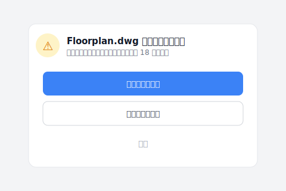
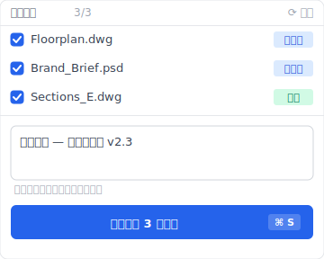
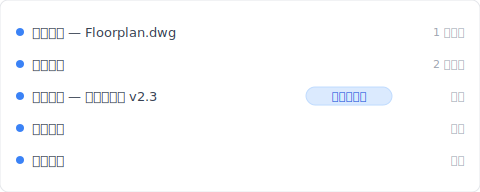

# 【2026 文件管理】共享文件夹的命名税：4 人团队一年花 83 小时改 _v7_FINAL_千万别动 后缀

> 周四下午五点半，你已经画完图，手却悬在文件名上。多人共享文件夹 + 手动命名 v1/v7/FINAL 的代价：一年 83 小时防御税。

周四下午五点半，办公室逐渐安静。你其实已经画完了中庭的平面图，本来可以准时下班去吃顿好的。但你的手悬在鼠标上，盯着屏幕里的文件夹。

里面躺着 `Floorplan_v6.dwg`、`Floorplan_v7_Client.dwg`、还有一份 `Floorplan_v7_FINAL_千万别动.dwg`。

你深吸一口气，右键点刚存好的文件，小心翼翼把文件名改成 `Floorplan_v8_送审版_0423.dwg`。然后你打开微信传给对面的同事：「那个…我刚存了 v8，你要改立面图记得抓这版、不要盖到我的喔。」

你不是在存档，你是在买保险。这份保险的代价就是这篇拆给你看：一年 83 小时防御税 + 命名规则 4 周后一定崩溃的设计缺陷。然后让你看 [Keeply](https://keeply.work) 怎么让 `_v8_千万别动` 后缀从你文件夹里永远消失。

## 本文目录

- [共享文件夹命名税一年 83 小时：Asana《Anatomy of Work》算给你看](#anxious-bill)
- [为什么共享文件夹命名规则 4 周后一定崩溃：纪律对抗赶件压力的设计缺陷](#naming-failure)
- [Keeply 怎么让共享文件夹的 _v8_FINAL 后缀从此消失：自动 30 分钟 + 手动写笔记](#auto-版本管理)
- [共享文件夹 + Dropbox / OneDrive / Google Drive 对照表：4 种工具各解什么](#compare-tools)
- [不必加 Keeply 的 3 种共享文件夹情境](#when-not-needed)

---

## 共享文件夹命名税一年 83 小时：Asana《Anatomy of Work》算给你看 {#anxious-bill}

根据 Asana《[Anatomy of Work](https://asana.com/resources/why-work-about-work-is-bad)》研究，知识工作者一年花 83 小时在做这些「关于工作的工作」(work about work)：确认、再确认、追进度、找最新版。把账单摊得更开，数字还会更高——[麦肯锡《The Social Economy》研究发现，员工每天约花 1.8 小时](https://www.mckinsey.com/industries/technology-media-and-telecommunications/our-insights/the-social-economy)、几乎是一周工时的五分之一，光是用来搜寻和收集信息。

这些只是冰冷的数字。真正的成本是那种**挥之不去的微型恐慌**。

你把图纸发给营造厂后突然背脊发凉、赶紧重新打开文件夹确认：「等等、我刚刚寄的是 `v7_FINAL` 还是 `v7_真的最终`？」主管问「这是不是最新版」、你不敢立刻点头、必须先说「我确认一下」、然后在一堆后缀词中玩猜谜游戏。

这不是管理出问题、也不是你或团队太散漫。是因为你们的工具把保护心血的责任全部推给了你们脆弱的记忆力。

4 个人的工作室就是 83 × 4 = 332 小时 / 年——大概一个半月的全职工时，纯粹消耗在防御命名上。

---

## 为什么共享文件夹命名规则 4 周后一定崩溃：纪律对抗赶件压力的设计缺陷 {#naming-failure}

每次发生图档被覆盖的惨剧，公司就会发起「文件夹整理运动」、要求大家严格遵守 `日期_项目_版本_姓名` 的军事化命名规则。

我自己当年在事务所也试过这条路。前两周、全部门都很乖。但到了第六周，有人赶着交件、顺手存了一个 `_NEW`；下游同事拿错版去出图、补图补一晚。三个月后文件夹又变回原本的垃圾山。看着那些乱七八糟的文件名、你心里甚至有一丝罪恶感、觉得是不是自己没把团队管好。

别傻了。这根本违反人性。

当你的大脑充满管线配置、法规检讨、设计变更时，你的手只会凭着「怕被覆盖」的恐惧本能地打上 `_FINAL`。命名规则把**机制问题**包装成**纪律问题**——纪律会被赶件击穿、机制不会。

而还有第二层问题：团队里只要有一个人偷懒存了 `_NEW`、整个下游的参考链结就连环崩溃。`.dwg`、`.psd`、`.indd`、`.xlsx` 跨文件的 reference 都会错指。一个人松懈、全团队重做。

软件业早就用版本控制工具解决这层问题——但那层工具一直没被搬到建筑、设计、研究这些产业。我们还在用手动加 `_v7` 对抗灾难。

---

## Keeply 怎么让共享文件夹的 _v8_FINAL 后缀从此消失：自动 30 分钟 + 手动写笔记 {#auto-版本管理}

[Keeply](https://keeply.work) 补的就是这层。装完之后、明天早上你打开共享文件夹——里面只有 `Floorplan.dwg`、`Brand_Brief.psd`、`Budget.xlsx` 几个干净的主文件名。没有 `_v7_FINAL`、没有 `_千万别动`、没有 `_真的最后一版`。

A 设计师上礼拜踩的案例：她下午改完平面图、习惯性想打 `_v8` 加保险。同事 B 喊她「不用啦你 Keeply 不是有开？直接存就好」。

她下午切去另一个项目文件夹前、Keeply 跳出一行提示——当前的 Floorplan.dwg 还有未保存的变更：

她按了「保存版本后切换」。这一步避免下午那批改动只剩 18 分钟前的自动存档。下班前她再点 Keeply 主窗口的「保存版本」按钮主动标一版、跳出对话框长这样：

她在笔记栏输入「中庭平面 — 业主签约版 v2.3」、点「保存版本」、关掉电脑走出办公室。

隔天早上下包打来：「不好意思我昨晚开那个档加了我的立面图、但好像把妳的中庭盖掉了。」

A 设计师打开 Keeply。时间轴长这样：

她点「中庭平面 — 业主签约版 v2.3」那一行——还原。3 秒钟。

那一行有笔记、是她下班前主动点「保存版本」打的标。下包昨晚改完的版本在最新一行的位置、她可以同时保留下包的立面图、把自己的中庭那层用 Keeply 拉回来。

没有 `_v8`、没有微信群「记得抓最新版」公告、没有 `_千万别动` 后缀。

3 件事一起运作：

- 共享文件夹里只留干净主文件名——下包打开文件夹看到的是 `Floorplan.dwg` 不是 12 个 `_FINAL`
- Keeply 每 30 分钟背景轮询、有变更才存——下包昨晚改的、A 设计师今天回办公室看 Keeply 就知道
- 重要时刻（业主签约版、送审版）亲手点「保存版本」+ 写笔记——半年后查得回、不是 `_v7_签约_真的这版` 猜谜

---

## 共享文件夹 + Dropbox / OneDrive / Google Drive 对照表：4 种工具各解什么 {#compare-tools}

把目前团队在用的方法摆一起看、每个工具负责的层次完全不同：

| 方法 | 解什么 | 不解什么 |
|---|---|---|
| **严格命名规则**（`日期_项目_v1_姓名.dwg`） | 形式上保留版本 | 违反人性、4 周后一定有人偷懒 |
| **Dropbox / OneDrive / Google Drive 同步** | 多人即时共享、本机档不弄丢 | 同事覆盖你的版本你不会收到通知、版本历史 30 天就删 |
| **Word / Google Docs 修订追踪** | 文字档谁改哪一句记得 | `.dwg / .psd / .indd` 设计档完全不支持 |
| **Keeply** | 自动 30 分钟留版 + 手动写笔记 + 本机跑 | SSD 物理坏掉（要搭 [3-2-1 备份原则](/zh-cn/post/3-2-1-backup-rule/)） |

每个工具有它对的场景。问题是团队协作这场战役**同时**需要「每次改动自动留版」+「跨文件 reference 不失效」+「重要版本有笔记能查」三层、而传统工具没有一个专做这三层。

详细的 backup vs 同步 vs 版本历史对照可看 [Keeply 跟备份、云端工具有什么不一样](/zh-cn/post/what-keeply-saves-vs-backup-cloud/)。

---

## 不必加 Keeply 的 3 种共享文件夹情境 {#when-not-needed}

几种情况确实不需要：

**你们完全在 Google Docs / Notion 工作**。文字档工作流可以靠 Google Docs / Notion 内建版本历史撑——它们有完整的逐字修订追踪。Keeply 主场是 `.dwg`、`.psd`、`.indd`、`.xlsx` 这类 binary 设计档。

**公司 IT 已经用 Veeam / Acronis / SVN / Git LFS 做版本管理**。集中化版本系统已经涵盖了——Keeply 是个人 / 小团队的本机工具、不取代企业版控系统。

**你们的共享文件夹只放短周期工作档**（一周内结案、不需要回头找）。如果你们不需要半年后找回「业主签约版」这种有意义的旧版、Dropbox 30 天版本历史就涵盖了。

以上都不适用——笔电族设计师 / 多人共享 NAS / 跨文件 reference / 半年后客户会回头问——这时候加一层像 Keeply 才划算。

---

## 延伸阅读

主篇 [文件版本管理完整指南](/zh-cn/post/file-version-management-complete-guide/) 拆解 4 个结构性原因——为什么工具就是没设计给你这件事。

对照阅读：[Keeply 跟备份、云端工具有什么不一样](/zh-cn/post/what-keeply-saves-vs-backup-cloud/) — 三件不同事的完整对照。

备份原则：[3-2-1 备份原则：20 年了还够用吗？](/zh-cn/post/3-2-1-backup-rule/) — 共享文件夹 + 3-2-1 防的是不同的灾难。

---

还记得周四下午五点半、手悬在文件名上那一刻吗？

那一刻你不是在存档、是在缴每年 83 小时的防御税。命名规则 4 周后会崩溃、微信群「记得抓最新版」公告永远发不完。

[Keeply](https://keeply.work) 接手那一层：文件夹里只留干净主文件名、版本史在时间轴看、重要版本你亲手点「保存版本」写笔记。下次下包盖到你的图、3 秒拉回来、不必补图补一晚。

---

## 研究来源

- [Asana《Anatomy of Work》Why Work About Work Is Bad](https://asana.com/resources/why-work-about-work-is-bad)
- 延伸参考：[IDC 报告《The High Cost of Not Finding Information》(2012)](https://computhink.com/wp-content/uploads/2015/10/IDC20on20The20High20Cost20Of20Not20Finding20Information.pdf)・[McKinsey Global Institute, The Social Economy (2012)](https://www.mckinsey.com/industries/technology-media-and-telecommunications/our-insights/the-social-economy)

---

> 关于作者：Ting-Wei Tsao，[Keeply](https://keeply.work) 创办人。
> [LinkedIn](https://www.linkedin.com/in/ting-wei-tsao-b57480152/)
