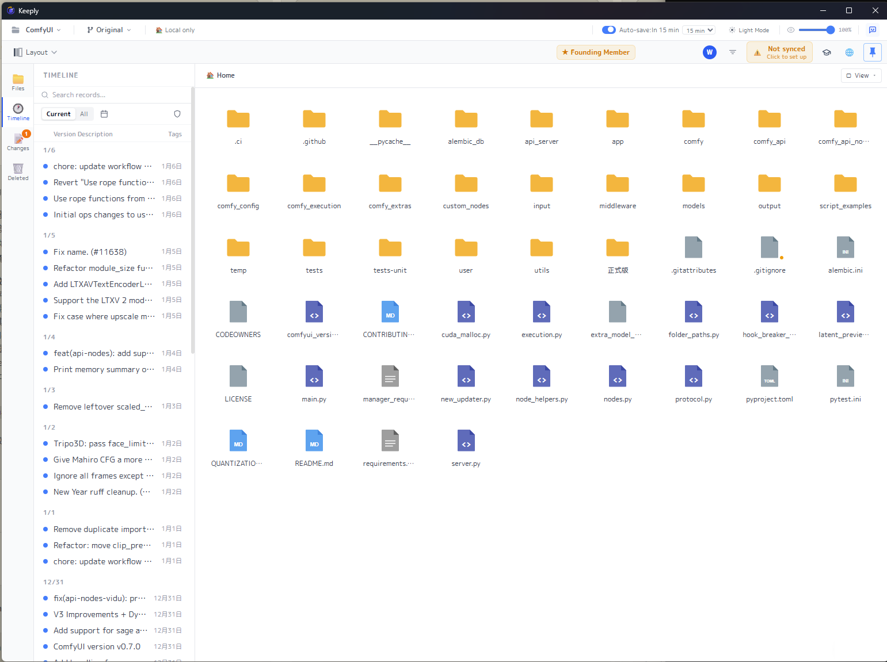
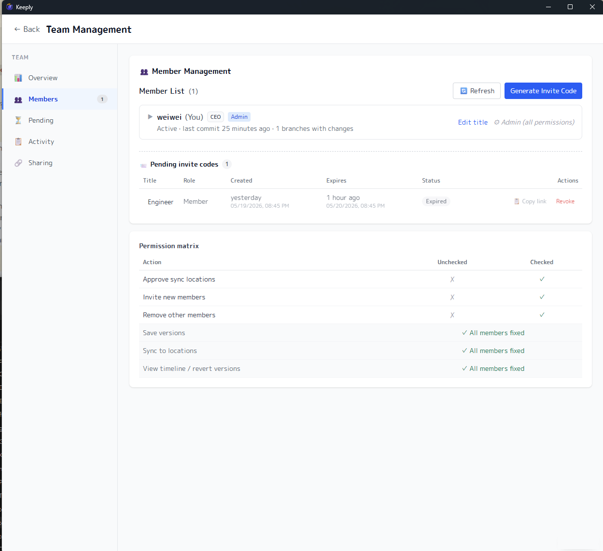

从 1.0.10 到 1.0.12，我们把重心放在团队，也顺手补了一轮稳定性和安全。

Keeply 打开就是你熟悉的文件夹界面：一格一格的文件和文件夹，左边一条时间轴记着你存的每一版。正因为长得像文件夹，1.0.12 的新东西你几乎不用学就会用：对着文件夹按右键就能打开、邀请同事像发一条链接那么简单。

## 🆕 新功能

### 右键「用 Keeply 打开」

以前要先打开 Keeply 窗口，再回头去找文件夹的路径。现在不用了：在文件资源管理器或桌面，对着任何一个文件夹按右键，就有「用 Keeply 打开」。少了两步，想保护哪个文件夹就直接右键。

### 团队邀请，从生成邀请码到加入

这一版我们把整段邀请流程重做了。

在你这端（管理员）：生成邀请码时可以填对方的名字、选他的角色（成员或管理员）、设置有效期（24 小时、7 天或永久），生成后同时给你**短代码**和**邀请链接**两种分享方式。你还能看到谁已经用了、谁还没加入、哪些过期了，随时一键撤销。

在同事那端：点开链接，他会看到「你正要加入 ◯◯ 的团队」的确认界面，按下去就加入，不用自己摸索要去哪里粘贴代码。

这一版一起到位的还有：

- **Ctrl + S / Cmd + S 快速保存版本**：在 Keeply 窗口里用你最熟的保存快捷键，立刻保存一个版本（等同于点「保存版本」按钮）。
- **免费的同事也能受邀加入**：对方不必先买授权，被邀进团队就会继承这个团队的权限，直接开始协作。
- **团队成员看得到「人」**：每位成员现在有名字和职称，团队面板一眼就看出谁是谁，不再只是一串代号。
- **付费徽章一点直达团队面板**：不用再进设置里绕。
- **团队角色权限（基础版）**：开始能按角色区分权限。老实说这还是第一步，更完整的权限设置还在路上。

## ✨ 体验改进

- 成员加入统一走邀请码，我们移除了旧的「手动添加成员」入口，流程更清楚。
- 位置卡片等界面做了清理，画面杂讯更少。
- 反馈问题时，Keeply 会自动带上更完整的诊断信息，我们能更快找到原因并修好。
- 授权指纹漂移会自动修复，换机器或环境变动时不再误判、不再把你锁在外面。

## 🛡️ 修复与安全

- 例行更新底层组件、修补了一批已知安全漏洞，其中包含文件同步连接的证书验证。
- 修掉团队与邀请流程的一连串问题，包含切换页面时残留的计时器。

## ⬇️ 下载与升级

到 [keeply.work](https://keeply.work) 就能下载 1.0.12；已经安装的话，会自动收到更新。

团队这条路我们才走到一半，接下来做什么，很大一部分看你的反馈。用了有任何想法，从 Keeply 里的「反馈问题」直接告诉我们，我会看到。

---

> 关于作者：Ting-Wei Tsao，[Keeply](https://keeply.work) 创始人。[LinkedIn](https://www.linkedin.com/in/ting-wei-tsao-b57480152/)
