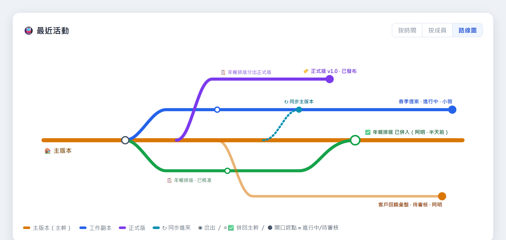

从 1.0.12 到 1.0.13，我们把最多心力放在一件事：把「不小心删掉的文件找回来」做成一个你信得过的面板。同时，酝酿很久的团队协作也接近完成，这版先让你抢先看一眼。

Keeply 打开就是你熟悉的文件夹画面：一格一格的文件和文件夹，左边一条时间轴记着你存的每一版。这版的新东西也照这个逻辑走——点一个文件就看它的历史、误删了就从时间轴找回来。

## 🆕 新功能

### 删除时光机：把误删的文件找回来

以前文件不小心删掉、又已经不在回收站，多半就只能认了。这版我们做了一个专门的面板：点左侧工具栏的 🗑️，就会看到一条「删除时间轴」，按今天 / 昨天 / 本周 / 更早分组，每一笔右边标着「🗑️ N」——这一版删掉了几个文件。

点某一笔，右边会像时光机一样展开那个时间点的文件树，自动翻到被删文件所在的位置。真正被删的文件用红色删除线标出来；如果其实只是改了名字，旁边会贴一个小提示「可能只是改名」，省得你白找。

勾选你要的文件（可以一次全选这一版删掉的），按「还原已选 N 个文件」，选一个文件夹放（默认桌面），它就照原本的文件夹结构帮你还原回去。文件名撞到的话，默认会自动加 `_restored` 后缀，不会覆盖你现有的文件。

### 点一个文件，只看它的版本历史

时间轴一直以来显示的是整个文件夹的版本。但很多时候你只想知道「就这一份文件，到底改过哪几版」。现在直接单击那个文件，左边的主时间轴就只剩这份文件的历史；看完按一下「回到全部版本」就回到完整时间轴。

### 文件管理器，更好看也更好用

- **一眼看出哪些文件改过**：在「变更」分页，没动过的文件会压灰、有改的会凸显出来，不用自己一个个比对。
- **文件夹卡片化 + 选中态**：文件夹改成卡片式图标，点选有明确的选中样式。
- **右键菜单统一**：不管在哪个视图、对文件还是对文件夹按右键，菜单都一致。
- **F5 一键刷新**：跟你习惯的一样，按 F5 就刷新当前画面。

## 🔭 即将开放：团队协作（抢先看）

先说清楚：团队协作**这版还没正式开放**，我们想先让你看一眼接下来的方向。这是 1.0.13 内部投入最多的一块，我们把整段协作流程补成了一条完整的线，等打磨好就会开给大家。

接下来会开放的包括：

- **从送审到合并一条龙**：成员把工作副本送主管审阅、附上说明；主管逐个文件留意见、批准或退回（退回写明原因）；批准后合并、成员端一键收尾。送审记录跨机器同步，不会只留在某一台电脑上。
- **任务指派与跟踪**：主管派工、成员一键开工；任务可拆成子项打勾看进度；送审 / 批准 / 退回会自动带动任务状态。
- **团队活动「地铁图」**：一张像地铁线路的图，主干是主版本、每位成员的工作副本是岔出去的支线，谁在动、哪条已合并、哪条还在审，一眼看完。
- **把现有文件夹收编成「团队正本」**：已经在用 Keeply 管的文件夹可直接设成团队正本，成员加入即继承授权，不必每个人重买。

开放时间还没定，会在准备好时通知你。如果团队协作正是你在等的，欢迎从「反馈问题」告诉我们你最想先要哪一段。

## ✨ 体验改进

- 存版本、同步、还原都改成在后台进行，操作当下画面不会卡住。
- 通知类提醒改到右下角浮层，不再挤压主画面。
- 时间轴的筛选文字去掉了技术术语，改用一般人看得懂的说法。
- 反馈问题时，Keeply 会自动带上正确的版本号，我们能更快对到是哪一版的情况。

## 🛡️ 修复与安全

- 修掉删除功能上线后、从真实使用中抓到的一批问题。
- 备份位置：盘符转成网络路径时，修好「达上限卡死」以及「旧位置已不存在却误报红字」。
- 安全存版本的把关更严谨：事前快照真的失败时，会中止有风险的操作，而不是硬做下去。
- 例行更新底层组件、修补了一批已知安全漏洞。

## 🔒 关于隐私

这版加了一个「匿名使用统计」的同意设置：它只会在你同意后，发送不含个人信息的使用信号，帮我们知道哪些功能有人用。默认你可以随时在设置里关掉，而且它**要到 2026 年 7 月 15 日才会真正启用**——在那之前，我们会在 App 里提前 30 天公告，不会无声开始。

## ⬇️ 下载与升级

到 [keeply.work](https://keeply.work) 就能下载 1.0.13；已经安装的话，会自动收到更新。

这版也补上了 **Intel 版 Mac**：除了 Apple Silicon，使用 Intel 处理器的 Mac 现在也有对应的安装包。

删除还原、单文件时间轴这些已经在你手上了，团队协作也快了。接下来做什么，很大一部分看你的反馈。用了有任何想法，从 Keeply 里的「反馈问题」直接告诉我们，我会看到。

---

> 关于作者：Ting-Wei Tsao，[Keeply](https://keeply.work) 创办人。[LinkedIn](https://www.linkedin.com/in/ting-wei-tsao-b57480152/)
