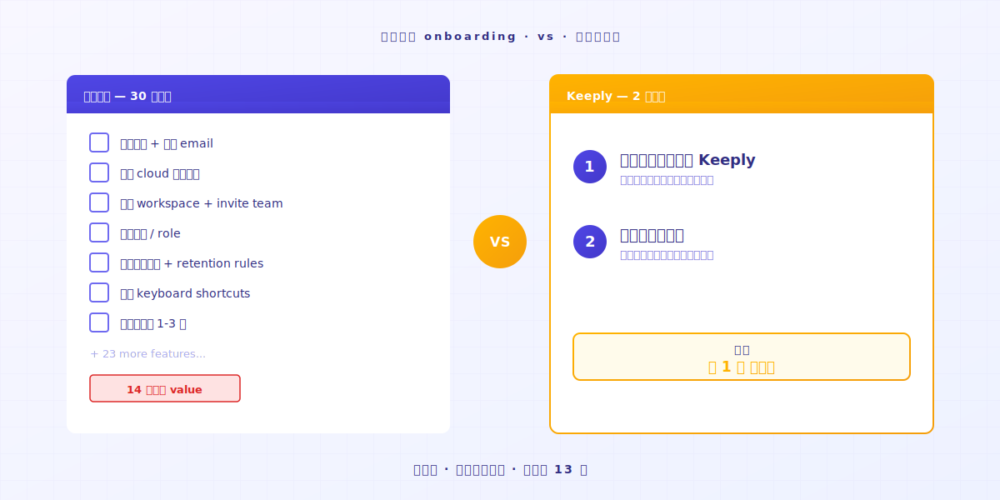
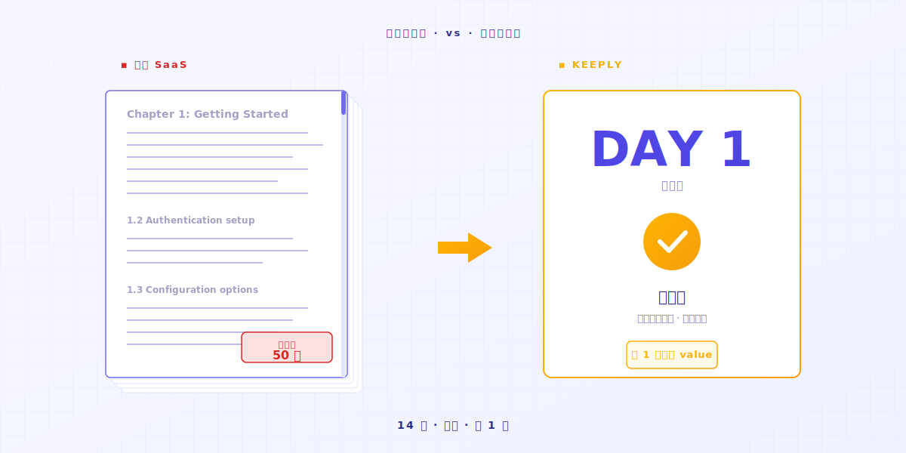
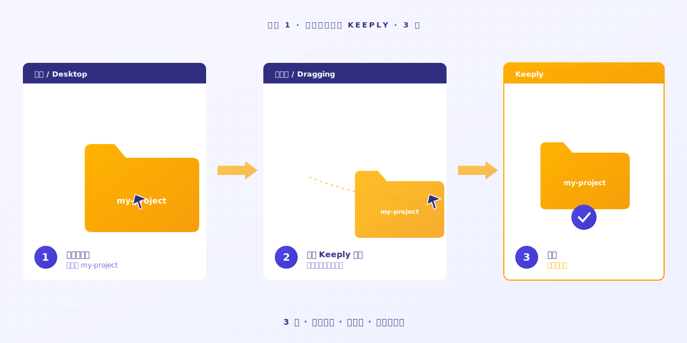
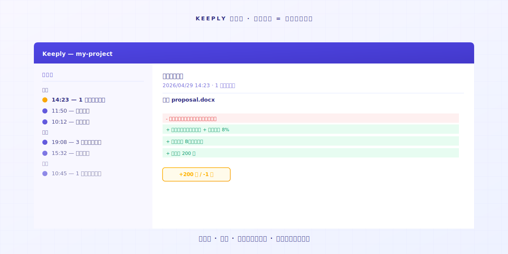
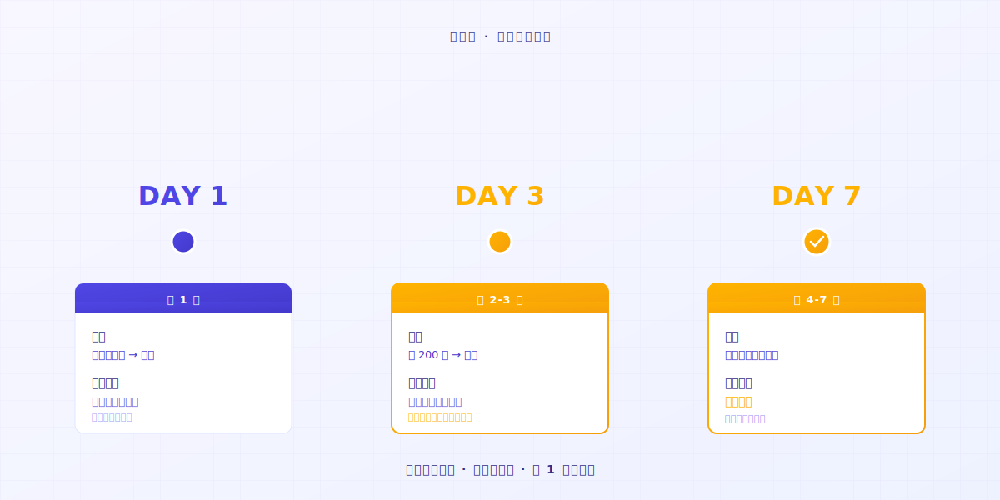

# 【2026 文件管理】Keeply 怎么用：不用学 30 个功能，2 个动作就上手

> 不必先变专家。把文件夹拖进去，继续工作。版本历史就生效了。

## 目录

1. [为什么你会排斥使用新的工具？](#why-resist-new-tools)
2. [你为什么会放弃一个工具？](#why-give-up-a-tool)
3. [那 2 个动作是什么？](#what-are-the-two-actions)
4. [我跟你说你会有什么体验？](#first-week-natural)
5. [Keeply 不适合你的时候](#when-keeply-isnt-right)

---

A 先生手上有很多项目，常常用记事本记录他每天做了什么，刚听说 Keeply 是一个很好用的文件笔记软件。他打开官网，看到「3 步骤开始」「7 天免费试用」。他上一个试的工具用了 14 天还没进入状况。价值都没有展现，耐心就被磨完了。**这次他想要 10 分钟决定**。

不是你不聪明。是传统软件学习曲线假设你今天愿意停下手头的事，先当 14 天的学生。

---

## 为什么你会排斥使用新的工具？ {#why-resist-new-tools}

你会排斥装新工具，是因为大多数工具默认你今天可以停下手头的事、花 14 天当学生。但你明天有要交的项目，没有 14 天空档可以学任何东西。

你昨天试装了一个工具。文档 50 页。新词 30 个。明天要交项目。

你想：「等下周再来慢慢看」。然后就再也没打开过。

多数软件企业把「14 天学完」当成天经地义。[业界研究](https://userpilot.com/blog/time-to-value-benchmark-report-2024/)显示，没走完一半新手引导步骤的用户，14 天内流失率是走完全程的 **3 倍**。

换句话说：软件默认你有 14 天空档。它默认你的工作可以等你学会它。

这 14 天空档默认里没有你的下一个项目。

---

## 你为什么会放弃一个工具？ {#why-give-up-a-tool}

学一套新工具大概要 14 天，这 14 天大部分都还在摸索。

走在探索期中途，多数人会想关掉。

我做 Keeply 之前，自己学习过很多新工具。很多用了第一天就觉得很麻烦，后面就继续用原来的老方法。

后来我意识到：真正让我留下来的工具，**可以直觉性使用才是重点**。

有一次我在用 AI 写代码，AI 改着改着失控了，我已经忘了它原本写到哪。**好在我有随时做文件记录**。

打开历史。**回到我可控的状态**。

那一刻我才知道：好工具不是「功能多」，是**够简单好上手**。没学任何功能，光是它默默接住了那个文件，这个工具的价值已经兑现。

不是工具有问题。**而是这类工具本来就不是设计成「学完再用」的**。

---

## 那 2 个动作是什么？ {#what-are-the-two-actions}

只有两个动作：**把一个文件夹拖进 Keeply，然后继续做你今天本来要做的事**。没有要设置的选项，没有要记的快捷键，没有 30 页文档。Keeply 在后台自动帮你保存版本历史。

### 动作 1：拖一个文件夹进 Keeply

真的就是拖进去。**不改命名、不分类、不思考结构**。

### 动作 2：继续工作

你今天本来要做的事，继续做。

改文件、保存、改回上一版、删掉重做。**Keeply 自动保存进左边的时间轴，产生一笔文件笔记**。你不用按任何按钮，不用记住任何快捷键。

也不用改文件名。那个 `_v3_真的最终.docx` 还是叫这个名字。Keeply 不动你的习惯。

第 1 天结束，你已经有 1 天份的文件笔记。**第 7 天结束，你已经有 1 周**。

直觉性使用，没有第二招。

---

## 我跟你说你会有什么体验？ {#first-week-natural}

### 第 1 天

拖一个项目进去，保存。

### 第 2-3 天

原来的文件改了 200 字，保存。

你透过时间轴看到自己的文件笔记开始出现。**笔记点进去，看到自己删了什么、增加了什么**。

### 第 4-7 天

你开始保存越来越多文件笔记。

某天你会发现：**有这个软件真好**。

---

## Keeply 不适合你的时候 {#when-keeply-isnt-right}

Keeply 不争所有场景。4 种情况下，别的工具更对。

- **如果你需要跨设备云端同步**：选 [IDrive](https://www.idrive.com/) 或 [Backblaze](https://www.backblaze.com/)。Keeply 存在你的电脑上，不是云端原生。
- **如果你需要系统还原 / 整个磁盘备份**：选 [Acronis True Image](https://www.acronis.com/)。Keeply 不做这个。
- **如果你是 IT pro 管 50 台以上机器**：选 [MSP360](https://www.msp360.com/)。Keeply 是给个人 / 小团队用的。
- **如果你只是不想丢掉个人文件**，Windows 内置的「文件历史记录」（File History）已经够用，不必装任何工具。

选工具像选同事，每个有它擅长的场景。诚实看清楚，少花 14 天试错。

---

## 收尾

你想试一个新工具，又不想浪费 14 天。这合理。

把文件夹拖进 [Keeply](https://keeply.work/)，继续做今天的事。

第 7 天再打开时间轴看一眼，**你会懂**。

---

## 延伸阅读

- [文件版本管理完整指南](/zh-cn/post/file-version-management-complete-guide/)（PILLAR 1，了解版本管理为什么重要）
- [Keeply 第一周：用 7 天观察日记验证 3 个真实信号](/zh-cn/post/keeply-first-week-workflow/)（装好之后第一周怎么跑）
- [Keeply 到底存什么？跟备份、云端工具有什么不一样](/zh-cn/post/what-keeply-saves-vs-backup-cloud/)（先搞懂 Keeply vs Dropbox / Time Machine 的差别）
- [Vibe Coding 失控了？1 个动作回到上一个能跑的版本](/zh-cn/post/vibe-coding-rollback/)（AI 改坏文件的典型场景）

---

> 关于作者：Ting-Wei Tsao，Keeply 创办人。
> [LinkedIn](https://www.linkedin.com/in/ting-wei-tsao-b57480152/)
