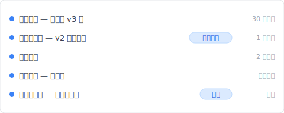
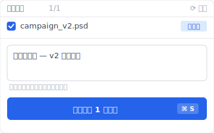
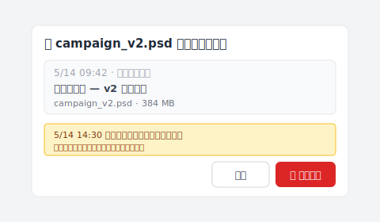

# 【2026 文件管理】Photoshop 自动保存救崩溃，救不了你盖掉客户版：Keeply 怎么补文件级版本历史

> Photoshop 自动保存只为崩溃而生。盖掉客户要的 v2 那种事它不接、你需要的是文件级版本历史。

你按下保存。光标闪了一下。

然后你想起来——那一份、是客户要的版本。

简报写的是「v2、但颜色用 v3 的」。你开的是 v2。你选了 v3 的色票。你存了。

完蛋。

被压过去的那层、现在是你手上唯一的 v2。你疯狂 google「photoshop 自动保存 location」、心想 Photoshop 应该偷偷在哪里留了副本吧——你打开自动保存文件夹、里面有一个文件、上周二的、今天的什么都没有。

你打开的文件夹是对的。问题在于、它做的事跟你以为的不一样。这篇拆完 Photoshop 自动保存 / 历史记录面板 / Time Machine / OneDrive 各自为什么救不了「盖掉客户版」这个场景、然后让你看 [Keeply](https://keeply.work) 怎么用「30 分钟背景轮询 + 主动保存版本 + 笔记」补文件级版本历史这层。

## 本文目录

1. [换 Keeply 后我的客户确认版自己一行、半小时前的 v2 一键还原](#keeply-timeline)
2. [Photoshop 自动保存文件夹打开、里面什么都没有——这是设计使然](#autosave-empty)
3. [Photoshop 自动保存为崩溃而生：自动保存 vs 版本历史的关键差别](#autosave-vs-version)
4. [历史记录面板也救不了你：单次 session 的 undo 记忆、文件一关就蒸发](#history-panel-fails)
5. [Keeply 怎么补文件级版本历史：30 分钟背景轮询 + 主动保存版本 + 笔记](#keeply-fills-gap)
6. [不必装 Keeply 的 3 种 Photoshop 场景](#when-not-needed)

---

## 换 Keeply 后我的客户确认版自己一行、半小时前的 v2 一键还原 {#keeply-timeline}

先让你看现在。同样是 `campaign_v2.psd`、客户要 v2 但颜色用 v3 的——在 [Keeply](https://keeply.work) 里，这个设计项目保管库的时间轴看起来是这样：

「客户确认版 — v2 主色完稿」自己一行、有「客户确认」tag——是我下午客户确认 v2 主色那一刻、主动点 Keeply 主窗口「保存版本」+ 写笔记存的。后来我改 v3 色票存错覆盖——「自动保存 — 主色改 v3 后」在时间轴上另一条、但前面那版「客户确认版」**没有消失**。

我打开 Keeply、点时间轴「客户确认版 — v2 主色完稿」那一行——3 秒还原回来、跟现在改错的 v3 并排对比、把 v3 的颜色复制过去、原本要重做一小时的图层工作 30 秒结束。

那行笔记怎么来的？客户确认那一刻、我点 Keeply 主窗口「保存版本」按钮、跳出来这个对话框：

写一行「客户确认版 — v2 主色完稿」、保存版本。Keeply 在背景每 30 分钟轮询文件变更——就算我忘了主动标、30 分钟内也会有自动保存版本。覆盖掉的灾难对 Keeply 来说只是时间轴上多一条记录、不会抹掉前面那一版。

下面拆 Photoshop 自动保存 / 历史记录面板各自为什么救不了「盖掉客户版」这个场景。

---

## Photoshop 自动保存文件夹打开、里面什么都没有——这是设计使然 {#autosave-empty}

自动保存文件夹从头到尾就是空的。它在等崩溃才会写东西；今天没崩溃、所以里面没今天的事。

面对这个空文件夹、设计师通常先做两件事：再 google 一次「photoshop 自动保存 在哪」、然后盯着文件夹发呆十分钟。两件事都白搭、因为自动保存从头到尾就是另一个机制——它是 Photoshop 为自己准备的紧急伞、伞是为「程式或系统突然死掉」开的、伞下站的人是 Photoshop 自己、不是你的版本历史。

这支紧急伞实际在做什么？Photoshop 监控的是「非正常结束」这件事——崩溃、强制关闭、系统 kernel panic。这些事情发生的时候、它会把内存里的工作状态写进一份 `.psb` 恢复文件；下次你打开 Photoshop、会跳出对话框问你要不要还原那份文件。

它的职责到这里为止。你存档盖掉自己上一个版本？这在 Photoshop 内部完全是另一件事——程式运作正常、使用者主动执行保存指令、自动保存机制连被触发都没。没崩溃、没东西需要救、所以也没东西被写进恢复文件夹。

想自己去文件夹翻一遍确认？[Adobe 官方文档有列出每个平台的精确路径](https://helpx.adobe.com/cn/photoshop/using/自动保存-recovery-后台-save.html)：Mac 的 `~/Documents/Adobe/自动恢复/`、Windows 的 `%AppData%/Adobe/Adobe Photoshop {version}/自动恢复/`。前几次 session 的旧 `.psb` 可能还躺着、但今天的工作从来没被写进去、也就还原不出来。

那为什么还有上千篇文章教你「自动保存文件夹在哪」？

---

## Photoshop 自动保存为崩溃而生：自动保存 vs 版本历史的关键差别 {#autosave-vs-version}

老实说、这是 Google 第一页没人愿意分清楚的差别：

| 机制 | 触发 | 救什么 | Photoshop 内建？ |
|---|---|---|---|
| **自动保存** | Photoshop 检测到异常结束 | 崩溃时内存里的工作状态 | ✅ |
| **版本历史** | 每次保存 | 每次保存的完整快照、永久保留 | ❌ |

**崩溃救援**是自动保存的工作——程式死了、文件没存、帮你回到当下那一刻。一份工作、一个位置。你能在 Adobe `偏好设置 > 文件处理` 选间隔（5、10、15 或 30 分钟）、但无论选哪个、存的都是同一个会被覆写的位置；新的覆盖旧的、没有历史、只有「最近一次可恢复的点」。

**存错救援**属于另一个机制——也就是版本历史这个 Photoshop 没做的东西。你保存把上一版直接覆盖过去。「另存新档...」会多出一份新档、原档还在、但原档的内容也已经是你最后存的版本、旧内容一样回不来。

回到那个「上千篇文章」的问题——它们答的是另一个比较容易答的问题。「自动保存在哪个文件夹」是技术 FAQ、「我盖掉了上一版怎么救」是设计问题；前者有答案、后者在 Photoshop 内没有。

最妙的是 Adobe 自己其实没在装。自动保存功能的官方名称叫「**背景保存与自动恢复**」。Adobe 把它叫「恢复」、我们自己读成「历史」、差别就在这里开始的。

---

## 历史记录面板也救不了你：单次 session 的 undo 记忆、文件一关就蒸发 {#history-panel-fails}

既然自动保存不是历史、那设计师下一个会试的通常就是历史记录面板——它听起来最像版本历史。

你打开历史记录面板、滑过去、看到今早做的 20 个步骤、但昨天的什么都没有。

历史记录面板是「单次 session 的 undo 记忆」。它住在正在跑的 Photoshop 程序的内存里、文件一关（或 Photoshop 一结束）、整段历史就蒸发了。隔天早上打开同一个 PSD、历史记录面板只剩一行：「打开」。昨天每一笔操作、每一笔笔触、每一次图层调整、历史记录里都不见了。像素还在文件里、怎么走到那些像素的轨迹不在。

「我有历史记录面板啊！」这是直觉反应。当下工作中确实没问题、但你昨天的工作关了文件就消失、整个 session 结束就清零。比较像便条：用过就丢。

Photoshop 预设保留 50 个步骤、你可以在 `偏好设置 > 性能` 调高。这个数字对你的问题没有帮助——这段历史活不过文件关闭、调再高都一样。

历史记录面板其实是「操作日志」——「你照这个顺序做了这些事」。它记的是动作序列、每次保存不会在这上面留任何记号、因为它没被设计来做这个。

所以你手上有三个看起来该救你的东西：自动保存（为崩溃而生）、恢复文件夹（前者放暂存的地方）、历史记录面板（session 内 undo、文件一关就蒸发）。

第四个没有。**文件层级的版本历史、Photoshop 没内建。** 就是这层缺失、把你带到这篇文章里。

---

## Keeply 怎么补文件级版本历史：30 分钟背景轮询 + 主动保存版本 + 笔记 {#keeply-fills-gap}

缺的那层住在 Photoshop 外面那一层——一个独立的程序、在背景每 30 分钟轮询一次文件系统变更。

把需要的东西精确定义一下。每存一次 PSD、Keeply 在 30 分钟内检测到文件变更、就把那一刻的完整字节快照保留下来、永远不覆写。今天存 20 次就有约 20 个快照堆着（如果改动跨多个 30 分钟轮询）。明天你盖掉客户要的 v2 了？回到「客户确认版」那一行、当前文件不动、过去版本另外恢复回来。

Photoshop 为什么不做这层？Adobe 把自己定位在绘图工具、文件在磁盘上的历史变化是文件系统层、操作系统、或第三方工具的责任、所以 Adobe 把这层留给别的工具补。

填这个空缺的工具不只一个。Apple Time Machine 试着补——但它是每小时系统快照、不是文件级版本历史、一小时前存过的 v2 你可能有救、也可能刚好抓到你已经改完的状态、纯看时机。OneDrive 跟 SharePoint 提供版本历史、预设保留 [500 个 major 版本](https://learn.microsoft.com/en-us/sharepoint/document-library-version-history-limits)、超过会被自动清除最旧那些（个人 Microsoft 账号更少、限 25 个版本）。Google Drive 规则更窄：每个文件最多 [100 个 revisions](https://developers.google.com/workspace/drive/api/guides/manage-revisions)、且超过 30 天的旧版会被自动清除（除非手动标记「Keep Forever」、这层上限 200 个）。[我们在另一篇文章详细拆过](/zh-cn/post/client-asked-which-version/) 为什么这层保留期接不到 3 个月后的交付。这些都是部分答案。

剩下的空缺、Keeply 想补。逻辑很简单：Keeply 监看的文件夹里放 PSD、它在背景每 30 分钟轮询一次文件变更（不依赖 hook 你按保存那一刻、是事后检查文件系统）、有改就把那一刻的完整版本保留一份。再肥的 PSD（500MB 一张那种）、Keeply 都在底层用 LFS 技术优化处理、不会把硬盘塞爆。

同时 Keeply 主窗口有一个「保存版本」按钮——客户确认版那一刻你主动点、跳对话框写笔记「客户确认版 — v2 主色完稿」、那一版单独被冻结。3 个月后客户问你哪版、翻时间轴看 tag 就有。

当你发现自己盖掉客户要的 v2 那一刻、打开 Keeply、滑到「客户确认版」那一行、按还原。跳出来的对话框长这样：

注意红色「还原这版」下方那行说明——5/14 14:30 后的修改不会被覆盖、会被另存为一个新版本。新旧版同时留在版本历史、谁也没丢。你看着两份视觉对比、把 v3 的颜色复制到还原回来的 v2 上面、原本要重做一小时的图层工作 30 秒结束。

顺便讲一下：Keeply 跟你已经有的 Adobe Creative Cloud、Time Machine、任何一种云端同步并排运作、它不取代任何一个。它只补那个其他工具都没处理到的空缺——二进位创意文件的永久文件层级版本历史、每 30 分钟轮询看一眼。

这也是[更广的文件版本管理问题](/zh-cn/post/file-version-management-complete-guide/)里、设计师感受最强的那一块。PSD 大、编辑具破坏性、客户会改变心意指的是哪一版 v2。

---

## 不必装 Keeply 的 3 种 Photoshop 场景 {#when-not-needed}

Keeply 救不回已经不存在的东西、诚实列几个情境。

**硬盘故障——那不是我们的领域**。磁盘坏了、扇区损毁、`.psd` 后缀被搞坏、那是 EaseUS、Disk Drill、Stellar Phoenix 那群工具的事。Keeply 假设你的文件还在磁盘上、只是内容已经变成你不想要的那一版；如果文件本身就消失了、你要找的工具是硬盘救援。

**Keeply 安装之前被盖掉的文件**也救不了。它从你装那一刻起开始记录版本、昨天盖掉的 v2、今天才装 Keeply、没有历史可以回。我承认这听起来废、但版本历史工具的本质就是这样——它记录的是从现在开始的时间流、往前是它不认识的时段。

**Photoshop 编辑中崩溃那一刻**。Keeply 30 分钟轮询、不会抓到那一刻的中间状态。Photoshop 自动保存 / 自动恢复 仍是第一道线（Photoshop 自己的紧急伞）。Keeply + Photoshop 自动保存互补、各管一段、并排运作。

---

下次客户确认版那个瞬间、会再来。

打开 [Keeply](https://keeply.work)、看时间轴顶端那条「客户确认」tag——下次你盖掉 v2、不用再 google「photoshop 自动保存 location」盯着空文件夹发呆。点时间轴还原、3 秒拿回来。

整个 panic 解掉。

自动保存在它被设计的那个工作里——把你从崩溃带回来——做得不错。它只是不该被期待去解一个从来没打算解的问题。版本历史属于另一个工具的工作。

下次存错之前要把这层加到 PSD 上、[Mac 或 Windows 都可以装 Keeply](/zh-cn/post/install-keeply-windows-mac/)。

---

*作者：[Ting-Wei Tsao](https://www.linkedin.com/in/ting-wei-tsao-b57480152)，[Keeply](https://keeply.work) 创办人。Keeply 是为设计师、建筑师、知识工作者打造的文件版本历史工具——不用学 Git 也能单档还原到任何过去版本。*
