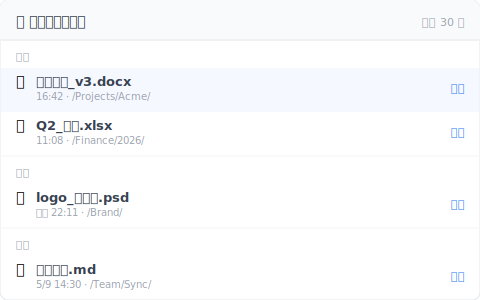

---
title: "【2026 文件管理】文件恢复软件不一定救得到：4 种你以为有回收站，但其实早已消失的情境"
description: "按了 Delete 发现回收站是空的？破解 SSD TRIM 机制与文件恢复软件的盲区，告诉你为什么事前防御比事后取证更可靠。"
date: 2026-05-06T08:50:00+08:00
draft: false
slug: restore-without-panic
locales: [zh-TW, en, zh-CN, ja, ko, it]
categories: [文件管理]
tags: [文件恢复, 版本控制]
image: cover.svg
og_image: cover.png
role: cluster
pillar_parent: file-version-management-complete-guide
template: T1
primary_keyword: "文件恢复"
voice_version: v2-2026-05-11
image_alt_data: "四个原因说明为何需要时回收站已清空：最近刚清空、位于共用磁盘、使用 Shift+Del、云端垃圾桶超过 30 天——事前安装的文件层版本工具是唯四情境均有效的唯一解法"
faq_schema:
  - q: 为什么 SSD 上的删除文件恢复软件几乎救不回来？
    a: 现代电脑多使用 SSD，Windows 7 后默认开启 TRIM 机制，删除时 OS 立刻告诉 SSD 把该区块标为空白可重用，恢复软件扫描到的只有一片零。业界直言：声称能从启用 TRIM 的 SSD 救出已删文件的公司，不是无能就是在骗客户。
  - q: 有哪些情境下文件根本不会进入回收站？
    a: 4 种情境直接绕过回收站：从 NAS 或 SharePoint 等共享磁盘删除（直接抹除）、按 Shift+Del 快捷键（OS 设计即永久删除）、云端回收站超过 30 天保留期自动清空、以及你前天刚手动清过回收站。
  - q: 为什么事后的文件恢复比事前防御更不可靠？
    a: 事后恢复依赖「发现的时机」，TRIM 触发后扇区立即被标记可覆写，每多拖一小时成功率急速下降。SSD 加 BitLocker 加密的环境下恢复概率基本为零。事前防御在你存版本的当下就留着，完全不依赖发现时机。
  - q: Keeply 可以解决哪些文件恢复软件解不了的场景？
    a: Keeply 在工具层建立版本记录层，不靠云端也不靠外接硬盘：共享磁盘 NAS 或 SharePoint 上作业一样保留历史；离线工作无需全程在线；没有 30 天保留期上限，3 个月前的版本时间轴上仍找得到。
  - q: Keeply 有哪些恢复场景做不到？
    a: 三种情境 Keeply 无法处理：SD 卡与手机照片需要专门 App；整块磁盘物理损毁需要备份工具加 3-2-1 原则；以及 Keeply 安装前已删除的文件，因为它是事前防御工具，无法溯及既往。
---

# 【2026 文件管理】文件恢复软件不一定救得到：4 种你以为有回收站，但其实早已消失的情境

> 按了 Delete 发现回收站是空的？破解 SSD TRIM 机制与文件恢复软件的盲区，告诉你为什么事前防御比事后取证更可靠。

## 本文目录

- [恢复软件不敢说的致命伤：SSD + TRIM](#trim)
- [4 种打从一开始就没进过回收站的情境](#scenarios)
- [真正可靠的恢复，在文件层](#file-layer)
- [诚实的边界：Keeply 不做的事](#limits)

---

你按了删除键。打开回收站，里面是空的。

你接着 Google「文件恢复」，第一页的广告叫你下载 Recoverit 或 Disk Drill。先慢一秒。我做 Keeply 之前也买过一轮 Recoverit 想救自己误删的家人照片，直接告诉你结论：绝大多数情境里，那 400 块的软件救不了你的文件。

多数时候，OS 根本没留下任何恢复痕迹。而且这并不是什么罕见的小意外——在 [Handy Recovery 2024 年的调查中，误删是数据丢失最常见的单一原因，甚至高于硬件故障](https://www.handyrecovery.com/data-loss-statistics/)。

---

## 恢复软件不敢说的致命伤：SSD + TRIM {#trim}

那些恢复软件做的是「扇区扫描（Sector Scanning）」，试图找出磁盘上没被覆盖的字节来重组文件。这在十年前的传统 HDD 时代听起来很合理，但在现代电脑上，这条路几乎已被封死。

现代电脑多数使用 SSD（固态硬盘）——[到 2024 年，笔记本电脑的 SSD 搭载率已逼近 100%，意味着几乎每一台新笔电出厂都配备 SSD（TrendForce）](https://www.trendforce.com/presscenter/news/20251107-12774.html)——而 Windows 7 之后默认开启了 TRIM 机制。当你删除文件时，OS 会立刻发送 TRIM 指令，告诉 SSD 把那个区块标记为空白可重用。

这代表恢复软件扫描过去，看到的只会是一片零。数据恢复公司 Hetman 曾直言：「如果恢复公司声称能从启用 TRIM 的 SSD 救出已删文件，他多半不是无能，就是在骗客户。」（[Hetman 官方说明](https://hetmanrecovery.com/recovery_news/data-recovery-is-impossible-ssd-cloud-and-online-services.htm)）我自己后来也跟几位数据恢复工程师聊过，得到的答案都一样。

再加上 Windows Update、云端同步或浏览器缓存每分钟都在写入新数据。你删档后每多拖一小时，扇区被覆盖的概率就直线飙升。如果你的硬盘还开了 BitLocker 加密，那恢复概率基本上就是零。

---

## 4 种打从一开始就没进过回收站的情境 {#scenarios}

除了硬件限制，还有 4 种日常情境，会让你的文件直接绕过回收站，当场消失：

1. **共享磁盘的陷阱**：你在 NAS、SharePoint 或公司网络磁盘里删了文件。系统会直接抹除，根本不会退回到你本机的回收站（[Microsoft 官方文档](https://learn.microsoft.com/en-us/windows/win32/shell/recycle-bin)）。团队最常发生的悲剧就是：「以为删了可以去回收站捡，结果 IT 说那是直接从 NAS 消失。」
2. **手滑按了 Shift+Del**：OS 的原生设计，快捷键按下去就是物理超度，不留记录。
3. **云端回收站已过期**：OneDrive 默认 30 天、Google Drive 30 天、Dropbox Basic 30 天。时间一到，云端端点也会自动清空（[OneDrive 官方说明](https://support.microsoft.com/en-us/office/restore-deleted-files-or-folders-in-onedrive-949ada80-0026-4db3-a953-c99083e6a84f)）。
4. **你前天刚顺手清过回收站**：对 OS 来说，清理指令已完成，该文件彻底脱离追踪。

简单来说：市面上的恢复软件，只有在「传统 HDD + 刚刚才删 + 磁盘完全没新写入」这个极度狭窄的完美条件下才有效。而你在办公室里遇到的，几乎都不是这种情境。

---

## 真正可靠的恢复，在文件层 {#file-layer}

不要再迷信事后的「磁盘取证」，真正的答案是在文件系统之上，铺一层静默的「版本记录层」。

这就是 Keeply 的位置。它不靠云端、不靠外接硬盘，而是在你每次按下保存时，自动在后台留下一份版本。

- **不怕共享磁盘**：就算在 NAS 或 SharePoint 上作业，一样能保留历史。
- **Offline-first**：不需要全程在线同步。
- **没有 30 天大限**：没有云端严苛的保留期上限，3 个月前的版本，时间轴上照样找得到。

不只是版本历史，Keeply 也有一个独立的「最近删除」清单，把过去 30 天里你动手砍掉的文件、按时间分组列出来：

不必先回想「我是什么时候删的」，打开面板看一眼名字就找得到，按右边「还原」就回到原本的位置。比起翻系统回收站，这条路在你还没急着 Cmd+S 盖掉前，就已经接住你了。

想看更深的版本历史设计理论，可看 [Pillar：文件版本管理完整指南](/zh-cn/post/file-version-management-complete-guide/)。

---

## 诚实的边界：Keeply 不做的事 {#limits}

我一样要诚实标示 Keeply 的极限：

- **不救 SD 卡与手机照片**：那是另一个领域的工具，请找专门的 App。
- **不防整颗磁盘物理损毁**：这是备份工具的事，请去买外接硬盘并遵守 [3-2-1 备份原则](/zh-cn/post/3-2-1-backup-rule/)。
- **不救「安装前」的文件**：Keeply 是事前防御工具，不是事后取证软件。在你装上它之前删除的东西，它无能为力。

下次按下删除键引发灾难之前，[今天先装好 Keeply](/zh-cn/post/install-keeply-windows-mac/)。

---

> 关于作者：Ting-Wei Tsao，Keeply 创办人。
> [LinkedIn](https://www.linkedin.com/in/ting-wei-tsao-b57480152/)
