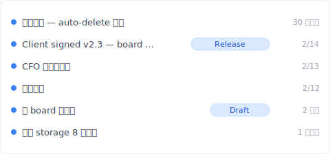
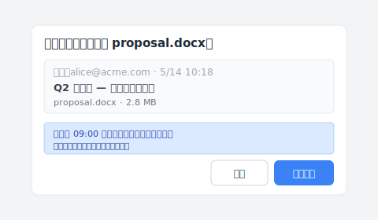

# 【2026 文件管理】SharePoint 版本历史：500 个版本上限 + 自动删除 设定的隐藏成本

> Microsoft 2024 给了 IT 管理员 一个 存储 省钱按钮。按下去之前该知道你会失去什么。

“SharePoint 你昨天才设了 自动删除 100。今天客户问你‘3 个月前那版’在哪？打开历史只剩 100 个版本——前面那 250 版、Microsoft 已经帮你删了。”

这不是 错误、不是教学没看清楚。是 [Microsoft Learn 官方文件](https://learn.microsoft.com/en-us/sharepoint/document-library-version-history-limits)写清楚的机制：500 主要版本上限 + 2024-Q4 推出的 自动删除 设定（500 / 100 / 50 / 期限 截止 四段位）。本文拆 SharePoint 版本历史的 3 个机制 + 自动删除 设了之后**失去什么**，加上 [Keeply](https://keeply.work) 怎么接住超过 上限 后的场景。

## 本文目录

1. [Keeply 怎么让 SharePoint 版本历史“不被 自动删除 吃掉”](#keeply-timeline)
2. [SharePoint 版本历史 3 个机制：500 major + 511 minor + 自动删除](#three-mechanisms)
3. [500 主要版本上限：Microsoft 官方数字、IT 管理员 容易误解的细节](#500-cap)
4. [自动删除 4 段位：500 / 100 / 50 / 期限 截止 真实成本](#自动删除)
5. [SharePoint 存储配额：你压 100 真的省多少？](#存储-quota)
6. [Keeply 补位：跨 SP 存储层级 的 发布版冻结 + 单档 笔记](#keeply-fills)
7. [3 种你不需要 Keeply 的 SharePoint 场景](#when-not-needed)
8. [常见问题](#faq)

---

## Keeply 怎么让 SharePoint 版本历史“不被 自动删除 吃掉” {#keeply-timeline}

先看现在会发生什么。James 是中小企业的 IT 兼任 admin、5 人团队用 SharePoint Online 共用 `proposal.docx` 改提案。半年累积 200 多版、SharePoint 存储配额 用到 8 成、他刚在 管理中心 设了 自动删除 100——下个月 存储配额 会降回安全范围。

但今天客户忽然问他“2 月 14 日 董事会 确认的那版”在哪。打开 SP 版本历史只剩最近 100 个版本、2 月 14 日那版已经被 自动删除 吃掉。

换 [Keeply](https://keeply.work) 就不会。同一个 `proposal.docx` 在 Keeply 的时间轴看起来这样：

“Client signed v2.3 — 董事会核可”自己一行、有 Release tag——是 James 在 2 月 14 日客户确认后、主动点 Keeply 主视窗“保存版本”+ 写笔记存的：

写一行“Client signed v2.3 — 董事会核可”、保存版本。半年后翻 Keeply 时间轴看 tag 就有——**不受 SP 自动删除 影响、不被自动删除**。

操作只有 2 个动作：

1. **存档**——他在 Word 按 Ctrl+S、SharePoint 同步云端（如常）、Keeply 在背景 30 分钟内看到变更、自动存一版进**自己的时间轴**。
2. **标里程碑**——重要时刻（董事会 确认 / 客户签 / 上线版）点 Keeply 主视窗“保存版本”+ 写笔记。

下面拆 SharePoint 自家 3 个机制——为什么 自动删除 100 设了之后 250 版直接消失。

## SharePoint 版本历史 3 个机制 {#three-mechanisms}

SharePoint 讲“版本历史”是 3 件不同的事被混在一起：

| 机制 | 是什么 | 上限 | 触发 |
|---|---|---|---|
| **主要版本**（Major version） | 每次保存的完整版本 | **500 个**（[MS Learn](https://learn.microsoft.com/en-us/sharepoint/document-library-version-history-limits)） | 预设每次保存自动 |
| **次要版本**（Minor version） | 草稿状态（需开启 major/次要版本ing 才有） | 511 个（额外） | 草稿存档 |
| **自动删除 设定** | IT 管理员 可设更严格的 上限 | 500 / 100 / 50 / 期限 截止 | 管理中心 设定 |

3 件事、混在一起问会找错方向。“找不到 3 个月前那版”可能是 500 上限 撞到、可能是 自动删除 设了 100 / 截止、可能是 admin 把它从 site 整个搬走了。**先确认你的 site 设了什么 自动删除 才知道在哪层解。**

## 500 主要版本上限：Microsoft 官方数字 {#500-cap}

[Microsoft Learn 文件](https://learn.microsoft.com/en-us/sharepoint/document-library-version-history-limits)写得很清楚：SharePoint Online 文件库每个文件最多保留 **500 个主要版本**。启用主要 / 次要 版本管理 后可再加 511 个次要版本。

**容易误解的细节**：

- **不是“500 个任意版本”**——是 **500 major + 511 minor**（两个独立 pool）
- **超过会自动删最旧的、不通知**——跟 OneDrive 机制一样（[详细看 OneDrive 版本历史](/zh-cn/post/onedrive-version-history/)）
- **每个文件独立计算**——不是 站点集合 共用 500
- **2024-Q4 之前所有 site 预设 500**、之后 IT 管理员 可在 管理中心 设成更小

**谁会撞到 500 上限**：

- 5 人团队每天轮流改 proposal、每天 3 次保存 = 月 ~66 版 → **约 7-8 个月** 撞 上限
- IT 管理员 想 清理 把 上限 压到 100 = 撞 上限 速度 × 5

## 自动删除 4 段位：500 / 100 / 50 / 期限 截止 真实成本 {#auto-delete}

Microsoft 2024-Q4 推出 SharePoint 管理中心 的 [version history 自动删除 settings](https://learn.microsoft.com/en-us/sharepoint/version-history-limits)、IT 管理员 可选：

| 段位 | 保留版本数 | 适合场景 | 失去什么 |
|---|---|---|---|
| **500（预设）** | 最近 500 个 | 存储 充裕、想保留完整历史 | 第 501 次保存后失去最旧 1 版 |
| **100** | 最近 100 个 | 存储 开始紧、团队改动少 | 第 101 次保存后最旧版自动删 |
| **50** | 最近 50 个 | 存储 紧张、轻度版本需求 | 大量历史失去（高频保存场景惨） |
| **期限 截止（自订天数）** | 过 N 天的版本永久删 | 法规 retention 场景 | 过了 N 天的旧版救不回（回收站 也捞不到） |

**真实 存储 省多少**：以 [note.shiftinc 案例](https://note.shiftinc.jp/n/n4eaa1ebddd34) 为例、设了 自动删除 后该 租户 存储配额 占用率从 85% 降到 35%。但代价是：截止 前的版本永久删。

**没人写的关键风险**：自动删除 是 site-collection 层级设定、IT 管理员 设了之后 end user 看不到、不会被通知。3 个月后找不到某版，end user 还以为 SP 坏了。

## SharePoint 存储配额：你压 100 真的省多少？ {#storage-quota}

SharePoint 存储配额 是 租户层级 + 站点集合 level 加总：

- **Microsoft 365 Business Standard**：1 TB / 租户 + 10 GB / user
- **Microsoft 365 Business Premium**：1 TB / 租户 + 10 GB / user
- **Enterprise E3/E5**：5 TB / 租户 + per-user 存储 额外计

`proposal.docx` 平均 1.5 MB × 500 主要版本 = 750 MB / 一个文件。500 个 活跃文件 × 750 MB = 375 GB → 撞 1 TB 租户 上限。

**自动删除 100 后**：1.5 MB × 100 = 150 MB / 档 → 500 档 × 150 MB = 75 GB → 租户 7.5% 占用。确实是 5 倍 存储 节省。

**但**：你失去了 80% 的历史。客户 3 个月后问 董事会 签的那版、可能就在那 400 版被删掉的范围里。

## Keeply 补位：跨 SP 存储层级 的 发布版冻结 {#keeply-fills}

James 的场景：5 人团队 + SP 存储 紧 + 想 清理 但又怕失去重要版。

[Keeply](https://keeply.work) 给他 3 件事一个工具：

- **发布版冻结**：在 董事会 确认那天、James 点 Keeply“保存版本”标“Client signed v2.3”——这版冻结在**本机 + Keeply 自己备援位置**、不被 SP 自动删除 影响、永久保留
- **单档 笔记**：每版 1-2 行笔记。3 个月后翻时间轴看“CFO 第三轮修改”“董事会 签”tag、不必猜 SP 上 100 版里哪个是哪个
- **跨工具 portability**：Keeply 不依赖 SP。James 即使换 Dropbox / NAS、时间轴还在本机 + Keeply 备援位置、不被任何 cloud vendor 的 上限 锁死

5 人协作场景常遇到的另一个动作：同事改了 SP 上同一份 `proposal.docx`、你想把对方那版套到自己本机改的版本上。Keeply 的「套用同事版本」对话框长这样：

注意蓝色提示那行——本机 09:00 后的编辑不会被覆盖、会另存为独立版本、两版都留在版本历史。不必先 email 互传「最新版.docx」、不必担心套错版盖掉自己的修改。

SP 留给团队协作 sync + 存储 压 100、Keeply 给 无上限 单档版本历史 + 重要版冻结。**两个并行、各做自己强项**。

## 3 种你不需要 Keeply 的 SharePoint 场景 {#when-not-needed}

诚实写：

**企业合规封存**。SOX、HIPAA、GDPR 要 审计轨迹 + 加密 + 保留期管理——走 [Microsoft 365 Backup](https://www.microsoft.com/en-us/microsoft-365/business/microsoft-365-backup) / Veeam / Acronis。Keeply 是日常版本管理、不是合规工具。

**500 版以内 + 不开 自动删除 的个人 / 小团队**。如果你 存储配额 用不到一半、根本不必设 自动删除——SP 预设 500 已经够用、Keeply 是 过度。

**100% 纯移动设备 工作流**。Keeply 是桌面优先、手机端轻。如果你团队 90% 用 Office 移动版 + SharePoint 移动版 改档，Keeply 不在主视野里、价值不显。

## 常见问题 {#faq}

**Q1: SharePoint 每个文件最多保留几个版本？**

500 个主要版本（[Microsoft Learn](https://learn.microsoft.com/en-us/sharepoint/document-library-version-history-limits)）。开启主要 / 次要 版本管理 后可再加 511 个次要版本。超过自动删最旧、不通知。

**Q2: SharePoint 自动删除 是什么？**

Microsoft 2024-Q4 推出、IT 管理员 可在 管理中心 设 4 段位：500 / 100 / 50 / 期限 截止。存储成本 vs 历史完整性的 取舍。

**Q3: SharePoint 版本历史跟 OneDrive 一样吗？**

底层 存储 一样（SP document library）、机制一样。差别在使用情境（个人 vs 团队）+ admin 设定的可控性。

**Q4: 自动删除 开了之后找不回半年前那版怎么办？**

截止 前的版本永久删、回收站 也捞不到。要避免就需外部工具备援关键版本——例如 [Keeply](https://keeply.work) 发布版冻结。

**Q5: SharePoint 存储配额 不够、不开 自动删除 还有什么办法？**

3 个选项：（1）付费加 存储；（2）开 自动删除 接受失去历史；（3）外部工具搬重要版本出 SP。

**Q6: Keeply 跟 SharePoint 冲突吗？**

不冲突、并行运作。SP 同步协作、Keeply 给 无上限 单档版本历史 + 发布版冻结。

## 延伸阅读

主篇 [文件版本管理完整指南](/zh-cn/post/file-version-management-complete-guide/)。

对照阅读：
- [OneDrive 版本历史：500 个版本天花板](/zh-cn/post/onedrive-version-history/)——同 MS family 的个人云端对位
- [Excel 版本历史的限制](/zh-cn/post/excel-version-history-limits/)——Excel 同款 500 机制
- [Keeply 跟备份、云端工具有什么不一样](/zh-cn/post/what-keeply-saves-vs-backup-cloud/)

---

James 在 SP 管理中心 设 自动删除 100。下个月 存储 真的降回安全范围。

但今天客户问 董事会 签的那版、SP 已经帮他删了。

Microsoft 已经把 取舍 写进文件。你不需要 SharePoint 不变、你需要 SharePoint 压 存储 的时候还有工具接得住历史。

---

> 关于作者：Ting-Wei Tsao，[Keeply](https://keeply.work) 创办人。
> [LinkedIn](https://www.linkedin.com/in/ting-wei-tsao-b57480152/)
