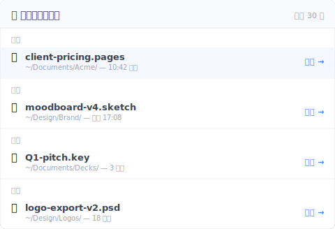

---
title: "【2026 文件管理】Time Machine vs Dropbox：backup、sync，跟两者都不是的第三轴"
description: "每篇 Time Machine vs Dropbox 比较文都把它写成 backup vs sync 二选一。两个说法都对，但都漏了第三轴——文件层级故意保存的版本历史——两个工具都不做。3 个月后想找你「当时故意保存的那版」，那道缺口才是真痛点。"
voice_version: v2-2026-05-13
date: 2026-05-13T09:00:00+08:00
draft: false
slug: "time-machine-vs-dropbox"
retrofit_status: v1-legacy
primary_keyword: "Time Machine Dropbox 区别"
locale: zh-CN
categories: [文件管理]
tags: [版本控制, 云端同步, 工具对比]
image: cover.svg
og_image: cover.png
cta_topic: backup
role: cluster
pillar_parent: file-version-management-complete-guide
locales_required: [en, zh-TW, zh-CN, ja, ko, it]
image_alt_data: "三轴图表对比 Time Machine（磁盘层 快照）、Dropbox（云端同步）、第三轴「文件层级故意保存的版本历史」——说明标准 Time Machine vs Dropbox 比较只涵盖 3 轴中的 2 轴"
faq_schema:
  - q: Time Machine 会 backup 我的 Dropbox 文件夹吗？
    a: 默认会。Time Machine 会 快照 整个家目录包含 Dropbox 文件夹。但它 backup 的是同步好的状态——不是 Dropbox 本身的版本历史。如果想排除 Dropbox 省 Time Machine 空间，可以加进 Time Machine 排除清单。
    
  - q: 光跑 Time Machine 够吗？
    a: 对「磁盘坏了 / 整台 Mac 重装」的灾难恢复来说够——Time Machine 能恢复整台机器。但对「我要找 2 个月前某个礼拜二下午我特地保存的那版」来说不够——Time Machine 是 hourly 磁盘 快照，不是文件层级的保存意图记录。
    
  - q: Time Machine 跟 Dropbox 都要跑吗？
    a: 两者解不同问题，多数人都会两个都跑——Time Machine 做整盘恢复、Dropbox 做跨设备同步加异地副本。但即使两个都跑，第三轴还是空的——每个文件故意保存的版本历史，无 retention 上限。
    
  - q: Time Machine 快照 跟 Dropbox 版本历史区别在哪？
    a: Time Machine 快照 是磁盘层——hourly 整盘 快照，随时间 thin 掉旧的。能恢复 快照 涵盖到的任何文件，但你是按「日期」翻不是按「保存事件」。Dropbox 版本历史是文件层——保留每个文件的版本清单，但免费版 30 天 上限、付费 180 或 365 天。Time Machine 认得磁盘、Dropbox 认得文件、两个都不认得你的保存意图。
    
  - q: 两个都不解的第三轴是什么？
    a: 文件层级的故意保存版本历史——无时间 上限、无计数 上限——在后台每隔一段时间（15/30/60 分）把改动自动存成可回溯的版本，加上「标记某版为『这是送给客户的那版』」让它永远不被覆盖。像 Keeply 这类工具就是在磁盘备份跟云端同步之外，独立做这第三层。
---

# 【2026 文件管理】Time Machine vs Dropbox：backup、sync，跟两者都不是的第三轴

> 每篇比较文都写成 backup vs sync。两个说法都对。两个都漏了 3 个月后你真的会用到的第三轴。

周五晚上 6:18，你在找「改价格前那一版」的提案。你记得是 2 个月前那个礼拜二——下午你特地保存了一版。

打开 Time Machine。技术上资料在里面——但 Time Machine 要你翻一整叠整个 Documents 文件夹的 快照。你不记得确切日期，只记得「2 个月前礼拜二午餐后」。

打开 Dropbox。版本历史 30 天。没了。

你发现主流建议「两个都跑」给了你两个工具，但两个都不回答你真正想问的问题。

## Time Machine vs Dropbox 比较文真正在比的东西

你读过的每篇比较文都把它写成两轴对决：

| 轴 | Time Machine | Dropbox |
|---|---|---|
| 本机磁盘备份 | ✅ 整盘 快照 | ❌ 不是它的工作 |
| 跨设备云端同步 | ❌ 不是它的工作 | ✅ 核心功能 |

两个都对、两个都真。每篇结论：「两个都用」。建议合理——范围错了。

因为还有第三轴没被摆上桌。

## 第三轴：文件层级故意保存的版本历史

每篇比较文都漏的这件事：**每个文件故意保存的记录，无时间 上限、无计数 上限，加上能标记某次保存为「这个版本永远不准被盖掉」**。

把第三轴加回表格：

| 轴 | Time Machine | Dropbox |
|---|---|---|
| 本机磁盘备份 | ✅ 整盘 hourly 快照 | ❌ |
| 跨设备云端同步 | ❌ | ✅ |
| **文件层级故意保存版本历史** | ⚠️ 只到磁盘层，不到文件层 | ⚠️ 30 天 上限（付费 180） |

Time Machine 有 快照，但是磁盘层。它不知道你下午 2:47 对某个文件做了重要修改。它只知道下次整点 快照 时的磁盘状态，那可能是 2:00（你保存之前）或 3:00（你保存之后，但夹杂其他改动）。

Dropbox 有文件层版本，但免费 30 天 上限、付费 180 或 365 天。过了 上限，那份文件级历史就没了。

所以当你要「2 个月前礼拜二下午故意保存的那版」时，Time Machine 有 bytes（在某个 快照 里）但没有索引。Dropbox 本来有索引，第 31 天扔了。

## 为什么第三轴不会出现在比较文里

这是分类学问题。

评测站比较的是被定位为「竞争对手」的产品。Time Machine 跟 Dropbox 其实不是竞争对手——Apple 随 OS 出货一个、Dropbox 卖订阅。「vs」的 framing 是用户误以为两者重叠，因为两者都碰文件。

第三轴——文件层级故意保存版本历史——主流工具没人占这个 slot。所以评测站找不到 vendor 放这格，轴就消失了。

你按可见的轴选工具。挑 Time Machine 加 Dropbox、感觉都涵盖了，等用到时才发现缺口。

## 第三轴做得好的工具长什么样

围绕「文件层级故意保存版本历史」设计的工具会做这些事：

- **你能手动把某个时刻标记成一版，后台再每隔几分钟自动补存**——不是只有整点快照
- **无时间 上限**——2 年前的版本跟昨天的一样好叫出来
- **无计数 上限**——500 次保存之后，最早的还在
- **「Release」或「Milestone」标记**——把某次保存标成「这是我 3 月 8 号送给客户的版本」，永远不被覆盖
- **跟 Time Machine 跟 Dropbox 共存**——不取代它们，活在第三轴上

[Keeply](https://keeply.work) 是这层的一个实现。本机跑、盯着你加进去的文件夹、后台每隔一段时间（15/30/60 分）自动抓变更，重要时刻也能手动存一版、无时间上限。Release 功能让你把某版冻结成里程碑。

```
Keeply — 2 个月前礼拜二下午

2026-03-08 — 礼拜二
─────────────────────────────────
● 14:23   proposal.psd          （自动保存）
● 14:47   proposal.psd          ★ Release：client-pricing-v1
● 15:11   proposal.psd          （自动保存）
● 15:42   proposal.psd          （自动保存）
```

那个 ★ 标记就是你要的「礼拜二下午故意保存的那版」——撑过 Dropbox 30 天 上限、撑过 Time Machine hourly thinning、撑过你自己忘记是哪一天的记忆。

顺带一提，第三轴对「最近丢掉的文件」也有对应的窗口——按时间分桶、永久层留着、不被 30 天时钟吃掉：



挑文件还原、不需要先还原整颗磁盘才挑得到单文件。

## Time Machine 跟 Dropbox 还是要跑

这篇不是叫你取代任何一个。

**Time Machine** 是对的工具用在：硬件故障后整盘恢复、「Mac 被偷我要恢复到新机」、「我想 undo 一个坏的系统更新」。它是完整的磁盘安全网。要跑。

**Dropbox** 是对的工具用在：跨设备同步、跟客户共享文件夹、工作中文件的异地副本。它是完整的同步方案。要跑。

两个都做不好的事：「给我这个文件某个我只记得个大概日期的版本，不是那整天的整盘 快照」。那是第三轴。

## 第三轴不值得加的场景

3 个边界，这篇 frame 不适用：

**你不留超过 30 天前的文件**：如果工作流程是短周期、30 天前的东西不重要，Dropbox 30 天窗口就够。别加你用不到的复杂度。

**你的工作完全在 Pages / Numbers / Keynote**：Apple 原生档类型有内建版本历史，不依赖 Time Machine 或第三方工具。第三轴本来就 build-in 进档案格式。代价是档案类型 lock-in。

**你在需要不可变存档的合规产业**：版本历史不是 合规封存。如果 GDPR / HIPAA / SOX 要求「这个版本创建后不能再被修改」，你需要 archive 级工具（Veeam、Acronis），不是 Time Machine + Dropbox + 版本历史。

## 延伸阅读

主篇 [文件版本管理完整指南](/zh-cn/post/file-version-management-complete-guide/) 拆解 4 个结构性原因——为什么工具就是没设计给你这件事。

[比 iCloud 跟 Dropbox 之前先看：4 家云端共通的版本历史天花板](/zh-cn/post/cloud-version-history-cliff/) — 云端 vs 云端的对比；本篇是本机 vs 云端。

[Keeply 到底存什么？跟备份、云端工具有什么不一样](/zh-cn/post/what-keeply-saves-vs-backup-cloud/) — 同一个 3 层思考换个 Keeply-为主角 framing。

---

「Time Machine vs Dropbox」从来没有单一答案，因为从来就不是对的问题。

对的问题是：你想覆盖哪一轴？你有没有一个工具住在那一轴上？

Backup 轴：Time Machine。Sync 轴：Dropbox。版本历史轴：不在你读的那张比较表里。加一层住在那、或接受缺口存在并知道它在那里。

3 个月后当你要礼拜二下午故意保存的那版时，答案是「点、3 月 8 号、还原」——不是「我先开 Time Machine 翻一小时」。

---

> 关于作者：Ting-Wei Tsao，Keeply 创办人。
> [LinkedIn](https://www.linkedin.com/in/ting-wei-tsao-b57480152/)
