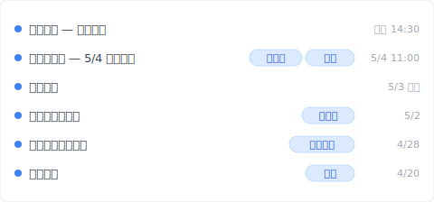
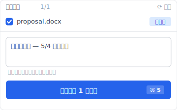
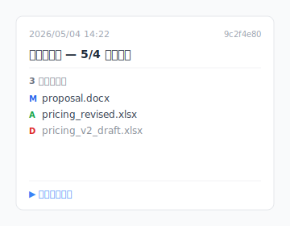

---
title: "【2026 文件管理】文件命名规则救不了你：3 种让你不必再命名 _v3_FINAL 的工具设计 + Keeply 怎么接手"
description: "你那串 `_v3_FINAL_真的最终.docx` 不是强迫症、是工具没给你回头路的求生反应。换 Keeply 后 11 个 `_v3_FINAL` 变一条时间轴、客户签约版自己一行 tag、4/28 客户反馈后也在——这篇拆完「太多版本」其实是 4 种不同的痛。"
voice_version: v3-2026-05-15
date: 2026-05-04T20:15:00+08:00
draft: false
slug: too-many-file-versions
primary_keyword: "文件 命名 规则"
locale: zh-CN
derived_from: zh-TW
locales: [zh-TW, en, zh-CN, ja, ko, it]
categories: [文件管理]
tags: [版本控制, 操作失误]
image: cover.svg
og_image: cover.png
role: cluster
pillar_parent: file-version-management-complete-guide
image_alt_data: "文件命名链 proposal_v3.docx → v3_FINAL → v3_FINAL_v2，标题问「客户签的是哪一个？」——AutoSave、Time Machine、Dropbox 均只能回溯 1-2 个版本，使命名军备竞赛成为看似唯一的出路"
faq_schema:
  - q: 为什么大家会把文件命名为 _v3_FINAL？
    a: 因为现有工具的版本历史不可靠（Dropbox 30 天、AutoSave 1-2 版），人脑只能用文件名当作备援机制。「_v3_FINAL」是无声的不信任投票：你不相信工具会帮你记得历史，所以自己手动标记。

  - q: 「太多版本」其实是哪 4 种不同的痛点？
    a: 4 种混在一起的问题：分不出哪个是「正本」、想找特定时间点的版本却没有索引、改错了想退回却找不到上一版、跨人协作不知道别人改了什么。每种痛点需要不同设计来解，无法用一个「再多备份」解决。

  - q: Keeply 怎么接手 _v3_FINAL 这层责任？
    a: Keeply 在背景每 30 分钟轮询文件变更（不依赖 hook 你按保存那一刻、是事后检查文件系统）。加上你可以主动点 Keeply 主窗口「保存版本」按钮、写笔记（如「客户签约版」「老板第三轮修改」）标重要里程碑、之后永远回得来。文件夹里只留干净主文件名 `proposal.docx`、不再 `_v3_FINAL_真的最终`。

  - q: 什么时候 Keeply 不是「太多版本」问题的正确解法？
    a: 大量 raw 影音素材每天累积几十 GB 不适合（Keeply 不是冷存方案）；实时多人协作会议记录用 Notion 或 Google Docs 更好；以及纯法务签核流程用 DocuSign 等专业工具。
---

# 【2026 文件管理】文件命名规则救不了你：3 种让你不必再命名 _v3_FINAL 的工具设计 + Keeply 怎么接手

> `_v3_FINAL_真的最终.docx` 不是强迫症、是工具没给你回头路的求生反应。

周四晚上 11:47、你在桌面找客户今天签好的版本。11 个 `提案_v*_FINAL.docx` 排在那里。哪个是客户签的、哪个是你自己加注的、哪个是 IM 收到后又改一次的。你不敢删、但留着找不到。

这不是个案。每个用保存键工作的人都遇得到。这篇拆完为什么会这样、「太多版本」其实是 4 种不同的痛、然后让你看 [Keeply](https://keeply.work) 怎么用「30 分钟背景轮询 + 主动里程碑」接手 `_v3_FINAL` 这层责任。

## 目录

1. [换 Keeply 后我的 11 个 _v3_FINAL.docx 变一条时间轴](#keeply-timeline)
2. [为什么你会命名 `_v3_FINAL`？工具没给你回头路的求生反应](#why-naming)
3. [「太多版本」其实是 4 种不同的痛点：误覆盖 / 客户反馈轮 / 同步冲突 / 自动保存残留](#four-types)
4. [你做的事是对的、工具没接棒——3 种工具设计怎么解](#three-designs)
5. [不必装 Keeply 的 4 种「太多版本」场景](#when-not-needed)

---

## 换 Keeply 后我的 11 个 _v3_FINAL.docx 变一条时间轴 {#keeply-timeline}

先让你看现在。同样一份 `proposal.docx`、同样从初稿改到客户签约——在 [Keeply](https://keeply.work) 里，这个提案保管库的时间轴看起来是这样：

「客户签约版 — 5/4 业主确认」自己一行、有「客户签」+「定版」两个 tag——是 5/4 客户签完那一刻、我主动点 Keeply「保存版本」+ 写笔记 + 冻结为 Release（对应 ADR-003）的版本。「老板第三轮修改」「客户第一轮反馈后」「初稿提案」也各自一行、有 tag。

文件夹里只有一个文件：`proposal.docx`。没有 `_v3_FINAL`、没有 `_真的最终`、没有 `_老板要再改_v2`。文件名干净、版本史在 Keeply 时间轴看。

那行笔记怎么来的？5/4 客户签完那一刻、我点 Keeply 主窗口「保存版本」按钮、跳出来这个对话框：

写一行「客户签约版 — 5/4 业主确认」、保存版本——同时冻结成 Release、业主签过的那一版永远不被后续保存覆盖。3 个月后客户问哪版、翻时间轴看 tag 就有。

加上 Keeply 在背景每 30 分钟轮询文件变更——就算我忘了主动标、30 分钟内也会有自动保存版本。覆盖掉的灾难不再存在。

下面拆为什么你会本能打 `_v3_FINAL`、那其实是 4 种不同的痛。

---

## 为什么你会命名 `_v3_FINAL`？工具没给你回头路的求生反应 {#why-naming}

保存是个永久动作。你按下去、旧版本就被覆盖。没有「半小时前那一版」可以回去。设计师的 PSD、律师的合同 docx、学生的论文、全都是这样。**不命名你会丢掉**。所以你才在文件名后面加 `_v3`、`_FINAL`、`_真的最终`。

对啊、这就是让人烦的地方。你做的事不是强迫症、是操作系统没给你「恢复半小时前那一版」这条路时的求生反应。

---

## 「太多版本」其实是 4 种不同的痛点：误覆盖 / 客户反馈轮 / 同步冲突 / 自动保存残留 {#four-types}

把「太多版本」拆开看、会发现是 4 种完全不同的问题。每种要的解法也不同。

| # | 痛点类型 | 典型现场 | Keeply 对应 |
|---|---|---|---|
| 1 | **用户误覆盖** | 存完才发现「啊半小时前那一版才是对的」 | 30 分钟背景轮询 + 时间轴还原 |
| 2 | **客户反馈轮** | `合同_v3_客户意见.docx` / `提案_v5_老板要再改.docx` 连环往复 | 主动「保存版本」+ 写笔记标里程碑 |
| 3 | **云端同步冲突** | Dropbox / OneDrive 两端同改、产生 `提案 (Bill 的 conflicted copy).docx` | 本机副本 + 主动推送（[Dropbox 冲突副本](/zh-cn/post/dropbox-conflicted-copy/) 细讲） |
| 4 | **软件自动保存残留** | Word `.asd` / Premiere `.bak` / PSD `.psb` 自动备份散在各处 | 工具教学（学会清缓存）、跟版本管理无关 |

你以为在解的是同一件事、其实是 4 件不同的事。第 1 类要工具自动保留历史；第 2 类要冻结里程碑；第 3 类要同步冲突解析；第 4 类要工具教学。**先诊断你是哪一种、再去找解法**。

---

## 你做的事是对的、工具没接棒——3 种工具设计怎么解 {#three-designs}

你在文件名后加 `_v3_FINAL` 逻辑上是对的——你需要标记版本的意义。错的不是你、是工具层没提供「自动存档点」「自动标里程碑」这些机制、把责任丢回给文件名。你只好用唯一能用的工具——文件名——来解这个问题。

整理大师会教你「命名要有规则」、列 14 页的命名惯例 PDF、要团队背前缀顺序。听起来很合理、但做起来只能撑三天。

问题在于：**规则把版本管理的责任丢给人类纪律**。而纪律永远赢不过自动化。你今天记得 `2026-05-04_提案_v3_客户签.docx`、明天赶时间就变 `提案_v3_最终.docx`、后天客户再改一次就是 `提案_v3_最终_v2.docx`。

把工具能做的事拆成 3 种设计模式：

### Design A：自动存档点（不依赖用户纪律）

工具背景轮询文件变更、无论你存几次都留下历史、你不必命名。**例子**：macOS Time Machine（Apple 内建、每小时自动存一版）、Word AutoSave（只回最近 1-2 版）、Dropbox 30 天版本史。**Keeply** 在背景每 30 分钟轮询你的工作文件夹：文字档只记变动内容、影像跟设计档每版完整保留、这样大文件不会把硬盘撑爆。**解第 1 类痛点**。

那些版本后来怎么找回？鼠标悬停 任一笔、Keeply 浮卡列当时改了哪些文件、不用打开就能比对：

点下去开完整 diff、或直接按右键还原。不必再用 `_v3_FINAL_v2_最终.docx` 这种文件名标记哪版是哪版。

### Design B：里程碑冻结（你自己标「客户签」「上线」）

你主动标「这版客户签了」、「这版上线了」、之后不论怎么改、冻结点还在。**例子**：GitHub Release（工程师圈把某个时间点的程式码冻结成版本的功能、只给开发者用）。**Keeply** 内建一个叫「发行版」的功能（对应 ADR-003）、做同一件事但你不用学任何术语：在版本历史里选一版、按一下「冻结为发行版」、之后永远回得来。**解第 2 类痛点**。

### Design C：单档还原（从历史拉一个文件出来）

从历史任何版本还原**单一文件**、不必整文件夹退回。**例子**：Dropbox 的单档 restore、Time Machine 单档还原。**Keeply** 加上版本内文搜索——你记得「上周改过某段话」、可以直接搜索变动内容、定位到那一版、把那个文件拉出来。**解第 1 + 2 类混合场景**。

这时候你就会发现、4 种痛点里第 4 类（软件自动保存残留）走的是另一条路径：工具教学（学会清缓存）、跟版本管理无关。

---

## 不必装 Keeply 的 4 种「太多版本」场景 {#when-not-needed}

Keeply 不解所有场景：

**Raw 影音素材**。每天累积几十 GB Premiere 素材、disk 真的不够、Keeply 不是冷存方案。要走专业影音 archive（Adobe Bridge / DAM 系统）。

**百万档以上的文件夹**。Keeply 设计范围是数百到数千档的工作文件夹、再多会卡。企业级走 Veeam / Acronis / 集中备份系统。

**纯跨团队频繁冲突合并**。1 小时内 5 人轮流改一份文档、Keeply 冲突解析 UI 仍受限、用 Google Docs 共同编辑比较顺。

**合同终版冻结 / 客户 de实时rable 签核流程**。那种场景就该手动命名 + 走 DocuSign 等专业签核工具、Keeply 不是合规签署平台。

以上都不适用——你常踩「太多 _v3_FINAL 找不到哪个是定版」、想要客户签 / 老板改 / 客户反馈各自一行 tag——这时候装 Keeply 才划算。

---

## 延伸阅读

主篇 [文件版本管理完整指南](/zh-cn/post/file-version-management-complete-guide/) 拆 4 个结构性原因——为什么工具就是没设计给你这件事。

对照阅读：[Dropbox 冲突的副本：为什么一直出现？](/zh-cn/post/dropbox-conflicted-copy/) — 解第 3 类痛点。

共享文件夹的命名税：[共享文件夹的命名税：4 人团队一年花 83 小时改 _v7_FINAL_千万别动 后缀](/zh-cn/post/hidden-cost-shared-folders/) — 多人共享的设计缺陷。

---

下次你保存、不会再害怕「万一这版是错的」。因为「万一」根本不存在了。每一版都还在、你只要找得到。

打开 [Keeply](https://keeply.work)、看时间轴顶端那条「客户签」tag——文件夹里只有一个 `proposal.docx`、版本史在 Keeply 看、不必再 `_v3_FINAL_真的最终`。

---

> 关于作者：Ting-Wei Tsao，[Keeply](https://keeply.work) 创办人。
> [LinkedIn](https://www.linkedin.com/in/ting-wei-tsao-b57480152/)
