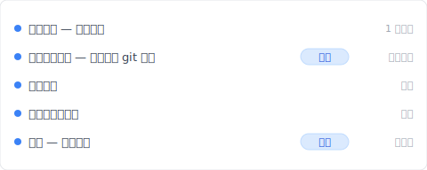
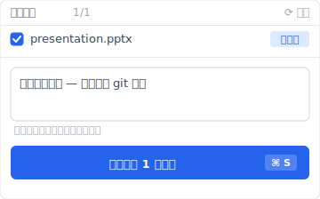
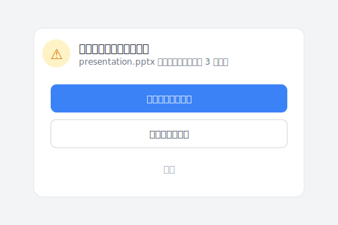

# 【2026 文件管理】「版本管理软件」搜出来都是 git？非开发者的 3 种选择 + Keeply 不打一行命令

> Google 把「版本管理」这个词默认成「工程师搜索」。非开发者的选项被挤到第二页以后。

你 Google「版本管理软件」。跳出来的是 git、SVN、Mercurial 教程。终端机命令、黑底白字、存档点、合并、推送。读 5 分钟就放弃了。你不是工程师、是设计师、行政、接案者。你只是想要一个「看得到文件的窗口」就能管版本的软件而已。

这不是你哪里搜错、是 Google 把「版本管理」这个词默认成「工程师搜索」。这篇拆完为什么会这样、非开发者需要什么、然后让你看 [Keeply](https://keeply.work) 怎么用「30 分钟背景轮询 + 主动标里程碑」做版本管理——**不打一行 git 命令**。

## 目录

1. [换 Keeply 后我的版本管理长这样（不打一行 git 命令）](#keeply-timeline)
2. [为什么搜「版本管理软件」只跑出 git？SERP 把非开发者挤到第二页](#why-only-git)
3. [非开发者需要的 4 个设计要件：文件层 / 免命令 / 二进位 / 直觉还原](#four-requirements)
4. [软件业早就解决版本管理、为什么没搬给非开发者？设计思维没过来](#why-never-crossed-over)
5. [非开发者实际能用的 3 个选择：Time Machine / Dropbox 版本历史 / Keeply](#three-options)
6. [Keeply 不适合的 4 种使用情境](#when-not-needed)

---

## 换 Keeply 后我的版本管理长这样（不打一行 git 命令） {#keeply-timeline}

先让你看现在。同样是 `presentation.pptx`、同样从初稿改到客户签——在 [Keeply](https://keeply.work) 里，这个简报项目保管库的时间轴看起来是这样：

「客户简报定版 — 不打一行 git 命令」自己一行、有「定版」tag——是我今天上午客户确认后、主动点 Keeply 主窗口「保存版本」+ 写笔记存的。不用打 `git commit -m "client approved"`、不用懂 `HEAD~3` 是什么。

整个操作只有 2 个动作：

1. **保存**——你在 PowerPoint 按 Ctrl+S。Keeply 在背景 30 分钟内轮询看到变更、自动存一版进时间轴。
2. **标里程碑**——重要时刻（客户签 / 上线版）点 Keeply 主窗口「保存版本」按钮、跳对话框写一行笔记：

写一行「客户简报定版 — 不打一行 git 命令」、保存版本。3 个月后回头看、翻时间轴看 tag 就有。

没有 `git commit`、没有 `branch / merge / checkout`、没有黑底白字终端机。Keeply 底层其实用 git engine（技术上是好的）、但 UI 完全没有工程师术语——界面是「保存版本 / 记录 / 还原」这种日常词。

连工程师工具最常逼你学的 `git stash` 这层也省掉——你在这个项目边改边忘了存版本、要切到另一个客户文件夹时，Keeply 直接拦下来、用日常话问你：

「存一版，再切过去」就是你在工程师世界要打的 `git stash` + `git checkout`、变成两个中文按钮。

下面拆为什么 Google 不会自然给你看这层、传统工具为什么不满足非开发者。

---

## 为什么搜「版本管理软件」只跑出 git？SERP 把非开发者挤到第二页 {#why-only-git}

「版本管理软件」搜索意图其实**一半一半**：一半是工程师（要比较 git / SVN / Mercurial 这类版本控制系统）、另一半是非开发者（要看得到文件的窗口、不想学命令）。

但 Google 搜索结果**100% 都显示工程师那一半**：Atlassian、GitHub、Stack Overflow 把前 10 名霸占了。非开发者的需求被挤到结果第二页以后。

没人告诉你的是：你找不到不是因为你搜不对、是你需要的工具被挤出视野了。

---

## 非开发者需要的 4 个设计要件：文件层 / 免命令 / 二进位 / 直觉还原 {#four-requirements}

把「版本管理软件要什么」拆开看、工程师工具满足不了 4 个要件：

| # | 要件 | 工程师工具满足不了的原因 | Keeply 对应 |
|---|---|---|---|
| 1 | **看得到文件的界面** | git 是用「存档点」当单位、看不到你想看的「proposal.docx 在哪里」 | 文件层 UI、窗口看得到 |
| 2 | **不用打命令** | git 默认要用终端机（有 GUI 但学习曲线一样陡） | 纯 GUI、没终端机 |
| 3 | **大文件能装得下** | git 为纯文字优化、PSD、DWG、影片这类大档不擅长 | 底层 LFS、PSD/DWG 都支持 |
| 4 | **直觉的还原界面** | git 的「checkout」「reset」「revert」三个概念对非工程师很混乱 | 一个「还原」按钮、不用学三个概念 |

git 是**为文字程式码设计的工具**。设计师、行政、接案者的文件场景跟它本质上不对。

---

## 软件业早就解决版本管理、为什么没搬给非开发者？设计思维没过来 {#why-never-crossed-over}

软件业 20 年前就解决版本管理：工程师按一次保存、整份程式码的历史轨迹都留得干干净净。问题是那层工具从来没搬给非开发者用。

不是技术做不到、是设计思维没过来。工程师工具的词汇（branch、merge、HEAD）、默认流程（先 commit 才能切换）、UI（黑底白字终端机）、都假设使用者已经是工程师。你不是工程师、那套工具就跟你无关。

非开发者需要的是**从零为他们设计的版本管理工具**、不是把工程师工具的界面换个颜色。[Keeply](https://keeply.work) 走的是这条路：不假设你懂 git、也不教你 git、从文件层的视角设计版本历史。底层用 git engine（技术上是好的）、UI 完全藏起来。

对啊、这就是让人烦的地方。Atlassian、GitHub、Stack Overflow 都对工程师讲话、从来没有人正面回答「不是工程师的人想要的版本管理长什么样」。

---

## 非开发者实际能用的 3 个选择：Time Machine / Dropbox 版本历史 / Keeply {#three-options}

3 个非开发者可以实际用的选项、各有取舍：

### 选项 A：macOS Time Machine（Mac 内建）

Apple 从 2007 年起在每一台 Mac 内建的功能：插上外接硬盘、系统每小时自动存一份完整快照、要回到 3 个月前那一份文件打开、点两下就有。**优点**：免费、看得到文件、不用打命令、什么文件都行。**缺点**：只限 Mac、还原界面要走时间轴动画、没有「冻结成里程碑」这个功能、要外接硬盘连着才存得到。**适合**：Mac 个人使用、只要偶尔还原。

### 选项 B：Dropbox 版本历史（30 天限定）

30 天内的版本 Dropbox 自动留着、从文件右键→「之前的版本」就能还原。**优点**：跨平台、团队共享方便。**缺点**：超过 30 天就清掉、不支持单元格层级比对、会产生「冲突副本」（[参考另一篇](/zh-cn/post/dropbox-conflicted-copy/)）、版本只有时间戳没有笔记。**适合**：30 天内的协作场景。

### 选项 C：[Keeply](https://keeply.work)

从零为非开发者设计：背景每 30 分钟轮询文件变更（不用打命令、不依赖使用者纪律）、主动点「保存版本」可以写笔记标里程碑、UI 完全没有工程师术语。**优点**：看得到文件、不用打命令、大文件都能装（底层 LFS）、无时间限制、可以把某一版冻结成「发行版」（对应 ADR-003）永远不被覆盖。**缺点**：桌面优先（手机端弱）、实时同步不是强项、实时多人协作不适合。**适合**：设计师、研究生、接案者、中小团队、有长期版本需求或设计档多的工作。

选哪个的提示：(1) 只要偶尔还原 → Time Machine；(2) 团队在 30 天内协作 → Dropbox；(3) 长期 + 个人 / 小团队 + 设计档多 → Keeply。

---

## Keeply 不适合的 4 种使用情境 {#when-not-needed}

老实讲、Keeply 不适合所有人：

**真正的工程师**。要用终端机、要看版本历史的图表结构、要 `git rebase` / `git bisect` 那些进阶命令——Keeply UI 故意藏太多、不适合。直接用 git / GitHub Desktop。

**大企业需要 SSO / AD 整合**。没有 Single Sign-On / Active Directory 整合。要走企业集中身份管理走 Veeam / Acronis Enterprise / 集中备份系统。

**手机优先的使用者**。Keeply 是桌面优先。手机上看 / 改文件多的场景用 Google Workspace / Microsoft 365 比较顺。

**实时多人协作**（1 小时内 5 人轮流改一份文档）。Microsoft 365 共同编辑 / Google Docs 比较强。Keeply 是本机 + 主动推送设计、不是实时镜像。

---

## 延伸阅读

主篇 [文件版本管理完整指南](/zh-cn/post/file-version-management-complete-guide/) 拆 4 个结构性原因——为什么工具就是没设计给你这件事。

对照阅读：[Keeply 跟备份、云端工具有什么不一样](/zh-cn/post/what-keeply-saves-vs-backup-cloud/) — 三件不同事的完整对照。

冲突副本：[Dropbox 冲突的副本：为什么一直出现？](/zh-cn/post/dropbox-conflicted-copy/) — Dropbox 30 天限制下的设计缺陷。

---

下次搜「版本管理软件」、不会再被 git 教程挫败。你不是工程师、那也没关系——非开发者的选项存在、只是 Google 不会给你看而已。

打开 [Keeply](https://keeply.work)、看时间轴顶端那条「定版」tag——文件夹里只有一个 `presentation.pptx`、版本史在 Keeply 看、不打一行 git 命令。

---

> 关于作者：Ting-Wei Tsao，[Keeply](https://keeply.work) 创办人。
> [LinkedIn](https://www.linkedin.com/in/ting-wei-tsao-b57480152/)
