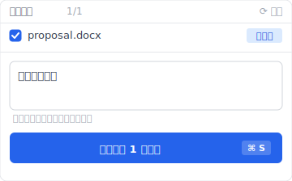
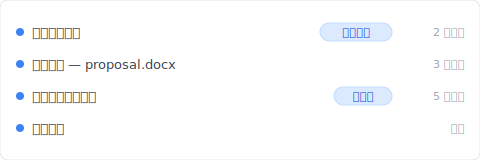
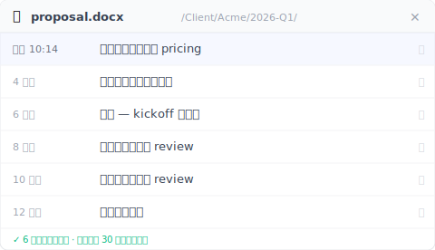

# 【2026 文件管理】Keeply 到底存什么？跟备份、云端工具有什么不一样

> 备份顾整个磁盘。云端顾最新一份。Keeply 顾那条没人顾的版本轴。三件不同事。

## 目录

1. [Keeply 跟备份、云端有什么不一样？同事 B 卡住的问题](#a-and-b)
2. [Time Machine / Acronis 在做什么：整个磁盘快照](#what-backup-saves)
3. [Dropbox、OneDrive、iCloud 在做什么：跨设备同步 + 30 天版本历史](#what-cloud-saves)
4. [Keeply 补的第三层：有笔记的版本历史](#the-third-pit)
5. [我有 Time Machine 了还要装 Keeply 吗？3 件事不取代的理由](#why-not-replace)
6. [不必装 Keeply 的 4 种情境](#when-not-needed)

---

## Keeply 跟备份、云端有什么不一样？同事 B 卡住的问题 {#a-and-b}

A 先生刚装完 [Keeply](https://keeply.work)。同事 B 走过来问：「这跟我 Mac 内建的 Time Machine 不一样吗？」

A 先生卡住。他知道不一样，但说不上来差在哪。

区别是这个：**备份、云端、Keeply 是三件不同的事**——它们的设计目标不重叠。Time Machine 救硬盘坏掉那种灾难。Dropbox 救你想在笔电跟手机看到同一份。第三种怕——「我会议后存的那版在哪」、「业主上周确认过的那一版我改掉了」——前两个都答不出来。

这篇拆完前两个各自在做什么、然后让你看那第三种坑长什么样。

---

## Time Machine / Acronis 在做什么：整个磁盘快照 {#what-backup-saves}

Time Machine、Acronis True Image、Backblaze 这类工具存的是**某个时间点整个磁盘的快照**。

它们的工作不在救一个文件——它们存的是「**那一整天我整台电脑长什么样子**」：OS、应用程序、设置、所有文件夹，全部一起。

如果你的硬盘坏了、整台电脑遗失，备份能还原一切。**这是它们真正存在的理由**。

但如果你想找回 `proposal.docx` 在周四 10:23 改之前的版本，备份做得到，**但你要先还原整个快照才能挑出那个文件**。而且还原回来的那一版只有时间戳——你还是不知道哪一版是业主确认那版。

这不是 Time Machine 的设计目标问题。它本来就不是来解这个的。

---

## Dropbox、OneDrive、iCloud 在做什么：跨设备同步 + 30 天版本历史 {#what-cloud-saves}

Dropbox、iCloud、OneDrive、Google Drive 存的是**文件的最新版，加上跨设备同步**。

你在 A 电脑改一个文件，B 电脑自动拉到最新版。它们的工作是让「最新一份」同步到你所有设备。

它们也有版本历史，但都有上限——[Dropbox 标准方案、Google Drive 通常 30 天](https://help.dropbox.com/delete-restore/version-history-overview)就删，[OneDrive／SharePoint 则是版本数上限（默认 500 版）](https://learn.microsoft.com/zh-cn/sharepoint/document-library-version-history-limits)、旧版会被稀释。

而且云端的版本历史**只有时间戳**：`2025/03/14 15:00`、`2025/03/14 16:00`。哪一版是会议后加结论的、哪一版是业主说错了又改回来的——你打开看才知道。

云端救「我笔电在公司、回家想用平板继续看」这种事。它不是来解「3 个月后找回某个有意义版本」的。

---

## Keeply 补的第三层：有笔记的版本历史 {#the-third-pit}

最常踩、但没名字的那种坑：

「上礼拜业主确认的那版 proposal.docx 我改掉了。我要找回业主看的那版。」

「我会议后加结论那一版在哪？我下午改了之后不太确定改得好。」

「3 个月前的那份合同底稿，我想对照现在这版看我们从哪改的。」

备份能还原整个磁盘、但你要先还原才挑得出单档。云端 30 天就删、而且只有时间戳。OS 内建的版本历史（Windows File History、Time Machine）也只有时间戳——而且 File History 还要外接硬盘连着才存。

这层空缺了。

A 先生装的 Keeply 就是补这层的。它在背景跑、加上他重要时刻可以主动点「保存版本」、跳对话框写笔记：

半年后翻时间轴、你看到的是这个：

「会议后加结论」自己一行——不用看时间戳猜「下午 2:00、2:30、3:00 哪一个是会议后」。

跨文件的历史也是同一条逻辑。同一份 `proposal.docx` 从 12 周前的初稿到今天的最新版，Keeply 全留下来——而且是过了云端 30 天天花板之后还在的本机层：

3 个月前那份你想对照的合同底稿——Dropbox 已经过保留期、Time Machine 还在但要先还原才挑得到——Keeply 在这条清单上直接点那一行就回去。

要那一版——点那一行。`design.psd` 也好、`contract-final-v3.docx` 也好，同样那一条时间轴往下滑。

---

## 我有 Time Machine 了还要装 Keeply 吗？3 件事不取代的理由 {#why-not-replace}

很多人问：「我有 Time Machine 了、为什么还要装 Keeply？」或「我用 OneDrive 同步、版本历史不是有吗？」

A 先生回 B 同事的时候是这样说的：

「Time Machine 是万一这台 Mac 摔到地上、或者 SSD 坏掉，能让我从上礼拜的快照重新长出一台一模一样的机器。OneDrive 是我笔电在公司、回家想拿手机看那份文件。Keeply 是我下礼拜回来找『业主上次说 OK 的那一版』，能直接点到那一版、不用猜时间戳。」

这 3 件事**不是同一件事**。把 Time Machine 拿去做 Keeply 的工作会做得很糟（你要还原整个快照）。把 OneDrive 版本历史拿去做 Keeply 的工作也会做得很糟（30 天就消失、而且没笔记）。

它们互补：

- 怕硬件灾难 → 备份
- 怕跨设备看不到最新版 → 云端
- 怕自己改错、想找特定意义的旧版 → Keeply

装其中一个不会让另外两个变多余。

---

## 不必装 Keeply 的 4 种情境 {#when-not-needed}

几种情况确实不需要：

**你的工作短周期、不在乎「哪版有笔记」**。如果你的需求是「找回几小时前」、不会半年后才回头找特定版本，云端版本历史 30 天就涵盖了。

**你的工作完全在云端文档（Google Docs / Notion）**。这些平台自己有内建版本历史。Keeply 监看的是本机文件系统、不会去碰 Google Doc。

**法规合规场景需要不可变存档**。SOX、HIPAA、GDPR 要正规封存工具（Veeam、Acronis、行业专属封存软件）。本篇讲的是日常工作版本管理、不是合规。

**你在公司 IT 管控环境**。IT 用 SCCM、Veeam 或别的集中备份系统——能不能装 Keeply 不是你决定。先去问 IT。

---

## 收尾

A 先生对 B 同事的最后一句：

「**我两个都用。Time Machine 顾硬盘坏掉，Keeply 顾『业主上次说 OK 的那一版』。**」

如果你也想顾那条时间轴，把文件夹拖进 [Keeply](https://keeply.work) 就好。剩下的它在背景记。

---

## 延伸阅读

- [文件笔记软件 Keeply 怎么用：不用学 30 个功能，2 个动作就上手](/zh-cn/post/keeply-getting-started-from-zero/)（Keeply 整体上手指南）
- [文件版本管理完整指南](/zh-cn/post/file-version-management-complete-guide/)（为什么版本管理一直没人做好）
- [你以为自己有备份，但「备份」在 Windows 里有 3 种意思](/zh-cn/post/windows-file-history-vs-backup/)（Windows 版的同类拆解）

---

> 关于作者：Ting-Wei Tsao，[Keeply](https://keeply.work) 创办人。
> [LinkedIn](https://www.linkedin.com/in/ting-wei-tsao-b57480152/)
