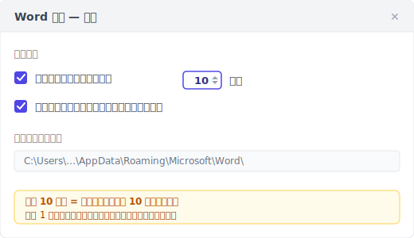
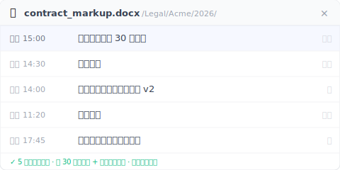

自动恢复是崩溃救援，不是版本记录。Word 内置的，只有救崩溃那一份。

> 周五下午三点，你写了 90 分钟合同批注，准备五点开会用。Word 不动了，画面卡住，你等了三分钟按了强制结束。
>
> 重开 Word，「文档恢复」工作窗格弹了出来。你满怀希望点开。**里面一片空白**。
>
> 90 分钟的工作没了。客户 5 点要看。

不是运气不好。是「自动恢复」设计上本来就不会救这份文档。

下面 5 种情况，是从 Microsoft 官方文档、搜索结果里同行们的求救帖子、以及实际机制反推出来的。每一种都跟你直觉想的不一样。

---

## 情况 1：你从没按过 Ctrl+S {#case-1-never-saved}

你新开一份 Word，点了「空白文档」开始打字，30 分钟后崩溃。重开 Word，「文档恢复」工作窗格。空的。

这不是程序出错。**自动恢复要追踪一份文档，前提是这份文档有文件名、有路径**。从没按过 Ctrl+S = 没文件名 = 没路径 = 自动恢复不知道要把临时文件存到哪。

Microsoft 自家[官方说明](https://support.microsoft.com/zh-cn/office/%E6%81%A2%E5%A4%8D-office-%E6%96%87%E4%BB%B6-dc01156a-be1c-43e6-b3f1-bd4a01a93cf9)写得很白：「自动恢复」需要这份文件至少保存过一次，才会开始帮你做 .asd 临时存档。

新建 → 写 30 分钟 → 崩溃，这个顺序里自动恢复从头到尾没被叫起来过一次。

> **习惯建议**：开新文档的第一个动作，永远是 Ctrl+S → 起文件名 → 然后再开始写。30 秒的事，可以避免这种事故。

---

## 情况 2：Word 卡住，你按了强制结束 {#case-2-force-quit}

这是开头那个合同批注的场景。Word 不是真的崩溃弹恢复对话框。是卡住没响应，你**主动**按了强制结束。

Word 自动恢复**默认每 10 分钟**存一次 .asd 临时文件。在那 10 分钟之间，你打的字都在内存缓冲里。强制结束 = 内存内容没写到 .asd = 从 .asd 救只能回到上次写入硬盘那一刻。

「上次写入」可能是 9 分钟前的版本，也可能是 1 分钟前的版本。取决于你正好在 10 分钟周期的哪个位置。最坏情况：你 9:59 写了一大段，10:00 Word 卡住，这段都没写进 .asd。

这个 10 分钟默认值，是 Microsoft 在「磁盘读写负担」跟「数据丢失风险」之间的取舍。对你来说，这 10 分钟的延迟 = 最多 10 分钟的工作暴露在风险里。

可以调短：文件 → 选项 → 保存 → 「保存自动恢复信息时间间隔」改成 1。代价是磁盘读写变高，旧笔记本可能感觉得到。

> 自动恢复救的不是「你刚打的那 8 分钟」，是「8 分钟之前那个写进硬盘的版本」。差别不大但决定谁活下来。

---

## 情况 3：「文档恢复」弹出来了。但里面是空白 {#case-3-blank-recovery}

这是最让人崩溃的一种。Word 真的弹了「文档恢复」工作窗格，你满怀希望点开。**文件内容是空的**或乱码。

机制上发生了什么：自动恢复把当下状态打包成 .asd 文件写入硬盘，这个动作要时间。如果写到一半电源切断 / 程序在打包中途崩溃。半截的 .asd 文件留在硬盘，无法解析。Word 看到 .asd 存在所以弹恢复窗格，但打开后解析失败 → 显示空白或乱码。

Microsoft 自己论坛上有一则 Q&A：[「My recovered unsaved word document is entirely blank」](https://learn.microsoft.com/en-us/answers/questions/5285105/my-recovered-unsaved-word-document-is-entirely-bla)。Microsoft 自家论坛都在问这个情况。这不是边缘事故，是常见的。

> 「文档恢复」工作窗格弹出来，不等于救得回来。自动恢复承诺的是「尝试」，不是「保证」。

---

## 情况 4：你换了一台电脑 {#case-4-cross-machine}

你昨天用办公室台式机写了一份 Word，今天回家用笔记本打开，发现只回到上周六手动保存那版。**昨天 8 小时的修改不见了**。

自动恢复的 .asd 文件存在本机：

- **Windows**：`%LocalAppData%\Microsoft\Office\UnsavedFiles` 与 `%AppData%\Microsoft\Word`
- **macOS**：`~/Library/Containers/com.microsoft.Word/Data/Library/Preferences/AutoRecovery`

**这些路径不会自动同步到 OneDrive、不会同步到 Dropbox、不会同步到 iCloud Drive**。它设计上就是一份本机缓存。

你可能会问「我的 Word 不是绑了 OneDrive 吗？」对，但 OneDrive 同步的是「文件本体」，不是「自动恢复的 .asd 临时文件」。即使 AutoSave 开了（要 Microsoft 365 订阅 + 文件放 OneDrive），AutoSave 同步文件本体到云端、自动恢复写本机 .asd 缓冲。**两个并存不互通**。

换电脑打开，新机读不到旧机的 .asd。

> .asd 是自动恢复给你那台机的本地小抄。它不出国。

---

## 情况 5：你按了「不保存」 {#case-5-dont-save}

关 Word 时弹「是否保存更改?」对话框，你想都没想按了「不保存」。因为以为自己已经保存过。3 秒后想起来刚刚改了重要段落没保存。

按「不保存」是用户主动行为。Word 认定「用户明确选择丢弃这次编辑的修改」。**自动恢复设计上立刻清掉这份文件的 .asd 缓冲**。因为保留就违反用户的意愿。

这个情况在 Google 英文搜索结果第 8 名的小站 [integrisit.com/accidentally-clicked-dont-save](https://integrisit.com/accidentally-clicked-dont-save/)（网站权重只有 DA 41）就在讲。为什么权重这么低的小站能排进前十？因为这个情况 **Microsoft 自家文档不会讲**。承认「用户按了不保存我们立刻清缓冲」会打到产品自己的说法。

> 「不保存」不是手滑打错字。是 Word 内部的「确认丢弃 + 立刻清缓冲」双重指令。

---

## 补位：一层永久版本记录，后台自动 + 你主动标记 {#keeply-fills-gap}

5 种情况走完，你看到「自动恢复」是一层特定设计的网。它接得到「正在打字 + 落在两次记录中间 + Word 真的崩溃」这个短窗，但接不到其他 5 种。共同点是：自动恢复的临时存档**用完就清**。正常关闭清、按不保存清、强制结束时可能根本没写完。

要补位，要的是一层**不会被清掉的版本记录**：每一版都是完整存档、永久保留，强制结束跟不保存都动不到。它有两个来源。**后台每 30 分钟自动记一版**，加上**你主动点「保存版本」按钮、写一句备注**标记里程碑（例如「这版是客户要的」）。

把上面 5 种情况跟这层对照一遍：

| 情况 | 自动恢复 | 永久版本记录（30 分钟自动 + 手动保存版本）|
|---|---|---|
| 1. 从没保存过 | 没有基准点 = 无记录 | 也救不到。文件没写进硬盘，这层看不到（见下方边界）|
| 2. 强制结束 | 缓冲可能空白或写一半 | 最近一次自动快照或手动保存版本完整可开（最多丢 30 分钟，但拿回的是完整文件不是空白）|
| 3. 恢复窗格空白 | 缓冲写一半损坏 | 每一版都是完整存档快照，不是半截缓冲 |
| 4. 换电脑 | 本机 .asd 没同步 | 版本同步到云端，跨机可开 |
| 5. 按了不保存 | 缓冲立刻清 | 上次自动快照/手动保存版本已写，不保存只丢掉那之后没存的改动 |

Keeply 是这层的一个实现。安装后它监看你的 Word 文件夹，后台每 30 分钟自动记一版；你也可以随时点「保存版本」立刻记一版、附一句备注。版本侧栏能看到每一版的时间戳 + 一键还原任意一版。

**重点不是「更频繁」**。30 分钟其实比自动恢复的 10 分钟还粗。重点是**永久 + 完整可开 + 强制结束和不保存都动不到**。自动恢复对「正在打、还没到下次记录、突然崩溃」这个短窗仍可能留住更新的内容，所以 Keeply **不取代**自动恢复，是补在它底下的那一层。

---

## Keeply 也救不到的 3 种事故 {#limits}

说清楚边界：

**1. 从没写进硬盘的文件，Keeply 也救不到**。Keeply 监看的是硬盘上的文件夹。文件要先保存过一次、写进那个文件夹，Keeply 才看得到它、才能开始记版本。从没按保存的新文件，Keeply 跟自动恢复一样无能为力。所以前面那个习惯建议。新建文档第一个动作 = 保存起名。对两者都成立。

**2. 损坏的 .docx，Keeply 只回得到上一个健康版本**。如果某次自动快照或手动保存版本记下的时候，文件本身已经损坏（罕见但有），Keeply 记的就是损坏那一版。版本记录回不到健康状态，需要再往前找一个没坏的版本还原。

**3. 没同步出去的跨机文件留在原机**。Keeply 把版本写进本机的版本库，云端同步是另一步。如果你在笔记本写了 8 小时但网络断线没同步，后来台式机打开没看到那 8 小时。不是 Keeply 故障，是同步还没完成。

这三个比自动恢复的 5 种情况都明确、都能验证。你知道「我有没有保存过」「文件是不是坏了」「网络有没有断」，不用反推机制。

---

## 不必装 Keeply 的 3 种 Word 场景 {#when-not-needed}

不是每个人都需要这层。

**1. 短时间作业（< 10 分钟的回信备忘）**。自动恢复 10 分钟间隔都还没到，Keeply 的下次自动快照也还没到。这种轻量作业内置已经够。

**2. 你已养成每 5 分钟保存习惯 + 文件放 OneDrive**。OneDrive [25 版](https://support.microsoft.com/en-us/office/restore-a-previous-version-of-a-file-stored-in-onedrive-159cad6d-d76e-4981-88ef-de6e96c93893) / 30 天保留 + 你的高频保存已经接近一层版本记录。Keeply 在你想跨 30 天回溯时才有加值。例如客户三个月后问你「上次那版的 v2 还在吗」。

**3. 公司部署了 SharePoint + 版本历史**。SharePoint 版本历史保留更长、管理员管控、合规可审。个人 Keeply 是补位不是替代。你还是用 SharePoint。

Keeply 是给「在 5 种情况任一被咬过」+「以后不想再咬」的个人用户。没被咬过或公司已有方案，原状没问题。

---

## 常见问题 {#faq}

**Q1. 我把 Keeply 装在 Word 文件夹，会跟自动恢复打架吗？**

不会，是两层不同的东西。Keeply 监看硬盘上的 .docx 文件（你保存过一次、写进它监看的文件夹之后），后台每 30 分钟记一版；自动恢复写的是 `%LocalAppData%` 里的 .asd 临时文件。两个碰不到对方的存储路径。

**Q2. 我可以把 Word 自动恢复间隔改成 1 分钟吗？**

可以。文件 → 选项 → 保存 → 「保存自动恢复信息时间间隔」改成 1。间隔越短 = 崩溃时可救回的内容越新，代价是磁盘读写变高，旧笔记本可能感觉得到。但这仍是崩溃缓冲。正常关闭/按不保存照样清掉。如果你要的是一层「崩溃、按了不保存都还在」的永久版本记录，那是另一条路：Keeply 后台每 30 分钟自动记一版 + 你主动按保存版本，不靠你记得去调间隔。

**Q3. 为什么我正常关闭 Word，「文档恢复」工作窗格不出现？**

因为 Word 正常关闭 = 没崩溃 = 自动恢复认定「用户已经保存好了」= 把 .asd 缓冲清掉。下次打开就没东西可恢复。这是设计：自动恢复只在「异常结束」的场景下保留 .asd。

**Q4. OneDrive AutoSave 会不会取代自动恢复？**

不会。AutoSave 同步文件本体到云端（你需要 Microsoft 365 订阅 + 文件放在 OneDrive 路径），自动恢复写本机 .asd 缓冲。AutoSave 解的是「跨设备实时同步」，自动恢复解的是「崩溃那一刻的最后几分钟」。两个并存不互通。底下还可以加第三层：永久版本记录（例如 Keeply），后台每 30 分钟自动记一版 + 手动保存版本，独立于云端同步状态。

**Q5. Keeply 救得回我删掉的、从没保存过的 Word 文件吗？**

救不到。Keeply 的起点 = 文件第一次写进硬盘（你按保存起名）。把这个动作变成习惯：开新文档 → 先保存起名 → 再开始写。文件进了 Keeply 监看的文件夹后，后台每 30 分钟自动记一版，你也可以随时手动按「保存版本」。

---

## 延伸阅读

- [Excel 版本历史只回 1-2 版是 Microsoft 设计，不是故障](/zh-cn/post/excel-version-history-limits/)
- [保存后不小心覆盖旧版？Excel/Word/PPT 覆盖救援的机制断层](/zh-cn/post/recover-overwritten-file/)
- [Photoshop 自动保存救崩溃，救不了你存错版本](/zh-cn/post/photoshop-autosave-not-version-history/)
- [文件版本管理完整指南](/zh-cn/post/file-version-management-complete-guide/)

---

*作者：[Ting-Wei Tsao](https://www.linkedin.com/in/ting-wei-tsao-b57480152/)。Keeply 创始人，做文件版本管理工具给不是工程师的人。*
