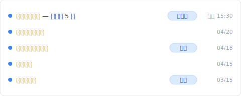
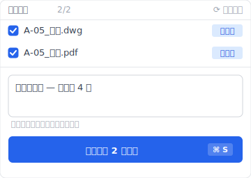
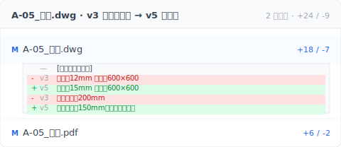

# 【2026 檔案管理】圖檔版本管理 4 步：為什麼工班總在打開上週的 AutoCAD 舊圖

> 早上 9:40 你回辦公室、主管翻出上週四的新版圖。蓋板規格早就改了，但你每天在工地、沒人通知你。

早上 9:40，你難得回辦公室一趟，順手把昨天現場的照片滑給後面主管看。排水溝那段混凝土已經灌下去，蓋板的承載框也都預埋定位了。

主管沒說話。他翻開桌上一份 `A-05_水溝_0422_定版.dwg`。

「蓋板不是這個規格。設計上禮拜四又改了一次。」

你心裡涼了一下。上禮拜四那版是設計寄來辦公室的。收信的是小李、他順手存進 NAS、沒通知你。你每天在工地、不是每次都回辦公室、這禮拜根本沒人告訴過你已經換版。

現場那段已經灌好了。蓋板尺寸改。要打石把埋進混凝土的舊框打出來、換上新尺寸的框重新埋、收邊、養護、蓋板才能蓋得下去。工期再往後推兩天。

你沒傳錯檔給工班。你只是不知道、檔已經換了。

這篇拆完辦公室 → 現場那條斷線為什麼會斷、傳統做法（嚴格命名 / LINE 通知 / NAS 共享）為什麼補不起來、然後讓你看 [Keeply](https://keeply.work) 怎麼把營造團隊版本史一個工具一起做。

## 目錄

1. [換 Keeply 後辦公室 + 工地看同一條時間軸](#keeply-team-timeline)
2. [「你那份是上禮拜四的新版嗎？」——5 個檔名你記不住哪份算數](#which-version)
3. [定案前會冒出好幾版、然後設計又改回去：為什麼版本管理不能等定版](#why-iterate)
4. [辦公室知道、現場不知道：3 方時間線最容易斷的那條](#office-vs-site)
5. [圖檔版本管理 4 步實戰：辦公室 + 現場對齊 + Keeply 同步保管庫](#autocad-4-step)
6. [唯一不需要的人：工地現場照圖施作的師傅](#when-not-needed)

---

## 換 Keeply 後辦公室 + 工地看同一條時間軸 {#keeply-team-timeline}

先讓你看現在。同樣一個 `A-05_水溝.dwg`、設計從 3 月初版改到今天第 5 版——在 [Keeply](https://keeply.work) 裡，這個案場專案保管庫的時間軸看起來是這樣：

「修改蓋板規格 — 設計第 5 版」自己一行、有「最新版」tag。「甲方審閱後正式版」自己一行、有「定版」tag。

辦公室小李今天 15:30 收到設計郵件、打開檔案改完、點 Keeply 主視窗「儲存版本」按鈕寫筆記：

他寫了「蓋板規格改 — 設計第 4 版」。

**重點是這個**：小李用的 Keeply 跟你工地用的 Keeply 是**同一個保管庫**（公司 NAS）。他存進去那一刻、你的 Keeply 時間軸頂端就會多一條。明天早上你打開電腦、看到「修改蓋板規格」那一行有「最新版」標籤——你就知道「等等、新版上來了、我得先看再去現場」。

加上 Keeply 在背景每 30 分鐘自動輪詢——設計可能再改、辦公室還沒主動標、但檔案變了 Keeply 30 分鐘內會偵測到。

下面拆傳統做法（嚴格命名 / LINE 通知 / NAS 共享）為什麼補不起這條斷線。

---

## 「你那份是上禮拜四的新版嗎？」——5 個檔名你記不住哪份算數 {#which-version}

這是主管回頭問你時最常聽到的一句。

你打開電腦找「最新版」。NAS 的專案夾裡有 `A-05_水溝_0418.dwg`、`A-05_水溝_0422_定版.dwg`、`A-05_水溝_0422_定版_改蓋板.dwg`、LINE 群傳過 `A-05_水溝_0420_避開雨水管.dwg`。還有設計三月時第一次交的 `A-05_水溝_0315.dwg`、你沒刪、因為設計改一改有時候又改回接近原版。

五個檔名、你知道其中一份是現場該照著做的。但你**不記得是哪一份**。你上禮拜在工地三整天、這週的新版進 NAS 的時候你不在。沒人通知你。辦公室的小李覺得他「有存進去就好」。

這不是你懶、也不是小李壞心。是**新圖進辦公室跟新圖到現場之間、沒有人把這條線接起來**。你剛好是站在這條斷線兩邊的人。

Keeply 在這裡能做的事、就是讓你能直接比兩版圖差在哪——不用開兩個 AutoCAD 視窗肉眼掃：

點 v3 跟 v5 兩個版本、Keeply 列出兩版差了哪幾個圖層、哪些尺寸改了。蓋板從 12mm 鑄鐵變成 15mm、鋼筋間距從 200mm 縮到 150mm——這是技師複核後加的。你看完 30 秒就知道現場該動哪邊、不用打電話回辦公室問。

---

## 定案前會冒出好幾版、然後設計又改回去：為什麼版本管理不能等定版 {#why-iterate}

你會問：「那我每次來辦公室都重新對一次不就好了？」

理論上可以。實務上困難的原因、是**定案前的版本會一直長新的**。

一個段落的設計、從初稿到定版、中間會出很多版本。甲方提一次意見改一次。現場踏勘發現障礙物改一次。技師複核改一次。**然後設計改到第 5 版、甲方突然說第 2 版的收邊比較好、就又改回去**。你看到 NAS 裡六個檔案、其中兩個的內容其實差不多。但你不知道哪一個才是現在算數的。

如果每次都等設計「完全定版」才開工、營造廠會被工期拖死。三個工序卡在你這一段、每一天人力、機具、進度全部在燒。所以營造廠會鋌而走險、**先照最新看過的那版做**。賭後面不會再改。

很多時候賭贏。偶爾賭輸一次、就是這週這段水溝。

---

## 辦公室知道、現場不知道：3 方時間線最容易斷的那條 {#office-vs-site}

真正的斷點在這裡：**辦公室收到新圖、現場不知道、沒人把訊息接過去**。

辦公室那邊、收信的可能是行政、可能是助理、可能是另一個主任。他收完第一個動作是「存好」。進 NAS、分類、歸檔。他不一定知道現場這週已經做到哪、也不一定知道這版跟上版的差別大到要立刻通知。對他來說、存好就是負責。

現場這邊、你天天在工地。就算你每週回辦公室一次、從你上次核對到這次之間、設計可能已經出過兩版、改過一次、又改回來。你查是查得到、但**你要謹慎地主動回來查**。這件事、沒有主任每次都做得到。

工班那邊、照你給他的最後一份做。他不知道辦公室是不是已經有新版。他也不該需要知道。他的責任是照圖施作、不是追版本。

這三方的時間線裡、**辦公室跟現場之間那條是最容易斷的**。不是因為誰怠惰、是因為沒有機制硬逼這條線必須通。LINE 群裡一條「新版已上傳」的訊息、漏了就是漏了。

---

## 圖檔版本管理 4 步實戰：辦公室 + 現場對齊 + Keeply 同步保管庫 {#autocad-4-step}

要做的其實不多。四件事。

**一、新版一進辦公室、當下通知現場 + 要一個「收到」回覆。** 不是「存好就算」、是**handshake 完成才算**。LINE 群也好、電話也好、規矩是「現場那個人有沒有明確回『收到』」。沒這個回覆、就不算完成交接。

**二、每次新版覆蓋舊版之前、那一版獨立留下來。** 檔名寫 `A-05_水溝_0418_設計_v3.dwg`、`A-05_水溝_0422_設計_v4.dwg`。這是**為了設計又改回去那一次**。你回頭找得到第 3 版原來長什麼樣。

**三、讓 [Keeply](https://keeply.work) 自動記住每一版 + 全部人都看得到。** 第一、二步靠意志力做不到、或做不滿的地方、工具補位。每次辦公室點「儲存版本」+ 寫筆記、整個保管庫的成員（小李辦公室、你工地、陳領班）打開 Keeply 都看到同一條時間線。Keeply 在背景每 30 分鐘輪詢一次檔案變更——設計就算改了沒主動標、30 分鐘內 Keeply 會偵測到、時間軸自動多一條。

**相容性**：Keeply 在底層記錄、相容於公司現有的 NAS、SharePoint、OneDrive Business、Synology、QNAP、共享網路磁碟。檔案不搬家、不換 AutoCAD、不改工班作業流程。

誠實說：兩張 `.dwg` 的圖面要比對細節差異、還是得開 AutoCAD 自己看；Keeply 不做 CAD 圖面比對。但「有沒有新版進來、是誰、什麼時候、你看過沒」這件事不會再漏掉。主管問「你有沒有看過上週四那版」、時間軸一目了然。

**四、一份不在辦公室、不在工地 NAS。** 外接硬碟、雲端、備份槽、哪個都行。重點是**至少一份異地**。公司 NAS 壞了、被清了、被接手的人用掉、你回不來。異地備份是你給自己買的最便宜的保險。

第一步沒有工具也能靠紀律做、但誠實說、做三個月你會漏一半。第三步是讓工具接住那一半。

---

## 唯一不需要的人：工地現場照圖施作的師傅 {#when-not-needed}

誠實講：這篇不是寫給所有工程人員的。但排除名單比你想像的短。

**唯一完全不需要的人、是現場按圖施作的師傅。** 他們的職責是照拿到的那一份圖做事、不是追版本。追版本是你的工作。

**公共工程反而最需要。** 你以為大型公共工程、政府案「已經有 BIM 協同平台所以不用」？恰好相反。公共工程的文書量是民間案的好幾倍、變更申請一來一往跨月、管理層異動比民間更頻繁、檔案累積更快、記憶斷鏈更容易。BIM 平台解的是最終交付成果、解不了計劃書、公用檔案、設計圖在過程中的變動筆記。而那才是每天真正在長的東西。

**一個人做的小案也需要。** 你可能會想：「案子就我一個人從頭管到尾、還需要版本管理？」需要。因為三個月後你回頭看同一個檔案、你會**忘記自己當時為什麼要變更設計**。時間軸存的不只是圖、是你每一次改動當下的理由。未來的你會感謝現在的你留下這條軌跡。

其他所有人。中小型住宅、透天、外構、排水、景觀、道路、校園、商辦、室內裝修、公共工程、BIM 案、獨立接案、事務所。**只要你的工作牽涉「這個檔案會被改、會被別人或未來的你再打開」、你就需要一條時間線**。每斷一次、時間跟錢都從你口袋出去。

---

## 延伸閱讀

主篇 [檔案版本管理完整指南](/zh-tw/post/file-version-management-complete-guide/) 拆解 4 個結構性原因——為什麼工具就是沒設計給你這件事。

對照閱讀：[共用資料夾的命名稅：4 人團隊一年花 83 小時改 _v7_FINAL_千萬別動 後綴](/zh-tw/post/hidden-cost-shared-folders/) — 共用資料夾的設計缺陷。

備份原則：[3-2-1 備份原則：20 年了還夠用嗎？](/zh-tw/post/3-2-1-backup-rule/) — NAS + 異地備份的搭配。

---

一張 dwg 不只是一張圖。它是設計那邊的決定、辦公室那邊的存檔、現場這邊的施作。這三件事**必須在同一版上對齊**、才算數。

還記得早上 9:40、主管翻開新版、你心裡涼了一下的那個瞬間嗎？打開 [Keeply](https://keeply.work)、看時間軸頂端那條「最新版」tag——下次新版進辦公室、你工地的 Keeply 30 分鐘內就會多一條、不會再灌錯。

---

> 關於作者：Ting-Wei Tsao，[Keeply](https://keeply.work) 創辦人。
> [LinkedIn](https://www.linkedin.com/in/ting-wei-tsao-b57480152/)
