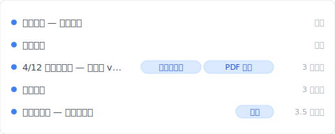
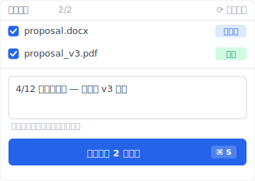
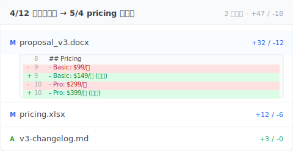

# 【2026 檔案管理】Word 存得住版本、存不住 3 個月後的記憶：Keeply 怎麼補

> Word 自動回復、OneDrive 版本歷史、Time Machine 都是儲存層救援。3 個月後客戶問哪版？要工具層的常駐版本歷史。

週六晚上 11:23、客戶 LINE 你：「3 月那版你寄我的提案可以再傳一份嗎？」

你打開 OneDrive 版本歷史。只剩一週。Word 自動回復 在檔案關閉時就清除掉。電腦裡 7 個 `_v` 字尾檔案、沒一個對得上 3 月那次交付。

3 個月前你按下儲存那一刻的版本、工具沒記得。

Keeply 用戶聊過最多次的、是這通晚上 11:23 的 LINE。這篇拆完 Word 自動回復 / OneDrive / Time Machine 各自的保留期限制、Microsoft 為什麼這樣設計、然後讓你看 [Keeply](https://keeply.work) 怎麼用「常駐版本歷史 + 業主核定版 tag + PDF 收執單」根治。

## 重點

Microsoft Word 的「**版本歷史**」、自動回復、OneDrive 版本紀錄都是**儲存層救援機制**。設計給「打到一半當機」用、保留期短：從檔案關閉就清除、到雲端版本歷史約 500 個版本上限。這是儲存救援、不是交付追蹤。3 個月後客戶問哪版？要工具層獨立的常駐版本歷史、加上交付當下的元資料標記、才找得回。

## 本文目錄

1. [換 Keeply 後我 3 個月前的提案 3 秒翻得到](#keeply-timeline)
2. [Word 內建版本歷史能做什麼？自動回復 / 自動儲存 / OneDrive 三種機制](#word-three-mechanisms)
3. [自動回復 / OneDrive / Time Machine：各能保留多久？4 個保留期數字](#retention-numbers)
4. [為什麼這些機制守不到 3 個月後？儲存層 vs 工具層的設計差](#儲存空間-vs-tool-layer)
5. [找回 3 個月前的交付版本，Keeply 怎麼補：常駐版本歷史 + 業主核定版 + PDF 收執單](#keeply-fills-gap)
6. [不必裝 Keeply 的 4 種 Word 場景](#when-not-needed)
7. [常見問題](#faq)

---

## 換 Keeply 後我 3 個月前的提案 3 秒翻得到 {#keeply-timeline}

先讓你看現在。同樣是 `proposal.docx`、同樣 3 個月前 4 月那次交付——在 [Keeply](https://keeply.work) 裡，這個客戶提案保管庫的時間軸看起來是這樣：

「4/12 業主核定版 — 給客戶 v3 簡報」自己一行、有「業主核定版」+「PDF 收執」兩個 tag——後者是 Keeply 的 Release 機制（對應 ADR-003）：那一版會凍結成獨立快照、附當天匯出的 PDF 收執單（含 commit hash 證明）、永遠不被後續存檔覆蓋。

3 個月後 11:23 那條 LINE 來、你打開 Keeply、看時間軸頂端「業主核定版」tag——3 秒回客戶。

那行筆記怎麼來的？4 月 12 日下午、簡報定稿給客戶之前、你點 Keeply 主視窗「儲存版本」按鈕、跳出來這個對話框：

寫一行「4/12 業主核定版 — 給客戶 v3 簡報」、儲存版本——同時把那天匯出的 PDF 也標進這版的 Release。3 個月後客戶問哪版、PDF 跟原始 .docx 都在那一行。

加上 Keeply 在背景每 30 分鐘輪詢 Word 檔案變更——你忘記主動標、30 分鐘內也會有自動儲存版本。Word 自動回復 限制（檔案關閉就清）Keeply 解。

下面拆 Word 自動回復 / OneDrive / Time Machine 各自的保留期限制、Microsoft 為什麼這樣設計。

---

## 我是怎麼找到那一版的？Keeply diff 比對兩個版本一眼看出差異

打開「4/12 業主核定版」跟「5/4 pricing 修訂版」並排，Keeply 標出哪幾段被改、改了什麼數字：

兩段紅綠對照、原本的 pricing 跟修訂後的 pricing 一目了然。客戶看到這張圖就知道哪邊改了——不用我口頭說。

---

## Word 內建版本歷史能做什麼？自動回復 / 自動儲存 / OneDrive 三種機制 {#word-three-mechanisms}

Word 跟 Office 生態系內建有 3 種「**版本還原**」機制：

- **自動回復**：當機時救回未儲存的內容。預設每 10 分鐘自動暫存一份。檔案正常關閉後就清除。
- **自動儲存**（OneDrive / SharePoint 線上 Word）：邊打邊存到雲端。
- **OneDrive 版本歷史**：保留每次儲存的版本快照、可回頭看任意時間點。OneDrive / SharePoint [官方文件](https://learn.microsoft.com/en-us/sharepoint/document-library-version-history-limits)指出預設保留 500 個主要版本（個人 Microsoft 帳號限 [25 版](https://support.microsoft.com/en-us/office/restore-a-previous-version-of-a-file-stored-in-onedrive-159cad6d-d76e-4981-88ef-de6e96c93893)）。

這 3 種設計目的都很清楚：給「**打到一半當機**」、「**剛剛存錯了**」這類**短期儲存事故**用。它們不是「**3 個月後客戶問哪版**」這種場景的設計目標。

---

## 自動回復 / OneDrive / Time Machine：各能保留多久？4 個保留期數字 {#retention-numbers}

要看這些機制守不守得住、先看保留期數字：

| 機制 | 預設保留期 | 清除條件 | 適合場景 |
| --- | --- | --- | --- |
| Word 自動回復 | 檔案關閉即清除 | 檔案關閉、Word 重啟 | 當機救援 |
| OneDrive 自動儲存 | 邊打邊存 | 即時同步覆寫 | 即時協作 |
| OneDrive 版本歷史 | 預設約 [500 個版本](https://learn.microsoft.com/en-us/sharepoint/document-library-version-history-limits)（個人帳號 25 版） | 超過 500 自動清除最舊 | 短期回滾 |
| Mac [Time Machine](https://support.apple.com/en-us/HT201250) | hourly 24h + daily 30 天 + weekly 直到磁碟滿 | 磁碟滿 | 系統級備份 |
| Windows 檔案歷史 | 設定可調 | 設定可調 | 系統級備份 |
| **[Keeply](https://keeply.work)** | **無時間上限**（本機 git 不過期） | **使用者主動刪除才清** | **長期交付追蹤** |

對啊、每個內建機制都有上限。檔案關閉清除到 500 個版本、跨不過 3 個月這條線。3-2-1 防的是磁帶腐壞、Word 防的是當機、這些都不是同一個問題。

---

## 為什麼這些機制守不到 3 個月後？儲存層 vs 工具層的設計差 {#儲存空間-vs-tool-layer}

這裡要拆一個沒人明講的差別：**儲存層** vs **工具層**。

軟體內建的版本歷史活在**儲存層**。它存在的目的是「最近一次寫入失敗就回滾」、所以保留期設得短。從檔案關閉清除到 500 個版本上限、這些設計參考的是「平均使用者一個月內回頭找的次數」。3 個月以上不在設計目標內、清除掉是合理的。

A 先生是顧問。週六 11:23 客戶 LINE 他要 3 月那版報告。他打開 OneDrive 版本歷史、最舊的是 4 月 28 日。Word 自動回復 早關了。他電腦裡 8 個 `_v` 開頭的 .docx、沒一個檔案修改日期對得上 3 月那週的交付。

等等、這還不是最糟的。A 先生事後想起來、3 月那次他寄附件給客戶用的是當天匯出的 PDF。原始 .docx 早被覆蓋掉了。**他寄出去的 PDF 在客戶信箱裡。但他沒辦法從 PDF 拼回 .docx 那個版本繼續改。**

---

## 找回 3 個月前的交付版本，Keeply 怎麼補：常駐版本歷史 + 業主核定版 + PDF 收執單 {#keeply-fills-gap}

[Keeply](https://keeply.work) 用兩件事補儲存層的限制：

**常駐版本歷史**——每次儲存都留下、不會清除。不依賴 OneDrive 訂閱、不依賴 AutoSave、檔案存桌面也照存。本機 git 沒時間上限、500 版本上限不存在。

**業主核定版凍結 + PDF 收執單**（Release 機制、對應 ADR-003）——交付當下你主動點「儲存版本」、寫筆記「4/12 業主核定版」、可同時把當天匯出的 PDF 一起標進這版的 Release。Keeply 把那一版凍結成獨立快照（含 commit hash 證明）、永遠不被後續存檔覆蓋。3 個月後客戶問哪版、翻 Release tag 就有完整 .docx + PDF。

B 小姐用 Keeply 半年。週一早上客戶 LINE 她要 4 月那版設計稿。她打開 Keeply 時間軸、看到「4/12 業主核定版」自己一行、有 tag、有 PDF 收執單——點開就是當時客戶看過的內容。3 秒回客戶。

---

## 不必裝 Keeply 的 4 種 Word 場景 {#when-not-needed}

Keeply 不取代所有 Word 場景：

**Keeply 不取代 自動回復**。打到一半當機、自動回復 仍是第一道線（Keeply 30 分鐘輪詢、不會抓到那一刻的中間狀態）。當機救援走 Word 本身。

**Keeply 不取代 Microsoft 365 共同編輯**。5 人同時改一份文件、走 Microsoft 365 / Google Docs 比較順。Keeply 是本機 + 主動推送設計、不是即時協作。

**Keeply 不能溯及既往**。沒裝 Keeply 過的舊交付、本文救不了你（過去那版 Keeply 沒記到）。從今天開始的每次交付才救得了。

**法規合規場景**。SOX / HIPAA / GDPR 需要不可變存檔走 Veeam / Acronis / 產業專屬封存軟體。Keeply 是日常版本管理、不是合規工具。

以上都不適用——你常被客戶 3 個月後問哪版、想要交付有 PDF 收執單留底——這時候裝 Keeply 才划算。

---

## 常見問題 {#faq}

**Q1: Word 自動回復 預設關不關得掉？**

可以關、但預設是開的。設定路徑：「檔案 → 選項 → 儲存 → 儲存自動回復資訊每 10 分鐘」。但 自動回復 在檔案正常關閉後會清除。不算長期保留。

**Q2: OneDrive 個人版跟商務版版本歷史保留一樣多嗎？**

不一樣。OneDrive 個人預設約 500 個版本。商務版（Microsoft 365）也預設 500 個但管理員可調、到上限就清除最舊。

**Q3: Time Machine 算備份還是版本管理？**

Time Machine 是系統級備份。它保留整個磁碟快照、不會單獨追蹤「proposal.docx 每次儲存的版本」這個層級。要從 Time Machine 救單檔特定版本可以做、但很麻煩。

**Q4: Google Docs 修訂版能保留多久？**

Google 沒公開明確保留期數字。[官方文件](https://support.google.com/docs/answer/190843)指出「較舊的修訂版可能會被合併」以節省空間。實務經驗：3 個月以上的修訂版常被自動合併或清除。

**Q5: Keeply 跟 Git 是同一類東西嗎？**

不是。Git 是給軟體工程師用的版本控制工具——介面是黑底白字終端機、要學一套詞彙才會用。Keeply 是給非工程師從零設計的版本管理工具：介面是檔案視窗、看到的詞是「儲存版本 / 紀錄 / 還原」、沒有工程師術語。兩者解類似的問題（保留檔案歷史）、但設計對象、介面、心智模型都不同。

---

## 延伸閱讀

主篇 [檔案版本管理完整指南](/zh-tw/post/file-version-management-complete-guide/) 拆 4 個結構性原因——為什麼工具就是沒設計給你這件事。

對照閱讀：[Keeply 跟備份、雲端工具有什麼不一樣](/zh-tw/post/what-keeply-saves-vs-backup-cloud/) — 三件不同事的完整對照。

Excel 版本歷史限制：[Excel 還原版本只回 1-2 版？4 個 Microsoft AutoSave 沒講的限制](/zh-tw/post/excel-version-history-limits/) — 同 Microsoft 設計、不同檔案類型。

---

11:23 那條 LINE 訊息、下次出現是什麼時候你不知道。

但你知道一件事：5 分鐘前的版本和 3 個月前的版本、工具不能不分。

打開 [Keeply](https://keeply.work)、看時間軸頂端那條「業主核定版」tag——下次客戶 11:23 LINE 你、不必再翻 7 個 `_v` 字尾檔案猜哪份是 3 月那次交付。

---

> 關於作者：Ting-Wei Tsao，[Keeply](https://keeply.work) 創辦人。
> [LinkedIn](https://www.linkedin.com/in/ting-wei-tsao-b57480152/)
