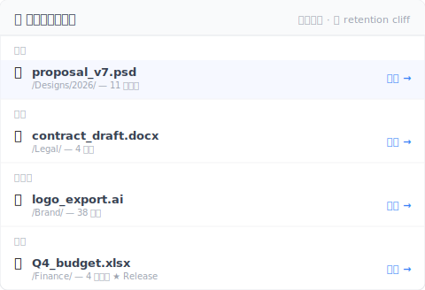

# 【2026 檔案管理】比 iCloud 跟 Dropbox 之前先看：4 家雲端共通的版本歷史天花板

> 容量跟價格是錯的維度。Retention 才是所有比較文停止有用的地方。

週五下午 4:23，客戶 email 來：「上次提案的 v3 版能找出來嗎？是兩個月前那次，改價格前那版。」

你打開 Dropbox。版本歷史只到 30 天前。客戶要的版本在 60 天深處。

沒了。

這不是某一家雲端的問題。這是 4 家雲端共通的問題，比較文從沒告訴你過。

## 比較文從沒列給你看的那張版本歷史表

容量、分享、月費——這是每篇「iCloud vs Dropbox vs OneDrive vs Google Drive」比較文的落點。沒人把 retention 規則並排放出來。我們放這裡：

| 雲端 | 通用檔版本歷史 | Retention 形狀 | 實際 上限 |
|---|---|---|---|
| **iCloud Drive** | ❌ 對非 Apple 檔不暴露 | 只有「最近刪除」資料夾 | 刪除復原 30 天；PSD / Word / PDF 沒版本歷史介面 |
| **Dropbox** | ✅ 有 | 時間制 | [30 天（Basic / Plus / Family）/ 180 天（Pro / Business）/ 365 天（Enterprise）](https://help.dropbox.com/files-folders/restore-delete/version-history-overview) |
| **OneDrive** | ✅ 有 | 計數制 + 刪除視窗 | [保留 500 主要版本](https://learn.microsoft.com/en-us/sharepoint/document-library-version-history-limits)；回收筒 personal 30 天 / business 93 天 |
| **Google Drive**（非原生檔） | ✅ 有 | 時間 + 計數（先觸發者贏） | [30 天 OR 100 versions](https://support.google.com/drive/answer/2409045)，除非你按「Keep forever」 |

盯著這張表看十秒。4 家形狀根本不一樣。你想 apple-to-apple 比都比不了。

## 3 種不同的「retention」機制，1 個共通盲點

3 家有 expose 版本歷史的雲端各自用完全不同的 上限。

**時間制（Dropbox）**——你拿到一個視窗。30 / 180 / 365 天。視窗外的版本不管有幾個都消失。兩個月前動一次的檔案，跟兩個月前動五十次的檔案，下場一樣：都沒了。

**計數制（OneDrive）**——你拿到的是 slot 數。保留 500 主要版本。超過 500，最舊的版本被刪挪空間給新的。可能是兩年累積 500 個版本，也可能是一週內就改了 500 次，1 月看過的那版 2 月就消失。

**混合制（Google Drive）**——先觸發者贏。30 天 OR 100 versions。閒置的 PSD 可能在 30 天時只有 15 個版本就消失歷史；密集修的文件可能兩週內就到 100 版本上限。Google 提供「Keep forever」per-version override——但你要在存檔當下就記得按。

**第四家 iCloud Drive**——是完全不同的問題：**通用檔沒有版本歷史介面**。Pages、Numbers、Keynote 有原生版本瀏覽器（Apple 從 macOS 文件架構繼承的）。Word、PSD、PDF，iCloud Drive 裡的其他任何東西：只同步最新版本，舊版本不保留。Apple 從沒對非 Apple 檔類型公布過明確的 retention 政策，因為根本沒有政策可公布。

4 家共通的盲點：**每家都有 上限。Cap 形狀不一樣。比較文從沒告訴你哪個形狀符合你的工作。**

## 為什麼比較文不寫 retention？

Retention 在規格表上很難呈現。

容量是一個數字：GB。價格是一個數字：每月 $X。分享 UX 是一張截圖。

Retention 是一棵條件樹：方案層級、檔案類型、版本數、流逝時間、像「Keep forever」這種手動 override。所以評測站跳過——不合規格表格式。

這是買家的盲點：用比較文買雲端 retention，跟只看後車廂尺寸買車一樣。你會買到後車廂，但不會買到對的車。

你真正需要的那版，沒有定價進比較表。你真正需要的那版，會在你已經選好之後兩個月才出現。

## 不在雲端 feature 內的那層版本歷史

Reframe 一下：你不換雲端就能解這個問題。你的雲端做同步沒問題。少的那一塊是**另一層**——檔案層級的版本歷史，無時間上限、你存的每一版都留（重要時刻手動存版，或開背景自動儲存每 15/30/60 分）。

具體說：

- **雲端（4 家任一）**負責同步 + 異地副本
- **版本歷史層（Keeply 或同類）**負責留下你存的每一版（手動存版＋可選每 15/30/60 分自動），無時間上限、無計數上限、不需要在存檔當下決定要不要「Keep forever」

你不是要取代 Dropbox 或 iCloud。你是疊一層原本雲端沒設計成的東西上去。

[Keeply](https://keeply.work) 跟 iCloud Drive、Dropbox、OneDrive、Google Drive、Synology / QNAP NAS、純 Finder 資料夾都能搭配——你不換系統，是加一層在原本系統上面。

Keeply 是這層的 reference 實作：你存的每一版本地保留，無時間上限、無計數 上限，加上「Release」凍結機制——把某個版本標成「這版送給客戶」，那個 快照 永遠存在，後續存五十次也蓋不掉。兩個月前的版本，回溯約 2 個點擊。

```
Keeply 時間軸 — proposal.psd
────────────────────────────────
● 2026-05-12 14:23   （目前）
● 2026-04-15 09:11   ◀ 27 天前
● 2026-03-08 17:42   ◀ 65 天前  ★ Release：client-signoff
● 2026-02-14 11:30
```

65 天前那版上面的 Release 標記表示它過了 OneDrive 500 版本 上限、過了 Dropbox 30 天視窗、過了 Google Drive 100 版本計數，還是能拉回來——因為 Keeply 不像雲端那樣套 上限。

刪除也是同樣邏輯。雲端的 30 天回收筒到了就清空，但 Keeply 的「最近刪除」面板沒有那道時鐘——本機保留：



「上個月」那條 38 天前刪的 `logo_export.ai`、雲端 30 天視窗早過了——Dropbox 給你 410 Gone、OneDrive 給你 410 Gone。Keeply 面板裡還在、點還原就回來。「更早」那條 Q4 budget 是 4 個月前刪的 Release 凍結版、任何雲端 retention 都救不回、Keeply 一樣留著。

## 這篇文章不夠用的場景

這篇不解所有 retention 場景。三個邊界要講清楚：

**只是刪除復原，不是深度歷史**：如果你擔心的是「我不小心刪了一個檔案」，每家雲端的 30 天回收筒就夠。你不需要這篇文章描述的那層。

**法規等級的不可變存檔（GDPR / SOX / HIPAA）**：版本歷史不是 immutable archive。如果合規要求「原始檔不可被修改」，你需要正規的存檔工具——Veeam、Acronis 或你產業認證的供應商。Keeply 與同類工具是工作中版本層，不是存檔系統。

**Cloud-native 個人接案（Pages / Numbers / Sheets）**：如果你的工作全在 Apple 原生格式或 Google 原生 Docs / Sheets，內建版本歷史可能夠你用。代價是檔案類型 lock-in——你不能直接在 Word 開 Pages 檔，要轉檔。對某些人值得，對某些人不值得。

## 延伸閱讀

主篇 [檔案版本管理完整指南](/zh-tw/post/file-version-management-complete-guide/) 拆解 4 個結構性原因——為什麼工具就是沒設計給你這件事。

[3-2-1 備份原則](/zh-tw/post/3-2-1-backup-rule/) 講空間冗餘那一半——3 份檔案、2 種媒介、1 份異地。這篇是時間冗餘的另一半：怎麼讓檔案在時間裡保持可拉回。

[Keeply 到底存什麼？跟備份、雲端工具有什麼不一樣](/zh-tw/post/what-keeply-saves-vs-backup-cloud/) 把 Keeply 跟備份工具跟雲端儲存當成 3 個不同層而不是 3 個競爭產品來比。

---

比較文的 framing 把你卡在迴圈裡：更大容量、更好分享、更多功能。真正會壞掉的那件事——60 天前那版——從來沒出現在規格表上。

挑符合你分享需求跟價格的雲端。然後加上那一層補天花板的工具。

兩個月後客戶來問，答案是「有，我找一下」——不是「等等，咦，沒了」。

---

> 關於作者：Ting-Wei Tsao，Keeply 創辦人。
> [LinkedIn](https://www.linkedin.com/in/ting-wei-tsao-b57480152/)
