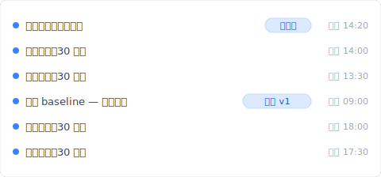
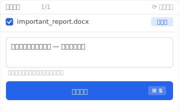

刪除一個檔案、打開垃圾桶——「不在」。

「我剛剛明明右鍵刪除了啊」，你開始懷疑：剛剛 Shift 鍵有沒有按到？垃圾桶是不是滿了？心臟有種被輕輕往下壓的感覺。

別緊張。大多時候，檔案還在硬碟裡。「從垃圾桶消失」跟「完全消失」是兩回事。問題在於 Windows、macOS、OneDrive 各有自己一套「跳過垃圾桶」的刪除規則，只要找出是哪一條規則害的，救回機率其實還不錯。

但在動手之前，有 4 件事絕對不能做。請先看下面 5 個原因找出你的狀況，再進到救援方法。順序很重要。

## 刪除的檔案不在垃圾桶的 5 個原因

垃圾桶裡找不到檔案，大致可以分成 5 種情況。每一種背後的機制不同，先確認自己屬於哪一類，才是還原的第一步。

如果你有像 Keeply 這類常駐型的版本歷史工具在背景跑，這 5 種原因隨便一種發生，被刪檔案的過去版本都還留在 Keeply 的時間軸裡。不過原因還是要先確認，因為它決定下一步怎麼做。

### 1. 用 Shift+Delete 永久刪除（Windows 預設行為）

在 Windows 上，按住 `Shift` 鍵再按 `Delete`，檔案會直接被刪除、跳過垃圾桶。就算只是不小心碰到 Shift 鍵，垃圾桶也不會留下任何痕跡。

這種情況下檔案本體通常還留在硬碟的「未配置區」，救援軟體仍有機會救回。但如果有新資料寫進那塊區域就會被覆蓋掉、永遠消失。所以下一段「動手前不能做的事」一定要先看。

### 2. 垃圾桶容量超出，被自動清掉

Windows 的垃圾桶有「最大容量」設定，預設大約是該硬碟容量的 5%。超出就會從最舊的開始自動永久刪除。所以如果你剛刪了一個大檔，接著又連續刪了幾個檔案，第一個大檔可能在你不知情的狀況下被自動清掉。

垃圾桶的最大容量可以在桌面右鍵點垃圾桶 → 內容查到。

### 3. 從網路共用硬碟或 USB 刪除

從檔案伺服器、NAS、USB 隨身碟、SD 卡這類「不是本機 C 槽」的儲存裝置刪除的檔案，不會進到 Windows 垃圾桶。這是 Windows 的設計：本機 NTFS 硬碟以外的刪除，一律是「即時永久刪除」。

很多人沒意識到這點，從公司檔案伺服器誤刪一個檔案，隔天才發現「垃圾桶裡沒有」——這是企業 IT 支援最常接到的問題之一。

### 4. OneDrive、SharePoint 同步刪除

從 OneDrive 或 SharePoint 同步資料夾刪除的檔案，不會進到本機垃圾桶，而是同步到 OneDrive 雲端那邊的「垃圾桶」。打開本機垃圾桶找不到，是因為刪除動作被同步到雲端去了。

OneDrive 個人版的雲端垃圾桶保留 30 天，商用版（SharePoint）保留 93 天。過期就會被自動永久刪除。

### 5. 垃圾桶保留期限到了

新版 Windows 10 / 11 的「儲存空間感知」功能預設開啟，垃圾桶裡的檔案超過 30 天會自動永久刪除，這是預設值。

這個功能可以在「設定」→「系統」→「儲存空間」→「儲存空間感知」關掉。但大多數 PC 保持預設，意思就是你「一個月前刪除的檔案」會悄悄地被清掉。

## 【重要】動手救援前不能做的 4 件事

檔案剛消失那一刻，會很想馬上下載救援軟體——這心情完全可以理解。但這個動作本身可能會降低救回機率。下面 4 件事，請在你「找出原因」和「進入救援方法」之間，絕對避開。

這 4 件禁區是寫給「事前完全沒備份」的情況。如果你已經有 Keeply 在跑常駐快照，被刪的版本早就在時間軸裡，這 4 條規則造成的壓力幾乎不存在。但萬一只能靠救援軟體那條路，下面的禁區還是要知道。

### 1. 不要在原本那顆硬碟寫入新資料

被刪檔案的本體，剛刪除時通常還留在硬碟「未配置區」。但只要有新資料寫進那塊區域，就會覆蓋掉、永遠消失。

也就是說，刪檔之後開瀏覽器、下載東西、寄信，這些動作都會產生新的寫入，可能會覆蓋掉你想救的那個檔案。除了確認原因，請把電腦操作減到最少。

### 2. SSD 上 TRIM 機制可能已經把痕跡清掉

SSD 有個叫 TRIM 的機制：刪除檔案時，作業系統會通知 SSD「這塊區域不再需要」，SSD 內部會主動把資料清掉。HDD 上被刪資料通常會留在未使用區，但 SSD 在 TRIM 跑完之後，連救援軟體都很難救得回。

在 SSD 上用 Shift+Delete，TRIM 通常會在幾秒到幾分鐘內執行，所以救援難度比 HDD 高非常多。

### 3. 不要把救援軟體裝在被刪檔案的同一顆硬碟

這是最多新手會犯的錯。慌張之下下載救援軟體，安裝精靈預設路徑就是 C 槽，結果安裝過程本身會寫進你想救檔案的那塊「未配置區」，直接覆蓋掉。

如果要用救援軟體，請用 USB 隨身版，或裝在另一顆硬碟上。

### 4. 不要急著重開機或重設電腦

「重開機應該就好了吧」「重設應該會還原吧」——對被刪檔案的還原來說，這兩個都是反效果。重開機會觸發系統檔案寫入；重設更是會把整顆硬碟全部寫入新資料。

如果有想救的檔案，請先讓電腦操作減到最少、確認原因、選對救援方法，再動手。

## 自己救回檔案的 4 個方法

確認原因、看完上面禁區之後，進到救援方法。根據你的情況，依下面順序嘗試。

下面 4 個方法都是「事後找回」的範疇——前提是你事前就啟用了對應的功能。如果都沒設過，下一段的 Keeply 事前保存設計可能會是更實際的答案。

### 1. Windows 檔案歷程記錄（Windows 10 / 11）

Windows 內建一個叫「檔案歷程記錄」的備份功能，如果事前有開啟，可以還原特定資料夾（文件、桌面、圖片等）的過去版本。

在檔案總管打開該資料夾，從功能區點「歷程記錄」。如果事前有開啟檔案歷程記錄，可以回到該資料夾過去某個時間點的狀態。

重點在「事前有開啟」。預設是關閉的，多數使用者是檔案被刪了之後才知道有這個功能。當作未來的防護，建議現在就先打開。

### 2. macOS Time Machine

Mac 內建「Time Machine」時間軸備份，事前接上一顆外接 SSD 或網路儲存裝置，系統就會自動定期做快照。

從選單列點 Time Machine 圖示 →「進入 Time Machine」。回到過去某個時間點的資料夾，選你要的檔案，點「還原」就會回到目前的資料夾。

Time Machine 需要事前設定加上接著儲存裝置才能用，所以如果你平常都只在桌面工作、沒接過外接硬碟，這條路用不上。

### 3. OneDrive 雲端垃圾桶、版本歷史

如果檔案原本是在 OneDrive 或 SharePoint 同步資料夾，可以從 OneDrive 網頁版去看「資源回收筒」。OneDrive 個人版 30 天內、SharePoint 93 天內，被刪檔案很可能還在。

OneDrive Web → 左邊選單「資源回收筒」→ 選那個檔案 →「還原」就會回到原本的資料夾。

如果檔案本身還在但「內容被破壞」，也可以從 OneDrive 的「版本歷程記錄」回到過去版本。根據 [Microsoft Learn](https://learn.microsoft.com/zh-tw/sharepoint/document-library-version-history-limits)，預設最多保留 500 個版本。

### 4. 救援軟體（Recuva、Disk Drill 等）

如果以上 3 種都不適用，就要用專業救援軟體了。主流選擇是 [Recuva](https://www.ccleaner.com/recuva)（免費）和 [Disk Drill](https://www.cleverfiles.com/recover-deleted-files.html)（免費試用版）。

但救援軟體的成功率，會隨條件變化很大：

- HDD 剛刪不久 → 成功率 70-90%
- SSD 在 TRIM 跑完之後 → 降到 10-30%
- 檔案有碎片化 → 再往下降

救援軟體是「最後手段」，不是從根本上防止檔案消失的機制。

## 一開始就不該消失的設計：常駐版本歷史這個選項

讀到這你可能也察覺到了——叫救援軟體、找專業業者、為了拉高還原成功率把電腦停下不動——這些全部都是「事後處理」的話題。

但真正需要的，難道不是「事前就已經有副本被保存著」的設計嗎？

Windows 檔案歷程記錄、Time Machine 思想本身都是對的。問題是大多數使用者根本不知道它們存在，等到知道的時候，檔案已經刪掉了。

Keeply 是把「沒注意到的時候、其實已經有副本」這個設計徹底執行的工具。

機制很單純：

- 每 30 分鐘（也可以選 15 / 60 分鐘），自動把選定資料夾裡所有檔案做一次快照保存
- 任何時間點都可以手動按「儲存版本」按鈕，幫那個瞬間的快照命名、留筆記
- 刪除、覆蓋、儲存錯誤版本——都可以從過去的時間軸還原回來

當你想把某個瞬間的狀態鎖起來——比如即將分享給團隊的那一版——也可以手動按按鈕留一個快照。

意思是說，不管檔案從垃圾桶消失、被 Shift+Delete、被 OneDrive 同步刪掉——Keeply 獨立保存的版本還在。這是「事前保存」的概念，不是「事後復原」。

不過，有一些情況 Keeply 解決不了：

- 物理損壞（HDD 磁頭故障、SSD 晶片故障）不在守備範圍內
- 這種情況需要專業資料救援業者

Keeply 處理的是「使用者操作造成」的事故（誤刪、誤覆蓋、儲存到壞掉的版本），「硬體故障」明確不在範圍內。這條界線講清楚。

## 常見問題

### Q1. Keeply 的自動儲存能救回被刪除的檔案嗎？

可以。Keeply 每 30 分鐘（也可以選 15 / 60 分鐘）會把你指定資料夾裡所有檔案做一次快照保存。被刪掉的檔案可以從「最近一次的快照」復原，完全不依賴垃圾桶。Windows、macOS 都能用。

### Q2. 用 Shift+Delete 永久刪除的檔案還救得回來嗎？

Windows 的設計就是 Shift+Delete 會跳過垃圾桶，所以系統內建工具無法救。如果事先有開啟 File History 或 Time Machine，可以從過去的版本還原。否則只能靠救援軟體，而 SSD 因為 TRIM 機制成功率會大幅下降。最保險的做法是事前裝一個像 Keeply 這樣的常駐版本歷史工具。

### Q3. 救援軟體安全嗎？

Recuva（CCleaner 系列）和 Disk Drill 都是全球廣泛使用的主流工具，軟體本身是安全的。要注意的是：如果把它裝在被刪檔案的同一顆硬碟上，安裝過程本身就會覆蓋掉你想救的檔案。一定要裝在另一顆硬碟、或用 USB 隨身版執行。

### Q4. SSD 的還原成功率比 HDD 低，是真的嗎？

是真的。SSD 有 TRIM 機制：當系統刪除檔案時會通知 SSD 控制器「這塊區域不再需要」，SSD 內部會主動把資料清掉。HDD 上被刪資料通常會留在未使用區，但 SSD 在 TRIM 跑完之後，幾乎無法還原。

### Q5. 找專業業者救援大概多少錢？

邏輯損壞（誤刪等）大約台幣 6,000-30,000 元；物理損壞（硬碟故障等）大約台幣 30,000-150,000 元。很多業者採完全成功收費制，沒救回不收錢，所以先請業者免費檢測是最安全的第一步。

---

**作者**：Ting-Wei Tsao｜Keeply 創辦人
[LinkedIn](https://www.linkedin.com/in/ting-wei-tsao/)｜[Keeply](https://keeply.work/)

Keeply 是一個在做的桌面工具：讓檔案歷史在背景持續保存著。不用依賴垃圾桶、不用依賴 Cmd+Z，你就可以回到過去任何一個時間點。我們想把這個普通的體驗，帶給每個跟檔案打交道的人。

延伸閱讀：

- [被刪掉的檔案找不到時：iOS 跟 Outlook 有「最近刪除」清單，Finder 跟檔案總管沒有](/zh-tw/post/deleted-files-recovery-list/)
- [檔案版本管理完整指南：Mac、Windows、雲端的差異到 Keeply](/zh-tw/post/file-version-management-complete-guide/)
