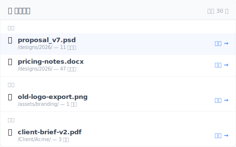

# 【2026 檔案管理】你不需要救援軟體，你需要一份「最近刪除」清單

> iOS 會顯示你刪了什麼，Finder 不會。這個 UX 模式偏偏缺在你最需要的工具裡。

週三上午 11:14，你按下 Delete，本以為刪掉的是錯的重複檔。兩分鐘後，發現刪錯了——刪到的是正確版本。

打開垃圾桶。空的。上週五清過了。

Google「Mac 救回刪除的檔案」。第一個結果：[Disk Drill](https://www.cleverfiles.com/data-recovery-software.html)，一年 $89 美金（終身版 $149），需要對你的 SSD 做鑑識掃描。你已經在 Google「SSD 上跑鑑識救援會不會傷硬碟」。

你不需要鑑識工具。你需要一份清單。

## 已經做這件事的工具，跟沒做的工具

iOS 照片有「最近刪除」相簿。iCloud Drive 有。備忘錄有。Outlook 有「復原已刪除項目」。Gmail 有 30 天垃圾桶。

反倒是協作工具未必有。Slack 免費版你[刪掉的訊息根本找不回](https://slack.com/help/articles/203457187-Customize-data-retention-in-Slack)——那個「90 天」只是可見歷史的上限，不是還原鍵。連它都沒做「找回你刪掉的東西」這件看似基本的事。

然後是表格下半部——你真正在工作的地方。

| 工具 | 「最近刪除」清單？ |
|---|---|
| iOS 照片 | ✅ 30 天相簿 |
| iCloud Drive | ✅ [「最近刪除」30 天](https://support.apple.com/guide/icloud/recover-deleted-files-mmae56ea1ca5/icloud) |
| 備忘錄（iOS / macOS） | ✅ 30 天資料夾 |
| Outlook | ✅ 復原已刪除項目 |
| Gmail | ✅ 30 天垃圾桶 |
| Slack | ✅ [免費版可見 90 天（保留政策可調）](https://slack.com/help/articles/203457187-Customize-data-retention-in-Slack) |
| **macOS Finder** | ⚠️ 垃圾桶 30 天，但沒有資料夾層級的清單 |
| **Windows 檔案總管** | ⚠️ 只有資源回收筒，清空後就沒了 |
| **Dropbox 本機資料夾** | ❌ 刪除直接從本機消失（[線上 Basic 30 天 / Pro 180 天](https://help.dropbox.com/delete-restore/recover-deleted-files-folders)才找得回） |
| **Google Drive 本機同步** | ❌ 跟 Dropbox 一樣 |
| **一般版本控制工具** | ❌ 要去「瀏覽歷史」找 |

下半部的工具，剛好就是你日常保存真實工作的地方。上半部的工具，反而是沒有這個功能也還可以的。

## 為什麼這個模式偏偏缺在你最需要的地方？

「最近刪除」這個 affordance 出現在**有 curated 內容模型**的 app 裡（照片、備忘錄、email）。它缺席在把檔案視為「透明檔案系統鏡像」的工具裡。

**Curated app**（iOS 照片、Outlook、備忘錄）：你不是在「管理檔案」，是在「跟內容互動」。「最近刪除」是內容管理的基本元件——心智模型本來就要這個，設計師當然會做。

**檔案系統鏡像**（Finder、檔案總管、Dropbox 本機同步）：這些工具是為了**透明反映磁碟內容**設計的。加一個「最近刪除」面板會違反這個透明契約——檔案不在磁碟上了，為什麼資料夾還顯示？

這份透明的代價：你只繼承到 OS 層的垃圾桶 / 資源回收筒。清空後，檔案在所有地方看起來都消失了——即使版本控制或雲端同步其實還有一份。救援路徑變成「打開時間軸 → 找到那天 → 找到檔案 → 還原」，摩擦大、容易跳過、容易默認跑去用鑑識軟體。

於是你來到了 Disk Drill 的訂價頁面——不是因為鑑識救援是對的工具，是因為對的工具（那份清單）沒被工具呈現出來。

## UI 沒呈現的那條 30 秒救援路徑

工具有「最近刪除」清單時，救援大約 5 秒。沒有時，救援是 5 分鐘的時間軸翻找，或 $89 美金加 2 小時的鑑識掃描——而且 SSD 上不一定救得到。

這個模式做得好的工具長什麼樣：

- **放在最上層**——sidebar 入口或主 tab，不是埋在 3 個點擊之後
- **依時間分組**——「今天 / 昨天 / 本週 / 更早」，不是 200 筆刪除的扁平清單
- **顯示原始路徑**——這個檔案從哪個資料夾刪的？這對確認「對，就是這個」很關鍵
- **一鍵還原**——不用選版本、不用 3 步「你確定嗎」精靈。點下去 → 還原到原始路徑
- **不需要鑑識**——這是從你自己有意保存的存檔歷史中救回，不是從磁區層救

[Keeply](https://keeply.work) 把這個做成「🗑️ 刪除清單」面板：你加進去的專案內，過去 30 天刪除的檔案清單、依時間分組、一鍵還原到原始資料夾。還原這個動作本身會建立一個新存檔點——所以連 undo 都會被版本化，你可以再 undo 一次。

不是鑑識工具，是一份有還原按鈕的清單。

可以放在你加進 Keeply 的任何資料夾裡運作——你的 Dropbox 本機資料夾、iCloud Drive 資料夾、Synology NAS 上的專案目錄、筆電上的純資料夾。你不換系統，是疊一層清單上去。

## 這份清單不夠用的場景

這個模式不解所有刪除場景。三個邊界要講清楚：

**你 6 個月前清過垃圾桶且當時沒在跑版本控制**：這篇文章描述的模式不適用——你真的進入鑑識救援領域了。Disk Drill 或 Recuva 可能有用，但 [檔案救援軟體不一定救得到](/zh-tw/post/restore-without-panic/) 解釋為什麼這類工具經常也失敗（SSD TRIM 是簡短版）。

**刪除發生在你不控制的遠端共享資料夾**：如果 IT 管理員或團隊負責人清空 SharePoint 資源回收筒超過 [93 天視窗](https://learn.microsoft.com/en-us/sharepoint/retention-and-deletion)，那份清單在你這邊根本沒存在過。要解的是管理員政策對話，不是裝什麼軟體。

**你要救的是檔案內部的編輯不是整個檔案**：Excel 單一儲存格回溯、Word 撤銷某段話——這是另一個問題，[Excel 那篇](/zh-tw/post/excel-version-history-limits/) 跟 [Word 那篇](/zh-tw/post/client-asked-which-version/) 各自處理。

## 延伸閱讀

主篇 [檔案版本管理完整指南](/zh-tw/post/file-version-management-complete-guide/) 拆解 4 個結構性原因——為什麼工具就是沒設計給你這件事。

[檔案救援軟體不一定救得到：4 種情境](/zh-tw/post/restore-without-panic/) — 本文的 forensics 角度對照版：當「清單救援」太遲時，這篇講為什麼替代方案也常常失敗。

[找回被覆蓋檔案的極限：自動回復 救不到的地方](/zh-tw/post/recover-overwritten-file/) — 不同救援場景（覆蓋而非刪除），同一主題：工具是依「為什麼建造」分類的。

---

檔案救援的摩擦不是技術限制，是 UI 設計選擇——要不要顯示你刪了什麼。

有顯示的工具（iOS、Outlook、iCloud）幫你避開那場恐慌螺旋。沒顯示的工具（Finder、檔案總管、一般同步 client）把你推到原本不必進去的鑑識領域。

挑會呈現這個模式的工具。或加一層做這件事的工具。週三上午，刪錯後兩分鐘，答案是「點、點、還原」——不是「我先 Google 一下 Disk Drill 多少錢」。

---

> 關於作者：Ting-Wei Tsao，Keeply 創辦人。
> [LinkedIn](https://www.linkedin.com/in/ting-wei-tsao-b57480152/)
