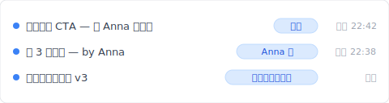
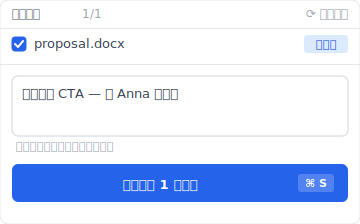
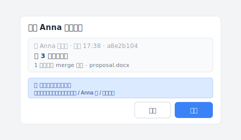

# 【2026 檔案管理】Dropbox 衝突的副本：為什麼一直出現？4 種觸發場景 + Keeply 怎麼根治

> Dropbox `(conflicted copy)` 不是 錯誤，是設計上沒做衝突偵測層、後存者覆蓋前一版的結果。

週四晚上 10:30，你跟同事 Anna 共用 Dropbox 改一份提案。她加了 3 段內容、你同時加了結尾的 CTA。你們都存了檔。隔天打開資料夾、多了一份 `提案 (Anna 的 conflicted copy 2026-05-02).docx`。她改的你這裡沒有、你加的她那裡也沒有。你花 1 小時手動合併、30 分鐘檢查有沒有漏。

這不是 錯誤，是 Dropbox 設計上沒做衝突偵測層的後果。這篇拆完 4 種會觸發衝突副本的場景、Dropbox 為什麼這樣設計、然後讓你看 [Keeply](https://keeply.work) 怎麼用「本機副本 + 主動推送」根治。

## 目錄

1. [換 Keeply 後 Anna 跟你各存一版都進時間軸](#keeply-timeline)
2. [Dropbox 衝突的副本 4 種觸發場景：你工作模式至少踩 2 種](#when-it-happens)
3. [Dropbox 為什麼這樣設計衝突副本？last-writer-wins 的商業取捨](#why-dropbox-design)
4. [手動合併兩份檔案為什麼只是症狀治療？](#why-manual-merge-fails)
5. [3 種同步設計根治衝突副本：Git-style 偵測 / 檔案鎖定 / Keeply 本機副本](#three-designs)
6. [不必裝 Keeply 的 Dropbox 衝突副本 4 種場景](#when-not-needed)

---

## 換 Keeply 後 Anna 跟你各存一版都進時間軸 {#keeply-timeline}

先讓你看現在。同樣是週四晚上 10:30、Anna 加 3 段背景、你加結尾 CTA——在 [Keeply](https://keeply.work) 裡，這個專案保管庫的時間軸看起來是這樣：

「加 3 段背景 — by Anna」自己一行、有「Anna 的」tag。「加完結尾 CTA — 等 Anna 合進來」也自己一行、有「你的」tag。兩個版本都在、有筆記說明各自改了什麼、可以打開看完後決定怎麼合。

沒有 `(conflicted copy 2026-05-02)` 後綴。沒有「Anna 改的你這裡沒有」的驚喜。

那行筆記怎麼來的？你加完結尾 CTA、點 Keeply 主視窗「儲存版本」按鈕、跳出來這個對話框：

寫一行「加完結尾 CTA — 等 Anna 合進來」、儲存版本。Anna 那邊也是同樣動作。兩個版本各自進到保管庫的時間軸、互不覆蓋。

**Keeply 不自動合併文件內容**——沒有同步工具能正確自動合併（那要懂語意）。但 Keeply 把「衝突」變成「兩個有筆記的版本並列」、由你決定怎麼合。比起 Dropbox 安靜地把 Anna 的版本另存成 conflicted copy、你過 3 週才發現、好太多。

下面拆 Dropbox 為什麼會這樣設計、傳統做法（手動合併 / 鎖定 / 對齊時間）為什麼補不起來。

---

## Dropbox 衝突的副本 4 種觸發場景：你工作模式至少踩 2 種 {#when-it-happens}

把「衝突副本一直出現」拆開看、4 種完全不同的場景每個都會觸發：

| # | 場景 | 機制 |
|---|---|---|
| 1 | **兩人同時編** | 兩端都改完上傳、Dropbox 不知道前面已被改 |
| 2 | **離線編後上線** | 火車上改一段、回到 Wi-Fi 同步時跟雲端版本不一致 |
| 3 | **多裝置切換** | 筆電寫到一半切手機繼續、筆電後來同步撞到手機版 |
| 4 | **跨作業系統時鐘差** | Mac 跟 Windows 系統時鐘差幾秒、Dropbox 判定為衝突 |

沒人告訴你的是：4 種之中只要踩到一種、衝突副本就會出現。**而你的工作模式裡至少會踩到 2 種**。

---

## Dropbox 為什麼這樣設計衝突副本？last-writer-wins 的商業取捨 {#why-dropbox-design}

Dropbox 用「後存者覆蓋、前一版另存」這個機制（[Dropbox 官方說明](https://help.dropbox.com/organize/conflicted-copy)）：兩人同時改、後上傳的版本勝出、前一版不丟掉、存成 `(conflicted copy)`。

不是技術做不到衝突偵測、是商業取捨：

- **即時體驗優先**：同步不能擋你工作。每次都跳「請選擇合併方式」會讓 Dropbox 變難用
- **衝突解析推給使用者**：把另一版另存 = 「我都幫你留著、你自己決定」
- **設計者的選擇**：誰也不丟、但使用者得做工

對啊、這就是讓人煩的地方。Dropbox 把工具該做的事（衝突偵測 + 提示）推給使用者紀律。而紀律永遠贏不過自動化。

---

## 手動合併兩份檔案為什麼只是症狀治療？ {#why-manual-merge-fails}

[Dropbox Help Center](https://help.dropbox.com/organize/conflicted-copy) 教你的修法：「打開兩份檔案、比對差異、手動合併到主檔、刪掉衝突副本。」一聽很合理。

但這個修法**不改變機制**。你下個禮拜還會再撞到同步衝突、還會再產生新衝突副本、還會再手動合併。一個月之後你已經做這件事 4-5 次。

你不是不會合併。你是在用一個**設計上不擋衝突的工具**。解法是換同步機制、不是訓練自己合併得更快。

對比 Google 前 3 名搜尋結果（Dropbox Help / EaseUS / Wondershare）：他們都是症狀治療指南、沒人從機制角度切入。

---

## 3 種同步設計根治衝突副本：Git-style 偵測 / 檔案鎖定 / Keeply 本機副本 {#three-designs}

把同步設計能做的事拆成 3 種模式。每種對應不同的衝突場景：

### 設計 A：偵測 + 提示（同步時主動問你）

兩端改同檔、同步時偵測衝突、跳介面提示給使用者選：留 A、留 B、或把兩個變更合併。**例子**：工程師圈用的版本控制工具用這種模式。**Keeply** 把同樣的偵測搬進辦公室工具：撞到衝突時、用「Anna 的版本」「你的版本」這種白話讓你選、不會跳出術語。

實際長這樣——Anna 那邊也推了一版進保管庫、Keeply 把「套用她的變更」這件事跳成對話框讓你決定：

點「套用」前 Keeply 會自動先把目前的版本拍一張快照（即使按錯也能 Undo）、按下去之後若兩邊改到同一段文字、會跳第二層選擇：保留你的 / 用 Anna 的 / 兩個都留。**解場景 #1 + #2**。

### 設計 B：檔案鎖定（誰開了誰先用）

你打開檔案、工具自動鎖住。同事打開看到「Anna 在用」、不能改、要等。**例子**：SharePoint、Adobe Creative Cloud Files、Bentley ProjectWise（建築業專案管理系統）。**解場景 #1 + #3 + #4**、取捨：同事得等。

### 設計 C：本機副本 + 主動推送（Keeply 模型）

你的工作版本在本機、Keeply 在背景每 30 分鐘輪詢自動存（不是 Dropbox 那種即時同步到雲端）。每個人各自在自己電腦上改、各自點「儲存版本」、推送時把自己的版本進到共用保管庫。如果 Anna 已經推了一版、你推時看得到她的版本在時間軸、有筆記能看她改了什麼、你決定怎麼合並後再推。**Keeply** 走這條路。**解場景 #1-#4**、取捨：不像 Dropbox 即時鏡像、有 30 分鐘輪詢間隔 + 主動推送的延遲。

---

## 不必裝 Keeply 的 Dropbox 衝突副本 4 種場景 {#when-not-needed}

Keeply 不解所有 Dropbox 場景。誠實列出來：

**大檔即時同步**。Premiere 專案邊改邊同步、Adobe Creative Cloud Sync 那種、Keeply 本機副本模型不適合（推送一次要幾分鐘）。

**行動裝置存取**。Keeply 是桌面優先、Dropbox 在手機上順得多。

**外部分享連結**。Dropbox 的「Share link」Keeply 沒對應功能。要分享給沒裝 Keeply 的人看、用 Dropbox / Google Drive 比較直接。

**協作頻率超高**（1 小時內多人輪流編輯）。Keeply 比 Dropbox 慢、那種場景該用 Google Docs 共同編輯。

以上都不適用——你常踩 `(conflicted copy)`、想要每個版本有筆記、半年後翻得回——這時候裝 Keeply 才划算。

---

## 延伸閱讀

主篇 [檔案版本管理完整指南](/zh-tw/post/file-version-management-complete-guide/) 拆 4 個結構性原因——為什麼工具就是沒設計給你這件事。

對照閱讀：[Keeply 跟備份、雲端工具有什麼不一樣](/zh-tw/post/what-keeply-saves-vs-backup-cloud/) — 三件不同事的完整對照。

共用資料夾的另一面：[共用資料夾的命名稅：4 人團隊一年花 83 小時改 _v7_FINAL_千萬別動 後綴](/zh-tw/post/hidden-cost-shared-folders/) — 同樣是多人協作的設計缺陷、不同切入。

---

下次資料夾多出 `(conflicted copy)` 檔名、你不會再花 1 小時手動合併。你會知道那是機制問題、而且你有別的選項。

打開 [Keeply](https://keeply.work)、看時間軸上 Anna 跟你各自的版本各一行——沒有 `(conflicted copy)`、有筆記能看、可以決定怎麼合。

---

> 關於作者：Ting-Wei Tsao，[Keeply](https://keeply.work) 創辦人。
> [LinkedIn](https://www.linkedin.com/in/ting-wei-tsao-b57480152/)
