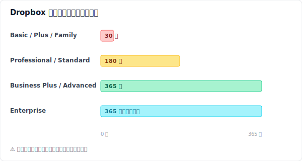
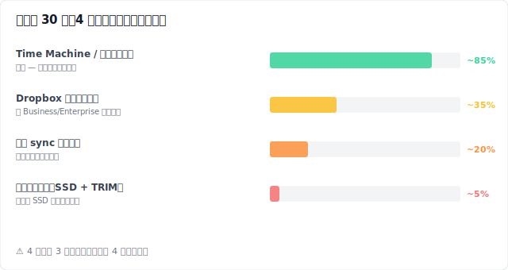
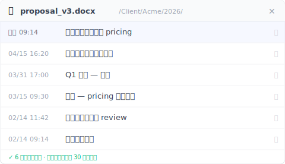
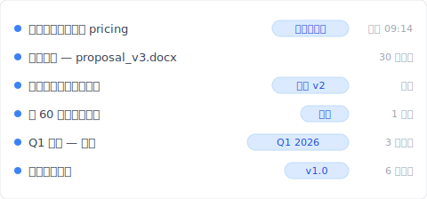

# 【2026 檔案管理】Dropbox 救得回昨天的誤刪，救不回兩個月前那一版

> Dropbox 救得回昨天的誤刪。救不回客戶兩個月後突然要的那一版。30 天時鐘過了還剩什麼路？以及怎麼讓下次再也不用倒數。

這不是一份救援指南。是三個人在 Dropbox 30 天時鐘上的三個位置，以及他們各自還能做什麼。

名字是假的。狀況是合成的 — 取自 [Dropbox Community](https://community.dropbox.com/) 上關於「刪除檔案救回」討論串的常見模式。但他們發現的機制是真的。

## Sarah — 5 分鐘前

> **【合成範例】**Sarah 是接案設計師。星期三上午 11:14。她剛剛按下刪除鍵把 `proposal_v3_FINAL.docx` 丟掉，以為那是舊版重複檔。新的應該是 `proposal_v3_FINAL_FINAL.docx`。她停了一下。等等 — 真的是這樣嗎？

她打開 dropbox.com，點左邊側欄的「**已刪除檔案**」。檔案在那，時間是 11:14。三個點：**⋯** → **還原**。完成。檔案回到原本的路徑。筆電在背景把它同步回來。手機過兩分鐘也跟上。

Sarah 之所以救得回來，是因為她還在保留期限內。Basic、Plus、Family 方案上，Dropbox 把已刪除檔案保留 30 天。來源：[help.dropbox.com 關於救回已刪除檔案](https://help.dropbox.com/delete-restore/recover-deleted-files-folders)。30 天內，網頁版三個點就能還原。

Sarah 沒意識到的是：她這次救回來，靠的是三件她不小心做對的事。

她用了 dropbox.com，不是桌面上的檔案管理員。如果 `proposal_v3_FINAL.docx` 剛好在一個被「[選擇性同步 (Selective Sync)](https://help.dropbox.com/sync/selective-sync-overview)」排除的資料夾裡 — Dropbox 提供的功能，讓某些資料夾不下載到本機以節省硬碟空間 — 那刪除動作會直接發生在雲端、根本不會經過本機的資源回收筒。每天都有人踩這個坑：先在本機找，沒找到，就以為檔案從來不存在。

她還原的是檔案，不是某個特定版本。如果 Sarah 想要的是三週前那個星期二的 `proposal_v3` — 不是今天這版 — 她需要的是[版本歷史](/zh-tw/post/file-version-management-complete-guide/)，那是另一棵跟刪除歷史完全分開的樹。「還原」會把檔案還原成被刪除那一刻的樣子。她昨天另外存的三個版本，是另一回事。

而且這個資料夾她沒碰過 conflicted copy。如果有 — 像是 `proposal (Marco's conflicted copy 2026-04-15).docx`，這是 Dropbox 在 [同步衝突](../dropbox-conflicted-copy/) 時自動建立的標記 — 又被同事以為重複砍掉，那她現在會在「已刪除檔案」裡用錯誤的檔名翻找。

Sarah 沒想這麼多。她把檔案救回來，去吃午餐。下午一切順利。

## Marco — 35 天前

> **【合成範例】**Marco 是 B2B 顧問，用 Dropbox Plus 方案。今天他客戶寫信來，要「我們上次改 pricing 之前那版提案 — 大概一個月前吧」。Marco 打開「已刪除檔案」。空的。他按日期排序。過去一個月也沒有。他翻寄件備份、信件草稿、桌面。然後他想起來了：五週前他整理過這個資料夾。他要的那份檔案就是那時候被自己刪掉的。

Marco 開了一張客服單。四十八小時後回信來：Dropbox 不能救回 Plus 帳號上超過 30 天的檔案。客服建議他升級到 Professional，可以拿到 180 天保留期限(從升級之後算)。Marco 還是升了，心想萬一呢。他再進去看。檔案還是沒有。

這就是 Dropbox 保留方案的廣告不會主打的那一塊。你方案的保留期限，套用的是**你刪除那一刻**的方案。Plus 刪除 = 30 天保留，無論你一週後升級到什麼方案。刪除時啟動的時鐘不認後續的升級。這個模式在 [Dropbox Community 討論串](https://community.dropbox.com/en/discussion/477149/can-i-recover-files-deleted-more-than-30-days-ago-if-i-upgrade-my-account) 上反覆出現。

Marco 真正剩下的三條路：

第一條是 Dropbox 客服協助。對 Business 與 Enterprise 客戶來說，如果只超過保留期限幾天，客服有時候能想辦法。Dropbox 官方政策寫的是個案處理，不是保證。Marco 是 Plus。客服單禮貌地關閉了。

第二條是看檔案有沒有同步到他舊筆電。如果作業系統的 sync 快取裡還留著本機副本 — 而且作業系統還沒回收那塊空間 — 他也許能找到一份殘影。他翻 `~/Dropbox/.dropbox.cache/` 跟 `~/Library/Application Support/`。沒有用。重新開機那時快取就被清掉了。

第三條，是 Marco 接下來真正做的事：他憑記憶跟那一週寄出的信件，把 pricing 那一段重寫一遍。內容跟原本不一樣。客戶看得出來。簽約往後拖了三天。

下面這張圖把 Dropbox 所有方案的保留故事濃縮成一張圖：

數字來自同樣兩個來源頁面：[版本歷史](https://help.dropbox.com/files-folders/restore-delete/version-history-overview) 與 [資料保留政策](https://help.dropbox.com/account-settings/data-retention-policy)。Marco 的救援期限是 30 天，因為他刪除時用的是 Plus。事後升級什麼方案都改變不了過去。

## Linh — 75 天前

> **【合成範例】**Linh 是博士生，在寫論文。她指導教授寫信來：「我想看一下你二月中傳給我那版的方法論章節 — 還沒把樣本範圍收窄之前那一版。」那是兩個半月前的事。Linh 六週前完成第四章的時候，把那一版草稿刪掉了。她用 Dropbox Family 方案，因為跟伴侶共用。30 天保留期限。早就過了。

Linh 在 Dropbox 那邊已經沒得選了。剩下的只能往本機找。

她在 Windows 上打開 [Recuva](https://www.ccleaner.com/recuva)(免費)掃 SSD。掃出幾百個檔案片段;沒有一個日期對得上。她又試了 [Disk Drill](https://www.cleverfiles.com/)(試用版 89 美金)做更深層的鑑識掃描。一樣。問題不在軟體。問題是 TRIM。

TRIM 是現代 SSD 的一項機制：作業系統會提前告訴 SSD 控制器哪些區塊已經被刪除，SSD 就會在新資料寫進來之前主動清空那些區塊。[Microsoft Learn 文件](https://learn.microsoft.com/en-us/windows/win32/w8cookbook/new-api-allows-apps-to-send--trim-and-unmap--hints-to-storage-media) 寫得很直接：「TRIM 提示通知磁碟某些先前分配的磁區應用程式已不再需要，可以清除。」macOS 從 OS X 10.10.4 起就在 Apple 原廠 SSD 上預設啟用 TRIM;第三方 SSD 用 `sudo trimforce enable` 開啟。結果是：一旦 TRIM 在某個磁區跑過 — 通常是刪除後幾分鐘內 — 救援軟體就找不到東西了。Linh 的論文草稿六週前就在矽晶片那一層被清光。沒有任何工具搆得到。

下面這張圖把 Linh 試過的四條路徑按實際結果排序：

四條路裡有三條需要**在刪除之前**就已經設定好。剩下那條 — 事後跑 Recuva 或 Disk Drill — 是每個人最先想到的，卻在現代筆電上幾乎沒有成功過。

Linh 寫信給指導教授，說她會從筆記跟早期草稿重建方法論章節。那是一個她原本沒打算要花掉的星期六。

## 為什麼三個人都掉進來

Sarah、Marco、Linh 三個人，做不同的工作、處理不同的檔案、踩在不同的時間點。他們的共同點是：都把 Dropbox 的刪除救援當成了「版本歷史層」來用。但它不是。它是一道**最後一道網**，設計來接住你昨天刪錯重複檔的那一刻。

最後一道網一定會過期。儲存空間要錢。一個把所有刪除永久保留的雲端，要嘛收費方式不一樣，要嘛偷偷加帳戶上限。30 天保留期限不是 錯誤;它是這個產品照設計運作的樣子。廣告強調的是它接住了什麼。沒強調的是它沒接住什麼。

真正接住最後一道網漏掉那些東西的，是住在另一個地方的版本歷史層 — 一個不打算當 sync 引擎、不打算便宜大碗、不打算一次做十二件事的層。一個只為一件事存在的層：把你存的每一版，永久留在你自己的硬碟上，那裡儲存空間便宜，時間也不是敵人。

## 平行宇宙

> 倒帶一下。一樣的 Sarah、Marco、Linh。但這次每個人都在註冊 Dropbox 的同一天，把 Keeply 也裝起來了。

Sarah 按下刪除鍵刪錯重複檔。救援流程一模一樣 — Dropbox 在 30 天內接住，三個點，完成。Keeply 那時候在背景跑，但這次她用不到。

Marco 的客戶在 pricing 那版從 Dropbox 消失 35 天之後寫信來。Marco 打開 Keeply 的版本歷史面板，找那份提案。五週前那一版就在那裡，旁邊還有他當時寫的註記：「套用客戶調整後的 pricing」。他複製出來。十一秒。

Linh 的指導教授寫信來要那版收窄樣本之前的草稿。Linh 打開 Keeply 的專案全局時間軸，找到二月中那筆寫著「最初方法論 — 完整樣本」的紀錄。還原。完成。她的星期六拿回來了。

三個情境機制都一樣。Keeply 跑在 Dropbox 的上游 — 每一次本機儲存都進到永久的版本歷史，當時寫的訊息變成可搜尋的標籤。Dropbox 繼續處理跨裝置同步、分享連結、雲端備份。那些不變。變的是：30 天時鐘不再決定你需要的那個版本還在不在。它在你的硬碟上。它永遠在那。

**跟你現有的雲端並用。** Keeply 跑在 Dropbox、OneDrive、Google Drive、iCloud 或任何你正在同步的資料夾上游。不用搬家。不用挑邊站。本機層管歷史;雲端管同步。每一個正在比較工具的人都會撞上同樣的 [懸崖](../cloud-version-history-cliff/)。

## Keeply 不解什麼(以及今天能做的一件事)

老實列一下 Keeply 不解決的事：

- **即時跨裝置同步** 是 Dropbox 的工作，不是 Keeply 的。
- **手機上看歷史版本** 不是 Keeply 的功能;它是桌面軟體。
- **外部分享連結** 要把最新版送給客戶 — 用 Dropbox。
- **團隊管理後台與稽核紀錄** — Dropbox Business。
- **異地備份** 在硬碟壞掉時救你 — Dropbox 繼續跑這件事。

Keeply 不是 Dropbox 的替代品。它是 Dropbox 底下那一層：把每一次本機儲存永久留下，這樣 30 天時鐘就不再決定 60 天後客戶要的那份提案還活不活著。

如果你現在已經過了第 30 天，你的選項就是 Linh 試過的那些;每一條成功機率都低。你還能存下來的版本，是下一個。安裝本機版本歷史層最好的一天，是你需要它的前一天。兩分鐘之後也行。

---

**作者**： Ting-Wei Tsao 是 [Keeply](https://keeply.work) 的創辦人，做給不想學 Git 的人用的本機版本歷史層。 [LinkedIn](https://www.linkedin.com/in/ting-wei-tsao/)
