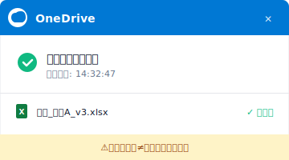
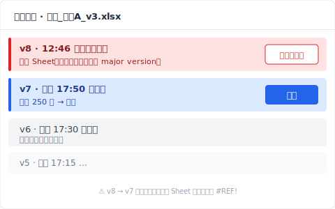
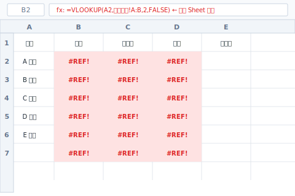
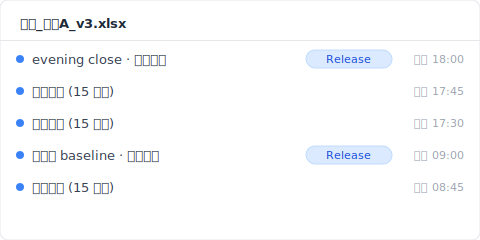
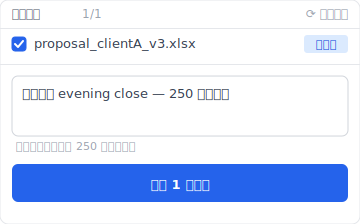

> 星期二下午 14 點 32 分。業務的陳小姐（**合成案例**）打開 OneDrive 上的「提案_客戶A_v3.xlsx」，這份檔他從星期一就在準備。明天早上 10 點要提案，剩 19 小時 28 分。檔案打開那一刻，畫面凍住。Sheet「業績實績」是空的。分頁還在、欄位 A 到 AZ 都還在、行號 1 到 250 也在，可是每一格都是白的。連動的 Sheet「報價」合計欄也整排 `#REF!`。OneDrive 角落是綠色勾。Excel 上面有個小字「另有 1 人正在編輯」。中午午休的時候，後輩小林開過這個檔。

搜「Excel 資料 復原」會看到還原軟體的廣告排成一排。EaseUS、4DDiG、Recoverit、iMyFone，全部講掃 SSD 磁區 disk recovery。可是這次發生的事，不是磁區問題。是共同編輯的時候同事刪了一個 Sheet，那個 delete 就被推上雲端而已。我把這種事故分鐘級追蹤的紀錄整理出來，今天分享。

## 共同編輯把 Sheet 吃掉時 Excel 畫面上的徵兆

14 點 32 分 17 秒，陳小姐打開「提案_客戶A_v3.xlsx」。Excel 啟動，他點 Sheet「業績實績」。畫面讀取中，0.4 秒後，整片白。Sheet 分頁還在、欄頭 A 到 AZ 都在、行號 1 到 250 也在，可是每一格都是空的。Excel 上面寫「另有 1 人正在編輯」，旁邊是後輩小林的頭像。15 秒前小林還開著這個檔。陳小姐看到的，就是小林中午 14:32 還在編的雲端版本。

事故的細節：

- **昨天 17:50**：陳小姐把 Sheet「業績實績」填好 250 筆客戶實績，關檔。
- **今天 12:31**：小林（後輩）開檔（陳小姐有跟他說「明天要提案」）。
- **今天 12:46**：小林對 Sheet「業績實績」右鍵，按「刪除工作表」（誤操作，事後解釋「以為刪的是測試用的 Sheet」）。
- **今天 12:46:03**：Excel 把這個操作推給 SharePoint，Sheet 刪除反映到雲端，被記成 主要版本 v8，AutoSave 把它當「正常編輯」處理。
- **今天 12:46 到 14:32**：這 1 小時 46 分鐘，檔案在雲端是「Sheet 業績實績 不見了」的狀態。
- **今天 14:32**：陳小姐開檔，雲端那個狀態（Sheet 已刪）被同步下來。

為什麼 Excel 不警告？Office 365 共同編輯的 commit semantics 是 **last-writer-wins**：誰最後動就以誰為準，特別是 Sheet 層級的刪除（[Microsoft Learn: Co-authoring in Office](https://learn.microsoft.com/en-us/office365/servicedescriptions/office-online-service-description/sharing-and-collaboration)）。刪 Sheet 在 Excel 看來是「正常的編輯動作」，不會跳確認框。

可是這只是表面的症狀。

## OneDrive 同步勾為什麼維持綠色不報錯

14 點 32 分 47 秒，陳小姐想搞清楚狀況，先看 OneDrive 圖示。綠色勾。全部同步，沒錯誤。真的嗎？

OneDrive 的同步勾代表「本機檔案跟雲端一致」，不代表「資料沒壞」。小林 12:46:03 刪了 Sheet，刪除被推上雲端，陳小姐的電腦（在辦公室，下午才開機）還沒同步。14:32 陳小姐一開檔，OneDrive 立刻拉雲端狀態，把本機檔案覆蓋成「Sheet 已刪」。同步勾顯示成功。

「已同步」不等於「你的工作安全」。在共同編輯模式下，別人的 delete 也會同步進來。

## SharePoint 版本歷史復原後 `#REF!` 為什麼還在

14 點 37 分，陳小姐用瀏覽器打開 OneDrive，對檔案右鍵，選【版本歷史】。列表跳出來：v8（12:46，小林）/ v7（昨天 17:50，陳小姐）/ v6（昨天 17:30，陳小姐）...

按【還原 v7】。

等幾秒。檔案重新下載。打開 Sheet「業績實績」，250 筆資料回來了。鬆了一口氣。

可是打開 Sheet「報價」，整排 `#REF!`。原因：v7 還原的是整個 workbook，可是 v7 那個時間點 Sheet「報價」的公式指向的是「業績實績」在 v6 時的那些儲存格位置。v8 刪掉的 Sheet，v7 還原後公式還是回傳 `#REF!`。SharePoint 版本歷史是 **workbook 等級的快照**，不是 per-sheet diff（[SharePoint version history limits](https://learn.microsoft.com/en-us/sharepoint/document-library-version-history-limits)）。Sheet 被刪這件事會被記成「主要版本」，可是它沒辦法回頭去修被刪 Sheet 連帶造成的公式錯誤。

**復原後 cascade 公式的修復步驟**：

1. 復原後打開 Sheet「報價」（公式 cell 大片 `#REF!`）
2. 在資料編輯列找到原本指向「業績實績」的位址
3. 一格一格改寫成新的參照位置
4. 同 Sheet 公式太多，用 VLOOKUP / XLOOKUP 批次處理

到這裡，已經損失 3 小時 28 分鐘。離明天提案剩 15 小時 60 分鐘。

## Excel 關掉那一秒 Ctrl+Z 為什麼就失效

15 點 32 分，陳小姐放棄了，把 Excel 關掉。他想「再開一次試試另一個還原版本」。

開回去發現：Ctrl+Z 按不了。「復原上一步」是灰的。Excel 的 undo stack 是 **per-session**，檔案一關，全部的 undo 紀錄（不管是自己的操作，還是共同編輯對方的操作顯示）都重置。本來可以拿來「復原小林刪 Sheet」的編輯 session，在 14:46 陳小姐關檔那一秒就消失了。

undo stack 在記憶體裡，per-session 結構，不會存進檔案、也不會上雲。這是 Microsoft Office 全產品共通的規格。

## Time Machine 為什麼救不回前一天的 Sheet

隔天早上 9 點，陳小姐想到「公司的 Mac 應該有 Time Machine」，發信給 IT 部。30 分鐘後回應：「Time Machine 快照有，每小時自動拍」。

打開昨天 15 點的快照。看 Sheet「業績實績」，空的。

為什麼？Time Machine 拍的是「OneDrive 同步資料夾上面的本機檔案狀態」（[Apple Support: Back up your files with Time Machine on Mac](https://support.apple.com/en-us/104984)）。14:32 那一刻 OneDrive 已經把本機檔案覆蓋成「Sheet 已刪」。15:00 Time Machine 拍下來的就是已經被雲端狀態染掉的本機檔案。Time Machine 記錄的是「從雲端落下來的最新版」，不是本機編輯歷史。

事故發生後 4 小時。陳小姐什麼都還沒救回來。

## 用 Keeply 救回共同編輯誤刪的 Excel 資料的方法

如果，在平行宇宙裡，陳小姐的電腦裝了 Keeply，14 點 32 分那一刻，會發生什麼事？

Keeply 在本機保管庫保存獨立的快照，跟 OneDrive 走完全不同的路徑、不同的儲存空間。Keeply 不知道「Office 365 共同編輯」這件事，也因為不知道，小林的 delete 不會反映到 Keeply 的保管庫裡。

陳小姐的 Keeply 設成 15 分鐘間隔背景自動儲存。昨天 17:50 陳小姐關檔後，18:00 Keeply 拍了最後一張自動儲存：「業績實績」250 筆、「報價」公式正常。今天 12:46 小林的 delete 發生在雲端側，陳小姐的電腦在辦公室、下班後關機，Keeply 不會動。14:32 陳小姐開機，OneDrive 同步雲端狀態下來，可是 Keeply 的保管庫跟 OneDrive 不在同一條路徑上，不受影響。

14 點 33 分，陳小姐打開 Keeply：

1. 在左邊時間軸點開「提案_客戶A_v3.xlsx」昨天 18:00 那個自動儲存版
2. 按「還原此版本」
3. Keeply 用新檔名（`提案_客戶A_v3_RESTORED.xlsx`）輸出

打開檔案確認，「業績實績」250 筆 ✅、「報價」公式 ✅。陳小姐傳 LINE 給小林：「測試的請改用新檔案，這個才是本尊」。30 秒解決。

Keeply 在背景自動儲存（間隔可選 15 / 30 / 60 分鐘，預設 30 分鐘；陳小姐這台設 15 分鐘）+ 重要節點你可以主動按「儲存版本」按鈕 + 每張快照分別存在保管庫，不會互相覆蓋。整個流程不經過共同編輯、不經過雲端同步，是本機磁碟上的另一個世界。

## Keeply 也救不回的 3 種共同編輯資料消失

Keeply 不是萬能。在共同編輯環境下，下列 3 種情況 Keeply 也救不回來。

1. **檔案放在共用網路磁碟、陳小姐本機沒副本**。Keeply 只看本機檔案，不會去監看共用磁碟上別人改了什麼。共用磁碟要團隊另外建一台 Keeply 鏡像保管庫。
2. **小林直接登入陳小姐的電腦（遠端桌面之類）改檔再刪**。這時 delete 是本機事件，Keeply 會記錄。要還原就是從 Keeply 保管庫拉回來，可是那一秒同時推上雲端，遠端同步起來會比較複雜。
3. **事故發生的這 1 小時剛好在 Keeply 自動儲存的盲區**。例如 14:30 設定要存、14:32 出事、14:31 那張快照太舊，或 14:15 存的時候「業績實績」就已經被改成一半空白。重要節點記得手動按「儲存版本」可以補上這個盲區。

事故報告書到這裡結束。下次怎麼不再發生這種事，我會另外寫一篇接著聊。我自己現在 Excel 工作檔的版本歷史，就是靠這層獨立保管庫睡得安穩。

---

**作者**：[Ting-Wei Tsao](https://www.linkedin.com/in/ting-wei-tsao-b57480152)，Keeply 創辦人。在做你的檔案管理守護神。

## 常見問題 {#faq}

**Q. Keeply 怎麼補上共同編輯衝突的資料消失？**

A. 把本機保管庫跟 OneDrive 切開，雲端側的編輯不會直接動到你本機的儲存空間。Keeply 在背景自動儲存（15 / 30 / 60 分鐘間隔可選）+ 重要節點你主動按「儲存版本」按鈕 + 每張快照分別保存在保管庫，互不覆蓋。同事在雲端側刪了 Sheet，那個 delete 不會傳到 Keeply 的保管庫。事故當下打開 Keeply、挑前一版、按「還原此版本」，30 秒。前面 4 層（OneDrive 同步 / SharePoint 版本歷史 / Time Machine / 還原軟體）全部都依賴雲端狀態做事後救援，對共同編輯衝突特別弱。Keeply 是跟雲端狀態切開的事前防禦層。

**Q. Excel 消失的資料怎麼救回來？**

A. 看情況。單人編輯 Ctrl+S 覆蓋的話，用 SharePoint 版本歷史（前提是 主要版本有留下來）或 Excel 內建「版本歷史」按鈕。共同編輯時別人刪掉資料，可以用 SharePoint workbook 等級的快照救回，但連動公式要手動重建。檔案只在本機、Windows 卷影複製又沒開的話，幾乎沒救。

**Q. 共同編輯時同事誤刪了 Sheet，能救回來嗎？**

A. SharePoint 版本歷史可以還原 workbook 等級，前提是刪除前那個 bundle 有被記成「主要版本」。AutoSave 連續寫的中間狀態不一定每個都會獨立留存。連動公式參照到被刪 Sheet 的其他 Sheet，v7 還原後還是 `#REF!`，要手動重建。事前有本機快照層（像 Keeply）的話，可以從沒被雲端 delete 污染的原本還原。

**Q. 沒儲存就關掉的 Excel 檔案能救回來嗎？**

A. 自動回復（預設 10 分鐘間隔）有機會保留「沒儲存的最近狀態」。打開 Excel，從「檔案 → 資訊 → 未儲存活頁簿」找。可是檔案正常關掉那一秒，自動回復暫存檔會自動刪除，如果沒看清楚就關掉就沒救了。Keeply 跟你按不按儲存無關，在背景自動存，未儲存就關檔的情況保管庫也還會有最近的狀態。

**Q. Excel 還原軟體能救儲存格層級的資料嗎？**

A. 幾乎不行。還原軟體是 disk 磁區層級救「剛被刪掉的位元」，前提是整個檔案被刪掉要救回來。檔案還活著、但裡面的儲存格資料消失（共同編輯 delete 或公式 `#REF!` 連帶崩壞）這種，還原軟體解不了。而且 SSD + TRIM 環境下，連磁區層級救援成功率都 < 5%（[NIST SP 800-88r1: Guidelines for Media Sanitization](https://nvlpubs.nist.gov/nistpubs/SpecialPublications/NIST.SP.800-88r1.pdf)）。共同編輯資料消失這件事，還原軟體結構上解不開，只能靠事前有本機快照層。

## 相關文章

- 📚 主題 hub：[檔案版本管理完全指南：5 個原因，多數工具都接不住](/zh-tw/post/file-version-management-complete-guide/)
- 🔁 同主題：[Excel 覆蓋還原現場鑑識：星期二 9:14，4 層救援搶回了什麼](/zh-tw/post/excel-overwrite-postmortem/)
- 📊 同主題：[Excel 版本歷史按鈕為什麼是灰的：4 個條件你 1 個都沒中](/zh-tw/post/excel-version-history-limits/)
- 🔄 同主題：[Dropbox 衝突的副本：4 種觸發場景](/zh-tw/post/dropbox-conflicted-copy/)

## 資料來源

1. [Microsoft Learn: Co-authoring in Office](https://learn.microsoft.com/en-us/office365/servicedescriptions/office-online-service-description/sharing-and-collaboration)
2. [SharePoint version history limits: Microsoft Learn](https://learn.microsoft.com/en-us/sharepoint/document-library-version-history-limits)
3. [Apple Support: Back up your files with Time Machine on Mac](https://support.apple.com/en-us/104984)
4. [NIST SP 800-88r1: Guidelines for Media Sanitization (SSD TRIM behavior)](https://nvlpubs.nist.gov/nistpubs/SpecialPublications/NIST.SP.800-88r1.pdf)
