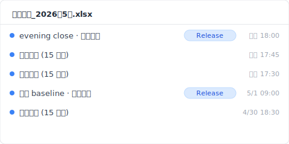
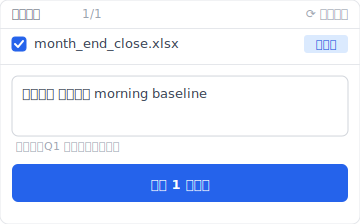

> 星期二早上 9 點 14 分。會計部的陳小姐（**合成案例**）按了 Ctrl+S。月底結算的「月底結算_2026年5月.xlsx」就這樣被一次覆蓋儲存吃掉。她沒發現。OneDrive 角落還是綠色勾。Excel 沒有跳任何視窗。等她 9 點 16 分要關掉檔案才察覺不對。Ctrl+Z 按不了，剛才已經關過。自動回復資料夾打開來是空的。

搜「Excel 覆蓋 還原」會看到一堆文章。Microsoft 講功能、還原軟體在賣自己、操作部落格列「方法 1 / 2 / 3」。可是沒人從事故發生的那一秒，分鐘級追到 30 天後，告訴你每一層救援是什麼時候、為什麼關上窗口。我把這份紀錄整理出來。今天我帶你跟著時間軸走一遍。

## 9:14：那一秒發生了什麼 {#h2-1-the-incident}

9 點 14 分 03 秒，陳小姐按 Ctrl+S。Excel 把新內容寫進 `xlsx` 檔。前一天 18:00 那份「正確業績匯總表」就此消失。自動回復不會留底。OneDrive 同步圖示繼續綠色。Excel 完全不問你「確定覆蓋嗎？」。

接下來幾秒：

- **9:14:03**：Excel 寫入新內容。
- **9:14 過後幾秒**：OneDrive 同步引擎發現變更，把新版本推到雲端。
- **十幾秒後**：雲端那份 18:00 的舊版也被新版覆蓋。
- **9:16**：陳小姐關檔。自動回復暫存檔（如果有）這一秒自動刪除。
- **9:23**：她想開下星期的工作表，發現某一頁的公式回傳空白。

為什麼 Excel 不警告？因為在 Microsoft 的設計裡，「儲存」永遠是「確定目前狀態」，不會被當成「取代舊狀態」。這是規格，不是設計失誤。

接下來，發生了這些事。

## T+0〜十幾秒：OneDrive 自動儲存的競爭條件 {#h2-2-onedrive-autosave}

OneDrive 自動儲存開著的時候，本機改完到推上雲端，中間有幾秒到十幾秒的窗口。這幾秒裡，如果你另一台電腦剛好開著同一份檔，或網路剛好斷，前一版有機會搶回來。陳小姐不知道這件事。十幾秒後，雲端那份也被新版蓋掉了。

OneDrive 同步多快，看你的網路跟檔案大小（[Microsoft Learn: Sync files with OneDrive in Windows](https://support.microsoft.com/en-us/office/sync-files-with-onedrive-in-windows-615391c4-2bd3-4aae-a42a-858262e42a49)）。SharePoint Online 的版本歷史最多保留 500 個主要版本（[SharePoint version history limits](https://learn.microsoft.com/en-us/sharepoint/document-library-version-history-limits)）。但是注意，這是「同步完成的版本會被收錄」，不是「事故前那一版一定還在」。

關鍵是 9:13 那一刻。如果 SharePoint 把它收錄成獨立版本，就能回去取。沒收錄，這條路斷掉。可這只是開始。

## T+15 分鐘：「以前的版本」為什麼是空的 {#h2-3-previous-versions-empty}

9 點 29 分，陳小姐打開 Excel 的「檔案 → 資訊 → 版本歷史」。畫面寫「沒有可用的版本」。同步明明在跑，自動儲存明明開著，卻是空的。

原因很簡單：Windows 的「以前的版本」跟 SharePoint 的版本歷史，是兩個完全不同的東西。

- **「以前的版本」**（檔案總管按右鍵看到的那個）走的是 Windows 卷影複製。Microsoft 365 個人版跟 Business 預設都不會永遠開著卷影複製。就算檔案放在 OneDrive 資料夾裡，這件事還是 Windows 自己決定，OneDrive 不管。
- **Excel 「版本歷史」按鈕**呼叫的是 SharePoint 那邊。自動儲存連續寫的小版本，SharePoint 不會每一個都當成正式版留下。
- **本機 Excel 檔**（沒掛 OneDrive 的）兩條路都沒有。SharePoint 根本不認識它。

陳小姐公司用的是 OneDrive for Business。她跳過 Excel 介面，直接打開 SharePoint 看版本歷史。9:14 之前的那一版不在。9:13 那個她以為「剛剛存好」的瞬間，從來沒被獨立留下來。

## T+24 小時：Time Machine 的 1 小時間隔 {#h2-4-time-machine-gap}

隔天 9 點 14 分，IT 部同事跟陳小姐說：「Time Machine 應該救得到吧？」

可是 Apple Time Machine 預設每 1 小時拍一次快照（[Apple Support: Back up your files with Time Machine on Mac](https://support.apple.com/en-us/104984)）。9:14 出事、9:15 同步完、10:00 Time Machine 才拍。那張快照拍到的是已經被覆蓋的版本。10 點的快照，是事故 46 分鐘後的事後現場。

為什麼這 3 層救援會在同一個事故裡同時失效？因為它們都有「幾十分鐘以上」的時間間隔。

- **自動回復**是救當機的，預設 10 分鐘存一次。
- **OneDrive 同步**是把雲端拉到跟本機一致，間隔看網路。
- **Time Machine** 是定期回頭看，預設 1 小時。

各自設計目的不一樣，但都同時錯過了 9:14 到 9:16 那 2 分鐘。

到這裡，已經損失 14 小時 46 分鐘。

## T+30 天：還原軟體什麼也沒找回來 {#h2-5-recovery-software}

30 天後，陳小姐買了一套還原軟體的年度方案。掃整顆 SSD，9:14 之前的位元一個都沒找到。

為什麼？Windows 跟 macOS 在 SSD 上會跑 TRIM 指令。被刪除或被覆蓋的磁區，當下就被實體歸零（[NIST SP 800-88r1: Guidelines for Media Sanitization](https://nvlpubs.nist.gov/nistpubs/SpecialPublications/NIST.SP.800-88r1.pdf)）。「覆蓋後馬上掃磁區」這招在 HDD 時代有用。SSD 上，已經被覆蓋的位元真的不見了。

還原軟體廣告寫的高成功率，前提是「剛刪除 + HDD + 檔案系統還沒覆蓋」三件事同時成立。公司配的工作 PC 主流是 SSD，覆蓋發生那一秒，SSD 就把舊位元抹掉。EaseUS、Recoverit、iMyFone、AOMEI 一樣的物理極限，跟你選哪個軟體無關。

陳小姐花了一筆訂閱費，買到的是一個確認。那份檔案真的回不來。

## 平行宇宙：那台電腦裡裝了 Keeply，9:14 會怎樣 {#h2-6-keeply-counterfactual}

如果陳小姐電腦裡裝了 Keeply，9:14 事故那一刻，Keeply 的保管庫裡已經有一份叫「2026/05/17 18:00 evening close」的快照。

Keeply 做兩件事：

1. 背景自動儲存（間隔可選 15 / 30 / 60 分鐘，預設 30 分鐘；陳小姐這台設 15 分鐘）
2. 你關 Excel 前可以主動按「儲存版本」按鈕留一張

每一張都另存到保管庫裡，不蓋過上一張。9 點 14 分的 Ctrl+S 是 Excel 內部的事，Keeply 在旁邊看著，不被影響。

9 點 14 分 16 秒，你「啊」一聲發現蓋掉了：

1. 打開 Keeply
2. 左邊時間軸點開「月底結算_2026年5月.xlsx」前一天 18:00 的 evening close 那一版
3. 按「還原此版本」

Keeply 不會直接覆蓋你現在的檔。它用新檔名（`月底結算_2026年5月_RESTORED_5-17.xlsx`）從保管庫拉一份出來。你打開來看看內容對不對，再決定要不要取代原檔。整個流程 30 秒。

介面上你不會看到任何 git 術語。記得兩件事就夠了：背景每隔 15-60 分鐘會自動存、重要時刻你自己也可以按「儲存版本」。

## 極限：Keeply 也救不到的 3 種覆蓋 {#h2-7-limits}

Keeply 不是萬能。下列三種情況，Keeply 也搶不回來。

1. **剛裝 Keeply、第一次自動儲存還沒跑就出事**（間隔看你的設定，15-60 分鐘）。剛裝那天，開工前手動按一下「儲存版本」當基線，這個盲區就補上了。
2. **共用網路磁碟上的 Excel**。Keeply 裝在你個人電腦上，不會去看共用磁碟上別人改了什麼。要監看共用磁碟，要請團隊另外建一台 Keeply 做鏡像保管庫。
3. **你 Excel 還開著，別人在另一台電腦上覆蓋了雲端那份**。Keeply 抓的是你電腦上的本機變更。同事用另一台 PC 蓋掉了 SharePoint 上同一份檔，這條路要靠 SharePoint 自己的版本歷史。

事故報告書到這裡結束。下次怎麼不再發生這件事，我會另外寫一篇接著聊。

---

**作者**：[Ting-Wei Tsao](https://www.linkedin.com/in/ting-wei-tsao-b57480152)，Keeply 創辦人。在做你的檔案管理守護神。

## 常見問題 {#faq}

**Q. Keeply 怎麼補上這 4 層救援的破口？**

A. 把版本歷史層放在事故發生之前。Keeply 在背景自動儲存（15 / 30 / 60 分鐘間隔可選）+ 重要節點你主動按「儲存版本」+ 每張快照保留在獨立保管庫不互相覆蓋。事故當下你開 Keeply、挑前一版、按「還原此版本」，30 秒搞定。前面四層（自動回復 / OneDrive 版本歷史 / Time Machine / 還原軟體）全部都是事後救援，本質上都會在某個間隔窗口失效；Keeply 是事前防禦，不是另一個事後選項。

**Q. Excel 覆蓋儲存後，還能救回前一版嗎？**

A. 看情況。OneDrive for Business 同步的檔案，事故前有明確儲存點留下來，可以從 SharePoint 版本歷史救回。本機 Excel 檔案（沒掛 OneDrive）只有在 Windows 卷影複製有開、而且不是 SSD 環境，才有部分機會。越晚發現，越難救。

**Q. 自動回復功能能救覆蓋掉的前一版嗎？**

A. 不能。自動回復是救 Excel 當機用的。檔案正常關掉的那一秒，自動回復暫存檔自動刪除。覆蓋後再關閉的檔案，自動回復救不到。要救覆蓋前的版本，需要事故發生之前就有獨立的版本保管庫；Keeply 就是補這層用的。

**Q. Excel 還原軟體能救被覆蓋的檔案嗎？**

A. SSD 上幾乎不行（NIST SP 800-88r1）。要同時湊齊「HDD + 覆蓋剛發生 + 檔案系統還沒覆蓋」三個條件才有機會。公司工作 PC 主流是 SSD，實際上很難期待。Keeply 把版本層放在 SSD 寫入之前的應用層，避開 TRIM 物理限制 — 上一版的位元一直好好地在保管庫裡。

**Q. OneDrive 同步的 Excel 檔，怎麼看舊版本？**

A. 用瀏覽器打開 OneDrive，對該檔按右鍵，選「版本歷史」。從 Excel 介面內按那顆按鈕，看到的反而沒有 SharePoint 端完整。

**Q. Time Machine 能救 1 小時內的 Excel 覆蓋嗎？**

A. 預設不行。1 小時拍一次的間隔下，事故跟下一張快照之間的覆蓋會被吃掉。除非你把 Time Machine 改成更頻繁，或自己有手動拍快照的習慣。公司配的 Mac 多半是預設。Keeply 自動儲存間隔最短 15 分鐘，比 Time Machine 預設 1 小時細很多 — 9:14 出事、9:00 那張快照還在，Keeply 抓得到。

## 相關文章

- 📚 主題 hub：[檔案版本管理完全指南：5 個原因，多數工具都接不住](/zh-tw/post/file-version-management-complete-guide/)
- 🔁 同主題: [找回被覆蓋檔案的極限：自動回復救不到的地方](/zh-tw/post/recover-overwritten-file/)
- 📊 同主題: [Excel 版本歷史按鈕為什麼是灰的：4 個條件你 1 個都沒中](/zh-tw/post/excel-version-history-limits/)

## 資料來源

1. [Microsoft Learn: Sync files with OneDrive in Windows](https://support.microsoft.com/en-us/office/sync-files-with-onedrive-in-windows-615391c4-2bd3-4aae-a42a-858262e42a49)
2. [SharePoint version history limits: Microsoft Learn](https://learn.microsoft.com/en-us/sharepoint/document-library-version-history-limits)
3. [Apple Support: Back up your files with Time Machine on Mac](https://support.apple.com/en-us/104984)
4. [NIST SP 800-88r1: Guidelines for Media Sanitization (SSD TRIM behavior)](https://nvlpubs.nist.gov/nistpubs/SpecialPublications/NIST.SP.800-88r1.pdf)
