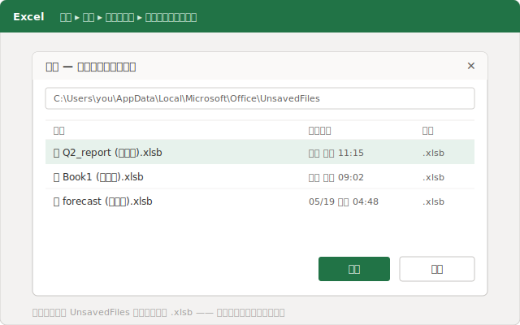
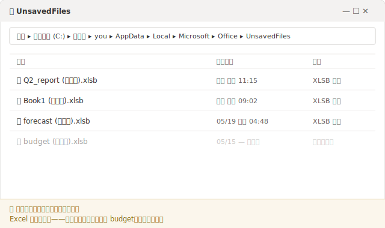
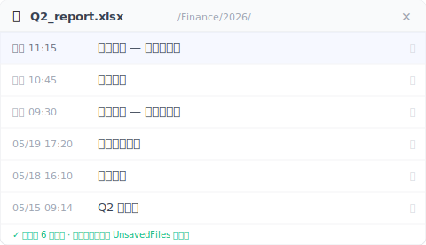

# 【2026 檔案管理】Excel 未存檔復原教學：救回來的檔案為什麼又不見了

*Excel 的「復原未儲存的活頁簿」是從一個隱藏的 `UnsavedFiles` 快取裡撈出你從沒存過的檔案，它以暫存的 `.xlsb` 形式存著，而 Excel 會照自己的排程把它清掉。這就是為什麼救回來的檔案過幾天又不見了。真正的解法不是更快救回，而是一層不待在那個快取裡的版本紀錄。*

你星期二把沒存的表格救回來，鬆了一口氣。到了週末，它不見了。不是 Excel 把它弄丟了，是那個救援用的快取本來就有時間限制。

如果你剛把 Excel 關掉、沒存檔，心一沉，那就從這裡開始。檔案救得回來，大概三十秒就好。但你最好先搞清楚，等一下要救回的這份檔案到底放在哪裡，因為那正是它有可能再次消失的原因。

## 馬上把檔案救回來：復原未儲存的活頁簿 {#h2-1}

先做這件事，別碰別的：

- **檔案 → 資訊 → 管理活頁簿 → 復原未儲存的活頁簿。**（或是 **檔案 → 開啟舊檔 → 復原未儲存的活頁簿**，按鈕就在最近使用檔案清單的最下面。）
- 一個資料夾會打開。你會看到一堆檔名很怪、副檔名是 `.xlsb` 的檔案，那些就是你沒存到的活頁簿。
- 找到時間對得上的那一份打開，然後**馬上「另存新檔」**，給它一個正常的檔名和位置。

那份 `.xlsb` 清單不是哪個救援精靈生出來的。Excel 是在讀你自己硬碟上的一個資料夾：`%LocalAppData%\Microsoft\Office\UnsavedFiles`。Excel 會偷偷在那裡放一份你從沒存過的工作副本，這樣你關檔不存、或它當掉的時候，才有東西可以還你。

檔案救回來了？很好。接下來這段，沒人會告訴你。

## 救回來的檔案，為什麼週末就不見了 {#h2-2}

那個 `UnsavedFiles` 資料夾是個暫放區，不是保險箱。Excel 幫你管它，意思就是 Excel 也會幫你清它。照它自己的排程，不會先問你。

**微軟的支援頁面從沒承諾未存的檔案會在那裡待多久**，而那個被到處傳的「四天」說法，微軟也沒有任何文件這樣寫。[官方教學](https://support.microsoft.com/en-us/office/recover-an-earlier-version-of-an-office-file-169cb166-e7e2-438e-8f39-9a8927828121)只教你怎麼打開「復原未儲存的活頁簿」，然後就停了。它從沒保證那份檔案明天還會在。實際上，大家普遍回報那個快取在幾天內、重開機之後、或是 Excel 累積了夠多比較新的紀錄之後，就被清掉了。

所以「我救回來了」跟「我留住了」是兩回事。如果你打開救回的活頁簿、看了一眼、又關掉，沒有「另存新檔」存到一個正常的資料夾，那你根本沒存到。你只是看了一份還在倒數計時的暫存副本。星期五再回來，它可能就不見了，而且這次資料夾裡連能救的東西都沒有了。

救援這一步解決的是接下來十分鐘的問題，它解決不了下星期。

## 同一個快取，要扛兩種完全不同的「沒存到」災難 {#h2-3}

大家會在這裡踩坑，是因為「我的 Excel 檔案沒存到不見了」其實是兩個用同樣字眼包裝的不同問題，而 Excel 把這兩個都塞進「復原未儲存的活頁簿」同一道門。

**狀況 A。你從來沒存過。** 全新的活頁簿、打了三小時公式，然後當掉，或不小心按到「不要儲存」。硬碟上從來沒有過一份真正的檔案，所以 `UnsavedFiles` 快取真的是你最好、也是唯一的機會。這正是它的用途，上面第一步通常救得回來。

**狀況 B。你之前存過，後來把存檔之後改的東西弄丟了。** 這是那份你開過上百次的月底報表。你整個早上都在改、沒存，然後關掉了。檔案還在。不見的只是*最近這幾個小時*。這時候快取通常沒什麼用，因為 Excel 是把你的編輯當成一個可救回的工作階段在追蹤，而不是當成這份檔案的永久版本。

那是一個你最熟的早上。你在那份月底報表裡填了三小時的數字、調了一輪公式對帳，午餐前順手關掉視窗。沒按存檔，因為你以為等下回來再說。下午打開，整個早上的進度回到昨天那一版。你跑去「復原未儲存的活頁簿」，裡面只有幾份跟這份報表無關的舊暫存檔。檔案一直都在，只是早上那幾個小時，Excel 從來沒當成「版本」留下來。

狀況 B 還有幾個近親，快取一個都搆不到：你在**另一台電腦**上開這份檔案，那台電腦上根本沒有這個本機快取；或是 OneDrive 的自動儲存悄悄蓋掉了同步的那一份（這是另一個有自己解法的陷阱。見[共編的 Excel 資料憑空消失時怎麼辦](/zh-tw/post/excel-data-vanished-postmortem/)）。表面不一樣，根源同一個：那個本該救你的東西，不是暫存的、就是只在本機、或者兩者都是。

一個為了撐過當機而設計的快取，本來就不是用來當你檔案的歷史紀錄。

## 那一層不住在暫存快取裡的版本紀錄 {#h2-4}

對狀況 B 來說，答案不是更快地翻 `UnsavedFiles`。是讓檔案自己的歷史，待在一個 Excel 掃不掉的地方。一層盯著你試算表真正所在資料夾的版本紀錄，邊做邊留下標了時間的副本，而不是放在一個 Excel 會回收的緩衝區裡。

這正是 [Keeply](https://keeply.work) 在補的那個缺口。把它指向你放試算表的資料夾，它就會在背景照你設定的排程留下一個版本。每 15、30 或 60 分鐘，預設 30。另外還有一個手動的**儲存版本**按鈕，可以加一行備註標記里程碑。當今天早上的編輯不見了，你不用再去翻一個可能早就清空的快取，你打開這份檔案的時間軸，挑出 11:15 那一版就好。

`UnsavedFiles` 快取是 Excel 給進行中檔案的短期安全網。一條版本時間軸是這份檔案的長期記憶。一個會過期，一個不會。想看清楚這幾層各自接住什麼、又在哪裡斷手，可以參考[檔案版本管理完整指南](/zh-tw/post/file-version-management-complete-guide/)。

## 一層版本紀錄也救不了你的地方 {#h2-5}

假裝這層東西什麼都罩得住，就不老實了，所以這裡講清楚它罩不到哪些：

- **一份你從來沒存進被追蹤資料夾的全新活頁簿。** 如果這檔案從沒被寫進被盯著的那個資料夾，就沒有它的版本可以留。那還是 Excel 的 `UnsavedFiles` 快取的工作（狀況 A），一樣在它那段很短的倒數裡。
- **無聲損毀。** 如果一份檔案悄悄壞掉、然後一份看起來正常的版本蓋過了一份原本好的，時間軸也會忠實地把壞掉的那份一起留下來。
- **放在被追蹤資料夾外面的檔案。** 一層版本紀錄只知道你指給它的那些資料夾。一支你從沒加進來的隨身碟上的試算表，它管不到。

一條版本時間軸解決的是「我本來有、後來把改的東西弄丟了」。它變不出一份從來沒被存到任何地方的檔案。

## 什麼時候 Excel 內建的就夠用了 {#h2-6}

你不是每次都需要多一層。下面這幾種情況，跳過它就好：

- 那是一份算完即丟、要你重做你也甘願的小計算。
- **你的檔案放在 OneDrive 或 SharePoint，而且開了自動儲存。** 那其實罩得很廣。雲端版本歷史在你編輯時就接住了大部分的覆蓋。只是要知道它做不到什麼：它綁的是同步的那一份、[保留的歷史有上限](https://learn.microsoft.com/zh-tw/sharepoint/document-library-version-history-limits)、而且[自動儲存是邊做邊蓋](https://support.microsoft.com/zh-tw/office/what-is-autosave-6d6bd723-ebfd-4e40-b5f6-ae6e8088f7a5)而不是先問你。如果你看過這些限制、覺得它們咬不到你，那你就不需要多一層。
- 弄丟一個早上的進度只是個你吞得下的麻煩，而不是會錯過的截止日。

如果你是這種情況，學會「復原未儲存的活頁簿」這條路、早點存讓檔案先存在，然後繼續過你的一天就好。多那一層，只有在那份試算表裡的工作是你沒辦法輕鬆重建的那種，才值得它的位置。

## 常見問題 {#faq}

**我之前存過 Excel 檔案，整個早上改都沒存，然後關掉了。早上的進度救得回來嗎？**

通常從 Excel 的快取救不回來。「復原未儲存的活頁簿」是為「你從來沒存過的檔案」設計的；一旦檔案存過一次，你那一段沒存的編輯就不會可靠地留在那裡。要救回「一份既有檔案最近這幾個小時」，靠的是一層持續性的版本紀錄（例如 Keeply）。它替檔案本身留下標了時間的版本，所以你打開它的時間軸，挑出接近中午的那一份就好。

**Excel 的未存檔檔案會保留多久？**

微軟沒有公布固定的保留期。那些未存的副本放在一個 Excel 會自己清掉的暫存快取裡。很多人發現它們在幾天內、重開機之後、或新紀錄累積夠多之後就不見了。在你「另存新檔」存到正常資料夾之前，都把救回來的檔案當成暫時的。

**Excel 未存檔的檔案存在哪裡？**

在 Excel 的 UnsavedFiles 快取裡，路徑是 %LocalAppData%\Microsoft\Office\UnsavedFiles，以副檔名 .xlsb 的檔案存著。你可以從「檔案 → 資訊 → 管理活頁簿 → 復原未儲存的活頁簿」進去。

**我把檔案救回來了，過幾天卻不見了。為什麼？**

因為「復原未儲存的活頁簿」讀的是一個暫存快取，不是一份永久副本。如果你打開救回的檔案卻沒有「另存新檔」存到一個正常位置，它就還留在快取裡，後來被清掉了。救回來之後一定要馬上「另存新檔」。

**把自動儲存打開能解決這件事嗎？**

[自動儲存](https://support.microsoft.com/zh-tw/office/what-is-autosave-6d6bd723-ebfd-4e40-b5f6-ae6e8088f7a5)（OneDrive／SharePoint）對放在雲端的檔案有幫助，但它是邊做邊蓋，而且它的[版本歷史有自己的限制](https://learn.microsoft.com/zh-tw/sharepoint/document-library-version-history-limits)。它罩不到你放在本機的檔案，也跟一條可以瀏覽、會保留的檔案版本時間軸不是同一回事。

## 延伸閱讀 {#related}
- [檔案版本管理完整指南](/zh-tw/post/file-version-management-complete-guide/)（支柱文）
- [Word 文件沒存到怎麼救。以及自動回復救不了的 5 種情況](/zh-tw/post/word-unsaved-recovery/)
- [Excel 版本歷史：沒人提的那些微軟限制](/zh-tw/post/excel-version-history-limits/)
- [共編的 Excel 資料憑空消失時怎麼辦](/zh-tw/post/excel-data-vanished-postmortem/)

---
*作者：曹庭維 Ting-Wei Tsao，Keeply 創辦人。[LinkedIn](https://www.linkedin.com/in/ting-wei-tsao-b57480152)*
