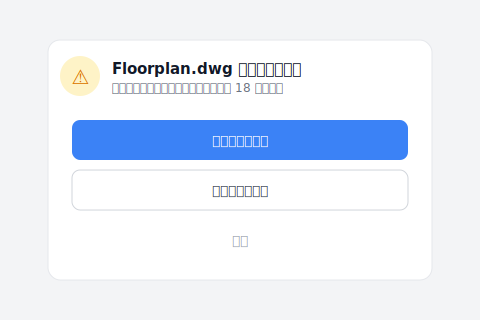
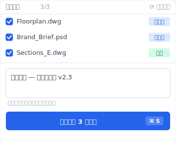
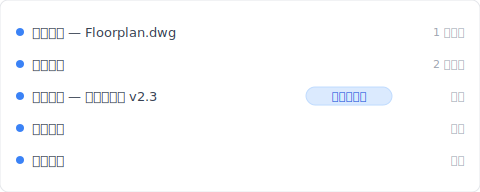

# 【2026 檔案管理】共用資料夾的命名稅：4 人團隊一年花 83 小時改 _v7_FINAL_千萬別動 後綴

> 星期四下午五點半，你已經畫完圖，手卻懸在檔名上。多人共用資料夾 + 手動命名 v1/v7/FINAL 的代價：一年 83 小時防禦稅。

星期四下午五點半，辦公室逐漸安靜。你其實已經畫完了中庭的平面圖，本來可以準時下班去吃頓好的。但你的手懸在滑鼠上，盯著螢幕裡的資料夾。

裡面躺著 `Floorplan_v6.dwg`、`Floorplan_v7_Client.dwg`、還有一份 `Floorplan_v7_FINAL_千萬別動.dwg`。

你深吸一口氣，右鍵點剛存好的檔案，小心翼翼把檔名改成 `Floorplan_v8_送審版_0423.dwg`。然後你打開 Line 傳給對面的同事：「那個…我剛存了 v8，你要改立面圖記得抓這版、不要蓋到我的喔。」

你不是在存檔，你是在買保險。這份保險的代價就是這篇拆給你看：一年 83 小時防禦稅 + 命名規則 4 週後一定崩潰的設計缺陷。然後讓你看 [Keeply](https://keeply.work) 怎麼讓 `_v8_千萬別動` 後綴從你資料夾裡永遠消失。

## 本文目錄

- [共用資料夾命名稅一年 83 小時：Asana《Anatomy of Work》算給你看](#anxious-bill)
- [為什麼共用資料夾命名規則 4 週後一定崩潰：紀律對抗趕件壓力的設計缺陷](#naming-failure)
- [Keeply 怎麼讓共用資料夾的 _v8_FINAL 後綴從此消失：自動 30 分鐘 + 手動寫筆記](#auto-版本管理)
- [共用資料夾 + Dropbox / OneDrive / Google Drive 對照表：4 種工具各解什麼](#compare-tools)
- [不必加 Keeply 的 3 種共用資料夾情境](#when-not-needed)

---

## 共用資料夾命名稅一年 83 小時：Asana《Anatomy of Work》算給你看 {#anxious-bill}

根據 Asana《[Anatomy of Work](https://asana.com/resources/why-work-about-work-is-bad)》研究，知識工作者一年花 83 小時在做這些「關於工作的工作」(work about work)：確認、再確認、追進度、找最新版。

83 小時只是冰冷的數字。真正的成本是那種**揮之不去的微型恐慌**。

你把圖紙發給營造廠後突然背脊發涼、趕緊重新打開資料夾確認：「等等、我剛剛寄的是 `v7_FINAL` 還是 `v7_真的最終`？」主管問「這是不是最新版」、你不敢立刻點頭、必須先說「我確認一下」、然後在一堆後綴詞中玩猜謎遊戲。

這不是管理出問題、也不是你或團隊太散漫。是因為你們的工具把保護心血的責任全部推給了你們脆弱的記憶力。

4 個人的工作室就是 83 × 4 = 332 小時 / 年——大概一個半月的全職工時，純粹消耗在防禦命名上。

---

## 為什麼共用資料夾命名規則 4 週後一定崩潰：紀律對抗趕件壓力的設計缺陷 {#naming-failure}

每次發生圖檔被覆蓋的慘劇，公司就會發起「資料夾整理運動」、要求大家嚴格遵守 `日期_專案_版本_姓名` 的軍事化命名規則。

我自己當年在事務所也試過這條路。前兩週、全部門都很乖。但到了第六週，有人趕著交件、順手存了一個 `_NEW`；下游同事拿錯版去出圖、補圖補一晚。三個月後資料夾又變回原本的垃圾山。看著那些亂七八糟的檔名、你心裡甚至有一絲罪惡感、覺得是不是自己沒把團隊管好。

別傻了。這根本違反人性。

當你的大腦充滿管線配置、法規檢討、設計變更時，你的手只會憑著「怕被覆蓋」的恐懼本能地打上 `_FINAL`。命名規則把**機制問題**包裝成**紀律問題**——紀律會被趕件擊穿、機制不會。

而還有第二層問題：團隊裡只要有一個人偷懶存了 `_NEW`、整個下游的參考鏈結就連環崩潰。`.dwg`、`.psd`、`.indd`、`.xlsx` 跨檔案的 reference 都會錯指。一個人鬆懈、全團隊重做。

軟體業早就用版本控制工具解決這層問題——但那層工具一直沒被搬到營建、建築、設計、研究這些產業。我們還在用手動加 `_v7` 對抗災難。

---

## Keeply 怎麼讓共用資料夾的 _v8_FINAL 後綴從此消失：自動 30 分鐘 + 手動寫筆記 {#auto-版本管理}

[Keeply](https://keeply.work) 補的就是這層。裝完之後、明天早上你打開共用資料夾——裡面只有 `Floorplan.dwg`、`Brand_Brief.psd`、`Budget.xlsx` 幾個乾淨的主檔名。沒有 `_v7_FINAL`、沒有 `_千萬別動`、沒有 `_真的最後一版`。

A 設計師上禮拜踩的案例：她下午改完平面圖、習慣性想打 `_v8` 加保險。同事 B 喊她「不用啦你 Keeply 不是有開？直接存就好」。

她下午切去另一個案子資料夾前、Keeply 跳出一行提示——目前的 Floorplan.dwg 還有未存的變更：

她按了「儲存版本後切換」。這一步避免下午那批改動只剩 18 分鐘前的自動存檔。下班前她再點 Keeply 主視窗的「儲存版本」按鈕主動標一版、跳出對話框長這樣：

她在筆記欄輸入「中庭平面 — 業主簽約版 v2.3」、點「儲存版本」、關掉電腦走出辦公室。

隔天早上下包打來：「不好意思我昨晚開那個檔加了我的立面圖、但好像把妳的中庭蓋掉了。」

A 設計師打開 Keeply。時間軸長這樣：

她點「中庭平面 — 業主簽約版 v2.3」那一行——還原。3 秒鐘。

那一行有筆記、是她下班前主動點「儲存版本」打的標。下包昨晚改完的版本在最新一行的位置、她可以同時保留下包的立面圖、把自己的中庭那層用 Keeply 拉回來。

沒有 `_v8`、沒有 Line 群組「記得抓最新版」公告、沒有 `_千萬別動` 後綴。

3 件事一起運作：

- 共用資料夾裡只留乾淨主檔名——下包打開資料夾看到的是 `Floorplan.dwg` 不是 12 個 `_FINAL`
- Keeply 每 30 分鐘背景輪詢、有變更才存——下包昨晚改的、A 設計師今天回辦公室看 Keeply 就知道
- 重要時刻（業主簽約版、送審版）親手點「儲存版本」+ 寫筆記——半年後查得回、不是 `_v7_簽約_真的這版` 猜謎

---

## 共用資料夾 + Dropbox / OneDrive / Google Drive 對照表：4 種工具各解什麼 {#compare-tools}

把目前團隊在用的方法擺一起看、每個工具負責的層次完全不同：

| 方法 | 解什麼 | 不解什麼 |
|---|---|---|
| **嚴格命名規則**（`日期_專案_v1_姓名.dwg`） | 形式上保留版本 | 違反人性、4 週後一定有人偷懶 |
| **Dropbox / OneDrive / Google Drive 同步** | 多人即時共用、本機檔不弄丟 | 同事覆蓋你的版本你不會收到通知、版本歷史 30 天就刪 |
| **Word / Google Docs 修訂追蹤** | 文字檔誰改哪一句記得 | `.dwg / .psd / .indd` 設計檔完全不支援 |
| **Keeply** | 手動存版＋筆記（可選每 15/30/60 分自動）+ 本機跑 | SSD 物理壞掉（要搭 [3-2-1 備份原則](/zh-tw/post/3-2-1-backup-rule/)） |

每個工具有它對的場景。問題是團隊協作這場戰役**同時**需要「每次改動自動留版」+「跨檔案 reference 不失效」+「重要版本有筆記能查」三層、而傳統工具沒有一個專做這三層。

詳細的 backup vs 同步 vs 版本歷史對照可看 [Keeply 跟備份、雲端工具有什麼不一樣](/zh-tw/post/what-keeply-saves-vs-backup-cloud/)。

---

## 不必加 Keeply 的 3 種共用資料夾情境 {#when-not-needed}

幾種情況確實不需要：

**你們完全在 Google Docs / Notion 工作**。文字檔工作流可以靠 Google Docs / Notion 內建版本歷史撐——它們有完整的逐字修訂追蹤。Keeply 主場是 `.dwg`、`.psd`、`.indd`、`.xlsx` 這類 binary 設計檔。

**公司 IT 已經用 Veeam / Acronis / SVN / Git LFS 做版本管理**。集中化版本系統已經涵蓋了——Keeply 是個人 / 小團隊的本機工具、不取代企業版控系統。

**你們的共用資料夾只放短週期工作檔**（一週內結案、不需要回頭找）。如果你們不需要半年後找回「業主簽約版」這種有意義的舊版、Dropbox 30 天版本歷史就涵蓋了。

以上都不適用——筆電族設計師 / 多人共用 NAS / 跨檔案 reference / 半年後客戶會回頭問——這時候加一層像 Keeply 才划算。

---

## 延伸閱讀

主篇 [檔案版本管理完整指南](/zh-tw/post/file-version-management-complete-guide/) 拆解 4 個結構性原因——為什麼工具就是沒設計給你這件事。

對照閱讀：[Keeply 跟備份、雲端工具有什麼不一樣](/zh-tw/post/what-keeply-saves-vs-backup-cloud/) — 三件不同事的完整對照。

備份原則：[3-2-1 備份原則：20 年了還夠用嗎？](/zh-tw/post/3-2-1-backup-rule/) — 共用資料夾 + 3-2-1 防的是不同的災難。

---

還記得星期四下午五點半、手懸在檔名上那一刻嗎？

那一刻你不是在存檔、是在繳每年 83 小時的防禦稅。命名規則 4 週後會崩潰、Line 群組「記得抓最新版」公告永遠發不完。

[Keeply](https://keeply.work) 接手那一層：資料夾裡只留乾淨主檔名、版本史在時間軸看、重要版本你親手點「儲存版本」寫筆記。下次下包蓋到你的圖、3 秒拉回來、不必補圖補一晚。

---

## 研究來源

- [Asana《Anatomy of Work》Why Work About Work Is Bad](https://asana.com/resources/why-work-about-work-is-bad)
- 延伸參考：[IDC 報告《The High Cost of Not Finding Information》(2012)](https://computhink.com/wp-content/uploads/2015/10/IDC20on20The20High20Cost20Of20Not20Finding20Information.pdf)・[McKinsey Global Institute, The Social Economy (2012)](https://www.mckinsey.com/industries/technology-media-and-telecommunications/our-insights/the-social-economy)

---

> 關於作者：Ting-Wei Tsao，[Keeply](https://keeply.work) 創辦人。
> [LinkedIn](https://www.linkedin.com/in/ting-wei-tsao-b57480152/)
