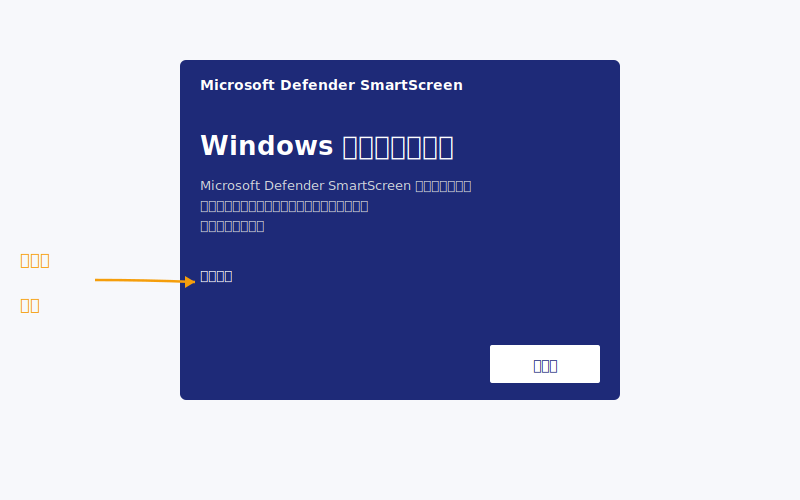
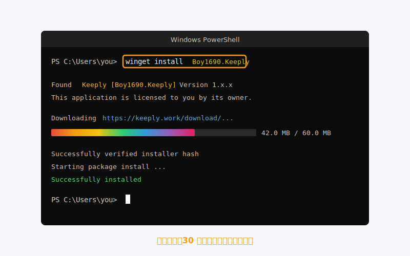
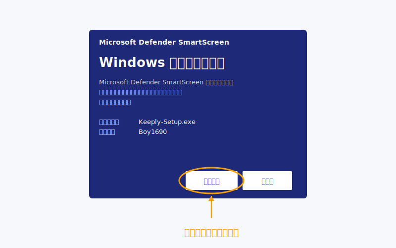
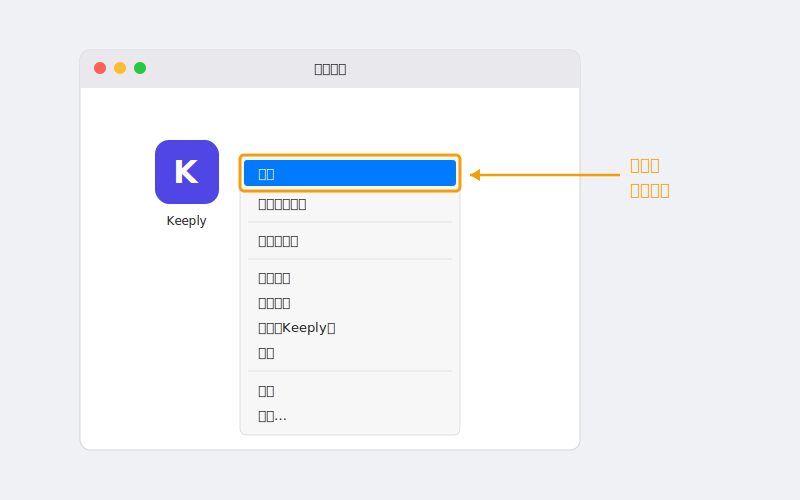
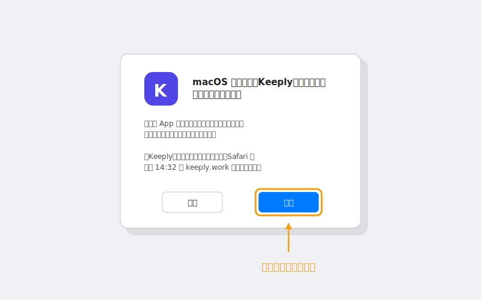
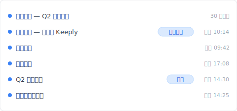
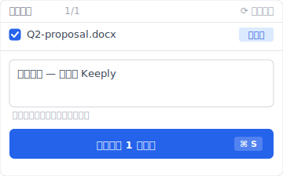

> 「我雙擊跳出藍屏，以為是病毒就關了。」
>
> 。某剛聽完 Keeply 介紹的設計師，當天回信這樣寫。

他不是第一個。Windows 那個藍色畫面攔下的人，可能比真正裝起來的還多。

這篇從頭走一次：**為什麼會跳藍屏 → 三條更乾淨的路 → 裝完馬上開第一個專案**。

## 目錄

1. [為什麼會跳出那個藍屏（不是 Keeply 的問題）](#why-smartscreen)
2. [三條路任你選：先看哪條最快](#three-paths)
3. [Windows 路徑 1：winget 一行指令（推薦）](#path-winget)
4. [Windows 路徑 2：手動下載 .exe](#path-exe)
5. [macOS 安裝：右鍵打開的關鍵步驟](#path-macos)
6. [裝完之後：把第一個專案丟進去](#first-project)
7. [卡住了？5 個常見錯誤排除](#troubleshoot)

## 為什麼會跳出那個藍屏（不是 Keeply 的問題） {#why-smartscreen}

那個畫面叫 [SmartScreen](https://learn.microsoft.com/en-us/windows/security/operating-system-security/virus-and-threat-protection/microsoft-defender-smartscreen/)。它不是判斷「這個軟體有沒有毒」，是判斷「這個軟體有沒有累積夠多人用過」。

換個角度：新開的餐廳還沒 Google 評價，不代表難吃。是還沒人吃過給星。

SmartScreen 對新軟體的態度一模一樣。它用「**下載量 + 時間**」累積信任，新版本一推出就會回到觀察期。Keeply 每次更新都會經歷一輪這個過程。這跟「軟體本身安全嗎」沒關係。

那為什麼還是會嚇到人？因為畫面只給你一顆很大的「不執行」鈕，要按執行得先點旁邊那個叫「**其他資訊**」的小字。視覺上，它不像個提示，比較像個阻擋。



但你不必跟它打交道。**Keeply 已經被 Microsoft 的 [winget 套件 倉庫](https://github.com/microsoft/winget-pkgs) 收錄**，那條路根本不會跳警告。

所以重點不是怎麼繞過警告。是怎麼走一條警告不會跳出來的路。

## 三條路任你選：先看哪條最快 {#three-paths}

| 路徑 | 適合誰 | 預估時間 | 跳藍屏？ |
| --- | --- | --- | --- |
| **A. winget 指令**（Windows） | 不怕貼一行字到 PowerShell | 2 分鐘 | 不會 |
| **B. 官方下載 .exe**（Windows） | 完全不想開黑色視窗 | 5 分鐘 | 會，下面教你怎麼處理 |
| **C. 官方下載 .dmg**（macOS） | Mac 使用者 | 3 分鐘 | 不會，但要按右鍵 |

選好了？跟著對應段落走，其他可以略過。

## Windows 路徑 1：winget 一行指令（推薦） {#path-winget}

**winget** 是 Windows 內建的「軟體商店指令版」，從 Windows 10 1809 起就在你電腦裡了。你不必另外裝任何東西。

打開 PowerShell（開始選單搜「PowerShell」），貼這一行進去，按 Enter：

```powershell
winget install Boy1690.Keeply
```



30 秒左右會跑完。沒有藍屏。沒有「其他資訊」那顆小字。

為什麼這條路這麼乾淨？因為要列進 winget，Keeply 得通過 [Microsoft 在 GitHub 上的官方審查](https://github.com/microsoft/winget-pkgs)：檢查安裝檔來源、檔案簽章、安裝行為是否乾淨。把關過才放上架。

換句話說，你跑這行指令的時候，Microsoft 已經先幫你做了一次審核。SmartScreen 那層判斷在這條路上是多餘的，所以它根本不會出來。

這是「短路徑」順便也是「信任路徑」。兩件事一行解決。

## Windows 路徑 2：手動下載 .exe {#path-exe}

不想開 PowerShell？也行。去 [keeply.work](https://keeply.work/) 點下載，拿到 `.exe` 安裝檔，雙擊。

接下來會跳出 SmartScreen 藍屏。**這是正常的**（[原因見上面](#why-smartscreen)）。要繼續裝，動作是這樣：

1. 點藍色畫面上的「**其他資訊**」（左下角的小字）
2. 才會出現「**仍要執行**」按鈕
3. 點下去，安裝精靈接手



整個過程多花約 3 分鐘，多在心理建設，不在實際操作。裝完跟路徑 1 殊途同歸，下一段一起。

## macOS 安裝：右鍵打開的關鍵步驟 {#path-macos}

Mac 不會跳藍屏。但首次打開不能雙擊。雙擊會被 [macOS Gatekeeper](https://support.apple.com/en-us/102445) 擋下。

正確流程：

1. 下載 `.dmg`，把 Keeply 拖進 應用 資料夾
2. 打開 應用，找到 Keeply
3. **右鍵 → 打開**（不是雙擊）

   

4. 對話框跳出來，按「打開」

   

到這就完成了。**只有第一次需要這樣**，之後雙擊正常用。

為什麼第一次要繞？Gatekeeper 對任何「未公證或新公證」的 應用 預設不允許雙擊啟動。右鍵打開是 Apple 自己提供的「我知道我在裝什麼」的明確同意動作。

這不是 Keeply 特殊狀況。每個沒被你電腦看過的新 Mac 應用 第一次打開都這樣。

## 裝完之後：把第一個專案丟進去 {#first-project}

裝好不算成功。當天有專案被保護住，才算。

打開 Keeply，點「**新增專案**」，挑一個你正在做的資料夾。

**建議第一個丟什麼**：你目前手上「**不想搞丟、又一直在動**」的那個。提案、合約、設計稿、簡報，都可以。最好不是你已經半年沒碰的舊資料夾。那個的價值不在「保護」，在「歸檔」，是另一個故事。

第一次掃描需要 1 到 2 分鐘。之後 Keeply 會在背景看著這個資料夾，**改檔自動記錄**版本，不必你手動按存檔點。

裝完當天打開時間軸，會看到這樣的歷史——「首次儲存 — 剛裝好 Keeply」自己一行、帶一個首次保護標記。



那條「首次儲存」是怎麼來的？打開專案資料夾後，點 Keeply 主視窗的「**儲存版本**」按鈕，跳出這個對話框：



寫一行筆記告訴未來的自己「這版是裝完當下的版本」，半年後回頭翻時間軸看到的是描述、不是時間戳。

舉個合成範例幫你想像：某設計師裝完當下丟的是 Q2 提案資料夾。第一次掃描花了 2 分鐘。第三天，他發現自己上週六改錯一個 logo 顏色，從歷史拉回前一版花了 20 秒。

裝完當天就用第一個專案，比裝完一週才用，留存率高很多。

## 卡住了？5 個常見錯誤排除 {#troubleshoot}

| 症狀 | 處理 |
| --- | --- |
| `winget` 找不到指令 | 表示你的 Windows 還沒裝「應用程式安裝程式」。改用路徑 2（手動下載 .exe）就好，不必跟它糾結 |
| Win 11 跳「需要管理員」 | 用「**以系統管理員身分**」重開 PowerShell |
| Mac「無法打開因為無法驗證開發者」 | 右鍵 → 打開（不是雙擊），見上面 macOS 段 |
| 公司網路擋下載 | 改用 winget 指令，走 Microsoft CDN，多半放行 |
| 裝完打不開 | 重啟一次；仍不行寄 [support@keeply.work](mailto:support@keeply.work) |

## 唯一要記住的一件事

記住一件事就好：

**藍屏不是判決，是信譽還在累積。**

你不需要繞過警告，你只需要走 winget 那條沒有警告的路。

---

> 關於作者：Ting-Wei Tsao，Keeply 創辦人。
> [LinkedIn](https://www.linkedin.com/in/ting-wei-tsao-b57480152/)
