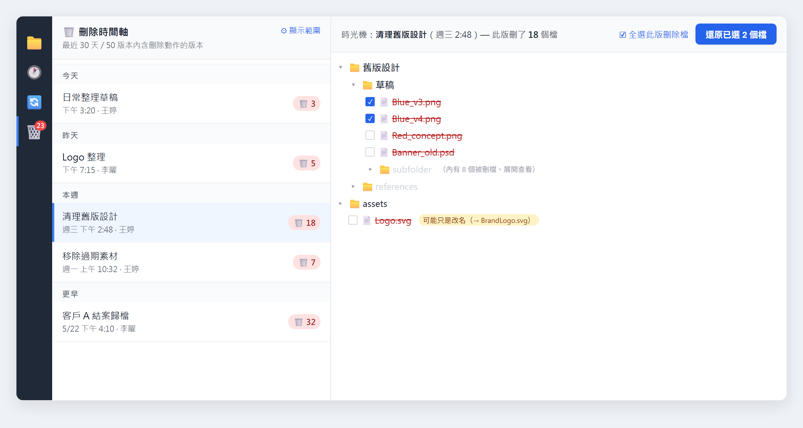
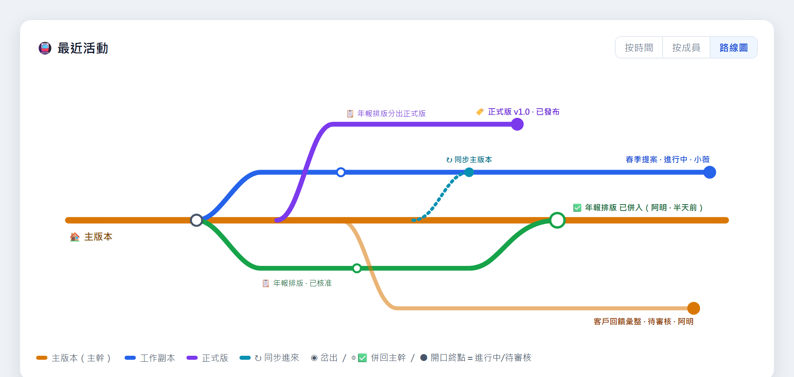

從 1.0.12 到 1.0.13，我們把最多心力放在一件事：把「不小心刪掉的檔找回來」做成一個你信得過的面板。同時，醞釀很久的團隊協作也接近完成，這版先讓你搶先看一眼。

Keeply 打開就是你熟悉的資料夾畫面：一格一格的檔案和資料夾，左邊一條時間軸記著你存的每一版。這版的新東西也照這個邏輯走——點一個檔就看它的歷史、誤刪了就從時間軸找回來。

## 🆕 新功能

### 刪除時光機：把誤刪的檔找回來

以前檔案不小心刪掉、又已經不在資源回收筒，多半就只能認了。這版我們做了一個專門的面板：點左側工具列的 🗑️，就會看到一條「刪除時間軸」，按今天 / 昨天 / 本週 / 更早分組，每一筆右邊標著「🗑️ N」——這一版刪掉了幾個檔。

點某一筆，右邊會像時光機一樣展開那個時間點的檔案樹，自動翻到被刪檔所在的位置。真正被刪的檔用紅色刪除線標出來；如果其實只是改了名字，旁邊會貼一個小提示「可能只是改名」，省得你白找。

勾選你要的檔（可以一次全選這一版刪掉的），按「還原已選 N 個檔」，選一個資料夾放（預設桌面），它就照原本的資料夾結構幫你還原回去。檔名撞到的話，預設會自動加 `_restored` 後綴，不會蓋掉你現有的檔。

### 點一個檔，只看它的版本歷程

時間軸一直以來顯示的是整個資料夾的版本。但很多時候你只想知道「就這一份檔，到底改過哪幾版」。現在直接單擊那個檔，左邊的主時間軸就只剩這份檔的歷史；看完按一下「回到全部版本」就回到完整時間軸。

### 檔案總管，更好看也更好用

- **一眼看出哪些檔改過**：在「變更」分頁，沒動過的檔會壓灰、有改的會凸顯出來，不用自己一個個比對。
- **資料夾卡片化 + 選取態**：資料夾改成卡片式圖示，點選有明確的選中樣式。
- **右鍵選單統一**：不管在哪個檢視、對檔還是對資料夾按右鍵，選單都一致。
- **F5 一鍵重新整理**：跟你習慣的一樣，按 F5 就刷新目前畫面。

## 🔭 即將開放：團隊協作（搶先看）

先說清楚：團隊協作**這版還沒正式開放**，我們想先讓你看一眼接下來的方向。這是 1.0.13 內部投入最多的一塊，我們把整段協作流程補成了一條完整的線，等打磨好就會開給大家。

接下來會開放的包括：

- **從送審到合併一條龍**：成員把工作副本送主管審閱、附上說明；主管逐個檔留意見、核准或退回（退回寫明原因）；核准後合併、成員端一鍵收尾。送審紀錄跨機器同步，不會只留在某一台電腦上。
- **任務指派與追蹤**：主管派工、成員一鍵開工；任務可拆成子項打勾看進度；送審 / 核准 / 退回會自動帶動任務狀態。
- **團隊活動「路線圖」**：把整個團隊畫成一張像捷運路線的圖，主幹是主版本、每位成員的工作副本是岔出去的支線，誰在動、哪條已合併、哪條還在審，一眼看完。
- **把現有資料夾收編成「團隊正本」**：已經在用 Keeply 管的資料夾可直接設成團隊正本，成員加入即繼承授權，不必每個人重買。

開放時間還沒定，會在準備好時通知你。如果團隊協作正是你在等的，歡迎從「回報問題」告訴我們你最想先要哪一段。

## ✨ 體驗改進

- 存版本、同步、還原都改成在背景進行，動作當下畫面不會卡住。
- 通知類提醒改到右下角浮層，不再擠壓主畫面。
- 時間軸的篩選文字拿掉了技術術語，改用一般人看得懂的說法。
- 回報問題時，Keeply 會自動帶上正確的版本號，我們能更快對到是哪一版的狀況。

## 🛡️ 修復與安全

- 修掉刪除功能上線後、從真實使用中抓到的一批問題。
- 備援位置：磁碟機代號轉成網路路徑時，修好「達上限卡死」以及「舊位置已不存在卻誤報紅字」。
- 安全存版本的守門更嚴謹：事前快照真的失敗時，會中止有風險的操作，而不是硬做下去。
- 例行更新底層元件、修補了一批已知安全漏洞。

## 🔒 關於隱私

這版加了一個「匿名使用統計」的同意設定：它只會在你同意後，傳送不含個資的使用訊號，幫我們知道哪些功能有人用。預設你可以隨時在設定裡關掉，而且它**要到 2026 年 7 月 15 日才會真正啟用**——在那之前，我們會在 App 裡提前 30 天公告，不會無聲開始。

## ⬇️ 下載與升級

到 [keeply.work](https://keeply.work) 就能下載 1.0.13；已經安裝的話，會自動收到更新。

這版也補上了 **Intel 版 Mac**：除了 Apple Silicon，使用 Intel 處理器的 Mac 現在也有對應的安裝檔。

刪除還原、單檔時間軸這些已經在你手上了，團隊協作也快了。接下來做什麼，很大一部分看你的回饋。用了有任何想法，從 Keeply 裡的「回報問題」直接告訴我們，我會看到。

---

> 關於作者：Ting-Wei Tsao，[Keeply](https://keeply.work) 創辦人。[LinkedIn](https://www.linkedin.com/in/ting-wei-tsao-b57480152/)
