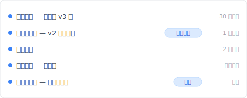
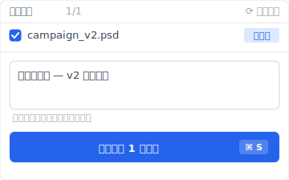
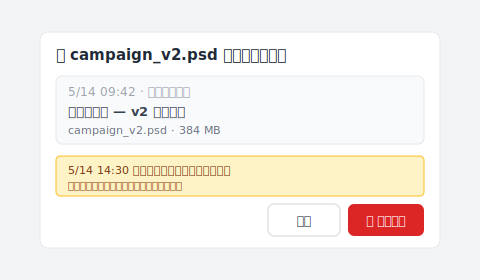

# 【2026 檔案管理】Photoshop 自動儲存救當機，救不了你蓋掉客戶版：Keeply 怎麼補檔案級版本歷史

> Photoshop 自動儲存只為當機而生。蓋掉客戶要的 v2 那種事它不接、你需要的是檔案級版本歷史。

你按下儲存。游標閃了一下。

然後你想起來——那一份、是客戶要的版本。

簡報寫的是「v2、但顏色用 v3 的」。你開的是 v2。你選了 v3 的色票。你存了。

完蛋。

被壓過去的那層、現在是你手上唯一的 v2。你瘋狂 google「photoshop 自動儲存 location」、心想 Photoshop 應該偷偷在哪裡留了副本吧——你打開自動儲存資料夾、裡面有一個檔案、上週二的、今天的什麼都沒有。

你打開的資料夾是對的。問題在於、它做的事跟你以為的不一樣。這篇拆完 Photoshop 自動儲存 / 歷史紀錄面板 / Time Machine / OneDrive 各自為什麼救不了「蓋掉客戶版」這個場景、然後讓你看 [Keeply](https://keeply.work) 怎麼用「30 分鐘背景輪詢 + 主動儲存版本 + 筆記」補檔案級版本歷史這層。

## 本文目錄

1. [換 Keeply 後我的客戶確認版自己一行、半小時前的 v2 一鍵還原](#keeply-timeline)
2. [Photoshop 自動儲存資料夾打開、裡面什麼都沒有——這是設計使然](#autosave-empty)
3. [Photoshop 自動儲存為當機而生：自動儲存 vs 版本歷史的關鍵差別](#autosave-vs-version)
4. [歷史紀錄面板也救不了你：單次 session 的 undo 記憶、檔案一關就蒸發](#history-panel-fails)
5. [Keeply 怎麼補檔案級版本歷史：30 分鐘背景輪詢 + 主動儲存版本 + 筆記](#keeply-fills-gap)
6. [不必裝 Keeply 的 3 種 Photoshop 場景](#when-not-needed)

---

## 換 Keeply 後我的客戶確認版自己一行、半小時前的 v2 一鍵還原 {#keeply-timeline}

先讓你看現在。同樣是 `campaign_v2.psd`、客戶要 v2 但顏色用 v3 的——在 [Keeply](https://keeply.work) 裡，這個設計專案保管庫的時間軸看起來是這樣：

「客戶確認版 — v2 主色完稿」自己一行、有「客戶確認」tag——是我下午客戶確認 v2 主色那一刻、主動點 Keeply 主視窗「儲存版本」+ 寫筆記存的。後來我改 v3 色票存錯覆蓋——「自動儲存 — 主色改 v3 後」在時間軸上另一條、但前面那版「客戶確認版」**沒有消失**。

我打開 Keeply、點時間軸「客戶確認版 — v2 主色完稿」那一行——3 秒還原回來、跟現在改錯的 v3 並排對比、把 v3 的顏色複製過去、原本要重做一小時的圖層工作 30 秒結束。

那行筆記怎麼來的？客戶確認那一刻、我點 Keeply 主視窗「儲存版本」按鈕、跳出來這個對話框：

寫一行「客戶確認版 — v2 主色完稿」、儲存版本。Keeply 在背景每 30 分鐘輪詢檔案變更——就算我忘了主動標、30 分鐘內也會有自動儲存版本。覆蓋掉的災難對 Keeply 來說只是時間軸上多一條記錄、不會抹掉前面那一版。

下面拆 Photoshop 自動儲存 / 歷史紀錄面板各自為什麼救不了「蓋掉客戶版」這個場景。

---

## Photoshop 自動儲存資料夾打開、裡面什麼都沒有——這是設計使然 {#autosave-empty}

自動儲存資料夾從頭到尾就是空的。它在等當機才會寫東西；今天沒當機、所以裡面沒今天的事。

面對這個空資料夾、設計師通常先做兩件事：再 google 一次「photoshop 自動儲存 在哪」、然後盯著資料夾發呆十分鐘。兩件事都白搭、因為自動儲存從頭到尾就是另一個機制——它是 Photoshop 為自己準備的緊急傘、傘是為「程式或系統突然死掉」開的、傘下站的人是 Photoshop 自己、不是你的版本歷史。

這支緊急傘實際在做什麼？Photoshop 監控的是「非正常結束」這件事——當機、強制關閉、系統 kernel panic。這些事情發生的時候、它會把記憶體裡的工作狀態寫進一份 `.psb` 回復檔；下次你打開 Photoshop、會跳出對話框問你要不要還原那份檔。

它的職責到這裡為止。你存檔蓋掉自己上一個版本？這在 Photoshop 內部完全是另一件事——程式運作正常、使用者主動執行儲存指令、自動儲存機制連被觸發都沒。沒當機、沒東西需要救、所以也沒東西被寫進回復資料夾。

想自己去資料夾翻一遍確認？[Adobe 官方文件有列出每個平台的精確路徑](https://helpx.adobe.com/tw/photoshop/using/自動儲存-recovery-背景-save.html)：Mac 的 `~/Documents/Adobe/自動回復/`、Windows 的 `%AppData%/Adobe/Adobe Photoshop {version}/自動回復/`。前幾次 session 的舊 `.psb` 可能還躺著、但今天的工作從來沒被寫進去、也就還原不出來。

那為什麼還有上千篇文章教你「自動儲存資料夾在哪」？

---

## Photoshop 自動儲存為當機而生：自動儲存 vs 版本歷史的關鍵差別 {#autosave-vs-version}

老實說、這是 Google 第一頁沒人願意分清楚的差別：

| 機制 | 觸發 | 救什麼 | Photoshop 內建？ |
|---|---|---|---|
| **自動儲存** | Photoshop 偵測到異常結束 | 當機時記憶體裡的工作狀態 | ✅ |
| **版本歷史** | 每次存檔 | 每次存檔的完整快照、永久保留 | ❌ |

**當機救援**是自動儲存的工作——程式死了、檔案沒存、幫你回到當下那一刻。一份工作、一個位置。你能在 Adobe `偏好設定 > 檔案處理` 選間隔（5、10、15 或 30 分鐘）、但無論選哪個、存的都是同一個會被覆寫的位置；新的覆蓋舊的、沒有歷史、只有「最近一次可回復的點」。

**存錯救援**屬於另一個機制——也就是版本歷史這個 Photoshop 沒做的東西。你存檔把上一版直接覆蓋過去。「另存新檔...」會多出一份新檔、原檔還在、但原檔的內容也已經是你最後存的版本、舊內容一樣回不來。

回到那個「上千篇文章」的問題——它們答的是另一個比較容易答的問題。「自動儲存在哪個資料夾」是技術 FAQ、「我蓋掉了上一版怎麼救」是設計問題；前者有答案、後者在 Photoshop 內沒有。

最妙的是 Adobe 自己其實沒在裝。自動儲存功能的官方名稱叫「**背景儲存與自動回復**」。Adobe 把它叫「回復」、我們自己讀成「歷史」、差別就在這裡開始的。

---

## 歷史紀錄面板也救不了你：單次 session 的 undo 記憶、檔案一關就蒸發 {#history-panel-fails}

既然自動儲存不是歷史、那設計師下一個會試的通常就是歷史紀錄面板——它聽起來最像版本歷史。

你打開歷史紀錄面板、滑過去、看到今早做的 20 個步驟、但昨天的什麼都沒有。

歷史紀錄面板是「單次 session 的 undo 記憶」。它住在正在跑的 Photoshop 程序的記憶體裡、檔案一關（或 Photoshop 一結束）、整段歷史就蒸發了。隔天早上打開同一個 PSD、歷史紀錄面板只剩一行：「開啟」。昨天每一筆操作、每一筆筆觸、每一次圖層調整、歷史紀錄裡都不見了。像素還在檔案裡、怎麼走到那些像素的軌跡不在。

「我有歷史紀錄面板啊！」這是直覺反應。當下工作中確實沒問題、但你昨天的工作關了檔案就消失、整個 session 結束就清零。比較像便條：用過就丟。

Photoshop 預設保留 50 個步驟、你可以在 `偏好設定 > 效能` 調高。這個數字對你的問題沒有幫助——這段歷史活不過檔案關閉、調再高都一樣。

歷史紀錄面板其實是「操作日誌」——「你照這個順序做了這些事」。它記的是動作序列、每次存檔不會在這上面留任何記號、因為它沒被設計來做這個。

所以你手上有三個看起來該救你的東西：自動儲存（為當機而生）、回復資料夾（前者放暫存的地方）、歷史紀錄面板（session 內 undo、檔案一關就蒸發）。

第四個沒有。**檔案層級的版本歷史、Photoshop 沒內建。** 就是這層缺失、把你帶到這篇文章裡。

---

## Keeply 怎麼補檔案級版本歷史：30 分鐘背景輪詢 + 主動儲存版本 + 筆記 {#keeply-fills-gap}

缺的那層住在 Photoshop 外面那一層——一個獨立的程序、在背景每 30 分鐘輪詢一次檔案系統變更。

把需要的東西精確定義一下。每存一次 PSD、Keeply 在 30 分鐘內偵測到檔案變更、就把那一刻的完整位元組快照保留下來、永遠不覆寫。今天存 20 次就有約 20 個快照堆著（如果改動跨多個 30 分鐘輪詢）。明天你蓋掉客戶要的 v2 了？回到「客戶確認版」那一行、當前檔案不動、過去版本另外復原回來。

Photoshop 為什麼不做這層？Adobe 把自己定位在繪圖工具、檔案在磁碟上的歷史變化是檔案系統層、作業系統、或第三方工具的責任、所以 Adobe 把這層留給別的工具補。

填這個空缺的工具不只一個。Apple Time Machine 試著補——但它是每小時系統快照、不是檔案級版本歷史、一小時前存過的 v2 你可能有救、也可能剛好抓到你已經改完的狀態、純看時機。OneDrive 跟 SharePoint 提供版本歷史、預設保留 [500 個 major 版本](https://learn.microsoft.com/en-us/sharepoint/document-library-version-history-limits)、超過會被自動清除最舊那些（個人 Microsoft 帳號更少、限 25 個版本）。Google Drive 規則更窄：每個檔案最多 [100 個 revisions](https://developers.google.com/workspace/drive/api/guides/manage-revisions)、且超過 30 天的舊版會被自動清除（除非手動標記「Keep Forever」、這層上限 200 個）。[我們在另一篇文章詳細拆過](/zh-tw/post/client-asked-which-version/) 為什麼這層保留期接不到 3 個月後的交付。這些都是部分答案。

剩下的空缺、Keeply 想補。邏輯很簡單：Keeply 監看的資料夾裡放 PSD、它在背景每 30 分鐘輪詢一次檔案變更（不依賴 hook 你按存檔那一刻、是事後檢查檔案系統）、有改就把那一刻的完整版本保留一份。再肥的 PSD（500MB 一張那種）、Keeply 都在底層用 LFS 技術優化處理、不會把硬碟塞爆。

同時 Keeply 主視窗有一個「儲存版本」按鈕——客戶確認版那一刻你主動點、跳對話框寫筆記「客戶確認版 — v2 主色完稿」、那一版單獨被凍結。3 個月後客戶 LINE 你問哪版、翻時間軸看 tag 就有。

當你發現自己蓋掉客戶要的 v2 那一刻、打開 Keeply、滑到「客戶確認版」那一行、按還原。跳出來的對話框長這樣：

注意紅色「還原這版」下方那行說明——5/14 14:30 後的修改不會被覆蓋、會被另存為一個新版本。新舊版同時留在版本歷史、誰也沒丟。你看著兩份視覺對比、把 v3 的顏色複製到還原回來的 v2 上面、原本要重做一小時的圖層工作 30 秒結束。

順便講一下：Keeply 跟你已經有的 Adobe Creative Cloud、Time Machine、任何一種雲端同步並排運作、它不取代任何一個。它只補那個其他工具都沒處理到的空缺——二進位創意檔案的永久檔案層級版本歷史、每 30 分鐘輪詢看一眼。

這也是[更廣的檔案版本管理問題](/zh-tw/post/file-version-management-complete-guide/)裡、設計師感受最強的那一塊。PSD 大、編輯具破壞性、客戶會改變心意指的是哪一版 v2。

---

## 不必裝 Keeply 的 3 種 Photoshop 場景 {#when-not-needed}

Keeply 救不回已經不存在的東西、誠實列幾個情境。

**硬碟故障——那不是我們的領域**。磁碟壞了、磁區損毀、`.psd` 副檔名被搞壞、那是 EaseUS、Disk Drill、Stellar Phoenix 那群工具的事。Keeply 假設你的檔案還在磁碟上、只是內容已經變成你不想要的那一版；如果檔案本身就消失了、你要找的工具是硬碟救援。

**Keeply 安裝之前被蓋掉的檔案**也救不了。它從你裝那一刻起開始記錄版本、昨天蓋掉的 v2、今天才裝 Keeply、沒有歷史可以回。我承認這聽起來廢、但版本歷史工具的本質就是這樣——它記錄的是從現在開始的時間流、往前是它不認識的時段。

**Photoshop 編輯中當機那一刻**。Keeply 30 分鐘輪詢、不會抓到那一刻的中間狀態。Photoshop 自動儲存 / 自動回復 仍是第一道線（Photoshop 自己的緊急傘）。Keeply + Photoshop 自動儲存互補、各管一段、並排運作。

---

下次客戶確認版那個瞬間、會再來。

打開 [Keeply](https://keeply.work)、看時間軸頂端那條「客戶確認」tag——下次你蓋掉 v2、不用再 google「photoshop 自動儲存 location」盯著空資料夾發呆。點時間軸還原、3 秒拿回來。

整個 panic 解掉。

自動儲存在它被設計的那個工作裡——把你從當機帶回來——做得不錯。它只是不該被期待去解一個從來沒打算解的問題。版本歷史屬於另一個工具的工作。

下次存錯之前要把這層加到 PSD 上、[Mac 或 Windows 都可以裝 Keeply](/zh-tw/post/install-keeply-windows-mac/)。

---

*作者：[Ting-Wei Tsao](https://www.linkedin.com/in/ting-wei-tsao-b57480152)，[Keeply](https://keeply.work) 創辦人。Keeply 是為設計師、建築師、知識工作者打造的檔案版本歷史工具——不用學 Git 也能單檔還原到任何過去版本。*
