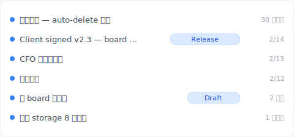
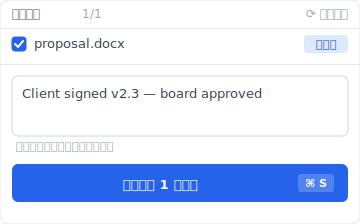
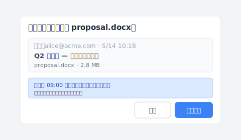

# 【2026 檔案管理】SharePoint 版本歷史：500 個版本上限 + 自動刪除 設定的隱藏成本

> Microsoft 2024 給了 IT 管理員 一個 儲存空間 省錢按鈕。按下去之前該知道你會失去什麼。

「SharePoint 你昨天才設了 自動刪除 100。今天客戶問你『3 個月前那版』在哪？打開歷史只剩 100 個版本——前面那 250 版、Microsoft 已經幫你刪了。」

這不是 錯誤、不是教學沒看清楚。是 [Microsoft Learn 官方文件](https://learn.microsoft.com/en-us/sharepoint/document-library-version-history-limits)寫清楚的機制：500 主要版本上限 + 2024-Q4 推出的 自動刪除 設定（500 / 100 / 50 / 期限 截止 四段位）。本文拆 SharePoint 版本歷史的 3 個機制 + 自動刪除 設了之後**失去什麼**，加上 [Keeply](https://keeply.work) 怎麼接住超過 上限 後的場景。

## 本文目錄

1. [Keeply 怎麼讓 SharePoint 版本歷史「不被 自動刪除 吃掉」](#keeply-timeline)
2. [SharePoint 版本歷史 3 個機制：500 major + 511 minor + 自動刪除](#three-mechanisms)
3. [500 主要版本上限：Microsoft 官方數字、IT 管理員 容易誤解的細節](#500-cap)
4. [自動刪除 4 段位：500 / 100 / 50 / 期限 截止 真實成本](#自動刪除)
5. [SharePoint 儲存空間配額：你壓 100 真的省多少？](#儲存空間-quota)
6. [Keeply 補位：跨 SP 儲存階層 的 發行版凍結 + 單檔 筆記](#keeply-fills)
7. [3 種你不需要 Keeply 的 SharePoint 場景](#when-not-needed)
8. [常見問題](#faq)

---

## Keeply 怎麼讓 SharePoint 版本歷史「不被 自動刪除 吃掉」 {#keeply-timeline}

先看現在會發生什麼。James 是中小企業的 IT 兼任 admin、5 人團隊用 SharePoint Online 共用 `proposal.docx` 改提案。半年累積 200 多版、SharePoint 儲存空間配額 用到 8 成、他剛在 管理中心 設了 自動刪除 100——下個月 儲存空間配額 會降回安全範圍。

但今天客戶忽然問他「2 月 14 日 董事會 確認的那版」在哪。打開 SP 版本歷史只剩最近 100 個版本、2 月 14 日那版已經被 自動刪除 吃掉。

換 [Keeply](https://keeply.work) 就不會。同一個 `proposal.docx` 在 Keeply 的時間軸看起來這樣：

「Client signed v2.3 — 董事會核可」自己一行、有 Release tag——是 James 在 2 月 14 日客戶確認後、主動點 Keeply 主視窗「儲存版本」+ 寫筆記存的：

寫一行「Client signed v2.3 — 董事會核可」、儲存版本。半年後翻 Keeply 時間軸看 tag 就有——**不受 SP 自動刪除 影響、不被自動刪除**。

操作只有 2 個動作：

1. **存檔**——他在 Word 按 Ctrl+S、SharePoint 同步雲端（如常）、Keeply 在背景 30 分鐘內看到變更、自動存一版進**自己的時間軸**。
2. **標里程碑**——重要時刻（董事會 確認 / 客戶簽 / 上線版）點 Keeply 主視窗「儲存版本」+ 寫筆記。

下面拆 SharePoint 自家 3 個機制——為什麼 自動刪除 100 設了之後 250 版直接消失。

## SharePoint 版本歷史 3 個機制 {#three-mechanisms}

SharePoint 講「版本歷史」是 3 件不同的事被混在一起：

| 機制 | 是什麼 | 上限 | 觸發 |
|---|---|---|---|
| **主要版本**（Major version） | 每次儲存的完整版本 | **500 個**（[MS Learn](https://learn.microsoft.com/en-us/sharepoint/document-library-version-history-limits)） | 預設每次儲存自動 |
| **次要版本**（Minor version） | 草稿狀態（需開啟 major/次要版本ing 才有） | 511 個（額外） | 草稿存檔 |
| **自動刪除 設定** | IT 管理員 可設更嚴格的 上限 | 500 / 100 / 50 / 期限 截止 | 管理中心 設定 |

3 件事、混在一起問會找錯方向。「找不到 3 個月前那版」可能是 500 上限 撞到、可能是 自動刪除 設了 100 / 截止、可能是 admin 把它從 site 整個搬走了。**先確認你的 site 設了什麼 自動刪除 才知道在哪層解。**

## 500 主要版本上限：Microsoft 官方數字 {#500-cap}

[Microsoft Learn 文件](https://learn.microsoft.com/en-us/sharepoint/document-library-version-history-limits)寫得很清楚：SharePoint Online 文件庫每個檔案最多保留 **500 個主要版本**。啟用主要 / 次要 版本管理 後可再加 511 個次要版本。

**容易誤解的細節**：

- **不是「500 個任意版本」**——是 **500 major + 511 minor**（兩個獨立 pool）
- **超過會自動刪最舊的、不通知**——跟 OneDrive 機制一樣（[詳細看 OneDrive 版本歷史](/zh-tw/post/onedrive-version-history/)）
- **每個檔案獨立計算**——不是 站台集合 共用 500
- **2024-Q4 之前所有 site 預設 500**、之後 IT 管理員 可在 管理中心 設成更小

**誰會撞到 500 上限**：

- 5 人團隊每天輪流改 proposal、每天 3 次儲存 = 月 ~66 版 → **約 7-8 個月** 撞 上限
- IT 管理員 想 清理 把 上限 壓到 100 = 撞 上限 速度 × 5

## 自動刪除 4 段位：500 / 100 / 50 / 期限 截止 真實成本 {#自動刪除}

Microsoft 2024-Q4 推出 SharePoint 管理中心 的 [version history 自動刪除 settings](https://learn.microsoft.com/en-us/sharepoint/document-library-version-history-limits)、IT 管理員 可選：

| 段位 | 保留版本數 | 適合場景 | 失去什麼 |
|---|---|---|---|
| **500（預設）** | 最近 500 個 | 儲存空間 充裕、想保留完整歷史 | 第 501 次儲存後失去最舊 1 版 |
| **100** | 最近 100 個 | 儲存空間 開始緊、團隊改動少 | 第 101 次儲存後最舊版自動刪 |
| **50** | 最近 50 個 | 儲存空間 緊張、輕度版本需求 | 大量歷史失去（高頻儲存場景慘） |
| **期限 截止（自訂天數）** | 過 N 天的版本永久刪 | 法規 retention 場景 | 過了 N 天的舊版救不回（資源回收筒 也撈不到） |

**真實 儲存空間 省多少**：以 [note.shiftinc 案例](https://note.shiftinc.jp/n/n4eaa1ebddd34) 為例、設了 自動刪除 後該 租戶 儲存空間配額 占用率從 85% 降到 35%。但代價是：截止 前的版本永久刪。

**沒人寫的關鍵風險**：自動刪除 是 site-collection 層級設定、IT 管理員 設了之後 end user 看不到、不會被通知。3 個月後找不到某版，end user 還以為 SP 壞了。

## SharePoint 儲存空間配額：你壓 100 真的省多少？ {#storage-quota}

SharePoint 儲存空間配額 是 租戶層級 + 站台集合 level 加總：

- **Microsoft 365 Business Standard**：1 TB / 租戶 + 10 GB / user
- **Microsoft 365 Business Premium**：1 TB / 租戶 + 10 GB / user
- **Enterprise E3/E5**：5 TB / 租戶 + per-user 儲存空間 額外計

`proposal.docx` 平均 1.5 MB × 500 主要版本 = 750 MB / 一個檔案。500 個 活躍文件 × 750 MB = 375 GB → 撞 1 TB 租戶 上限。

**自動刪除 100 後**：1.5 MB × 100 = 150 MB / 檔 → 500 檔 × 150 MB = 75 GB → 租戶 7.5% 占用。確實是 5 倍 儲存空間 節省。

**但**：你失去了 80% 的歷史。客戶 3 個月後問 董事會 簽的那版、可能就在那 400 版被刪掉的範圍裡。

## Keeply 補位：跨 SP 儲存階層 的 發行版凍結 {#keeply-fills}

James 的場景：5 人團隊 + SP 儲存空間 緊 + 想 清理 但又怕失去重要版。

[Keeply](https://keeply.work) 給他 3 件事一個工具：

- **發行版凍結**：在 董事會 確認那天、James 點 Keeply「儲存版本」標「Client signed v2.3」——這版凍結在**本機 + Keeply 自己備援位置**、不被 SP 自動刪除 影響、永久保留
- **單檔 筆記**：每版 1-2 行筆記。3 個月後翻時間軸看「CFO 第三輪修改」「董事會 簽」tag、不必猜 SP 上 100 版裡哪個是哪個
- **跨工具 portability**：Keeply 不依賴 SP。James 即使換 Dropbox / NAS、時間軸還在本機 + Keeply 備援位置、不被任何 cloud vendor 的 上限 鎖死

5 人協作場景常遇到的另一個動作：同事改了 SP 上同一份 `proposal.docx`、你想把對方那版套到自己本機改的版本上。Keeply 的「套用同事版本」對話框長這樣：

注意藍色提示那行——本機 09:00 後的編輯不會被覆蓋、會另存為獨立版本、兩版都留在版本歷史。不必先 email 互傳「最新版.docx」、不必擔心套錯版蓋掉自己的修改。

SP 留給團隊協作 sync + 儲存空間 壓 100、Keeply 給 無上限 單檔版本歷史 + 重要版凍結。**兩個並行、各做自己強項**。

## 3 種你不需要 Keeply 的 SharePoint 場景 {#when-not-needed}

誠實寫：

**企業合規封存**。SOX、HIPAA、GDPR 要 稽核軌跡 + 加密 + 保留期管理——走 [Microsoft 365 Backup](https://www.microsoft.com/en-us/microsoft-365/business/microsoft-365-backup) / Veeam / Acronis。Keeply 是日常版本管理、不是合規工具。

**500 版以內 + 不開 自動刪除 的個人 / 小團隊**。如果你 儲存空間配額 用不到一半、根本不必設 自動刪除——SP 預設 500 已經夠用、Keeply 是 過度。

**100% 純行動裝置 工作流**。Keeply 是桌面優先、手機端輕。如果你團隊 90% 用 Office 行動版 + SharePoint 行動版 改檔，Keeply 不在主視野裡、價值不顯。

## 常見問題 {#faq}

**Q1: SharePoint 每個檔案最多保留幾個版本？**

500 個主要版本（[Microsoft Learn](https://learn.microsoft.com/en-us/sharepoint/document-library-version-history-limits)）。開啟主要 / 次要 版本管理 後可再加 511 個次要版本。超過自動刪最舊、不通知。

**Q2: SharePoint 自動刪除 是什麼？**

Microsoft 2024-Q4 推出、IT 管理員 可在 管理中心 設 4 段位：500 / 100 / 50 / 期限 截止。儲存空間成本 vs 歷史完整性的 取捨。

**Q3: SharePoint 版本歷史跟 OneDrive 一樣嗎？**

底層 儲存空間 一樣（SP document library）、機制一樣。差別在使用情境（個人 vs 團隊）+ admin 設定的可控性。

**Q4: 自動刪除 開了之後找不回半年前那版怎麼辦？**

截止 前的版本永久刪、資源回收筒 也撈不到。要避免就需外部工具備援關鍵版本——例如 [Keeply](https://keeply.work) 發行版凍結。

**Q5: SharePoint 儲存空間配額 不夠、不開 自動刪除 還有什麼辦法？**

3 個選項：（1）付費加 儲存空間；（2）開 自動刪除 接受失去歷史；（3）外部工具搬重要版本出 SP。

**Q6: Keeply 跟 SharePoint 衝突嗎？**

不衝突、並行運作。SP 同步協作、Keeply 給 無上限 單檔版本歷史 + 發行版凍結。

## 延伸閱讀

主篇 [檔案版本管理完整指南](/zh-tw/post/file-version-management-complete-guide/)。

對照閱讀：
- [OneDrive 版本歷史：500 個版本天花板](/zh-tw/post/onedrive-version-history/)——同 MS family 的個人雲端對位
- [Excel 版本歷史的限制](/zh-tw/post/excel-version-history-limits/)——Excel 同款 500 機制
- [Keeply 跟備份、雲端工具有什麼不一樣](/zh-tw/post/what-keeply-saves-vs-backup-cloud/)

---

James 在 SP 管理中心 設 自動刪除 100。下個月 儲存空間 真的降回安全範圍。

但今天客戶問 董事會 簽的那版、SP 已經幫他刪了。

Microsoft 已經把 取捨 寫進文件。你不需要 SharePoint 不變、你需要 SharePoint 壓 儲存空間 的時候還有工具接得住歷史。

---

> 關於作者：Ting-Wei Tsao，[Keeply](https://keeply.work) 創辦人。
> [LinkedIn](https://www.linkedin.com/in/ting-wei-tsao-b57480152/)
