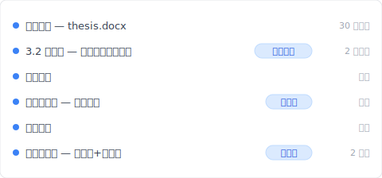
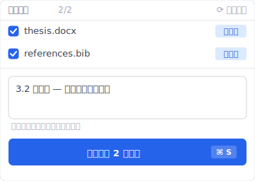
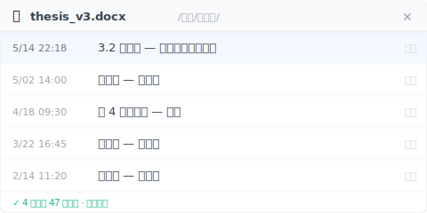

# 【2026 檔案管理】碩士論文版本管理 4 步：教授問「上一版那段」你答得出來嗎？

> 週三下午三點，教授傳訊息：「你上一版那段比較好，怎麼不見了？」你打開 thesis_final_v7、想不起 v5 跟 v6 差在哪。論文真正的風險不是寫不完，是你忘了差異是什麼——而檔案系統也不會幫你記。

週三下午三點。你在咖啡店，那杯美式還剩半杯。教授 Line 訊息跳出來：「你上一版第三章那段論證比較好，怎麼不見了？」

你打開筆電。Google Drive 裡躺著 `thesis_final.docx`、`thesis_final_v2.docx`、`thesis_修改版_0415.docx`。你一份一份點開，翻到第三章，對照眼前這一版。

完全想不起上一版那段跟現在差在哪。

你打字回教授：「我找找看喔。」然後你心裡知道。找不到了。

你以為論文最大的敵人是 截止日。從這個下午開始，不是了。

這篇拆完雲端同步 / Word 修訂追蹤 / 3-2-1 異地備份各自能解什麼、為什麼都救不了「上一版那段在哪」這個問題，然後讓你看 [Keeply](https://keeply.work) 怎麼把論文的時間軸一個工具一起做。

## 目錄

1. [換 Keeply 後我的論文時間軸長這樣](#keeply-timeline)
2. [雲端同步、Word 版本歷史、3-2-1 為什麼都救不了論文](#why-fail)
3. [論文不是一份文件，是一條時間線](#thesis-as-timeline)
4. [碩士論文版本管理 4 步實戰：每日存檔 + 交教授留底 + Keeply 自動版本 + 異地備份](#thesis-4-step)
5. [不必裝 Keeply 的 3 種研究生情境](#when-not-needed)

---

## 換 Keeply 後我的論文時間軸長這樣 {#keeply-timeline}

先讓你看現在。同樣是 `thesis.docx`、同樣兩年累積——在 [Keeply](https://keeply.work) 裡，教授問「3.2 節你上一版那段」的時候，我打開時間軸看到的是這個：

「3.2 節重寫 — 教授第三輪回饋後」自己一行、有我寫的筆記。點開就是教授看過的那一版。不用翻 `thesis_final_v2_真的這版.docx` 猜哪個是哪個。

教授前禮拜開會時要的「送教授前那一版」也在——「第二輪完稿 — 送教授前」自己一行、有 tag。

那一行筆記是怎麼來的？開完教授會、回到咖啡店、點 Keeply 主視窗的「儲存版本」按鈕、跳出來這個對話框：

寫一行筆記說明這一版為什麼存——例如「3.2 節重寫 — 教授第三輪回饋後」、「第一輪完稿」、「送教授前」、「口試版」。半年後翻時間軸、看到的是描述、不是時間戳。

加上 Keeply 在背景每 30 分鐘自動存一次——你忘記主動標也沒關係、最少 30 分鐘有一版。

點開 `thesis_v3.docx` 的版本歷史面板、看到的是這 4 個月來教授每一輪回饋後的版本一路堆疊：

底下的綠字「47 個版本 · 全部保留」——這是 Keeply 跟 Word 版本歷史最大的差別。Word 改完一句話按 Ctrl+S 就是新版、4 個月累積 47 個版本很正常；檔案放個人 OneDrive 的話、版本歷史[只撐 25 版](https://support.microsoft.com/en-us/office/restore-a-previous-version-of-a-file-stored-in-onedrive-159cad6d-d76e-4981-88ef-de6e96c93893)、超過就吃掉最舊那批。47 行裡哪一行你都點得到。

下面拆雲端同步 / Word 版本歷史 / 3-2-1 各自為什麼救不了這場戰役。

---

## 雲端同步、Word 版本歷史、3-2-1 為什麼都救不了論文 {#why-fail}

你會想：「我不是有存雲端嗎？iCloud、OneDrive、Google Docs、都自動存著啊。」

這裡有個容易混淆的點：**雲端同步解的是「檔案不會消失」、不是「上一版那段在哪」**。

拆開來看四個常見方法各自解什麼：

**雲端同步（iCloud、OneDrive、Dropbox）**解硬體故障。筆電壞了、檔案還在雲端。但今天存的會蓋掉昨天的。它是「最新備份」、不是「每一版的累積」。

**Word 修訂追蹤、Google Docs 版本歷史**對「當下這一份」有用。誰改了哪一句、記得清楚。但它不解決跨日期、跨檔案的差異。Google Docs 的自動版本會隨時間被系統合併、清除；3 個月前那一版的第三章全文、你看不到。

**手動改檔名 `v1 v2 v3`**。聽起來理所當然。但 6 個月後你看到 `thesis_v7_真的.docx` 跟 `thesis_v7_fix.docx`、哪一份是教授那時候看的？你答不出來。改檔名能留版本、留不住意義。

**3-2-1 異地備份**（[U.S. CISA. Data Backup Options](https://www.cisa.gov/news-events/news/data-backup-options)：3 份備份、2 種媒體、1 份異地）解的是「資料不會一次全沒」。它重要。但它不回答差異的問題。

把這五件事擺一起對照：

| 工具 | 解什麼 | 不解什麼 |
|---|---|---|
| 雲端同步（Dropbox / OneDrive / iCloud） | 筆電壞了檔案還在 | 上一版第三章在哪 |
| Word / Google Docs 版本歷史 | 當下這份誰改了哪句 | 跨日期、跨檔案差異 |
| 手動改檔名 `v1 v2 v3` | 留下分版的形式 | 哪一版意義是什麼 |
| 3-2-1 異地備份 | 資料不會一次全沒 | 哪一版你想找回 |
| **[Keeply](https://keeply.work)** | **每次存版本自動記、可以寫筆記、半年後翻時間軸看得到差異** | **整顆 SSD 物理壞掉（要搭 3-2-1）** |

每個工具有它對的場景。問題是論文這場戰役**同時**需要「差異記憶 + 有筆記的版本史」這層——而前 4 個工具沒有一個專做這層。

---

## 論文不是一份文件，是一條時間線 {#thesis-as-timeline}

換個角度想：**論文不是一份文件，是一條時間線**。

教授最後拿到的那個 PDF、只是這條時間線的一張切面。真正重要的，是你這一年半怎麼想的。為什麼刪掉那段、為什麼補這段、教授回饋之後你怎麼改。那條軌跡才是你論文的骨架。

PDF 是結果。時間線是過程。

把論文當「文件」的學生，寫著寫著、累積被攤成一灘。每次存檔覆蓋前一次、每次改完桌面上只剩最新那份。這不是做錯。這是絕大多數人預設的做法。代價是：教授問「你上一版那段」的時候、你沒得拿。

把論文當「時間線」的學生不一樣。每週一份、每次交給教授一份、每次改章節結構一份。不是為了收藏、是為了**留下證據**。

證據有什麼用？最關鍵的一點是：**教授不是在挑 PDF、是在幫你審想法的演化**。他問「你上一版那段比較好」不是在刁難你、是在跟你一起回憶當時的思路。這是學術工作最核心的動作。**迭代思考**。

口試的時候也一樣。委員問「為什麼第三章結構變成這樣」、你如果翻得出來歷程、就不是在背答案。你是在跟委員走一條你自己走過的路。

還有更現實的。如果有一天你的論文被質疑（引用來源、剽竊指控、研究倫理），版本歷程就是你的辯護。沒有時間線、你只有目前這份 PDF、什麼都證明不了。

所以**差異記憶**不是「有沒有」的問題、是「主動 vs 被動」的問題。你可以主動靠意志力每週改檔名、每次備份。誠實說、很少人做得到。或者、你讓工具幫你做。

---

## 碩士論文版本管理 4 步實戰：每日存檔 + 交教授留底 + Keeply 自動版本 + 異地備份 {#thesis-4-step}

要做的其實不多。四件事：

**一、每天收工前存一份帶日期的檔案。** 檔名像 `論文-0423.docx`。聽起來很簡單。但 6 個月下來誠實檢查一下、你做到了幾天？我自己以前寫長文的時候、第一個月做得到、第二個月就忘了——這層需要工具補位。

**二、每次交給教授前、把那一份單獨留下來。** 檔名寫 `論文-0423-交教授.docx`。這是教授會回頭問「上一版那段」時、你最常需要的那一份。

**三、讓 [Keeply](https://keeply.work) 自動記住每一版 + 你重要時刻寫筆記。** 第一、二步做不滿的地方、Keeply 補位。它在背景每 30 分鐘輪詢一次檔案變更（有改才存）——所以即使你忘了手動存日期檔、最少 30 分鐘有一版。同時你開完教授會、可以主動點 Keeply 主視窗的「儲存版本」、寫一行筆記「教授第三輪回饋後」、那一版就單獨標起來、半年後翻得回。

**四、至少一份不在這台筆電。** 雲端、外接硬碟、隨身碟、哪個都行。重點是**不在這台電腦**。筆電在咖啡店被偷。SSD 突然壞掉。冷氣水滴進鍵盤。這些事每年都在某個研究生身上發生一次。異地備份是你給自己買的最便宜的保險。

---

## 不必裝 Keeply 的 3 種研究生情境 {#when-not-needed}

誠實講一件事：這篇不是寫給所有研究生的。

**你已經在用 LaTeX 搭配工程師的版本工具**。如果你會 git、寫 `.tex`、已經 `git commit` 每天三五次——你早就有了完整的時間線。它比這裡講的任何方法都強。

**你的論文全程在 Overleaf**。Overleaf 自帶版本歷程——線上會合作、線上會留版。只是記得匯出 PDF 後不會保留、要另外備份那份 `.tex` 來源專案。

**你的寫作路徑是純線性、每天字數只增不減、從不回頭改**。也不需要這一切。誠實說、第三類人幾乎不存在。

還有一件事即使工具都到位也解決不了：**教授的口頭回饋不會自動被記下來**。你跟教授週會時他講的那些、是你的責任：筆記、錄音（先問過）、會後整理。工具幫你留住文件、留不住對話。

---

## 延伸閱讀

主篇 [檔案版本管理完整指南](/zh-tw/post/file-version-management-complete-guide/) 拆解 4 個結構性原因——為什麼工具就是沒設計給你這件事。

對照閱讀：[Keeply 跟備份、雲端工具有什麼不一樣](/zh-tw/post/what-keeply-saves-vs-backup-cloud/) — 三件不同事的完整對照。

備份原則：[3-2-1 備份原則：20 年了還夠用嗎？](/zh-tw/post/3-2-1-backup-rule/) — 論文 + 3-2-1 防的是不同的災難。

---

論文不只是最後那個交出去的 PDF。它是你這兩年怎麼想、怎麼改、怎麼被教授反駁又怎麼回應的那整條軌跡。那條軌跡每一天都在發生。

值不值得給它一條自己的時間線？

還記得週三下午三點、咖啡店裡那杯沒喝完的美式嗎？教授下次再問「你上一版那段比較好」、你不用再翻 `thesis_final_真的最終.docx` 猜哪份是哪份。打開 [Keeply](https://keeply.work) 時間軸、點「教授第三輪回饋後」那一行、3 秒就在眼前。

---

## 研究來源

- [U.S. CISA. Data Backup Options](https://www.cisa.gov/news-events/news/data-backup-options)（3-2-1 備份原則）

---

> 關於作者：Ting-Wei Tsao，[Keeply](https://keeply.work) 創辦人。
> [LinkedIn](https://www.linkedin.com/in/ting-wei-tsao-b57480152/)
