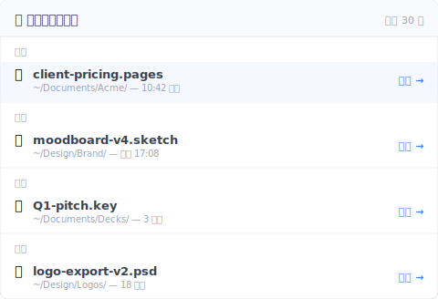

# 【2026 檔案管理】Time Machine vs Dropbox：backup、sync，跟兩者都不是的第三軸

> 每篇比較文都寫成 backup vs sync。兩個說法都對。兩個都漏了 3 個月後你真的會用到的第三軸。

週五晚上 6:18，你在找「改價格前那一版」的提案。你記得是 2 個月前那個禮拜二——下午你特地存了一版。

打開 Time Machine。技術上資料在裡面——但 Time Machine 要你翻一整疊整個 Documents 資料夾的 快照。你不記得確切日期，只記得「2 個月前禮拜二午餐後」。

打開 Dropbox。版本歷史 30 天。沒了。

你發現主流建議「兩個都跑」給了你兩個工具，但兩個都不回答你真正想問的問題。

## Time Machine vs Dropbox 比較文真正在比的東西

你讀過的每篇比較文都把它寫成兩軸對決：

| 軸 | Time Machine | Dropbox |
|---|---|---|
| 本機磁碟備份 | ✅ 整碟 快照 | ❌ 不是它的工作 |
| 跨裝置雲端同步 | ❌ 不是它的工作 | ✅ 核心功能 |

兩個都對、兩個都真。每篇結論：「兩個都用」。建議合理——範圍錯了。

因為還有第三軸沒被擺上桌。

## 第三軸：檔案層級故意存檔的版本歷史

每篇比較文都漏的這件事：**每個檔案故意存檔的紀錄，無時間 上限、無計數 上限，加上能標記某次存檔為「這個版本永遠不准被蓋掉」**。

把第三軸加回表格：

| 軸 | Time Machine | Dropbox |
|---|---|---|
| 本機磁碟備份 | ✅ 整碟 hourly 快照 | ❌ |
| 跨裝置雲端同步 | ❌ | ✅ |
| **檔案層級故意存檔版本歷史** | ⚠️ 只到磁碟層，不到檔案層 | ⚠️ 30 天 上限（付費 180） |

Time Machine 有 快照，但是磁碟層。它不知道你下午 2:47 對某個檔案做了重要修改。它只知道下次整點 快照 時的磁碟狀態，那可能是 2:00（你存之前）或 3:00（你存之後，但夾雜其他改動）。

Dropbox 有檔案層版本，但免費 30 天 上限、付費 180 或 365 天。過了 上限，那份檔案級歷史就沒了。

所以當你要「2 個月前禮拜二下午故意存的那版」時，Time Machine 有 bytes（在某個 快照 裡）但沒有索引。Dropbox 本來有索引，第 31 天扔了。

## 為什麼第三軸不會出現在比較文裡

這是分類學問題。

評測站比較的是被定位為「競爭對手」的產品。Time Machine 跟 Dropbox 其實不是競爭對手——Apple 隨 OS 出貨一個、Dropbox 賣訂閱。「vs」的 framing 是使用者誤以為兩者重疊，因為兩者都碰檔案。

第三軸——檔案層級故意存檔版本歷史——主流工具沒人佔這個 slot。所以評測站找不到 vendor 放這格，軸就消失了。

你按可見的軸選工具。挑 Time Machine 加 Dropbox、感覺都涵蓋了，等用到時才發現缺口。

## 第三軸做得好的工具長什麼樣

圍繞「檔案層級故意存檔版本歷史」設計的工具會做這些事：

- **你能手動把某個時刻標記成一版，背景再每隔幾分鐘自動補存**——不是只有整點 快照
- **無時間 上限**——2 年前的版本跟昨天的一樣好叫出來
- **無計數 上限**——500 次存檔之後，最早的還在
- **「Release」或「Milestone」標記**——把某次存檔標成「這是我 3 月 8 號送給客戶的版本」，永遠不被覆蓋
- **跟 Time Machine 跟 Dropbox 共存**——不取代它們，活在第三軸上

[Keeply](https://keeply.work) 是這層的一個實作。本機跑、盯著你加進去的資料夾、背景每隔一段時間（15/30/60 分）自動抓變更，重要時刻也能手動點「儲存版本」標記一版、無時間上限。Release 功能讓你把某版凍結成里程碑。

```
Keeply — 2 個月前禮拜二下午

2026-03-08 — 禮拜二
─────────────────────────────────
● 14:23   proposal.psd          （自動存）
● 14:47   proposal.psd          ★ Release：client-pricing-v1
● 15:11   proposal.psd          （自動存）
● 15:42   proposal.psd          （自動存）
```

那個 ★ 標記就是你要的「禮拜二下午故意存的那版」——撐過 Dropbox 30 天 上限、撐過 Time Machine hourly thinning、撐過你自己忘記是哪一天的記憶。

順帶一提，第三軸對「最近丟掉的檔案」也有對應的視窗——按時間分桶、永久層留著、不被 30 天時鐘吃掉：



挑檔還原、不需要先還原整顆磁碟才挑得到單檔。

## Time Machine 跟 Dropbox 還是要跑

這篇不是叫你取代任何一個。

**Time Machine** 是對的工具用在：硬體故障後整碟還原、「Mac 被偷我要還原到新機」、「我想 undo 一個壞的系統更新」。它是完整的磁碟安全網。要跑。

**Dropbox** 是對的工具用在：跨裝置同步、跟客戶共享資料夾、工作中檔案的異地副本。它是完整的同步方案。要跑。

兩個都做不好的事：「給我這個檔案某個我只記得個大概日期的版本，不是那整天的整碟 快照」。那是第三軸。

## 第三軸不值得加的場景

3 個邊界，這篇 frame 不適用：

**你不留超過 30 天前的檔案**：如果工作流程是短週期、30 天前的東西不重要，Dropbox 30 天視窗就夠。別加你用不到的複雜度。

**你的工作完全在 Pages / Numbers / Keynote**：Apple 原生檔類型有內建版本歷史，不依賴 Time Machine 或第三方工具。第三軸本來就 build-in 進檔案格式。代價是檔案類型 lock-in。

**你在需要不可變存檔的合規產業**：版本歷史不是 合規封存。如果 GDPR / HIPAA / SOX 要求「這個版本創建後不能再被修改」，你需要 archive 級工具（Veeam、Acronis），不是 Time Machine + Dropbox + 版本歷史。

## 延伸閱讀

主篇 [檔案版本管理完整指南](/zh-tw/post/file-version-management-complete-guide/) 拆解 4 個結構性原因——為什麼工具就是沒設計給你這件事。

[比 iCloud 跟 Dropbox 之前先看：4 家雲端共通的版本歷史天花板](/zh-tw/post/cloud-version-history-cliff/) — 雲端 vs 雲端的對比；本篇是本機 vs 雲端。

[Keeply 到底存什麼？跟備份、雲端工具有什麼不一樣](/zh-tw/post/what-keeply-saves-vs-backup-cloud/) — 同一個 3 層思考換個 Keeply-為主角 framing。

---

「Time Machine vs Dropbox」從來沒有單一答案，因為從來就不是對的問題。

對的問題是：你想覆蓋哪一軸？你有沒有一個工具住在那一軸上？

Backup 軸：Time Machine。Sync 軸：Dropbox。版本歷史軸：不在你讀的那張比較表裡。加一層住在那、或接受缺口存在並知道它在那裡。

3 個月後當你要禮拜二下午故意存的那版時，答案是「點、3 月 8 號、還原」——不是「我先開 Time Machine 翻一小時」。

---

> 關於作者：Ting-Wei Tsao，Keeply 創辦人。
> [LinkedIn](https://www.linkedin.com/in/ting-wei-tsao-b57480152/)
